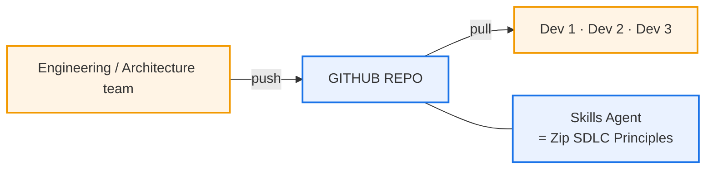
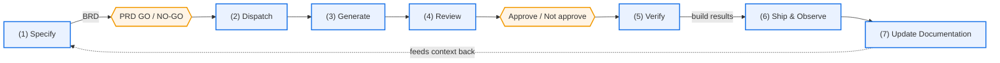
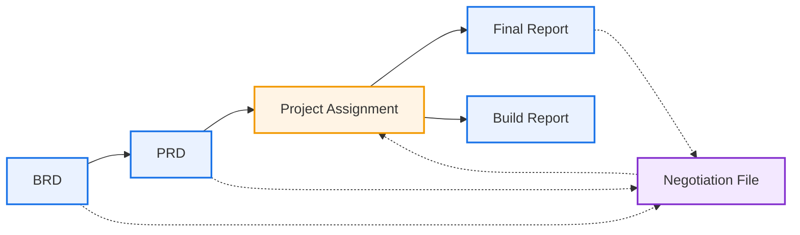
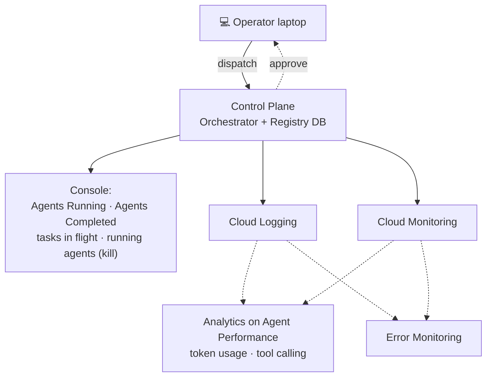

# Zip Agentic Factory — Architecture

> **Provenance:** synthesised from **five** pages of handwritten architecture
> notes with no text layer, across two files — `zip arc1.pdf` (document page 1:
> setup/environment and the stages) and `zip  architecture.pdf` (document pages
> 2–5). The verbatim page-by-page record lives in
> [`transcripts/`](transcripts/); this document is the *synthesis* layer built
> on top of it.
>
> **Reading contract:** everything below is traceable to the scans. Where this
> document reasons beyond what is written, it is marked **⟨inferred⟩** and
> carries a `PL-nn` pointer into [`PARKING_LOT.md`](PARKING_LOT.md).

---

## 1. What this system is

An **agentic factory**: a pipeline that turns a business requirement into
shipped software using a managed fleet of AI agents, with humans holding the
gates at each end.

The design rests on four ideas, and they're worth stating plainly because the
rest of the architecture falls out of them:

1. **Every step emits a durable artifact.** Nothing important lives in a chat
   log. Six artifact types, each with defined metadata, each registered.
2. **A registry is the backbone.** All six artifacts carry a `Registry ✓` mark.
   The registry is also where agents live, and it is what routes work to them.
3. **Disagreement is a first-class artifact.** The Negotiation File captures
   human↔agent and agent↔agent feedback as structured, auditable records.
4. **Documentation is a closed loop.** What the pipeline writes at the end is
   what it reads as context at the beginning.

---

## 2. Setup and environment

*Source: document page 1. This material appears on no other page of the set.*

### The repository is the hub

The engineering/architecture team maintains the repo and pushes to it;
developers pull. Attached to the repo is a **Skills Agent**, annotated
**"= Zip SDLC Principles"**.

> **This is the most under-specified important thing in the architecture.** The
> Skills Agent is the mechanism by which Zip's house engineering rules reach
> every agent in the fleet — effectively the governance backbone — and it
> appears exactly once, as a callout, with no elaboration on how principles are
> encoded, versioned, tested or enforced. See [PL-36](PARKING_LOT.md).
>
> **Architectural Resolution via Agent Plugins 1.0.0:** Materialized as an
> enterprise plugin suite conforming to the open **Agent Plugins 1.0.0** standard
> (co-maintained by Google, Amazon, Microsoft, OpenAI, Cursor, Vercel). House rules,
> linting configs, and double-entry invariants are packaged into versioned
> `skills/` with `mcp.json` tool declarations, pinned via [`skills-lock.json`](../skills-lock.json).

### Toolchain

| Tool | |
|---|---|
| **Antigravity** | **Antigravity CLI** |
| **VS Code** | **gcloud** |
| **Terraform** | **Agents CLI** |

### Google Cloud

**GCP** carries two stated responsibilities — **deploy infrastructure** and
**run tests** — with persistence split by purpose:

| Store | Holds | Tooling Acceleration |
|---|---|---|
| **Cloud SQL** | scoring runs | **Data Agent Kit** (`google-cloud-sql-plugin`) |
| **Cloud Storage** | artefacts storage | Cloud Storage MCP |
| **BigQuery** | shadow ledger proofs | **Data Agent Kit** (`google-bigquery-plugin`) |

That answers where the registry and artifacts physically live, which was
previously unstated ([PL-24](PARKING_LOT.md), now closed). Google's newly
shipped **Data Agent Kit** and **Agents CLI** plugins provide drop-in tools
for interacting with Cloud SQL scoring runs and running BigQuery reconciliation queries.

### Integration surface — MCP

Three integration points are named: a **Jira MCP Server**, **Slack**, and a
**Custom MCP**.

> **Worth pausing on.** An agent that can write to Jira and post to Slack has a
> materially larger blast radius than one confined to a repo. Combined with the
> absent identity model and the not-yet-built central kill switch, this is one
> combined risk rather than three separate ones —
> [PL-35](PARKING_LOT.md), [PL-19](PARKING_LOT.md), Q.2.
>
> **Architectural Resolution:** Agent Plugins 1.0.0 establishes a strict boundary
> between *tool packaging* and *platform authorization*. The plugin declares
> server schemas and transports (`stdio`, `streamable_http`) in `mcp.json`, but
> holds zero credentials. The GKE Control Plane & Dispatcher dynamically injects
> ephemeral Workload Identity OAuth tokens (read-only for Jira; alerting-only for
> Slack) and enforces network egress boundaries.

Editable source: [`diagrams/07-setup-environment.mmd`](diagrams/07-setup-environment.mmd)

---

## 3. The delivery pipeline

| Phase | Name | Produces | Human gate |
|---|---|---|---|
| 1 | **Specify** | BRD | → **PRD GO / NO-GO** |
| 2 | **Dispatch** | PRD, Project Assignment | |
| 3 | **Generate** | Build → unit test → handover | |
| 4 | **Review** | Score, Feedback register | **Approve / Not approve + Reason** |
| 5 | **Verify** | Build Report — integration, load, adversarial | persona attached |
| 6 | **Ship & Observe** | Final Report | 🛑 shadow gate testing |
| 7 | **Update Documentation** | *(closes the loop)* | |

> **Phase 4 is `Review`** — attested on document page 1: *"reviews the Build
> Report and provides a score"*, producing **Score agent**, **Feedback
> register**, and **Approve / Not approve + Reason**. This was an open inference
> until the first page arrived; [PL-01](PARKING_LOT.md) is now closed, and so is
> the page-numbering question ([PL-15](PARKING_LOT.md)) — nothing is missing.

Editable source: [`diagrams/02-phase-pipeline.mmd`](diagrams/02-phase-pipeline.mmd)

---

## 4. The six artifacts

Each artifact is tagged **external** (stakeholder-facing) or **internal**
(machine-to-machine), and each is registered.

| | Artifact | Visibility | Origin | Purpose |
|---|---|---|---|---|
| **A** | **BRD** | external | human curated / AI generated | Business-user-level understanding of the LMS component to be designed |
| **B** | **PRD** | external | AI generated / **human approved** | Translates BRD → PRD; creates the task set |
| **C** | **Project Assignment** | internal | service | Applies **deterministic rules** to assign agents to tasks |
| **D** | **Handover / Build Report** | external | agents | Record of what was accomplished |
| **E** | **Final Report** | external | pipeline | Final results: integration test, load balancing, adversarial |
| **F** | **Negotiation File** *(AKA Decision Registry)* | internal | humans + agents | Ledger of feedback between any two of {Human, Agent} |

### The PRD carries the engineering contract

The PRD is where the design puts its weight. Beyond translating the BRD it
pins down four things up front:

- **RESTRICTIONS / GUARDRAILS** — architectural inputs
- **UNIT TEST STRATEGY** — how correctness will be judged
- **TARGET TECHNOLOGY**
- **STACK IMPACT** — which part of the LMS is affected

This matters: the guardrails and the test strategy are decided *before* any
agent starts generating, which is what makes autonomous generation tolerable.

### Metadata is relational by design

`PRD.BRD_ID` → `BRD.ID`; `ProjectAssignment.BRD ID` → `BRD.ID`;
`BuildReport.Project_ID`, `FinalReport.Project ID`. The chain is traceable end
to end — which is precisely why the missing ER model
([PL-02](PARKING_LOT.md)) is the top open item.

Full field-level detail: [`data/artifacts.json`](data/artifacts.json) ·
[`transcripts/page-1-artifacts.md`](transcripts/page-1-artifacts.md)

---

## 5. Artifact dependencies

Solid = production flow. Dashed = Negotiation File attachment.

**The shape to notice:** the Negotiation File sits *underneath* the production
chain and attaches to exactly the artifacts where human review happens — BRD,
PRD, Project Assignment. It is a **side-car ledger, not a pipeline stage**. That
is a good decision: feedback doesn't block the flow, but it is never lost.

Editable source: [`diagrams/01-artifact-dependencies.mmd`](diagrams/01-artifact-dependencies.mmd)

---

## 6. Agents and the registry

### Agent definition

| Aspect | Detail |
|---|---|
| **Description** | free text |
| **Tech** | `GKE` · `DATA` · `Agents` — with a note on *when to choose this* |
| **Deployment** | **local → cloud**, carrying `Skills`, `Scripts`, `Agents.MD`, from a **github repo** |

Agents are versioned and promoted **as code**. That's the quiet but important
commitment on this page: the agent SDLC mirrors ordinary software CI/CD, which
means agents get review, history and rollback for free.

### The registry is a routing table, not a catalogue

The per-agent record carries:

| Field | Role |
|---|---|
| `Description` | |
| **`Use when`** | **the selection criterion the registry keys off** |
| `# of times deployed` | usage counter |
| `Successful runs` | success counter |
| `Rating` | composite — quantitative + qualitative |

with the stated principle: **"Registry has a deterministic way of choosing
agents."** The Project Assignment service (artifact C) is the consumer — it
reads the registry to route tasks.

**`Rating` decomposes into:**
- **Quantitative** — *inferred from test bugs associated*
- **Qualitative** — *user provided*

> **Two open items sit right here.** *Cardinality* is explicitly marked "to be
> defined" ([PL-05](PARKING_LOT.md)). And "deterministic" is asserted but never
> specified — the only stated input is `Use when`, which is free text and
> therefore not deterministic on its own ([PL-10](PARKING_LOT.md)).

Editable source: [`diagrams/05-agent-registry.mmd`](diagrams/05-agent-registry.mmd)

---

## 7. Control plane, monitoring and logging

The control plane is an **operator console**, not merely a scheduler. `kill`,
`tasks in flight` and a live agent list are human-operator affordances, and the
**approve** path returns on a dashed line to the operator's laptop — the
human-in-the-loop gate.

**Observability** rests on **Cloud Logging** and **Cloud Monitoring**, feeding
two derived views: **Analytics on Agent Performance** (token usage, tool
calling) and **Error Monitoring**.

> **Token usage sits alongside performance and errors as a first-class metric.**
> Cost control is treated as an operational concern from day one, not bolted on.

This is the only page that names concrete platform services. Together with `GKE`
on page 2, that is the sum total of technology commitment in the document —
which is why "lock in the basics" ([PL-07](PARKING_LOT.md)) is a live action
item, with **programming language** and **CI/CD path** still entirely open.

Editable source: [`diagrams/04-control-plane.mmd`](diagrams/04-control-plane.mmd)

---

## 8. Documentation as a closed loop

The design's most elegant move, and the one most likely to be skipped under
delivery pressure.

| Leg | Flow | Rule |
|---|---|---|
| **Downstream** *(part of phase 6, or a parallel phase 7)* | `(5) Verify → (6) Ship & Observe → (7) Update documentation` | With all artifacts, check what part of functional & technical documentation should be updated |
| **Upstream** *(supports PRD creation)* | `(1) Specify → (2) Dispatch` | Check existing documentation to build **in context** → a **stronger, more fit-for-purpose PRD** |

⚠ The page flags **documentation drift** as a known issue, and the open-items
list records documentation upkeep as **currently non-existent**.

**Why this is the load-bearing loop:** the upstream leg is what makes the PRD
good, and the PRD is what makes autonomous generation safe. If the downstream
leg is skipped, the upstream leg degrades, PRD quality falls, and agent output
quality falls with it. The two legs are the same body of documentation — the
loop either closes or it doesn't.

Editable source: [`diagrams/03-documentation-loops.mmd`](diagrams/03-documentation-loops.mmd)

---

## 9. Assessment — what's strong, what's missing

### Strong

- **Artifact-first.** Durable, registered, relationally-linked artifacts at every
  step. Auditability is designed in, not retrofitted.
- **Guardrails precede generation.** Restrictions and test strategy are fixed in
  the PRD before agents run.
- **Disagreement is structured.** The Negotiation File is an unusually mature
  idea — most agentic designs lose this in chat history.
- **Agents as code.** Registry + github + local→cloud promotion gives agents a
  real SDLC.
- **Cost is a first-class signal.** Token usage sits next to errors and
  performance.
- **The documentation loop closes.** Explicitly designed as a cycle.

### Missing

| Gap | Why it matters |
|---|---|
| **Evaluation model unspecified** ([PL-16](PARKING_LOT.md), Q.5) | Still the largest gap, though the *shape* is now visible. Known: score = user feedback + data-driven pass-tests; stage 4 emits Score, Feedback register, Approve/Not-approve; scoring runs persist to Cloud SQL. Unknown: **how it is computed, normalised, weighted, and what acts on it.** |
| **The Skills Agent is undefined** ([PL-36](PARKING_LOT.md)) | *"Skills Agent = Zip SDLC Principles"* is how house rules reach every agent. **Resolution ready:** package as an enterprise suite under the open **Agent Plugins 1.0.0** standard with hashes pinned in `skills-lock.json`. |
| **Blast radius is unbounded** ([PL-35](PARKING_LOT.md), [PL-19](PARKING_LOT.md), Q.2) | Three things that are really one risk: an MCP surface reaching Jira and Slack, no identity/authz model, and a central kill switch. **Resolution ready:** Agent Plugins decouples tool packaging (`mcp.json`) from runtime GKE Workload Identity OAuth scoping. |
| **No failure / rollback story** ([PL-20](PARKING_LOT.md)) | Every drawn flow is happy-path. *"Shadow gate testing"* hints at a safety gate but is never defined. |
| **No artifact versioning** ([PL-23](PARKING_LOT.md)) | PRDs go through review cycles and re-approval; versioning is implied but never stated. |
| **Human review is the unmodelled bottleneck** ([PL-25](PARKING_LOT.md)) | Now clearer and worse: **three** explicit human touchpoints (GO/NO-GO, approve at Review, persona at Verify) on top of human-curated BRDs. The design scales agents, not reviewers. |
| **"LMS" never scoped** ([PL-17](PARKING_LOT.md)) | The system being migrated anchors the whole effort but is never described in five pages. |

**Closed by the late-arriving page 1:** phase (4) is `Review` ([PL-01](PARKING_LOT.md));
the page-numbering mismatch is explained and nothing is missing ([PL-15](PARKING_LOT.md));
the registry's storage is Cloud SQL + Cloud Storage ([PL-24](PARKING_LOT.md)).

Full list with triage: **[`PARKING_LOT.md`](PARKING_LOT.md)**

---

## 10. Where to go next

The recommended order for the next working session, because these three unblock
the most:

1. **Define the evaluation model** (PL-16 + Q.5). The principle is now stated —
   user feedback plus data-driven pass-tests — but the mechanics aren't. Standardize
   via **Agents CLI** eval plugins persisting to Cloud SQL.
2. **Specify the Skills Agent via Agent Plugins 1.0.0** (PL-36). Concrete resolution:
   adopt the open **Agent Plugins 1.0.0** format (co-maintained by Google, Amazon, Microsoft, OpenAI,
   Cursor, Vercel). Package house rules, TDD test authoring skills, and linting scripts into
   versioned plugins (`zip-sdlc-governance-plugin` and LMS domain plugins), locked via
   [`skills-lock.json`](../skills-lock.json).
3. **Bound the blast radius & scope MCP** (PL-35 + PL-19 + Q.2). Leverage the Agent Plugins
   separation of concerns: declare tool interfaces in `mcp.json`, but enforce credential injection
   (ephemeral Workload Identity tokens) and sandbox egress filtering strictly on the GKE Control Plane.
   Drop in Google's **Data Agent Kit** plugins for BigQuery and Cloud SQL.
4. **Adopt the Master Skills Catalog & Dual-Runtime Sandboxing** (PL-43). Operationalize all 28 personas across a 56-skill matrix ([`SKILLS_CATALOG.md`](SKILLS_CATALOG.md)), pairing 32 upstream Google Cloud skills with 24 Zip plugins across Tier A (Agent Platform Managed Sandbox) and Tier B (Cloud Run BYOD custom Docker containers).

Then: review the draft ER model in
[`diagrams/06-registry-entities.mmd`](diagrams/06-registry-entities.mmd) (PL-02 —
now easier, since the stores are known) · settle the spec format (Q.1, cheap and
unblocks tooling) · find out where the documentation lives (Q.6, which blocks the
upstream loop) · settle agent cardinality (PL-05).

**Resolved by Agent Plugins 1.0.0:** Q.7, *"Multi-Model Inference on Vertex AI"*, is solved technically
because Agent Plugins runs portably across Gemini 1.5 Pro, Gemini 2.0 Flash, Cursor, Antigravity, and headless
Cloud Run workers with zero code duplication. Align commercial procurement on Vertex AI.
