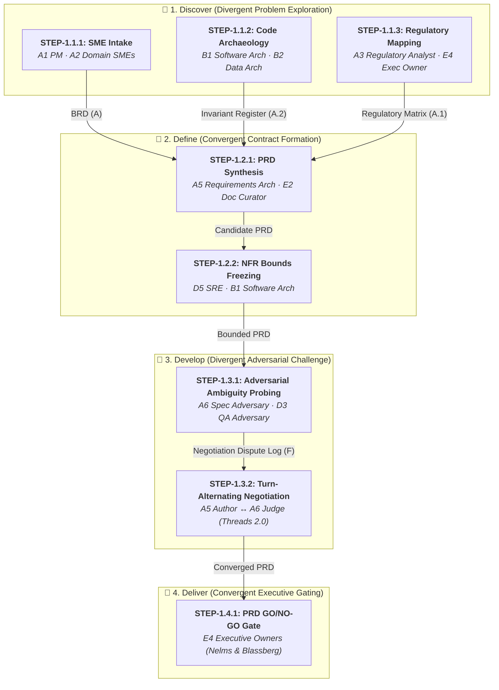
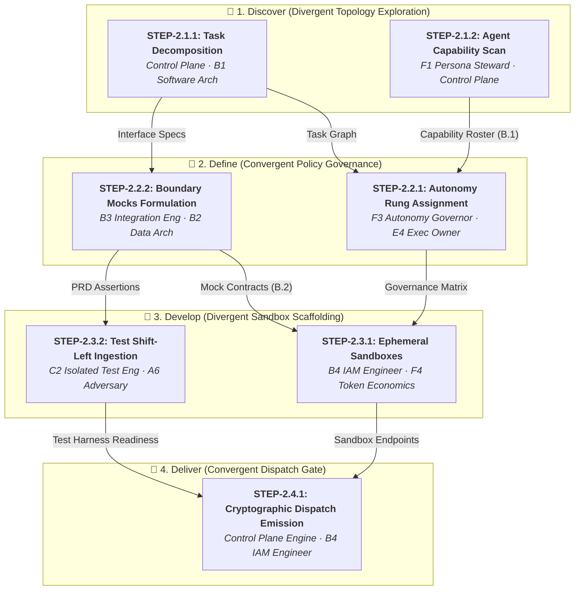
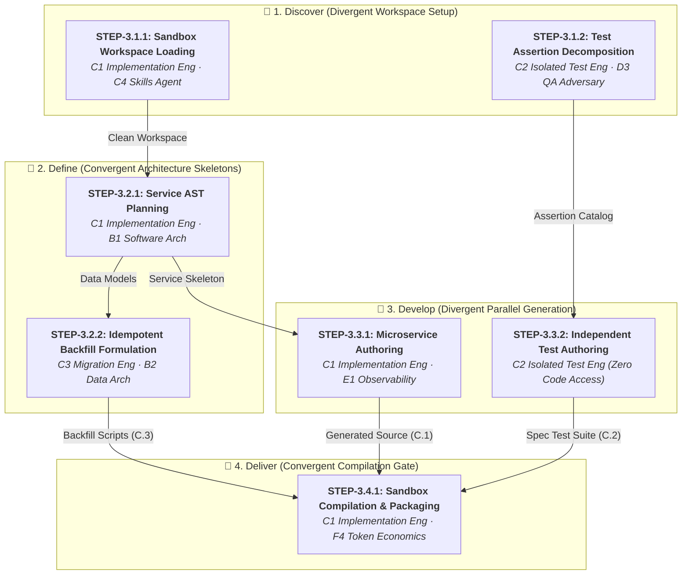
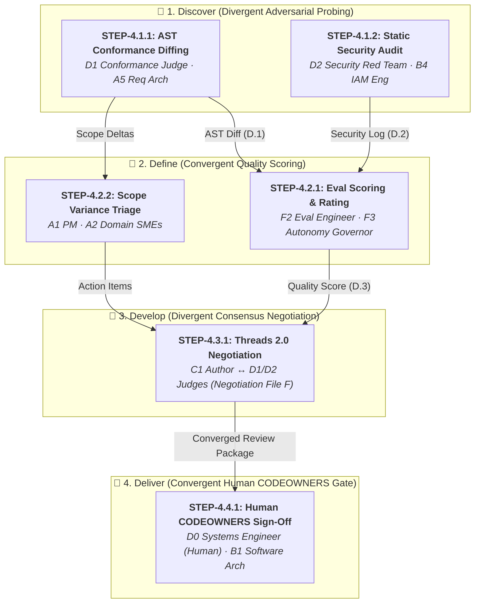
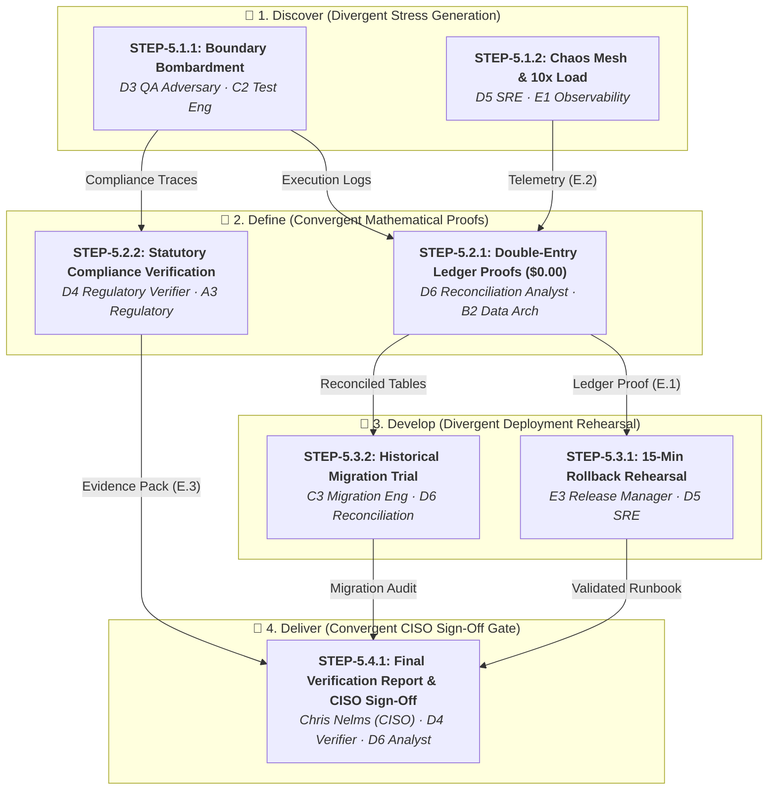
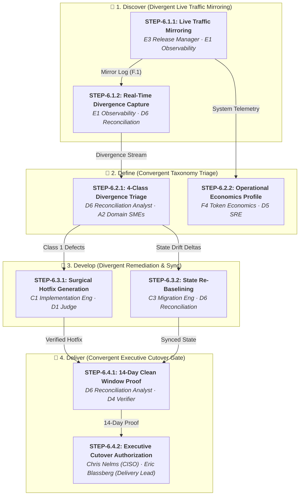
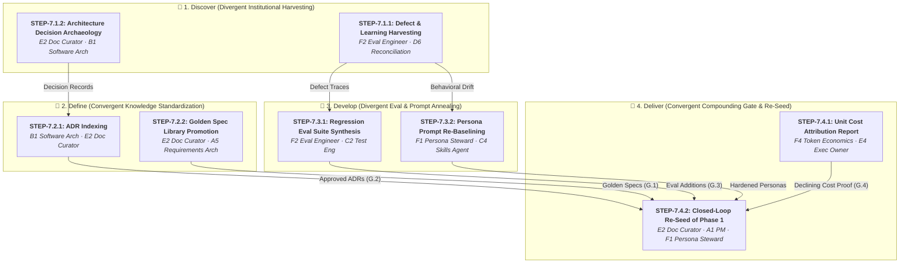

# Zip Agentic Factory — Phases & Execution DAG Specification

**Project Catalyst · Agent Factory / LMS Rebuild**  
**Executive Read-Back & Architectural Reference**  
**Stakeholders:** Chris Nelms (CISO), Eric Blassberg (Delivery Lead) & Google FDE / CE Team  
**Date:** September 1, 2026  
**Status:** Approved Architectural Blueprint

---

## 1. Executive Summary & The Recursive Double Diamond

The **Zip Agentic Factory** replaces traditional, unpredictable LLM prompting with a deterministic, mathematically verifiable software delivery lifecycle. Rather than treating the Double Diamond solely as a macro framework spanning months, the Zip factory applies the **Double Diamond recursively within EACH of the seven pipeline phases**:

```
               PHASE N: RECURSIVE DOUBLE DIAMOND
    ┌─────────────────────────┐   ┌─────────────────────────┐
    │       DIAMOND 1         │   │       DIAMOND 2         │
    │      PROBLEM SPACE      │   │      SOLUTION SPACE     │
    │  Discover  ➔   Define   │ ➔ │   Develop   ➔  Deliver  │
    │ (Divergent) (Convergent)│   │ (Divergent) (Convergent)│
    └─────────────────────────┘   └─────────────────────────┘
```

Within every phase:
1. **Discover (Divergent):** Explores the inputs, ingests context, performs legacy code archaeology, scans capabilities, or generates stress vectors.
2. **Define (Convergent):** Synthesizes insights, establishes machine-validatable contracts, bounds blast radiuses, or classifies variances into standard taxonomies.
3. **Develop (Divergent):** Generates parallel candidate implementations, authors isolated test suites without code access, probes adversarial vulnerabilities, or triages live traffic divergences.
4. **Deliver (Convergent):** Validates against non-negotiable exit gates, proves mathematical invariants ($0.00 ledger drift), compiles immutable evidence packs, and issues cryptographic handoffs to the subsequent phase.

---

## 2. Master End-to-End Factory Meta-DAG

The seven phases interconnect as a closed-loop Directed Acyclic Graph (DAG), with Phase 7 harvesting institutional learnings to continuously re-seed Phase 1:

```mermaid
flowchart TD
    subgraph P1["(1) SPECIFY PHASE (Intent & PRD)"]
        P1_Disc["1.1 Discover: SME Intake & Code Archaeology"]
        P1_Def["1.2 Define: Formal PRD & NFR Contract"]
        P1_Dev["1.3 Develop: Adversarial Spec Challenge (Threads 2.0)"]
        P1_Del["1.4 Deliver: PRD GO/NO-GO Executive Sign-Off"]
        P1_Disc --> P1_Def --> P1_Dev --> P1_Del
    end

    subgraph P2["(2) DISPATCH PHASE (Topology & Sandboxes)"]
        P2_Disc["2.1 Discover: Task Decomposition & Capability Scan"]
        P2_Def["2.2 Define: Autonomy Rungs & Boundary Mocks"]
        P2_Dev["2.3 Develop: Ephemeral Sandboxes & Test Shift-Left"]
        P2_Del["2.4 Deliver: Project Assignment Contract (C)"]
        P2_Disc --> P2_Def --> P2_Dev --> P2_Del
    end

    subgraph P3["(3) GENERATE PHASE (Build & Code)"]
        P3_Disc["3.1 Discover: Workspace Loading & Assertion Matrix"]
        P3_Def["3.2 Define: Service AST Skeletons & Data Backfills"]
        P3_Dev["3.3 Develop: Parallel Microservice & Isolated Tests"]
        P3_Del["3.4 Deliver: Sandbox Compilation & Build Report (D)"]
        P3_Disc --> P3_Def --> P3_Dev --> P3_Del
    end

    subgraph P4["(4) REVIEW PHASE (Adversarial Validation)"]
        P4_Disc["4.1 Discover: AST Conformance Diff & SAST Scans"]
        P4_Def["4.2 Define: Eval Scoring & Scope Triage"]
        P4_Dev["4.3 Develop: Multi-Turn Consensus Negotiation"]
        P4_Del["4.4 Deliver: Human CODEOWNERS Sign-Off & Merge"]
        P4_Disc --> P4_Def --> P4_Dev --> P4_Del
    end

    subgraph P5["(5) VERIFY PHASE (Pre-Production Proofs)"]
        P5_Disc["5.1 Discover: Boundary Edge Cases & Chaos Stress"]
        P5_Def["5.2 Define: $0.00 Double-Entry Ledger Proofs & Reg Audit"]
        P5_Dev["5.3 Develop: 15-Min Rollback Drill & Trial Migration"]
        P5_Del["5.4 Deliver: Final Verification Report (E) & CISO Sign-Off"]
        P5_Disc --> P5_Def --> P5_Dev --> P5_Del
    end

    subgraph P6["(6) SHIP & OBSERVE (Shadow Traffic Gate)"]
        P6_Disc["6.1 Discover: Dual-Run Mirroring & Divergence Stream"]
        P6_Def["6.2 Define: 4-Class Divergence Taxonomy Classification"]
        P6_Dev["6.3 Develop: Surgical Hotfixes & State Re-Baselining"]
        P6_Del["6.4 Deliver: 14-Day Clean Window & Executive Cutover"]
        P6_Disc --> P6_Def --> P6_Dev --> P6_Del
    end

    subgraph P7["(7) UPDATE DOCUMENTATION (Compounding Loop)"]
        P7_Disc["7.1 Discover: Defect Harvesting & ADR Archaeology"]
        P7_Def["7.2 Define: ADR Indexing & Golden Spec Promotion"]
        P7_Dev["7.3 Develop: Regression Eval Suite & Prompt Baselining"]
        P7_Del["7.4 Deliver: Unit Cost Attribution & Phase 1 Re-Seed"]
        P7_Disc --> P7_Def --> P7_Dev --> P7_Del
    end

    P1_Del -->|"Reviewed PRD (B) + Reg Matrix (A.1)"| P2_Disc
    P2_Del -->|"Project Assignment (C) + Boundary Mocks (B.2)"| P3_Disc
    P3_Del -->|"Generated Source (C.1) + Build Report (D)"| P4_Disc
    P4_Del -->|"Merged Release Candidate + Conformance Log"| P5_Disc
    P5_Del -->|"Final Verification Report (E) + Evidence Pack"| P6_Disc
    P6_Del -->|"Production Telemetry + Cutover Sign-Off"| P7_Disc
    P7_Del -.->|"Golden Specs (G.1) + ADRs (G.2) + Hardened Personas"| P1_Disc
```



---

## 3. Detailed Phase-by-Phase Decompositions & Step DAGs

---

### Phase 1: Specify (Intent & High-Definition PRD Contract)

**Primary Objective:** Eliminate ambiguity before coding begins. Transform unstructured business intent, legacy Azure invariants, and regulatory statutes into a mathematically testable PRD contract.

#### 1.1 Sub-Phases & Operational Steps

| Sub-Phase | Step ID & Name | Acting Personas | Input Artifacts | Output Artifacts | Exit Criteria |
|---|---|---|---|---|---|
| **1. Discover** | `STEP-1.1.1: SME Intake & Journey Mapping` | `A1 Product Manager` (Lead)<br/>`A2 Domain SME (x5)` | Unstructured requirements, borrower interviews | `BRD (Artifact A)` | All 5 lending domains (Repayments, Issuing, Decisioning, Customer Master, Merchant) mapped. |
| **1. Discover** | `STEP-1.1.2: Legacy Azure Code Archaeology` | `B1 Software Architect` (Lead)<br/>`B2 Data Architect` | Legacy Azure C#/SQL repo | `Domain Invariant Register (Artifact A.2)` | Unwritten lending invariants (e.g. daily interest accrual, grace period rules) extracted. |
| **1. Discover** | `STEP-1.1.3: Statutory Compliance Mapping` | `A3 Regulatory Analyst` (Lead)<br/>`E4 Executive Owner` | BRD (A), statutory legal codes | `Regulatory Traceability Matrix (Artifact A.1)` | 100% clause-by-clause legal mapping to Reg Z, Reg B, FDCPA, GLBA, and PCI DSS. |
| **2. Define** | `STEP-1.2.1: Formal PRD Contract Synthesis` | `A5 Requirements Architect` (Author)<br/>`E2 Doc Curator` | BRD (A), Reg Matrix (A.1), Invariants (A.2) | `Candidate PRD (Draft Artifact B)` | Machine-readable Markdown PRD with YAML frontmatter and zero ambiguous prose. |
| **2. Define** | `STEP-1.2.2: Non-Functional Bounds Freezing` | `D5 SRE / Resilience Agent`<br/>`B1 Software Architect` | Candidate PRD | `NFR Specification (SLO bounds)` | Enforceable latency (p99 < 15ms) and availability (99.99%) targets bound to PRD frontmatter. |
| **3. Develop** | `STEP-1.3.1: Adversarial Ambiguity Probing` | `A6 Spec Adversary` (Judge)<br/>`D3 QA Adversary` | Candidate PRD | `Negotiation File (Artifact F - Dispute Log)` | Every dual-interpretation phrase flagged with counter-example scenarios. |
| **3. Develop** | `STEP-1.3.2: Turn-Alternating Negotiation` | `A5 Requirements Architect` (Author)<br/>`A6 Spec Adversary` (Judge)<br/>`A1 PM` (Scope arbiter) | Negotiation File (F) | `Refined PRD Contract` | 3-cycle stopping rule enforced; all flagged ambiguities resolved or formally parked. |
| **4. Deliver** | `STEP-1.4.1: PRD GO / NO-GO Gate` | `E4 Executive Transformation Owner`<br/>`A1 PM`<br/>`B1 Architect` | Refined PRD, Reg Matrix (A.1), Invariants (A.2) | **`Reviewed & Signed PRD (Artifact B)`** | "Signed Spec or No Run" — immutable Git commit SHA signed by Executive Owners. |

#### Phase 1 Visual Directed Acyclic Graph (DAG)



---

### Phase 2: Dispatch (Work Topology & Bounded Sandboxes)

**Primary Objective:** Deterministically compile the signed PRD into modular, decoupled microservice build tasks; issue single-task cryptographic certificates; and enforce House Next Door boundaries.

#### 2.1 Sub-Phases & Operational Steps

| Sub-Phase | Step ID & Name | Acting Personas | Input Artifacts | Output Artifacts | Exit Criteria |
|---|---|---|---|---|---|
| **1. Discover** | `STEP-2.1.1: Task Decomposition & Graphing` | `Control Plane Engine`<br/>`B1 Software Architect` | Reviewed PRD (B) | `Task Graph & Dependency Tree` | PRD decomposed into independent microservice tasks with explicit boundary interfaces. |
| **1. Discover** | `STEP-2.1.2: Agent Capability Scanning` | `F1 Persona Steward`<br/>`Control Plane Engine` | Task Graph, Cloud SQL Agent DB | `Agent Capability Roster (Artifact B.1)` | Verified active personas matching all task requirements with valid skill certifications. |
| **2. Define** | `STEP-2.2.1: Autonomy Rung Assignment` | `F3 Autonomy Rung Governor`<br/>`E4 Executive Owner` | Task Graph, Agent Roster (B.1) | `Autonomy Governance Matrix` | Governance levels assigned (L1–L4); mandatory human oversight attached to financial ledger tasks. |
| **2. Define** | `STEP-2.2.2: Boundary Mocks & Stubs Formulation` | `B3 Integration Engineer`<br/>`B2 Data Architect` | Task Graph, Reviewed PRD (B) | `Boundary Contract & Mock Spec (Artifact B.2)` | OpenAPI/AsyncAPI stubs generated to isolate microservices from legacy Azure systems. |
| **3. Develop** | `STEP-2.3.1: Ephemeral Sandbox Provisioning` | `B4 Identity & Access Engineer`<br/>`F4 Token Economics Analyst` | Autonomy Matrix, Task Graph | `Disposable Cloud Run Sandboxes` | Sandboxes provisioned with read-only root filesystems, zero outbound internet, and token spend ceilings. |
| **3. Develop** | `STEP-2.3.2: Test Shift-Left Ingestion` | `C2 Isolated Test Engineer`<br/>`A6 Spec Adversary` | Reviewed PRD (B) | `Isolated Test Workspace` | Test environment prepared with zero source code access (Test-Driven AI Development). |
| **4. Deliver** | `STEP-2.4.1: Cryptographic Dispatch Package Emission` | `Control Plane Engine`<br/>`B4 Identity & Access Engineer` | Task Graph, Sandboxes, Mocks (B.2) | **`Project Assignment Contract (Artifact C)`** | Cryptographic execution token minted; immutable JSON dispatch contract emitted. |

#### Phase 2 Visual Directed Acyclic Graph (DAG)



---

### Phase 3: Generate (Parallel Build & Isolated Test Derivation)

**Primary Objective:** Author microservice code and independent spec-derived test suites in parallel, isolated sandboxes under strict Neighborhood Rules, guaranteeing test objectivity.

#### 3.1 Sub-Phases & Operational Steps

| Sub-Phase | Step ID & Name | Acting Personas | Input Artifacts | Output Artifacts | Exit Criteria |
|---|---|---|---|---|---|
| **1. Discover** | `STEP-3.1.1: Sandbox Workspace Loading` | `C1 Implementation Engineer`<br/>`C4 Skills Agent` (SDLC Principles) | Project Assignment (C), Mocks (B.2) | `Initialized Engineering Sandbox` | Clean sandbox initialized conforming strictly to Directory Governance ("Neighborhood Rules"). |
| **1. Discover** | `STEP-3.1.2: Test Assertion Decomposition` | `C2 Isolated Test Engineer`<br/>`D3 QA Adversary` | Project Assignment (C) | `Test Strategy & Assertion Catalog` | 100% of PRD requirements mapped to discrete test assertions without seeing production code. |
| **2. Define** | `STEP-3.2.1: Service AST Skeleton Planning` | `C1 Implementation Engineer`<br/>`B1 Software Architect` | Project Assignment (C) | `Service Skeleton & Interface Definitions` | Zero floating-point types for currency; double-entry ledger structures codified in Go/Python. |
| **2. Define** | `STEP-3.2.2: Idempotent Backfill Formulation` | `C3 Migration Engineer`<br/>`B2 Data Architect` | Service Skeleton, Legacy Data Dictionaries | `Idempotent Data Backfill Scripts (Artifact C.3)` | Restartable ETL routines authored with verified idempotency. |
| **3. Develop** | `STEP-3.3.1: Autonomous Microservice Authoring` | `C1 Implementation Engineer`<br/>`E1 Observability Engineer` | Service Skeleton, Mocks (B.2) | `Generated Microservice Source (Artifact C.1)` | Complete microservice implementation with OpenTelemetry instrumentation wrappers. |
| **3. Develop** | `STEP-3.3.2: Independent Test Suite Authoring` | `C2 Isolated Test Engineer` | Assertion Catalog | `Spec-Derived Test Suite (Artifact C.2)` | Complete TDD suite authored with zero source code access ("Measure the effect, not the act"). |
| **4. Deliver** | `STEP-3.4.1: Sandbox Compilation & Packaging` | `C1 Implementation Engineer`<br/>`F4 Token Economics Analyst` | Source (C.1), Tests (C.2) | **`Disposable Sandbox Build Report (Artifact D)`** | Clean compilation, zero linter warnings, 100% internal unit test pass, build report emitted. |

#### Phase 3 Visual Directed Acyclic Graph (DAG)



---

### Phase 4: Review (Adversarial Validation & Human CODEOWNERS)

**Primary Objective:** Verify that generated code implements the PRD ("nothing more, nothing less"), scan for security vulnerabilities, resolve disputes via Threads 2.0, and secure human CODEOWNERS sign-off.

#### 4.1 Sub-Phases & Operational Steps

| Sub-Phase | Step ID & Name | Acting Personas | Input Artifacts | Output Artifacts | Exit Criteria |
|---|---|---|---|---|---|
| **1. Discover** | `STEP-4.1.1: AST Conformance Diffing` | `D1 Spec Conformance Judge`<br/>`A5 Requirements Architect` | Build Report (D), Source (C.1), Reviewed PRD (B) | `AST Conformance Diff (Artifact D.1)` | Every method and route mapped directly to an approved PRD requirement. |
| **1. Discover** | `STEP-4.1.2: Static Security Audit & Blast Radius` | `D2 Security Red Team`<br/>`B4 Identity & Access Engineer` | Source Code (C.1) | `Static Security Audit Log (Artifact D.2)` | Zero critical/high CVEs, zero hardcoded secrets, zero unauthorized network egress paths. |
| **2. Define** | `STEP-4.2.1: Multi-Dimensional Eval Scoring` | `F2 Eval Engineer`<br/>`F3 Autonomy Rung Governor` | AST Diff (D.1), Security Log (D.2), Build Report (D) | `Agent Score & Rating Record (Artifact D.3)` | Overall composite score calculated; automated demotion triggered if score < 85%. |
| **2. Define** | `STEP-4.2.2: Scope Variance & Defect Triage` | `A1 Product Manager`<br/>`A2 Domain SME` | AST Diff (D.1) | `Triage Decisions & Action Items` | Non-critical variances classified as 'Rework' or 'Scope Deferral' to prevent build blockage. |
| **3. Develop** | `STEP-4.3.1: Multi-Turn Consensus Negotiation` | `C1 Implementation Eng` (Author)<br/>`D1 Conformance Judge`<br/>`D2 Red Team` | Negotiation File (F), Action Items | `Surgical Code Patches & Re-Review Logs` | Threads 2.0 turn-alternating consensus achieved in $\le 3$ cycles. |
| **4. Deliver** | `STEP-4.4.1: Human CODEOWNERS Sign-Off` | `D0 Systems Engineer (Human)`<br/>`B1 Software Architect` | Negotiation File (F), AST Diff (D.1), Security Log (D.2) | **`Approved Pull Request & Merged Release`** | Authoritative human approval recorded (`Approve / Not approve + reason`); code merged. |

#### Phase 4 Visual Directed Acyclic Graph (DAG)



---

### Phase 5: Verify (Mathematical Proofs & Pre-Production Verification)

**Primary Objective:** Reconcile ledgers to $0.00 zero-cent drift, subject services to Chaos Mesh fault injection under 10× load, compile auditor evidence, and secure CISO sign-off.

#### 5.1 Sub-Phases & Operational Steps

| Sub-Phase | Step ID & Name | Acting Personas | Input Artifacts | Output Artifacts | Exit Criteria |
|---|---|---|---|---|---|
| **1. Discover** | `STEP-5.1.1: Adversarial Boundary Bombardment` | `D3 QA Adversarial Tester`<br/>`C2 Isolated Test Engineer` | Merged Release Candidate, Spec Test Suite (C.2) | `Adversarial Test Execution Logs` | Negative edge cases (leap years, negative balances, concurrency race conditions) executed. |
| **1. Discover** | `STEP-5.1.2: Chaos Mesh & 10× Peak Load Injection` | `D5 SRE / Resilience Agent`<br/>`E1 Observability Engineer` | Staging GKE Cluster | `Chaos & Load Telemetry (Artifact E.2)` | Zero data corruption under simulated pod terminations and network partitions at 10× load. |
| **2. Define** | `STEP-5.2.1: Double-Entry Ledger Proofs ($0.00)` | `D6 Reconciliation Analyst`<br/>`B2 Data Architect` | PostgreSQL Ledger Tables | `Double-Entry Balance Proof (Artifact E.1)` | Mathematically proven cent-for-cent balance: $\sum \text{Debits} - \sum \text{Credits} = \$0.000000$. |
| **2. Define** | `STEP-5.2.2: Statutory Compliance Verification` | `D4 Regulatory Verifier`<br/>`A3 Regulatory Analyst` | Regulatory Matrix (A.1), Service Execution Logs | `Auditor Evidence Pack (Artifact E.3)` | 100% compliance proofs stored in immutable Google Cloud Storage bucket. |
| **3. Develop** | `STEP-5.3.1: 15-Minute Rollback Sequence Rehearsal` | `E3 Release & Change Manager`<br/>`D5 SRE` | Staging Deployment | `Rollback Drill Log & Validated Runbook` | Automated rollback successfully executed in $\le 15$ minutes with verified state consistency. |
| **3. Develop** | `STEP-5.3.2: Historical Data Migration Trial` | `C3 Migration Engineer`<br/>`D6 Reconciliation Analyst` | Backfill Scripts (C.3), Historical Loan Data | `Trial Migration Audit Report` | 100% record parity between legacy records and migrated ledger format. |
| **4. Deliver** | `STEP-5.4.1: Final Verification Synthesis & CISO Sign-Off` | `D4 Regulatory Verifier`<br/>`D6 Reconciliation Analyst`<br/>`Chris Nelms (CISO)` | Ledger Proof (E.1), Telemetry (E.2), Evidence Pack (E.3) | **`Final Verification Report (Artifact E)`** | Formal CISO verification sign-off; release authorized for production shadow mirroring. |

#### Phase 5 Visual Directed Acyclic Graph (DAG)



---

### Phase 6: Ship & Observe (Shadow Gate & Production Realization)

**Primary Objective:** Mirror live production traffic against the new microservice with side-effect suppression, classify divergences into the 4-class taxonomy, and gate cutover on 14 consecutive clean shadow days.

#### 6.1 Sub-Phases & Operational Steps

| Sub-Phase | Step ID & Name | Acting Personas | Input Artifacts | Output Artifacts | Exit Criteria |
|---|---|---|---|---|---|
| **1. Discover** | `STEP-6.1.1: Live Traffic Mirroring (Suppressed Effects)` | `E3 Release Manager`<br/>`E1 Observability Engineer` | Live Production Ingress | `Shadow Traffic Mirroring Log (Artifact F.1)` | 100% production traffic mirrored without duplicate customer-facing side effects. |
| **1. Discover** | `STEP-6.1.2: Real-Time Divergence Stream Capture` | `E1 Observability Engineer`<br/>`D6 Reconciliation Analyst` | Mirroring Logs (F.1) | `Raw Divergence Event Stream` | Real-time BigQuery capture of every mismatch between GCP and legacy Azure responses. |
| **2. Define** | `STEP-6.2.1: Four-Class Divergence Taxonomy Triage` | `D6 Reconciliation Analyst`<br/>`A2 Domain SME (x5)` | Raw Divergence Stream | `Divergence Triage Register (Artifact F.2)` | 100% of variances classified: Class 1 (GCP Bug), Class 2 (Azure Bug), Class 3 (Rounding), Class 4 (Intentional Spec). |
| **2. Define** | `STEP-6.2.2: Operational Economics Profiling` | `F4 Token Economics Analyst`<br/>`D5 SRE` | GCP Production Telemetry | `Operational Economics Profile` | Live infrastructure and model inference costs verified within production budgets. |
| **3. Develop** | `STEP-6.3.1: Surgical Hotfix Generation` | `C1 Implementation Eng`<br/>`D1 Conformance Judge` | Divergence Register (F.2) | `Surgical Hotfix Patch` | Class 1 bugs patched within microservice sandbox; zero regressions on existing tests. |
| **3. Develop** | `STEP-6.3.2: State Re-Baselining & Drift Compensation` | `C3 Migration Engineer`<br/>`D6 Reconciliation Analyst` | Latest Azure Snapshot | `Re-Baselined Ledger State` | Synchronized database state preventing cascading false divergences. |
| **4. Deliver** | `STEP-6.4.1: 14-Day Clean Shadow Window Proof` | `D6 Reconciliation Analyst`<br/>`D4 Regulatory Verifier` | Divergence Register (F.2) | `14-Day Clean Shadow Proof` | Strict empirical proof: 14 consecutive days with zero unexplained Class 1 defects. |
| **4. Deliver** | `STEP-6.4.2: Executive Cutover & Incumbent Retirement` | `Chris Nelms (CISO)`<br/>`Eric Blassberg (Delivery Lead)`<br/>`A1 PM` | 14-Day Proof, Rollback Plan (F.4) | **`Production Cutover Authorization (Artifact F.3)`** | Executive sign-off; traffic transitioned; legacy Azure commit permanently retired. |

#### Phase 6 Visual Directed Acyclic Graph (DAG)



---

### Phase 7: Update Documentation (Compounding & Closed-Loop Annealing)

**Primary Objective:** Prevent institutional amnesia. Harvest ADRs, promote reusable golden spec templates, convert escaped defects into permanent regression evals, and re-baseline personas for cycle N+1.

#### 7.1 Sub-Phases & Operational Steps

| Sub-Phase | Step ID & Name | Acting Personas | Input Artifacts | Output Artifacts | Exit Criteria |
|---|---|---|---|---|---|
| **1. Discover** | `STEP-7.1.1: Escaped Defect & Divergence Harvesting` | `F2 Eval Engineer`<br/>`D6 Reconciliation Analyst` | Negotiation File (F), Divergence Register (F.2) | `Defect & Learning Digest` | All triaged defects and edge-case failures catalogued with root-cause traces. |
| **1. Discover** | `STEP-7.1.2: Architecture Decision Archaeology` | `E2 Documentation Curator`<br/>`B1 Software Architect` | Negotiation File (F) | `Candidate ADR Summaries` | All architectural compromises and boundary adjustments extracted. |
| **2. Define** | `STEP-7.2.1: Architecture Decision Record Indexing` | `B1 Software Architect`<br/>`E2 Documentation Curator` | Candidate ADRs | `Architecture Decision Records Index (Artifact G.2)` | Permanent ADRs committed to Git with context, decision, and consequences. |
| **2. Define** | `STEP-7.2.2: Golden Domain Spec Library Promotion` | `E2 Documentation Curator`<br/>`A5 Requirements Architect` | Reviewed PRD (B) | `Golden Domain Spec Templates (Artifact G.1)` | Reusable spec patterns promoted into the repository's modular template library. |
| **3. Develop** | `STEP-7.3.1: Regression Eval Suite Additions` | `F2 Eval Engineer`<br/>`C2 Isolated Test Engineer` | Defect Digest | `Regression Eval Suite Additions (Artifact G.3)` | Permanent automated regression tests authored for all escaped defects. |
| **3. Develop** | `STEP-7.3.2: Persona Prompt Directive Re-Baselining` | `F1 Persona Steward`<br/>`C4 Skills Agent` | Learnings Digest, Model Updates | `Re-Baselined Persona Prompt Catalog` | Updated persona system prompts and boundary rules versioned in Cloud SQL. |
| **4. Deliver** | `STEP-7.4.1: Unit Cost Attribution Report` | `F4 Token Economics Analyst`<br/>`E4 Executive Owner` | Cloud Billing, Token Logs | `Unit Cost Attribution Report (Artifact G.4)` | Mathematical proof of declining unit delivery cost across quarterly releases. |
| **4. Deliver** | `STEP-7.4.2: Closed-Loop Re-Seeding of Phase 1` | `E2 Documentation Curator`<br/>`A1 PM`<br/>`F1 Persona Steward` | Artifacts G.1, G.2, G.3, G.4 | **`Re-Seeded Phase 1 Workspace (Cycle N+1)`** | Enriched templates and hardened personas loaded into Phase 1; cycle N+1 commences. |

#### Phase 7 Visual Directed Acyclic Graph (DAG)



---

## 4. End-to-End Cohesion & Traceability Audit

### 4.1 Artifact Continuity Matrix
Every artifact emitted by Phase $N$ is traced to its direct consumer in Phase $N+k$:

| Emitted Artifact | Source Phase & Step | Downstream Consumer Phase & Step | Purpose & Verification Mechanism |
|---|---|---|---|
| `BRD (Artifact A)` | Phase 1 (Step 1.1.1) | Phase 1 (Step 1.2.1) | Ingested to synthesize the machine-readable PRD contract. |
| `Regulatory Traceability Matrix (A.1)` | Phase 1 (Step 1.1.3) | Phase 1 (1.2.1), Phase 5 (5.2.2) | Basis for statutory audit evidence pack in Google Cloud Storage. |
| `Domain Invariant Register (A.2)` | Phase 1 (Step 1.1.2) | Phase 1 (1.2.1), Phase 5 (5.2.1) | Invariants verified during $0.00 double-entry ledger reconciliation. |
| **`Reviewed PRD (Artifact B)`** | Phase 1 (Step 1.4.1) | Phase 2 (2.1.1, 2.3.2), Phase 3 (3.1.2), Phase 4 (4.1.1) | Authoritative contract governing decomposition, test creation, and AST review. |
| `Boundary Contracts & Mocks (B.2)` | Phase 2 (Step 2.2.2) | Phase 3 (3.1.1, 3.3.1) | Isolates sandbox microservices from legacy Azure network dependencies. |
| **`Project Assignment (Artifact C)`** | Phase 2 (Step 2.4.1) | Phase 3 (Step 3.1.1) | Ephemeral cryptographic token authorizing code generation within sandbox bounds. |
| `Generated Microservice Source (C.1)` | Phase 3 (Step 3.3.1) | Phase 4 (4.1.1, 4.1.2) | Evaluated by Spec Conformance Judge and Security Red Team. |
| `Spec-Derived Test Suite (C.2)` | Phase 3 (Step 3.3.2) | Phase 4 (4.2.1), Phase 5 (5.1.1) | Independent test execution verifying functional correctness with zero mock bias. |
| **`Build Report (Artifact D)`** | Phase 3 (Step 3.4.1) | Phase 4 (Step 4.1.1) | Git commit SHA, compilation logs, and internal unit pass proofs. |
| `AST Conformance Diff (D.1)` | Phase 4 (Step 4.1.1) | Phase 4 (4.2.1, 4.4.1) | "Nothing more, nothing less" AST proof presented to human CODEOWNERS. |
| `Static Security Audit Log (D.2)` | Phase 4 (Step 4.1.2) | Phase 4 (4.2.1, 4.4.1) | SAST and IAM blast-radius certification. |
| `Negotiation File (Artifact F)` | Phase 1, 3, 4 | Phase 4 (4.4.1), Phase 7 (7.1.1, 7.1.2) | Complete dispute history harvested into permanent ADRs and evals. |
| `Double-Entry Balance Proof (E.1)` | Phase 5 (Step 5.2.1) | Phase 5 (5.4.1), Phase 6 (6.1.2) | $0.00 mathematical proof gating CISO authorization. |
| **`Final Verification Report (Artifact E)`** | Phase 5 (Step 5.4.1) | Phase 6 (Step 6.1.1) | Comprehensive verification dossier required before traffic mirroring. |
| `Divergence Triage Register (F.2)` | Phase 6 (Step 6.2.1) | Phase 6 (6.3.1, 6.4.1), Phase 7 (7.1.1) | Live variance triage driving surgical fixes and regression eval synthesis. |
| **`Production Cutover Sign-Off (F.3)`** | Phase 6 (Step 6.4.2) | Operations & Phase 7 | Authorizes retiring legacy Azure commit and triggers closed-loop documentation. |
| `Golden Spec Templates (G.1)` | Phase 7 (Step 7.2.2) | Phase 1 (Step 1.2.1, Cycle N+1) | Accelerates cycle N+1 specification authoring with standardized patterns. |
| `ADR Index (G.2)` | Phase 7 (Step 7.2.1) | Phase 1 (Cycle N+1), Phase 2 | Prevents revisiting settled architectural trade-offs. |
| `Regression Eval Additions (G.3)` | Phase 7 (Step 7.3.1) | Phase 4, Phase 5 (Cycle N+1) | Permanently immunizes factory against recurrences of historical defects. |
| `Unit Cost Attribution Report (G.4)` | Phase 7 (Step 7.4.1) | Executive Governance | Empirically proves that delivery cost per specification falls cycle-over-cycle. |

### 4.2 The 28 Personas Active Lifecycle Distribution
The complete 28 personas across all 6 families (A through F) are distributed across the 7 phases according to their redefined operational roles:

```
Family A: Intent (6 personas)
  • A1 Product Manager: Phases 1 (Specify), 4 (Scope Deferral), 6 (Cutover Co-Sign)
  • A2 Domain SMEs (x5): Phases 1 (Intake), 4 (Adjudication), 6 (Shadow Triage)
  • A3 Regulatory Analyst: Phases 1 (Matrix Mapping), 5 (Compliance Audit)
  • A4 UX/UI Designer: Phase 4 (Borrower Distress & Accessible Templates)
  • A5 Requirements Architect: Phases 1 (PRD Author), 3 (RFI On-Call), 7 (Golden Spec Promotion)
  • A6 Spec Adversary: Phases 1 (Ambiguity Judge), 2 (Test Ingestion Review)

Family B: Architecture (4 personas)
  • B1 Software Architect: Phases 1 (Archaeology), 2 (Task Graph), 4 (CODEOWNERS), 7 (ADR Sign-Off)
  • B2 Data Architect: Phases 1 (Invariants), 3 (Backfill Schema), 5 (Ledger Proofs)
  • B3 Integration Engineer: Phases 2 (Mock Specs), 3 (Stub Harnesses)
  • B4 Identity & Access Engineer: Phases 2 (Certificate Issuance), 3 (Egress Monitoring), 4 (IAM Scan)

Family C: Build (4 personas)
  • C1 Implementation Engineer: Phase 3 (Generate), Phase 4/6 (Surgical Fix Author only)
  • C2 Isolated Test Engineer: Phase 2 (Test Shift-Left), Phase 3 (Spec-Derived Author), Phase 7 (Evals)
  • C3 Migration Engineer: Phase 3 (Idempotent Backfill), Phase 5 (Trial Backfill), Phase 6 (State Sync)
  • C4 Skills Agent (Zip SDLC): Cross-cutting Governance across Phases 1 through 7

Family D: Adversarial Judges (6 personas)
  • D0 Systems Engineer (Human): Phase 4 (Authoritative CODEOWNERS Gate)
  • D1 Spec Conformance Judge: Phase 4 (AST Diffing), Phase 6 (Fix Verification)
  • D2 Security Red Team: Phase 4 (SAST & Privilege Audit), Phase 5 (DAST & Penetration)
  • D3 QA Adversarial Tester: Phase 1 (Negative Input Contributor), Phase 5 (Boundary Edge Testing)
  • D4 Regulatory Verifier: Phase 5 (Independent Auditor Evidence Pack), Phase 6 (Cutover Compliance)
  • D5 SRE / Resilience Agent: Phase 1 (NFR Targets), Phase 5 (Chaos Mesh), Phase 6 (SLO Monitoring)
  • D6 Reconciliation Analyst: Phase 1 (Tolerances), Phase 5 (Ledger Proofs), Phase 6 (Divergence Triage)

Family E: Sustain (4 personas)
  • E1 Observability Engineer: Phase 3 (Tracing Wrappers), Phase 5 (Chaos Telemetry), Phase 6 (Live Stream)
  • E2 Documentation Curator: Phase 1 (Templates), Phase 4 (Dispute Harvesting), Phase 7 (ADR/Golden Spec Index)
  • E3 Release Manager: Phase 5 (Rollback Drill), Phase 6 (Mirroring & Cutover Sequencing)
  • E4 Executive Transformation Owner: Phase 1 (PRD GO/NO-GO), Phase 6 (Production Cutover Gate)

Family F: Factory Governance (4 personas)
  • F1 Persona Steward: Phase 2 (Capability Registry Verification), Phase 7 (Prompt Re-Baselining)
  • F2 Eval Engineer: Phase 4 (Scoring Harness), Phase 5 (Test Harness), Phase 7 (Escaped Defect Evals)
  • F3 Autonomy Rung Governor: Phase 2 (Rung Assignment), Phase 4 (Automatic Demotion)
  • F4 Token Economics Analyst: Phase 2/3 (Sandbox Budgets), Phase 6 (Inference Cost), Phase 7 (Unit Cost KPI)
```

---

## 5. Conclusion: The Compounding Enterprise Advantage

By embedding the Double Diamond recursively within every phase, the **Zip Agentic Factory** resolves the critical failure modes of autonomous software generation:
1. **No Hallucinated Implementations:** Because Phase 1 enforces mathematical ambiguity elimination in Diamond 1, autonomous agents never guess business rules.
2. **No Circular Self-Certification:** Because Phase 3 enforces complete physical separation between the Implementation Engineer and the Isolated Test Engineer, tests measure true system effects rather than confirming code mocks.
3. **No Unmonitored Shadow Cutover:** Because Phase 6 requires 14 consecutive days of zero unexplained divergences across a four-class taxonomy, cutover to GCP is mathematically derisked.
4. **Compounding Value:** Because Phase 7 captures every resolved dispute and escaped defect into golden templates and automated evals, cycle $N+1$ is demonstrably faster, higher quality, and lower cost than cycle $N$.
