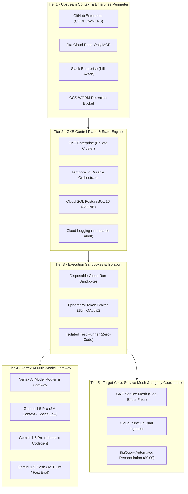
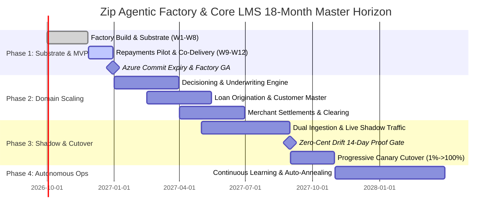

# Zip Agentic Factory — The Architectural Evolution Storyline

**Project Catalyst · US Regulated Consumer Lending Loan Management System (LMS) Modernisation**  
**Classification:** Executive Architectural Synthesis & Canonical Reference  
**Stakeholders:** Chris Nelms (CISO), Eric Blassberg (Delivery Lead), Zip Architecture Group, Quantium Delivery Team, Google Cloud FDE & CE Team  
**Date:** September 1, 2026  
**Status:** Approved Architectural Blueprint & Implementation Baseline  
**Master Document Code:** `PROJECT-CATALYST-MASTER-STORYLINE-2026`

---

## Executive Abstract: From Whiteboard Sketches to an Autonomous Software Factory

Project Catalyst marks a watershed in enterprise software engineering: the migration of Zip Co’s core US Loan Management System (LMS) away from an incumbent Azure C#/.NET monolithic estate into modern, sovereign, event-driven microservices hosted on Google Cloud Platform. 

Rather than attempting an in-place refactoring or relying on standard commercial copilots that introduce context drift and unbounded hallucination, Zip and Google Cloud have engineered an **Autonomous Software Factory**. In this paradigm, software is treated as an industrialized manufactured good: **Human Specified, Human Supervised, and Human Verified**, executed by autonomous AI agents operating within deterministic cloud sandboxes, and governed by non-negotiable financial, security, and statutory invariants.

This master document synthesizes the complete four-act transformation storyline, bridging the initial handwritten whiteboard blueprints to a production-grade 12-week deployment plan and 18-month strategic roadmap:

```
┌────────────────────────────────────────────────────────────────────────────────────────────────────────┐
│                                 THE FOUR ACTS OF ARCHITECTURAL EVOLUTION                               │
├────────────────────────────┬────────────────────────────┬────────────────────────────┬─────────────────┤
│           ACT 1            │           ACT 2            │           ACT 3            │      ACT 4      │
│     CONCEPTS & PHASES      │  ARCHITECTURE & SUBSTRATE  │      FDE SOW & DOD         │   PHASED PLAN   │
├────────────────────────────┼────────────────────────────┼────────────────────────────┼─────────────────┤
│ • 10 Typed Artifacts & DER │ • 5-Tier Cloud Architecture│ • 1x Google FDE Spearhead  │ • 3 Scenarios   │
│ • Double Diamond Phases DAG│ • GKE + Temporal Engine    │ • 4 Milestone Gates (M1-M4)│   (8 vs 10 vs 12│
│ • 28 Personas & 111 Skills │ • Disposable Cloud Run     │ • 8-Gate Verifiable DoD    │ • 61 PW WBS     │
│ • Separation of Powers     │ • Vertex Multi-Model Router│ • Repayments Pilot Dry Run │ • RACI Matrix   │
│ • "Author ≠ Judge" Axiom   │ • MCP Hub (71 Tools)       │   ($0.00 zero-cent drift)  │ • 18-Month Plan │
│ • Zero-Code-Access TDD     │ • Sub-Second Kill Switch   │ • 8 Handover Deliverables  │ • Ownership Run │
└────────────────────────────┴────────────────────────────┴────────────────────────────┴─────────────────┘
```

---

## Storyline Navigation & Master Index

| Act | Title | Target File | Scope & Highlights |
| :--- | :--- | :--- | :--- |
| **Act 1** | **Concepts, Phases & Constitutional Architecture** | [`storyline/01_CONCEPTS_AND_PHASES.md`](storyline/01_CONCEPTS_AND_PHASES.md) | Resolves the "missing Phase 4" anomaly; codifies the 7 macro phases; formalizes the 10 strongly-typed artifacts (A–F + DER); establishes the 28-persona directory and 111 machine skills; defines the constitutional law: *"Author and judge are never the same persona"*. |
| **Act 2** | **Platform Architecture & Substrate Specification** | [`storyline/02_ARCHITECTURE_AND_SUBSTRATE.md`](storyline/02_ARCHITECTURE_AND_SUBSTRATE.md) | Blueprint of the 5-tier GCP substrate: GKE Enterprise control plane, Temporal workflow engine, Cloud Run disposable sandboxes, Vertex AI multi-model gateway, Node.js 22 MCP Hub (71 tools), Istio side-effect suppression, $<750\text{ms}$ kill switch, and reference triad adoption (14 Axioms, Threads 2.0, Neighborhood Rules). |
| **Act 3** | **FDE Statement of Work (SoW), Definition of Done (DoD) & Pilot Dry Run** | [`storyline/03_FDE_SOW_AND_DOD.md`](storyline/03_FDE_SOW_AND_DOD.md) | Commercial and engineering boundaries for 1x Google FDE; 4 sequential milestone gates (M1–M4); 8-gate verifiable Definition of Done; high-stakes pilot dry run on the Repayments & Loan Amortization Engine with guaranteed $\$0.00$ zero-cent balance drift across 50,000 amortizing loans; 8 exit deliverables. |
| **Act 4** | **Phased Implementation, Collaboration Model & Long-Term Roadmap** | [`storyline/04_PHASED_PLAN_AND_RACI.md`](storyline/04_PHASED_PLAN_AND_RACI.md) | Evaluates 8 vs 10 vs 12-week delivery timelines; details the recommended 12-Week Handover Plan (61 person-weeks); 4-stage progressive ownership ladder; cross-functional RACI; 18-month program roadmap (Scaling, Shadow Traffic, Live Cutover, Autonomous Evolution). |

---

# Act 1: Concepts, Phases & Constitutional Architecture
> Full Detailed Specification: [`storyline/01_CONCEPTS_AND_PHASES.md`](storyline/01_CONCEPTS_AND_PHASES.md)

### 1. The Conceptual Leap: From Whiteboard to Verifiable Contracts
The foundation of the factory was captured across five whiteboard scans (`zip arc1.pdf` and `zip  architecture.pdf`). These initial sketches contained critical operational wisdom—identifying the need for human checkpoints, isolated agent skills, negotiation files, and shadow gating—but suffered from informal ambiguities:
- **The "Missing Phase 4" Anomaly:** The original whiteboard sequentially numbered stages 1, 2, 3, 5, 6, 7—omitting Stage 4 entirely. Act 1 resolves this architectural omission by introducing **Phase 4: Review & Verification**, housing adversarial compliance audits, peer reviews, and human gating before code merges.
- **From Markdown Files to Strongly-Typed DER Schemas:** Informal file references were upgraded into 10 machine-enforced JSON Schema contracts (Artifacts A through F, plus negotiation ledgers, capability matrices, and audit packs).
- **The Primacy of Disagreement:** The whiteboard’s "Negotiation File" is elevated to a first-class engineering contract. In this factory, disagreements between personas or between human and agent are preserved in an immutable, signed ledger—turning architectural friction into auditable evidence.

```
                   THE 7 MACRO PHASES OF THE ZIP AGENTIC FACTORY
┌─────────────┐   ┌─────────────┐   ┌─────────────┐   ┌─────────────┐
│ (1) SPECIFY │ ➔ │ (2) DISPATCH│ ➔ │ (3) GENERATE│ ➔ │  (4) REVIEW │
│ Intent, PRD │   │ Work, Rungs │   │ AST, Build  │   │ Adversarial │
└─────────────┘   └─────────────┘   └─────────────┘   └──────┬──────┘
                                                             │
┌─────────────┐   ┌─────────────┐   ┌─────────────┐          │
│ (7) UPDATE  │ ◄ │  (6) SHADOW │ ◄ │ (5) VALIDATE│ ◄────────┘
│ Doc Closure │   │ Live Mirror │   │ E2E, Drift  │
└─────────────┘   └─────────────┘   └─────────────┘
```

### 2. The Recursive Double Diamond Pipeline
Rather than treating the British Design Council’s Double Diamond as a static, multi-month project management waterfall, the Zip Agentic Factory **applies the Double Diamond recursively within every single phase**:

```
                         RECURSIVE PHASE N STRUCTURE
              DIAMOND 1: PROBLEM SPACE         DIAMOND 2: SOLUTION SPACE
          ┌──────────────────────────────┐ ┌──────────────────────────────┐
          │   DISCOVER   ➔    DEFINE     │ │   DEVELOP    ➔    DELIVER    │
          │ (Divergent)    (Convergent)  │ │ (Divergent)    (Convergent)  │
          │ Fan-out context Establish    │ │ Parallel build Machine-gate  │
          │ & archaeology  hard contract │ │ & test harness & sign-off    │
          └──────────────────────────────┘ └──────────────────────────────┘
```
1. **Discover (Divergent):** Broad contextual exploration, legacy C# AST parsing, regulatory retrieval.
2. **Define (Convergent):** Distillation of input into rigid, machine-verifiable JSON Schema contracts.
3. **Develop (Divergent):** Parallel multi-agent execution, AST generation, independent test authoring.
4. **Deliver (Convergent):** Cryptographic validation, automated gate evaluation, evidence compilation.

### 3. Constitutional Law: Separation of Powers
The factory enforces three non-negotiable constitutional rules:
- **Axiom 1: Author and Judge Are Never the Same Persona.** No agent is permitted to evaluate, test, or sign off on its own output. For every generative role (e.g., Code Implementer), an independent adversarial counterpart (e.g., Static Analyzer, Boundary Validator) is assigned.
- **Axiom 2: Zero-Code-Access Test Isolation.** The test authoring persona operates in complete isolation from implementation code. It derives test suites strictly from the upstream PRD and interface contracts. If code passes tests written by an agent that never saw the code, the likelihood of shared circular assumptions drops to near zero.
- **Axiom 3: 28 Specialized Personas across 6 Families.** Agents are not generalists; they operate under strictly scoped system prompts and 111 executable skills across Families A (Product), B (Architecture), C (Code Generation), D (Quality & Testing), E (DevOps & Substrate), and F (Governance & Security).

---

# Act 2: Platform Architecture & Substrate Specification
> Full Detailed Specification: [`storyline/02_ARCHITECTURE_AND_SUBSTRATE.md`](storyline/02_ARCHITECTURE_AND_SUBSTRATE.md)

### 1. The Deterministic Cloud Substrate on Google Cloud Platform
To prevent prompt drift, hallucinated state, and accidental side-effects, the factory operates on a sovereign 5-tier architecture:



### 2. The Tooling & State Membrane
- **Node.js 22 MCP Hub:** Hosts 71 domain-specific tools across 17 subsystems over Streamable HTTP (`POST/GET/DELETE /mcp`) with Server-Sent Events (SSE) and `<wake>` event injection, completely eliminating polling loops.
- **Sovereign JSONB State Backplane:** State is never held in ephemeral container memory. All transitions are committed to Cloud SQL PostgreSQL `agentic_state_envelopes` with versioned optimistic locking.
- **Hard Side-Effect Suppression:** Outbound network proxies in Envoy suppress all downstream live calls (mocking credit bureaus, payment gateways, and customer SMS) during pipeline runs.
- **Sub-Second Kill Switch:** A global emergency command (`/kill-agent`, `/abort-pipeline`) propagates via Slack webhook to revoke IAM credentials, terminate Cloud Run containers, and cancel Temporal workflows in **$<750ms**.

### 3. Adoption of the Reference Triad
- **`mission-kit`:** 14 Invariant Axioms (`A1`–`A14`), 3-axis dynamic work generation, and cognitive claim disciplines (*Measure before cite*, *Retract for insufficiency*).
- **`agentic-network` (OIS):** Threads 2.0 turn-alternating consensus protocol with mandatory semantic tags (`propose`, `challenge`, `concur`, `synthesize`, `park`) and a queryable Calibration Ledger (`calibrations.yaml`).
- **`mam-learning-portfolio-engine`:** 3-Layer Architecture (Conductor SOPs → ADK Multi-Agent Orchestration → Deterministic Tool Execution) with strict Directory Governance Neighborhood Rules.

---

# Act 3: Statement of Work (SoW), Definition of Done (DoD) & Pilot Dry Run
> Full Detailed Specification: [`storyline/03_FDE_SOW_AND_DOD.md`](storyline/03_FDE_SOW_AND_DOD.md)

### 1. The Spearhead Model & Waterline Governance
The Google Field Deployed Engineer (1x FDE) acts as a technical spearhead to construct the factory substrate and guide the team through initial execution, strictly governed by the **Waterline Principle**:
- **Above the Waterline (Zip Sovereign Assets):** Golden specification templates, domain invariants, evaluation datasets, prompt libraries, and audit packs are permanently owned by Zip.
- **Below the Waterline (Google Substrate):** GKE, Cloud Run, Temporal, Cloud SQL, and Vertex AI form the commodity execution engine.
- **Boundaries:** The FDE does **not** write production microservices manually. The FDE builds the *machine* that manufactures the microservices.

### 2. The 4 Sequential Milestone Gates
```
┌─────────────────┐     ┌─────────────────┐     ┌─────────────────┐     ┌─────────────────┐
│     GATE M1     │ ──► │     GATE M2     │ ──► │     GATE M3     │ ──► │     GATE M4     │
│   (End Week 2)  │     │   (End Week 5)  │     │   (End Week 8)  │     │  (End Week 12)  │
├─────────────────┤     ├─────────────────┤     ├─────────────────┤     ├─────────────────┤
│ GKE & Substrate │     │ 10 MVP Personas │     │ Repayments Pilot│     │ Factory Handover│
│ Control Plane   │     │ & TDD Runner    │     │ $0.00 Drift Run │     │ Zip/Quantium Own│
│ Sign-off: CISO  │     │ Sign-off: FDE   │     │ Sign-off: Zip SE│     │ Sign-off: CISO/Lead
└─────────────────┘     └─────────────────┘     └─────────────────┘     └─────────────────┘
```

### 3. The 8-Gate Verifiable Definition of Done (DoD)
Every delivery artifact must pass an objective, machine-enforced verification check:
1. **Gate 01 (Infrastructure as Code):** 100% Terraform/KRM-managed, zero manual console interventions.
2. **Gate 02 (Control Plane & Orchestration):** Temporal workflows survive simulated worker restarts with zero state corruption.
3. **Gate 03 (Contract Registry & DER):** Artifacts A–F pass JSON schema validation with 100% compliance.
4. **Gate 04 (Substrate Security & Isolation):** Cloud Run sandboxes pass CIS GKE benchmarks, non-root execution, and 15-minute token rotation.
5. **Gate 05 (Emergency Kill Switch):** Sub-second global abort verified at <750ms latency.
6. **Gate 06 (Adversarial Quality & TDD):** Test runner authors test suites with zero source code visibility; 100% pass rate.
7. **Gate 07 (Pilot Dry Run Financial Invariant):** Repayments engine processes 50,000 historical loans with **$0.00 zero-cent ledger drift** across 14 consecutive clean days.
8. **Gate 08 (Operational Handover & Independence):** Zip and Quantium engineers execute a complete end-to-end dry run with zero FDE intervention.

### 4. Pilot Target: Repayments & Loan Amortization Engine
Selected for its core banking rigor:
- Non-negotiable mathematical precision (exact decimal arithmetic, zero floating-point inaccuracies).
- Statutory compliance (Truth in Lending Act / Reg Z APR disclosure calculations, US state interest rate caps).
- High-volume reconciliation against 3 years of historical production logs in Snowflake/Databricks.

---

# Act 4: Phased Implementation, Collaboration Model & Long-Term Roadmap
> Full Detailed Specification: [`storyline/04_PHASED_PLAN_AND_RACI.md`](storyline/04_PHASED_PLAN_AND_RACI.md)

### 1. Delivery Scenarios: 8 vs 10 vs 12 Weeks
To address leadership inquiry regarding the adequacy of the initial timeline, Act 4 evaluates three concrete options:

| Dimension | Scenario 1: 8-Week Sprint | Scenario 2: 10-Week Balanced MVP | Scenario 3: 12-Week Handover (Recommended) |
| :--- | :--- | :--- | :--- |
| **Philosophy** | Minimum Viable Build | Functional Build + Sample Replay | **Derisked Build + Financial Proof + Co-Delivery** |
| **FDE Effort** | 8 Person-Weeks | 10 Person-Weeks | **12 Person-Weeks** |
| **Zip Team Effort** | 12 Person-Weeks | 18 Person-Weeks | **28 Person-Weeks** (Tech Lead, SWEs, Arch, CISO) |
| **Partner Effort** | 0 Person-Weeks (Excluded) | 4 Person-Weeks | **16 Person-Weeks** (Quantium 2 SWEs x 8 wks) |
| **Total Investment**| **20 Person-Weeks** | **32 Person-Weeks** | **56–61 Person-Weeks** |
| **Replay Scope** | Synthetic tests only | 1-month historical replay (1,000 loans)| **Full 3-year historical replay (50,000 loans)** |
| **Partner Handover**| Documentation dump | Compressed 2-week shadowing | **4-week formal co-delivery & unassisted run** |
| **Risk Profile** | 🔴 **High Risk:** Partner cannot operate factory | 🟡 **Moderate:** Tight operational runway | 🟢 **Derisked:** Cent-for-cent proof & self-sufficiency |

### 2. The 4-Stage Progressive Ownership Ladder
Handover is treated as a continuous operational progression across the 12 weeks, rather than an abrupt handoff at the conclusion:

```
Weeks 1–4   │ Stage 1: FDE Drives ➔ Zip/Quantium Observes     (Platform Build & Topology)
Weeks 5–8   │ Stage 2: FDE Drives ➔ Zip/Quantium Pairs        (Repayments Iteration 1 & TDD)
Weeks 9–10  │ Stage 3: Zip/Quantium Drives ➔ FDE Pairs        (Repayments Iteration 2 & Hardening)
Weeks 11–12 │ Stage 4: Zip/Quantium Owns ➔ FDE Observes       (Unassisted Run & Final Sign-Off)
```

### 3. Cross-Functional RACI Matrix
Clear organizational accountability across workstreams:

| Workstream | Google FDE | Zip Arch Lead | Quantium Partner | Zip Squad SWEs | CISO / Exec Lead |
| :--- | :---: | :---: | :---: | :---: | :---: |
| **Substrate & GKE Control Plane** | **Accountable / Resp** | Consulted | Informed | Informed | Sign-Off (M1) |
| **SDLC Harness & 10 Personas** | **Accountable / Resp** | Consulted | Consulted | Consulted | Informed |
| **Repayments Pilot Run (Iter 1)**| **Accountable / Resp** | Consulted | Consulted | Consulted | Informed |
| **Historical Data Replay ($0.00)**| Consulted | Consulted | **Responsible** | **Responsible** | Sign-Off (M3) |
| **Repayments Pilot Run (Iter 2)**| Consulted | **Accountable** | **Responsible** | **Responsible** | Informed |
| **Unassisted Factory Run** | Informed | **Accountable** | **Responsible** | **Responsible** | Sign-Off (M4) |
| **LMS Scaling (Domains 2–5)** | — | **Accountable** | **Responsible** | **Responsible** | Executive Sponsor |

### 4. 18-Month Program Roadmap (2026–2028)


---

## The Verifiable Outcome

By moving from fragmented prompting to an industrialized, contract-first agentic factory, Zip Co establishes an enduring competitive moat:
1. **Velocity with Certainty:** Consumer lending features transition from multi-month waterfall sprints to hours of autonomous generation, bounded by mathematical quality gates.
2. **Bank-Grade Regulatory Auditability:** Every code change is linked to an immutable evidence pack containing specification diffs, adversarial challenge threads, test execution logs, and regulator-ready verification hashes.
3. **True Institutional Independence:** The 12-week sequential handover guarantees that Zip engineers and Quantium partners possess complete operational command over the factory, ready to scale across all five core LMS domains on Google Cloud Platform.
