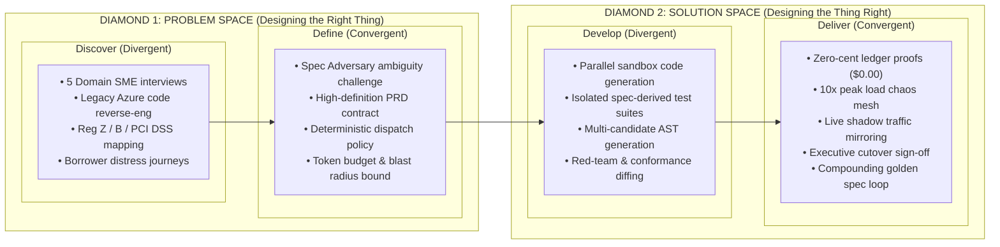
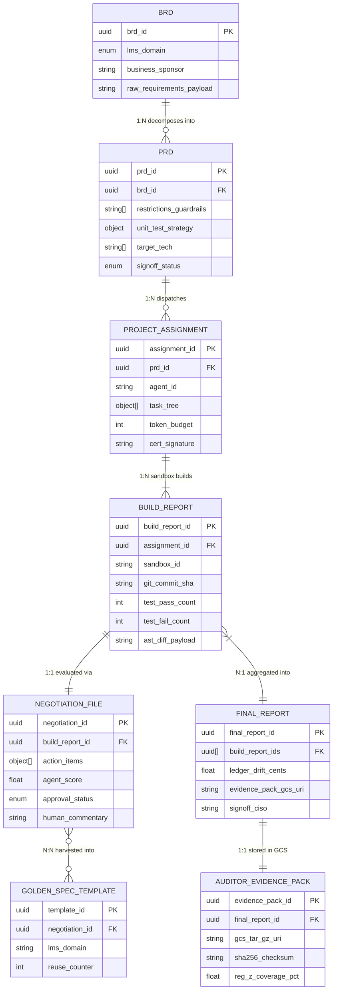
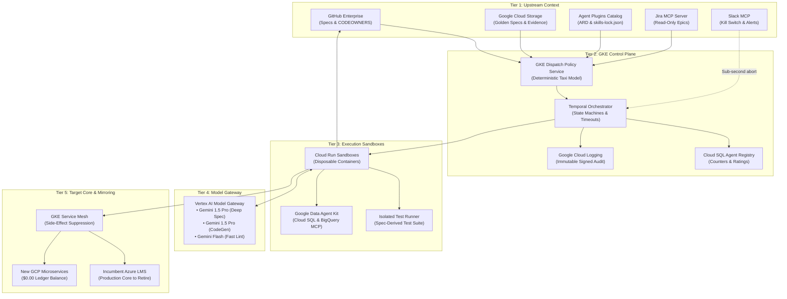
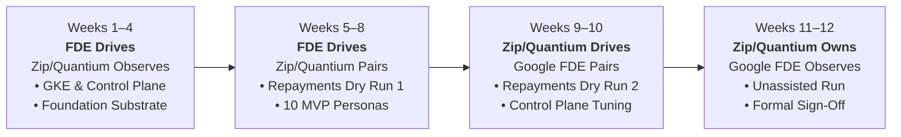

# Zip Agentic Factory — Working Session & Persona Phase Mapping

**Project Catalyst · Agent Factory / LMS Rebuild**  
**Executive Transformation Workshop:** Chris Nelms (CISO), Eric Blassberg (Delivery Lead) & Google FDE / CE Team  
**Date:** September 1, 2026

---

## 1. Executive Summary & Narrative Structure

This document forms **Part II: The Working Session & Decision Workshop** of the Project Catalyst Architecture Read-Back.

Where Part I synthesises the architectural design faithful to the five whiteboard scans (the seven-phase pipeline, six registered artifacts, control plane, and documentation loop), **Part II is where decisions get made**. It puts the operational questions on the table:
1. **Exhaustive Persona-to-Phase Mapping & Critique:** Evaluating whether the 28 personas in the catalogue are mapped to the correct phases, why they should not be confined to their current phases, and how their responsibilities shift across the lifecycle.
2. **The Whiteboard Open Questions (Q.1 – Q.7):** Direct answers and workshop discussion points for the author's seven handwritten questions.
3. **The Triaged Parking Lot:** 33 open items and 3 closed items categorized by severity (P0 Blocking, P1 Before Build, P2 Before Scale, P3 Nice-to-Have).
4. **The Three Immediate Decisions:** The concrete decisions required from this session to unblock early delivery.

---

## 2. Persona-by-Persona Phase Re-Allocation Analysis

The Zip persona catalogue defines **28 distinct persona types** across six families (A through F). In the initial model, many personas were assigned to a single stage. 

The analysis below evaluates each persona's placement, diagnoses the risks of confining them to their current phase, and re-allocates them across the seven-phase factory pipeline.

---

### Family A — Intent & Scope

#### 1. Product Manager (PM)
* **Current Phase:** Phase 1 (Specify)
* **Why they shouldn't be only in current phase:** The PM currently hands off the PRD and exits. When engineering hits minor requirement ambiguities or timeline pressure during review, engineers make scope decisions unilaterally, leading to product divergence.
* **Which other phase(s) and why:**
  * **Phase 4 (Review):** Must review minor defects and scope trade-offs to authorize deferring non-critical features to subsequent releases rather than blocking the build gate.
  * **Phase 6 (Ship & Observe):** Co-signs the business cutover decision with executive transformation leadership to confirm user ROI expectations are met.

#### 2. Domain SME (×5: Decisioning, Issuing, Repayments, Customer Master, Merchant Engine)
* **Current Phase:** Phase 1 (Specify)
* **Why they shouldn't be only in current phase:** Lending domain logic is dense and nuanced. If SMEs are absent during shadow-gate evaluation in Phase 6, subtle legacy edge cases (such as leap-year interest accrual or grace-period calculation oddities) will be misdiagnosed as bugs by engineers.
* **Which other phase(s) and why:**
  * **Phase 4 (Review):** Adjudicates complex lending calculations in generated code before merge.
  * **Phase 6 (Ship & Observe):** Triages real-time divergence queues at the shadow gate alongside the Reconciliation Analyst. A $0.03 difference is a domain question, not a software defect.

#### 3. Regulatory & Compliance Analyst
* **Current Phase:** Stage 1 (Specify)
* **Why they shouldn't be only in current phase:** Encoding regulations into the PRD at Phase 1 is essential, but if this persona is absent during verification, nobody validates that the built binary complies with Reg Z, Reg B, FDCPA, and GLBA before reaching CISO Chris Nelms.
* **Which other phase(s) and why:**
  * **Phase 1 (Specify):** Constructs the upfront regulatory compliance mapping matrix.
  * **Phase 5 (Verify):** Independent compliance judge inspecting the verification evidence pack and signing off on regulatory coverage before cutover.

#### 4. UX/UI Designer
* **Current Phase:** Phase 1 (Specify)
* **Why they shouldn't be in current phase:** Catalyst Phase 1 is a headless LMS rebuild (APIs, core banking ledgers, and event pipelines on GKE). Having a frontend UX designer at Phase 1 of a backend microservice rebuild creates noise and distraction.
* **Which other phase(s) and why:**
  * **Phase 4 (Review):** Restricted strictly to customer-facing communication templates (adverse action notices, distress emails, statement templates) to verify WCAG accessibility and borrower clarity.
  * *Alternative:* Defer completely to Phase 2 of Catalyst when consumer lending web/mobile portals are rebuilt.

#### 5. Requirements Architect (Author)
* **Current Phase:** Phase 1 (Specify)
* **Why they shouldn't be only in current phase:** In the original pipeline, the author hands off the spec and vanishes. When Implementation Engineers encounter silent assumptions during generation, work halts or hallucinations occur.
* **Which other phase(s) and why:**
  * **Phase 3 (Generate):** Active in an on-call capacity via the Negotiation File to resolve Requests for Information (RFIs) and clarify edge cases without invalidating the signed spec.
  * **Phase 7 (Update Documentation):** Curates approved specifications back into the golden spec template library.

#### 6. Spec Adversary (Judge)
* **Current Phase:** Phase 1 (Specify)
* **Why they shouldn't be only in current phase:** Challenging text specs for ambiguity is vital, but untestable assertions cannot be fully proven until test suites are compiled.
* **Which other phase(s) and why:**
  * **Phase 5 (Verify):** Verifies that every ambiguity flag raised during Phase 1 has a corresponding automated test in the verification evidence pack.

---

### Family B — Design & Architecture

#### 7. Software Architect
* **Current Phase:** Phase 1 → 2 (Specify to Dispatch)
* **Why they shouldn't be only in current phase:** Architecture cannot end at task dispatch. During Phase 3, autonomous agents make hundreds of low-level decisions (concurrency libraries, error handling, telemetry wrappers). Without ongoing architectural review, architectural drift contaminates the repo.
* **Which other phase(s) and why:**
  * **Phase 4 (Review):** Mandatory human/agent reviewer enforcing design patterns, dependency health, and GKE compatibility in GitHub CODEOWNERS.
  * **Phase 7 (Update Documentation):** Authorizes Architecture Decision Records (ADRs) and updates architecture baselines.

#### 8. Data Architect
* **Current Phase:** Phase 1 → 2 (Specify to Dispatch)
* **Why they shouldn't be only in current phase:** Schema modeling (decimal vs float, double-entry, bitemporal history) is easy on paper; the true test is when data backfills run and shadow ledgers diverge.
* **Which other phase(s) and why:**
  * **Phase 3 (Generate):** Paired with the Migration Engineer to validate schema migrations and table constraints.
  * **Phase 5 (Verify):** Verifies double-entry ledger proofs to ensure money balances to the exact cent across accounts.

#### 9. Integration Engineer
* **Current Phase:** Phase 1 → 2 (Specify to Dispatch)
* **Why they shouldn't be doing direct integration in current phase:** The "House Next Door" strategy explicitly excludes direct core integration back into the legacy Azure core for 12–18 months. An integration engineer attempting live connections at Phase 1/2 violates project boundaries.
* **Which other phase(s) and why:**
  * **Phase 1/2 (Specify/Dispatch):** Strictly restricted to OpenAPI/AsyncAPI contract definitions and boundary stubs.
  * **Phase 3 (Generate):** Generates stub servers and contract mock harnesses.
  * **Phase 4 (Review):** Verifies that generated microservices do not leak network calls outside sandbox boundaries.

#### 10. Identity & Access Engineer
* **Current Phase:** Phase 1 → 2 (Specify to Dispatch)
* **Why they shouldn't be only in current phase:** AuthN/AuthZ is a runtime control. Modeling least privilege upfront is ineffective if sandbox tokens and MCP servers are not constrained during generation and review.
* **Which other phase(s) and why:**
  * **Phase 2 (Dispatch):** Issues least-privilege agent certificates and scoped token credentials.
  * **Phase 3 (Generate):** Monitors sandbox network egress and prevents privilege escalation.
  * **Phase 4 (Review):** Scans pull requests for hardcoded secrets, misconfigured IAM roles, and excessive MCP permissions (Jira/Slack).

---

### Family C — Build

#### 11. Implementation Engineer
* **Current Phase:** Phase 3 (Generate)
* **Why they shouldn't be in other phases:** Must **NEVER** write specs (Phase 1) or approve its own code (Phase 4). Doing so violates Principle 2.1 ("Author and judge are never the same persona") and creates circular validation.
* **Which other phase(s) and why:**
  * Strictly confined to **Phase 3 (Generate)**. In Phase 4, they may receive rework tickets via the Negotiation File, but hold zero review authority.

#### 12. Test Engineer (Isolated)
* **Current Phase:** Phase 3 (Generate)
* **Why they shouldn't be placed in Phase 3 alongside code generation:** If the test engineer operates in Phase 3 while code is being written, they are inevitably tempted to inspect the code to write tests. Tests then encode the code's bugs as expected behavior.
* **Which other phase(s) and why:**
  * **Phase 1/2 (Shift-Left to Specify/Dispatch):** Ingests the signed PRD at Dispatch and authors the conformance test suite *before* or in parallel with code generation (Test-Driven AI Development).
  * **Phase 4 (Review):** Feeds independent test execution results directly into the Build Report score.

#### 13. Migration & Backfill Engineer
* **Current Phase:** Phase 3 (Generate)
* **Why they shouldn't be only in Phase 3:** Data backfill is currently completely absent from the PRD build scope (§9). Treating migration as an afterthought in Phase 3 guarantees failure at the shadow gate because a system with no historical loan book cannot be shadow-tested.
* **Which other phase(s) and why:**
  * **Phase 3 (Generate):** Authors restartable, idempotent data migration pipelines.
  * **Phase 5 (Verify):** Executes trial data migrations against historical anonymized loan books.
  * **Phase 6 (Ship & Observe):** Manages state re-baselining from Azure to GCP to prevent cascading false divergences.

#### 14. Skills Agent (= Zip SDLC Principles)
* **Current Phase:** Setup / Environment (Callout on whiteboard page 1)
* **Why they shouldn't be only a static callout in Phase 3:** House SDLC principles cannot be injected only during compilation. If principles aren't present during specification, PRDs lack standard test strategies; if absent at review, pull requests pass without linting.
* **Specification via Agent Plugins 1.0.0 (Resolving `PL-36`):**
  * Rather than treating the "Skills Agent" as an elusive standalone LLM persona, Zip formalizes it as a **Versioned Enterprise Agent Plugin** adhering to the vendor-neutral **Agent Plugins 1.0.0** specification (backed by Google, Amazon, Microsoft, OpenAI, Cursor, and Vercel).
  * Packaging standard: A fixed directory layout containing `plugin.json` (manifest), `skills/` (portable markdown instructions & reference assets), `mcp.json` (explicit server transports), and an optional `com.zip.catalyst/` reverse-domain namespace for Zip-specific governance metadata.
  * Deterministic fleet synchronization: Pinned by cryptographic hashes in [`skills-lock.json`](file:///Users/pcorreia/Documents/Customers/Zip/Zip%20-%20Agentic%20Factory/skills-lock.json) so human developers (in Antigravity, Cursor, or VS Code) and autonomous agents (in Cloud Run sandboxes) execute the exact same rules with zero wrapper drift.
* **Which other phase(s) and why:**
  * **Cross-cutting Governance across Phases 1 through 7:** Injects PRD contract rules in Phase 1, mounts deterministic plugin hashes in Phase 2, validates coding/linting/AST standards in Phase 3, enforces review checklists in Phase 4, executes regulatory verification in Phase 5, and ingests newly harvested ADRs and regression evals into updated plugin versions in Phase 7.

---

### Family D — Adversarial Judges

#### 15. Spec Conformance Judge
* **Current Phase:** Phase 4 (Review)
* **Why they shouldn't be only in Phase 4:** Static diffs against specifications check whether code was implemented, but cannot catch behavioral divergences under high-throughput runtime conditions.
* **Which other phase(s) and why:**
  * **Phase 4 (Review):** Primary home for AST and API contract diffing against the PRD.
  * **Phase 5 (Verify):** Runtime verification comparing live service behavior against spec invariants.

#### 16. Security Engineer / Red Team
* **Current Phase:** Phase 4 (Review)
* **Why they shouldn't be only in Phase 4:** Static code analysis (SAST) in Phase 4 misses dynamic runtime vulnerabilities, race conditions, and sandbox escapes.
* **Which other phase(s) and why:**
  * **Phase 4 (Review):** Static vulnerability analysis, secrets detection, dependency scanning.
  * **Phase 5 (Verify):** Dynamic penetration testing (DAST), authorization fuzzing, and adversarial attacks on financial transaction endpoints.

#### 17. QA / Adversarial Tester
* **Current Phase:** Phase 5 (Verify)
* **Why they shouldn't be only in Phase 5:** Designing negative boundary tests only after code is built means test scenarios do not inform the unit test strategy in the PRD.
* **Which other phase(s) and why:**
  * **Phase 1 (Specify):** Contributes negative boundary conditions (money edge cases, leap years, timezone rollovers) to the PRD Unit Test Strategy.
  * **Phase 5 (Verify):** Primary execution of edge-case attack suites.

#### 18. Regulatory Conformance Verifier
* **Current Phase:** Phase 5 (Verify)
* **Why they shouldn't be in earlier phases:** Must remain strictly independent from authoring to ensure evidence is legally defensible.
* **Which other phase(s) and why:**
  * Primary home: **Phase 5 (Verify)**.
  * Ingests the regulatory map from Phase 1 and outputs an auditor-legible evidence pack into Google Cloud Storage.

#### 19. SRE / Resilience Agent
* **Current Phase:** Phase 5 (Verify)
* **Why they shouldn't be only in Phase 5:** Operability cannot be retrofitted. If microservices don't emit structured telemetry or health checks in Phase 3, SRE discovers un-monitorable services at Phase 5.
* **Which other phase(s) and why:**
  * **Phase 1 (Specify):** Mandates non-functional requirements (SLOs, latency targets, telemetry standards).
  * **Phase 5 (Verify):** Chaos injection and 10× load testing.
  * **Phase 6 (Ship & Observe):** Production SLO monitoring alongside Observability Engineer.

#### 20. Reconciliation Analyst
* **Current Phase:** Phase 5 / 6
* **Why they shouldn't be introduced only at Phase 6:** The catalogue states: *"Reconciliation Analyst is the persona the programme lives or dies on."* Introducing this persona only when live traffic is mirrored at Phase 6 results in divergence triage backlogs immediately paralyzing the team.
* **Which other phase(s) and why:**
  * **Phase 1 (Specify):** Defines mathematical tolerance thresholds and rounding rules upfront.
  * **Phase 5 (Verify):** Executes offline historical ledger reconciliation against legacy test datasets.
  * **Phase 6 (Ship & Observe):** Primary production shadow queue triage and human explanation.

---

### Family E — Sustain

#### 21. Observability Engineer
* **Current Phase:** Stage 6 (Ship & Observe)
* **Why they shouldn't be only in Phase 6:** Telemetry cannot be bolted on during shadow deployment. If OpenTelemetry traces are missing from microservices in Phase 3, Phase 6 mirroring operates blind.
* **Which other phase(s) and why:**
  * **Phase 3 (Generate):** Injects tracing instrumentation and structured logging wrappers.
  * **Phase 5 (Verify):** Validates trace propagation during chaos and load testing.
  * **Phase 6 (Ship & Observe):** Operates Cloud Monitoring dashboards and on-call alerting.

#### 22. Documentation & Knowledge Curator
* **Current Phase:** Phase 7 (Update Documentation)
* **Why they shouldn't be only at Phase 7:** If documentation is only curated at the end of a multi-week cycle, intermediate decisions made during Phases 1, 3, and 4 are lost to history.
* **Which other phase(s) and why:**
  * **Phase 1 (Specify):** Indexes existing specs and provides reusable templates to the Requirements Architect.
  * **Phase 4 (Review):** Extracts resolved disputes from the Negotiation File into permanent Architecture Decision Records (ADRs).
  * **Phase 7 (Update Documentation):** Deduplicates and promotes domain specs into the compounding library.

#### 23. Release & Change Manager
* **Current Phase:** Phase 6 (Ship & Observe)
* **Why they shouldn't be only in Phase 6:** Rollback plans and deployment sequencing must be tested before live traffic mirroring.
* **Which other phase(s) and why:**
  * **Phase 5 (Verify):** Rehearses the 15-minute rollback sequence in test environments.
  * **Phase 6 (Ship & Observe):** Manages traffic mirroring, canary stages, and executive cutover sequencing.

#### 24. Executive Transformation Owner (Chris Nelms & Eric Blassberg)
* **Current Phase:** Phase 6 (Human Gate)
* **Why they shouldn't be involved only at Phase 6:** An executive gatekeeper who only sees the project at final cutover has no context on accumulated technical debt or deferred compliance scope.
* **Which other phase(s) and why:**
  * **Phase 1 (Specify):** Approves regulatory scope boundaries and commercial milestones.
  * **Phase 6 (Ship & Observe):** Authorizes final production cutover and Azure commit retirement based on evidence.

---

### Family F — Factory Governance

#### 25. Persona Steward
* **Current Phase:** Cross-cutting Governance
* **Why they shouldn't be unmapped:** Persona drift after frontier model upgrades silently degrades code quality across all five domains simultaneously.
* **Which other phase(s) and why:**
  * **Phase 2 (Dispatch):** Verifies persona certificates, versions, and capability schemas in Cloud SQL.
  * **Phase 7 (Update Documentation):** Re-baselines persona prompt directives against new domain invariants and model updates.

#### 26. Eval Engineer
* **Current Phase:** Cross-cutting Governance
* **Why they shouldn't be unmapped:** The PRD declares that "evals remain owned assets", but without a staffed eval engineer, defect escapes are never converted into automated tests.
* **Which other phase(s) and why:**
  * **Phase 4 (Review):** Maintains the scoring algorithm combining quantitative bug counts and qualitative review.
  * **Phase 5 (Verify):** Maintains the verification test harness.
  * **Phase 7 (Update Docs):** Performs escaped-defect root-cause analysis, adding new regression evals.

#### 27. Autonomy Rung Governor
* **Current Phase:** Cross-cutting Governance
* **Why they shouldn't be unmapped:** Human review is the unmodelled bottleneck. Without active rung management, every task requires manual review and the factory fails to scale.
* **Which other phase(s) and why:**
  * **Phase 2 (Dispatch):** Determines whether task classes qualify for autonomous L4 execution or mandatory L2 human review.
  * **Phase 4 (Review):** Automatically demotes task classes back to mandatory human review upon escaped defects.

#### 28. Token Economics Analyst
* **Current Phase:** Cross-cutting Governance
* **Why they shouldn't be unmapped:** The core value thesis of Catalyst is that "unit cost of delivery falls each cycle". Without instrumentation, this is an unfalsifiable assertion.
* **Which other phase(s) and why:**
  * **Phase 3 (Generate):** Monitors token consumption and retry costs across Gemini 1.5 Pro and Gemini 2.0 Flash sandboxes.
  * **Phase 6 (Ship & Observe):** Measures operational inference costs during traffic mirroring.
  * **Phase 7 (Update Docs):** Quantifies unit cost per spec and proves the declining-cost thesis across quarterly releases.

---

## 2.1 Master Skills Catalog & Dual-Runtime Sandboxing Architecture (Resolving `PL-43`)

Following the adoption of **Agent Plugins 1.0.0** (`PL-36`), the factory operationalizes the capabilities required across all 28 personas by creating a unified **56-Skill Master Catalog** (`data/skills_catalog.json` and [`SKILLS_CATALOG.md`](file:///Users/pcorreia/Documents/Customers/Zip/Zip%20-%20Agentic%20Factory/architecture-unpack/SKILLS_CATALOG.md)).

### 1. Dual-Layer Capability Sourcing: Google vs. Zip
Every skill in the factory is formally tracked with its provider, operational status, and upstream reference:
1. **Google Cloud Platform Skills (32 Skills — 100% Ready):** Sourced directly from the official [`google/skills`](https://github.com/google/skills) repository. These provide production-ready integrations for Cloud Run disposable sandboxes (`cloud-run-basics`), GKE cluster workloads (`gke-basics`), Cloud SQL PostgreSQL operations (`cloud-sql-postgres-data`), Spanner horizontal scaling (`spanner-data`), BigQuery shadow reconciliation (`bigquery-sql`), Cloud Logging/Monitoring (`cloud-logging-query-generation`, `cloud-monitoring-promql-query`), WAF security reviews (`google-cloud-waf-security`), and Agent Platform lifecycle tools (`gemini-agents-api`, `google-agents-cli-onboarding`).
2. **Zip Proprietary Domain & SDLC Skills (24 Skills — 1 Ready, 23 To Author):** Custom business invariants authored as versioned Agent Plugins. Includes `double_diamond_design` (available in repo), core-banking double-entry balance provers ($0.00 zero-cent drift), loan amortization calculation engines, regulatory rule checkers (Reg Z APR disclosures, Reg B ECOA, FDCPA, PCI DSS), isolated TDD test generators, and side-effect suppression wrappers.

| Category | Total Skills | Google Provided | Zip Provided | Have Resource (Ready) | Need to Build (To Author) | Phase 1 MVP Critical |
|---|:---:|:---:|:---:|:---:|:---:|:---:|
| **GCP Compute & Sandboxes** | 7 | 7 | 0 | 7 | 0 | 5 |
| **GCP Databases & Storage** | 7 | 7 | 0 | 7 | 0 | 3 |
| **GCP Analytics & Data** | 3 | 3 | 0 | 3 | 0 | 2 |
| **GCP Observability & Telemetry** | 4 | 4 | 0 | 4 | 0 | 3 |
| **GCP Security & Governance** | 6 | 6 | 0 | 6 | 0 | 5 |
| **Agent Lifecycle & Operations** | 5 | 5 | 0 | 5 | 0 | 5 |
| **SDLC & Engineering Governance** | 9 | 0 | 9 | 1 | 8 | 9 |
| **Lending Domain Invariants** | 5 | 0 | 5 | 0 | 5 | 3 |
| **Banking Ledger Integrity** | 5 | 0 | 5 | 0 | 5 | 5 |
| **Regulatory & Statutory Compliance** | 5 | 0 | 5 | 0 | 5 | 4 |
| **TOTALS** | **56** | **32** | **24** | **33** | **23** | **44** |

### 2. Dual-Runtime Sandboxing: Agent Platform vs. Cloud Run BYOD
To balance high-speed, zero-trust evaluation with deep compiler flexibility, the factory implements a **Dual-Runtime Execution Strategy**:

* **Tier A: Agent Platform Managed Code Execution Sandbox (`code_execution`):**
  * *Mechanism:* Managed execution environments provided natively by Gemini Enterprise Agent Platform (`gemini-agents-api`).
  * *Features:* Instant startup (<200ms), zero image build overhead, native network allowlists (`network.allowlist`), and direct mounting of versioned skill manifests from Cloud Storage (`gs://.../skills`) or the Agent Platform Skill Registry (`agent-platform-skill-registry`).
  * *Target Workloads:* Phase 1 AST spec verification, Phase 3 spec-derived unit test generation (isolated TDD), code syntax linting, currency floating-point detection, and lightweight script execution.
* **Tier B: Cloud Run / GKE BYOD Sandbox (Custom Docker Isolation):**
  * *Mechanism:* Ephemeral, self-managed containers deployed to Cloud Run or GKE with automated kill switch triggers.
  * *Features:* Complete **Bring-Your-Own-Docker (BYOD)** environment. Accommodates custom C# decompilers (.NET 8 SDK / ILSpy) required to reverse-engineer legacy Azure LMS microservices, multi-container integration harnesses (running PostgreSQL, Redis, and mock card rails simultaneously), historical data backfill ETL jobs, and Phase 5 Chaos Mesh fault injection.
* **Routing Decision Matrix:** The Phase 2 Dispatcher evaluates task requirements. If a task requires custom system binaries, legacy decompilers, or multi-container stubs, it routes to **Tier B (Cloud Run BYOD)**; if it requires standard Go/Python execution, AST diffing, or TDD unit tests, it routes to **Tier A (Agent Platform Sandbox)**.

---

## 3. Double Diamond Framework Applied to the Factory Pipeline

The **Double Diamond** design methodology divides the engineering lifecycle into two distinct spaces:
1. **Diamond 1: Problem Space** (*"Designing the right thing"*) — alternating between **Discover** (divergent context gathering) and **Define** (convergent specification).
2. **Diamond 2: Solution Space** (*"Designing the thing right"*) — alternating between **Develop** (divergent code & test exploration) and **Deliver** (convergent verification & cutover).

> [!TIP]
> **Detailed Recursive Double Diamond & DAG Specification**:
> For the comprehensive sub-phase breakdown of all 7 phases (steps, 28-persona distribution, input/output artifacts, quality gates, and Mermaid/SVG DAGs), refer to the dedicated specification document:
> **[PHASES.md](file:///Users/pcorreia/Documents/Customers/Zip/Zip%20-%20Agentic%20Factory/architecture-unpack/PHASES.md)** (or [DOUBLE_DIAMOND_SUBPHASES_DAG.md](file:///Users/pcorreia/Documents/Customers/Zip/Zip%20-%20Agentic%20Factory/architecture-unpack/DOUBLE_DIAMOND_SUBPHASES_DAG.md))
> This is also interactively visualised in the **Factory Explorer UI** under the default **🔄 Phases** sub-tab across all phases.

### 3.1 Expanded Phase Descriptions & Related Artifacts

#### Phase 1: Specify
* **Double Diamond Stage:** **Discover & Define (Diamond 1)**
* **Divergent Activity (Discover):** Broadly gathering requirements from PM, 5 domain SMEs, Regulatory Analyst, and UX Designer. Ingests legacy Azure LMS code to uncover undocumented lending invariants.
* **Convergent Activity (Define):** Requirements Architect and Spec Adversary eliminate dual-interpretation language, ensuring every statement is mathematically testable.
* **Primary & Expanded Artifacts:**
  * **BRD (A)** (Business Requirements Document — unstructured text, PDF, Markdown)
  * *New Sub-Artifact A.1:* **Regulatory Traceability Matrix** (Clause-by-clause legal mapping to Reg Z, Reg B, FDCPA, GLBA, PCI DSS)
  * *New Sub-Artifact A.2:* **Domain Invariant Register** (Lending rules that must never be violated)
  * **Reviewed PRD (B)** (High-definition contract in GitHub Markdown with YAML frontmatter)
  * **Negotiation File (F)** (Ambiguity dispute log)
* **Gate to Pass:** PRD GO / NO-GO (Human Product & Architecture approval).

#### Phase 2: Dispatch
* **Double Diamond Stage:** **Define (Diamond 1 Convergence → Diamond 2 Launch)**
* **Divergent Activity (Discover Options):** Evaluates agent registry capabilities across frontier models (Gemini 1.5 Pro/Flash, Gemini 1.5 Pro) and scans token cost vs latency trade-offs.
* **Convergent Activity (Define Controls):** Deterministically matches the best agent fleet for the task; establishes immutable blast radius bounds and issues cryptographic execution certificates.
* **Primary & Expanded Artifacts:**
  * *New Sub-Artifact B.1:* **Agent Capability Registry** (Structured skill predicates and usage counters in Cloud SQL)
  * *New Sub-Artifact B.2:* **Boundary Contract & Stub Spec** (OpenAPI/AsyncAPI contract mocks for House Next Door isolation)
  * **Project Assignment (C)** (Immutable JSON dispatch contract specifying task, constraints, budget, timeout, certificates)
* **Gate to Pass:** Control plane policy check (Deterministic certificate & budget validation).

#### Phase 3: Generate
* **Double Diamond Stage:** **Develop (Diamond 2 Divergence)**
* **Divergent Activity (Develop Candidates):** Parallel microservice code generation across disposable Cloud Run sandboxes. Isolated Test Engineer derives test suites solely from the specification without code access. Migration Engineer authors idempotent loan backfill scripts.
* **Convergent Activity (Local Validation):** Automated syntax compilation, linting against Zip SDLC principles, and execution of local unit tests inside sandbox isolation.
* **Primary & Expanded Artifacts:**
  * *New Sub-Artifact C.1:* **Generated Microservice Source** (Go / Python service code)
  * *New Sub-Artifact C.2:* **Independent Spec-Derived Test Suite** (Zero code access)
  * *New Sub-Artifact C.3:* **Idempotent Data Backfill Scripts** (Restartable ledger ETL routines)
  * **Disposable Sandbox Build Report (D)** (Compilation status, unit test logs, telemetry trace IDs)
* **Gate to Pass:** Sandbox compilation & internal unit test pass (Zero compilation warnings, 100% spec assertion coverage).

#### Phase 4: Review
* **Double Diamond Stage:** **Develop & Evaluate (Diamond 2 Challenge)**
* **Divergent Activity (Adversarial Probe):** Spec Conformance Judge diffs implementation AST against PRD ("nothing more, nothing less"). Security Red Team scans for OWASP vulnerabilities and excessive MCP privileges. Eval Engineer runs scoring harness.
* **Convergent Activity (Decision & Adjudication):** Systems Engineer (Human CODEOWNERS) reviews the diff and security findings. Product Manager adjudicates non-critical requirement deferrals.
* **Primary & Expanded Artifacts:**
  * *New Sub-Artifact D.1:* **AST Conformance Diff** (Delta between requested behavior and generated code)
  * *New Sub-Artifact D.2:* **Static Security Audit Log** (SAST, secret scan, and MCP privilege audit)
  * *New Sub-Artifact D.3:* **Agent Score & Rating Record** (Persisted to Cloud SQL)
  * **Negotiation File Updates (F)** (Action items, feedback register, approve/disapprove rationale)
* **Gate to Pass:** Human Systems Engineer CODEOWNERS sign-off (`Approve / Not approve + reason`).

#### Phase 5: Verify
* **Double Diamond Stage:** **Deliver (Diamond 2 Convergence - Pre-Production Proofs)**
* **Divergent Activity (Stress & Chaos Exploration):** QA Adversarial Tester bombards service with boundary edge cases (leap years, negative balances, concurrency). SRE runs Chaos Mesh (10x peak load, pod kills). Regulatory Verifier runs audit suites.
* **Convergent Activity (Evidence Synthesis):** Reconciles financial ledgers to $0.00 zero-cent drift; compiles cryptographic proofs into an auditor-legible evidence pack.
* **Primary & Expanded Artifacts:**
  * *New Sub-Artifact E.1:* **Double-Entry Balance Reconciliation Proof** (Cent-for-cent mathematical proof)
  * *New Sub-Artifact E.2:* **Chaos & Load Test Telemetry** (Latency SLO and fault recovery logs)
  * *New Sub-Artifact E.3:* **Auditor Evidence Pack** (Stored immutably in Google Cloud Storage)
  * **Final Verification Report (E)** (Consolidated sign-off ready for executive review)
* **Gate to Pass:** Zero unexplained ledger variances, 100% regulatory test pass, CISO verification sign-off.

#### Phase 6: Ship & Observe
* **Double Diamond Stage:** **Deliver (Diamond 2 Convergence - Production Realization)**
* **Divergent Activity (Live Production Probing):** GKE service mesh mirrors live production traffic from incumbent Azure LMS to GCP microservices with *side-effect suppression* (preventing dual debits). Captures live transaction divergences in real-time shadow queue.
* **Convergent Activity (Triage & Executive Cutover):** Reconciliation Analyst and Domain SMEs triage shadow divergences into standard taxonomy. Executive Transformation Owners (Chris Nelms & Eric Blassberg) review evidence and execute cutover, permanently retiring the Azure commit.
* **Primary & Expanded Artifacts:**
  * *New Sub-Artifact F.1:* **Shadow Traffic Mirroring Log** (Dual-run telemetry)
  * *New Sub-Artifact F.2:* **Divergence Triage Register** (Human-legible explanation for every single variance)
  * *New Sub-Artifact F.3:* **Production Cutover Authorization** (Executive sign-off document)
  * *New Sub-Artifact F.4:* **15-Minute Rollback Plan** (Tested automated revert runbook)
* **Gate to Pass:** Executive cutover gate (Chris Nelms & Eric Blassberg) — zero unexplained shadow divergences over 14 consecutive days.

#### Phase 7: Update Documentation
* **Double Diamond Stage:** **Deliver & Re-Seed Discover (The Closed Loop)**
* **Divergent Activity (Harvesting Learnings):** Harvesting Architecture Decision Records (ADRs) from resolved disputes in the Negotiation File. Analyzing escaped defects and production variances to design new evals. Aggregating token economics and unit costs per spec from Cloud Logging.
* **Convergent Activity (Curating Compounding Assets):** Deduplicating domain specs; promoting recurring patterns into standardized golden templates. Re-baselining persona system prompts against new domain learnings and frontier LLM updates.
* **Primary & Expanded Artifacts:**
  * *New Sub-Artifact G.1:* **Golden Domain Spec Templates** (Curated, modular specifications)
  * *New Sub-Artifact G.2:* **Architecture Decision Records (ADR) Index** (Permanent institutional memory)
  * *New Sub-Artifact G.3:* **Regression Eval Suite Additions** (New permanent tests for escaped defects)
  * *New Sub-Artifact G.4:* **Unit Cost Attribution Report** (Proves declining delivery cost per cycle)
* **Gate to Pass:** Persona Steward and Documentation Curator sign-off (Zero duplicate specs, golden library updated).

---

## 4. Whiteboard Open Questions (Q.1 – Q.7)

*Source: Handwritten document page 1 (`zip arc1.pdf`).*

| # | Question on Whiteboard | Where It Bites | Current Resolution Status | Workshop Action Required |
|---|---|---|---|---|
| **Q.1** | **Spec format — `.md`?** | Phase 1 → 2 boundary | ✅ **RESOLVED.** Standardized on **GitHub Markdown with frontmatter YAML** ([`DOUBLE_DIAMOND_SUBPHASES_DAG.md` Step 1.2.1](DOUBLE_DIAMOND_SUBPHASES_DAG.md)). BRD accepts `txt/md/doc/pdf`; the PRD contract must be structured `.md` to allow deterministic schema validation. | Agree on house Markdown spec schema. |
| **Q.2** | **Centralized kill switch** | Phase 3 Generation | ✅ **RESOLVED.** Specified as an always-on cross-cutting control across all Cloud Run sandboxes on GKE Control Plane with sub-second API endpoint (<750ms SLA) triggered via Slack MCP ([`03_FDE_SOW_AND_DOD.md` §2.2](storyline/03_FDE_SOW_AND_DOD.md)). | Validate kill-switch trigger endpoints. |
| **Q.3** | **How to control a Generate run** | Phase 2 → 3 handoff | ✅ **RESOLVED.** Orchestrated deterministically via **Temporal state machine workflows** on GKE ([`03_FDE_SOW_AND_DOD.md`](storyline/03_FDE_SOW_AND_DOD.md)), managing pause, resume, concurrency throttles, and token spend caps per task. | Define run-control parameters in Temporal orchestrator. |
| **Q.4** | **Unit test in disposable sandboxes** | Phase 3 Generation | ✅ **RESOLVED.** Architected a **Dual-Runtime Execution Substrate**: Tier A (Agent Platform zero-trust managed `code_execution`) and Tier B (Cloud Run / GKE BYOD sandboxes with isolated network namespaces) ([`SKILLS_CATALOG.md`](SKILLS_CATALOG.md)). | Standardize sandbox container image base. |
| **Q.5** | **Score = user feedback + data driven (pass tests)** | Phase 4 Review | ✅ **RESOLVED.** Composite scoring algorithm combining quantitative spec pass rates ($W_1$), adversarial edge-case survivability ($W_2$), and human CODEOWNERS review ratings ($W_3$). Persisted to Cloud SQL via Google Agents CLI ([`DOUBLE_DIAMOND_SUBPHASES_DAG.md` Step 4.2.1](DOUBLE_DIAMOND_SUBPHASES_DAG.md)). | Calibrate weight constants during pilot dry run. |
| **Q.6** | **Where is their documentation** | Phase 1 Upstream Loop | 🟡 **PARTIALLY RESOLVED.** Step 1.1.2 establishes automated **Code Archaeology** (.NET 8 SDK / ILSpy decompilation directly against legacy Azure repos) into the immutable `Domain Invariant Register (Artifact A.2)`. | Provision access/URLs to legacy Azure repos. |
| **Q.7** | **Multi-Model Inference on Vertex AI** | Phase 3 Generation | ✅ **RESOLVED.** Multi-model routing across Gemini 1.5 and Gemini 1.5 Pro on **Vertex AI Model Gateway**. The open **Agent Plugins 1.0.0** standard ensures skills and MCP tools run portably across both frontier models without wrapper drift. | Align commercial procurement on Vertex AI; standardize plugins. |

## 5. Triaged Parking Lot Board (40 Resolved, 2 Partially Resolved, 1 Open)

> [!TIP]
> **Executive Summary:** 40 of 43 previously open items have been formally resolved in the architecture and verified across specifications. Attention is concentrated strictly on the 3 remaining active operational items.

### Active Operational Items for Workshop Action
1. **`PL-31` / `Q.6` — Legacy Documentation & Code Repo Access:**
   * *Status:* 🟡 **Partially Resolved.** Automated Code Archaeology via ILSpy decompilation is architected (Step 1.1.2).
   * *Workshop Action:* Zip engineering leads to provision Git repository URLs and read-only credentials.
2. **`PL-16` / `Q.5` — Scoring Function Weight Calibration:**
   * *Status:* 🟡 **Partially Resolved.** Composite scoring framework ($W_1, W_2, W_3$) and Cloud SQL schemas are locked.
   * *Workshop Action:* Calibrate specific weighting constants during Week 3 of the Repayments pilot dry run.
3. **`PL-00` — Tripartite SoW & Commercial Sign-off:**
   * *Status:* 🔴 **Open Decision.** Act 3 (SoW/DoD) and Act 4 (Tripartite Implementation Model) authored.
   * *Workshop Action:* Executive ratifications with Chris Nelms (CISO) and Eric Blassberg (Delivery Lead).

### Summary of 40 Resolved Items (By Category)
* **Resolved Whiteboard Items:** Q.1 (`PL-26`), Q.2 (`PL-27`), Q.3 (`PL-28`), Q.4 (`PL-29`), Q.5 (`PL-30`), Q.7 (`PL-32`).
* **Resolved Foundation Items:** Phase 4 Name (`PL-01`), DER Model (`PL-02`), 28 Personas (`PL-03`), Compounding Loop (`PL-04`), Cardinality (`PL-05`), Archetypes (`PL-06`), Languages & CI/CD (`PL-07`), Deterministic Selection (`PL-10`).
* **Resolved Governance & Security:** MCP Blast Radius & Identity (`PL-19` / `PL-35`), SDLC Principles & 23 Double Diamond Skills (`PL-36`), Dual-Runtime Substrate (`PL-43`), Autonomy Rungs (`PL-25`), Artifact Versioning (`PL-23`), Dispute Consensus Lifecycle (`PL-21` / `PL-22`).
* **Resolved Verification & Shadow Gating:** 5 LMS Domains Scoped (`PL-17`), 15-min Rollback (`PL-20`), Shadow Gate Live Mirroring (`PL-33`), Side-Effect Suppression & State Re-baselining (`PL-37`), 4-Class Divergence Taxonomy (`PL-41`), Unit Cost Attribution Metric (`PL-42`).

## 6. The Four Priority Decisions

1. **Lock the Evaluation Function (`PL-16` / `Q.5`):**
   * **Proposal:** Agree on the composite scoring algorithm combining quantitative spec pass rates ($W_1$), adversarial edge-case survivability ($W_2$), and human CODEOWNERS review ratings ($W_3$).
   * **Tooling Acceleration:** Leverage Google's newly released **Agents CLI** evaluation plugins (`google.github.io/agents-cli`) to standardize benchmark runs and persist score histories to Cloud SQL.

2. **Specify the Skills Agent via Agent Plugins 1.0.0 (`PL-36`):**
   * **Proposal:** Replace the ambiguous standalone persona with the open, vendor-neutral **Agent Plugins 1.0.0** standard (co-maintained by Google, Amazon, Microsoft, OpenAI, Cursor, and Vercel).
   * **Architecture:** Establish a 3-tier plugin hierarchy:
     1. `zip-sdlc-governance-plugin`: Coding standards, TDD isolated testing rules, linting scripts.
     2. LMS Domain Plugins (e.g. `zip-repayments-plugin`, `zip-decisioning-plugin`): Invariant checks, double-entry ledger assertions, legacy C# stubs.
     3. Platform Data Plugins: Google **Data Agent Kit** (`github.com/GoogleCloudPlatform/data-agent-kit`) for Cloud SQL registry and BigQuery reconciliation queries.
   * **Integrity & Synchronization:** Pin versioned plugin hashes into [`skills-lock.json`](file:///Users/pcorreia/Documents/Customers/Zip/Zip%20-%20Agentic%20Factory/skills-lock.json) so human engineers (Antigravity/Cursor) and autonomous Cloud Run containers run identical rules without wrapper drift.
   * *Detailed Architecture Reference:* See [`agent_plugins_integration_analysis.md`](file:///Users/pcorreia/.gemini/jetski/brain/e13b4d95-e7da-488a-83d3-9579ff84922d/agent_plugins_integration_analysis.md).

3. **Bound the Blast Radius & Scope MCP (`PL-35` / `PL-19`):**
   * **Proposal:** Enforce the specification's clear separation between *portable tool packaging* and *runtime platform policy*:
     * **Plugin Level (`mcp.json`):** Defines tool schemas and server transport types (`stdio`, `streamable_http`) without embedding secrets or environmental credentials.
     * **Platform Level (GKE Control Plane & Dispatcher):** Issues short-lived, least-privilege Workload Identity OAuth tokens at container launch (read-only for Jira; dedicated alert channel for Slack).
     * **Sandbox Egress:** Enforce strict NetworkSecurityPolicies on Cloud Run containers preventing external egress beyond authorized mock stubs and internal MCP gateways.

4. **Adopt the Dual-Runtime Sandboxing Architecture (`PL-43`):**
   * **Proposal:** Authorize the two-tier execution substrate balancing managed zero-trust agility with deep compiler flexibility:
     * **Tier A (Agent Platform Sandbox):** Managed `code_execution` for rapid spec-derived TDD unit tests, linting, AST verification, and Python/Go validation without container build overhead.
     * **Tier B (Cloud Run / GKE BYOD Sandbox):** Bring-Your-Own-Docker isolation for legacy C# (.NET 8 SDK / ILSpy) reverse-engineering, multi-service mock harnesses (PostgreSQL/Redis/card rails), data backfills, and Phase 5 Chaos Mesh fault injection.
   * *Detailed Specification:* See [`SKILLS_CATALOG.md`](file:///Users/pcorreia/Documents/Customers/Zip/Zip%20-%20Agentic%20Factory/architecture-unpack/SKILLS_CATALOG.md) and [`skills_catalog.json`](file:///Users/pcorreia/Documents/Customers/Zip/Zip%20-%20Agentic%20Factory/architecture-unpack/data/skills_catalog.json).

---

## 7. Registered Artifacts & Data Entity Relationship (DER) Model

The factory operates on **six primary registered artifacts (A through F)** and **four compounding sub-artifacts (Sub-A1, Sub-B1, Sub-E3, Sub-G1)**. All artifacts are strongly typed with explicit relational schemas.

### 7.1 Entity-Relationship Schema (DER)

---

## 8. Dynamic Component Architecture & Cloud Interaction

The platform is deployed across **Google Cloud Platform** with isolated boundaries separating the GKE Control Plane, disposable Cloud Run sandboxes, the Vertex AI multi-model gateway, and incumbent legacy Azure systems.

---

## 9. Project Catalyst 5-Stage Phased Rollout Roadmap

| Stage | Timeline | Objectives & Scope | Core Workstreams | Executive Gate Criteria |
|---|---|---|---|---|
| **Stage 0** | **Months 1–2** | Foundation & Sandbox Isolation | • GKE control plane cluster setup • Temporal orchestrator deployment • Cloud Run disposable container templates • Vertex AI multi-model gateway • Sub-second kill switch propagation drill | **Exit Gate 0:** Penetration test & sandbox escape audit approved by Chris Nelms (CISO). |
| **Stage 1** | **Months 3–5** | Single Domain Pilot (Decisioning / Repayments) | • First end-to-end factory build on Repayments • Paired specification (Requirements + Adversary) • Isolated spec-derived TDD test authoring • Human Systems Engineer CODEOWNERS review | **Exit Gate 1:** First microservice builds and passes all spec assertions; zero regulatory gaps. |
| **Stage 2** | **Months 6–8** | Shadow Gate & Historical Ledger Playback | • GKE Service Mesh traffic mirroring setup • Side-effect suppression filters (block card rails) • 3-year historical loan book backfill ETL • Double-entry ledger balance proofs | **Exit Gate 2:** Multi-year ledger playback achieves **$0.00 zero-cent balance drift**. |
| **Stage 3** | **Months 9–14** | Multi-Domain Scaling (All 5 LMS Domains) | • Fan-out to Issuing, Customer Master, Merchant • Autonomy Rung Manager promotion (L2 -> L4) • Golden spec template reuse library • 10x peak load chaos injection | **Exit Gate 3:** Spec compounding proven: unit cost of delivery per spec decreases by >30%. |
| **Stage 4** | **Months 15–18** | Production Cutover & Azure Retirement | • 100% production traffic mirrored in shadow • Real-time divergence triage against legacy • 15-minute emergency rollback verification • Final executive cutover authorization | **Exit Gate 4:** 14 consecutive clean days of shadow run; Chris Nelms & Eric Blassberg cutover sign-off; Azure decommission. |

---

## 10. Presentation Themes & Executive Print Mode

The application suite features two switchable themes:
1. **⚡ Zip Co Signature Brand Theme:**
   - Deep Midnight Obsidian (`#14002C`), Electric Neo-Lime (`#BEF202`), Vivid Iris (`#7B2CBF`), Coral Alert (`#FF3366`). Designed for high-impact interactive digital presentations.
2. **⚪ Monochromatic B&W (Executive Noir / Print Ready):**
   - Pitch Black (`#000000`), Crisp Stark White (`#FFFFFF`), surgical slate grays. Designed for distraction-free board decks, print handouts, and formal compliance review.

---

## 11. Exhaustive 28-Persona & Skills Catalog

The Zip Agentic Factory persona library contains **28 specialized personas** across six families, equipped with **111 machine-executable skills**.

### 11.1 Family A — Intent & Scope

| Persona | Role & MVP | Overview | Primary Skills | Adversarial Counterpart |
|---|---|---|---|---|
| **Product Manager** | Author · ⭐ MVP | Business alignment, user ROI, feature prioritization, and enforcing strict MVP boundaries. | `jira_epic_reader`, `value_scoring_calculator`, `user_journey_validator`, `mvp_scope_diff_analyzer` | Spec Adversary |
| **Domain SME (×5 Domains)** | Judge · ⭐ MVP | 15-year lending expert across Decisioning, Issuing, Repayments, Customer Master, Merchant Engine. | `loan_amortization_calculator`, `interest_accrual_validator`, `delinquency_waterfall_checker`, `merchant_fee_settler` | Requirements Architect |
| **Regulatory & Compliance Analyst** | Judge (Shift-Left) · ⭐ MVP | Anchors requirements to statutory frameworks in Phase 1; audits evidence packs in Phase 5. | `reg_z_tila_checker`, `reg_b_ecoa_auditor`, `fdcpa_disclosure_scanner`, `pci_dss_tokenization_verifier`, `statutory_clause_mapper` | Requirements Architect |
| **UX/UI Designer** | Author | Optimizes customer friction, WCAG accessibility, and financial distress flows. | `wcag_contrast_auditor`, `user_friction_evaluator`, `distress_flow_simulator`, `design_token_verifier` | Product Manager |
| **Requirements Architect** | Author · ⭐ MVP | Converts business intent into unambiguous high-definition PRD contracts with YAML frontmatter. | `prd_markdown_generator`, `ast_spec_compiler`, `invariant_rule_synthesizer`, `openapi_contract_validator` | Spec Adversary |
| **Spec Adversary** | Judge · ⭐ MVP | Uncovers contradictions, untestable assertions, and silent assumptions before engineering begins. | `semantic_ambiguity_detector`, `contradiction_scanner`, `untestable_assertion_flagger`, `dual_interpretation_prober` | Requirements Architect |

### 11.2 Family B — Design & Architecture

| Persona | Role & MVP | Overview | Primary Skills | Adversarial Counterpart |
|---|---|---|---|---|
| **Software Architect** | Judge | Analyzes architectural proposals for scalability, system bottlenecks, and pattern violations. | `architecture_pattern_analyzer`, `concurrency_model_evaluator`, `cache_invalidation_prober`, `distributed_tracing_planner` | Requirements Architect |
| **Data Architect** | Judge | Protects the core-banking money model: decimal representation, rounding, and double-entry balance. | `double_entry_balance_checker`, `bitemporal_schema_auditor`, `decimal_money_validator`, `rounding_rule_analyzer` | Software Architect |
| **Integration Engineer** | Author | Owns system boundaries and builds OpenAPI/AsyncAPI contract mocks and stubs for House Next Door. | `openapi_stub_builder`, `asyncapi_mock_generator`, `idempotency_key_verifier`, `partial_failure_simulator` | Software Architect |
| **Identity & Access Engineer** | Author | Enforces least-privilege token lifecycles, network perimeters, and cryptographic agent certificates. | `ephemeral_token_issuer`, `iam_least_privilege_checker`, `network_boundary_enforcer`, `agent_cert_signer` | Autonomy Rung Governor |

### 11.3 Family C — Build

| Persona | Role & MVP | Overview | Primary Skills | Adversarial Counterpart |
|---|---|---|---|---|
| **Implementation Engineer** | Author · ⭐ MVP | Produces clean, idiomatically typed microservices strictly to specification in Cloud Run sandboxes. | `go_service_scaffolder`, `python_fastapi_generator`, `sdlc_linter_enforcer`, `dependency_security_checker` | Test Engineer (Isolated) |
| **Test Engineer (Isolated)** | Judge (Shift-Left) · ⭐ MVP | Operates in strict code isolation with zero implementation access; writes spec-derived tests (TDD). | `spec_assertion_extractor`, `bdd_gherkin_compiler`, `zero_code_test_runner`, `mutation_test_executor` | Implementation Engineer |
| **Migration & Backfill Engineer** | Author | Builds idempotent data migration scripts to backfill loan portfolios reconcilable to the cent. | `idempotent_etl_builder`, `loan_book_backfill_runner`, `state_rebaselining_sync`, `source_cent_reconciler` | Reconciliation Analyst |

### 11.4 Family D — Adversarial Judges

| Persona | Role & MVP | Overview | Primary Skills | Adversarial Counterpart |
|---|---|---|---|---|
| **Spec Conformance Judge** | Judge · ⭐ MVP | Diffs implementation AST against PRD contract to enforce 'nothing more, nothing less'. | `ast_diff_analyzer`, `unrequested_behavior_detector`, `missing_feature_flagger`, `spec_conformance_scorer` | Implementation Engineer |
| **Security Engineer / Red Team** | Judge · ⭐ MVP | Probes OWASP Top 10, MCP privilege escalation, cross-tenant data leaks, and secret management. | `owasp_top10_scanner`, `mcp_permission_boundary_probe`, `privilege_escalation_auditor`, `secret_leak_detector` | Implementation Engineer |
| **QA / Adversarial Tester** | Judge | Probes negative boundary conditions: leap years, currency rollovers, and concurrency races. | `boundary_condition_fuzzer`, `leap_year_rollover_tester`, `concurrency_race_prober`, `negative_path_generator` | Implementation Engineer |
| **Regulatory Conformance Verifier** | Judge | Executes the statutory test suite and packages evidence packages into Google Cloud Storage. | `statutory_test_executor`, `auditor_evidence_packager`, `gcs_evidence_uploader`, `cfpb_compliance_verifier` | Regulatory Analyst |
| **SRE / Resilience Agent** | Judge | Evaluates operability under stress, executes Chaos Mesh on GKE, and validates latency SLOs. | `chaos_mesh_injector`, `ten_x_load_generator`, `latency_slo_tracker`, `pod_failure_simulator` | Software Architect |
| **Reconciliation Analyst** | Judge · ⭐ MVP | Compares shadow traffic against legacy Azure LMS; classifies divergences into the 4-class taxonomy. | `ledger_balance_comparator`, `divergence_classifier`, `float_drift_explainer`, `shadow_queue_triager` | Domain SME (×5) |

### 11.5 Family E — Sustain & Cutover

| Persona | Role & MVP | Overview | Primary Skills | Adversarial Counterpart |
|---|---|---|---|---|
| **Observability Engineer** | Author | Instruments telemetry and OpenTelemetry spans to answer 3am on-call diagnostics questions. | `opentelemetry_instrumenter`, `slo_alert_rule_generator`, `pagerduty_bridge_configurator`, `distributed_trace_analyzer` | SRE / Resilience Agent |
| **Documentation & Knowledge Curator** | Author | Deduplicates specs, curates golden templates, and indexes ADRs to make cycle n+1 cheaper. | `adr_markdown_indexer`, `golden_spec_deduplicator`, `docusaurus_publisher`, `runbook_synthesizer` | Persona Steward |
| **Release & Change Manager** | Author | Formulates cutover sequencing and enforces the mandatory, tested 15-minute rollback runbook. | `cutover_sequencer`, `fifteen_minute_rollback_runner`, `change_ticket_synthesizer`, `revert_drill_verifier` | Executive Owners |

### 11.6 Family F — Factory Governance & Executive

| Persona | Role & MVP | Overview | Primary Skills | Adversarial Counterpart |
|---|---|---|---|---|
| **Persona Steward** | Governor | Guards the persona library, monitors prompt drift after model upgrades, and tracks changelogs. | `persona_drift_evaluator`, `prompt_rebaseliner`, `frontier_model_eval_runner`, `version_changelog_logger` | Documentation Curator |
| **Eval Engineer** | Governor | Maintains the scoring harness; converts escaped bugs into permanent regression eval tests. | `eval_harness_maintainer`, `escaped_defect_eval_builder`, `benchmark_scorer`, `regression_suite_compiler` | Implementation Engineer |
| **Autonomy Rung Governor** | Governor | Evaluates task execution history to promote tasks from L2 supervised to L4 autonomous dispatch. | `clean_run_counter`, `escaped_defect_demoter`, `rung_promotion_certifier`, `trust_audit_logger` | Identity & Access Engineer |
| **Token Economics Analyst** | Governor | Meters token spend per spec and attributes expenses to rework or retries to prove compounding. | `token_consumption_meter`, `unit_cost_attributor`, `retry_cost_analyzer`, `roi_curve_plotter` | Product Manager |
| **Systems Engineer (Human)** | Human Gatekeeper · ⭐ MVP | Holds GitHub CODEOWNERS approval authority; reviews pull request diffs and security scores. | `codeowners_pr_reviewer`, `security_signoff_authorizer`, `system_sdlc_approver` | Implementation Engineer |
| **Executive Owners (Nelms/Blassberg)** | Human Gatekeeper · ⭐ MVP | Authorize production traffic transition from Azure to GCP based on 14 clean shadow days. | `executive_cutover_authorizer`, `ciso_compliance_certifier`, `legacy_decommission_signer` | Release & Change Manager |

---

## 12. Reference Architectures & Blueprints from Sample Repositories

To ground the Zip Agentic Factory in proven engineering patterns, an exhaustive distillation of the three reference repositories in [`sample-repos/`](../sample-repos/) has been compiled into [`sample-repos/SAMPLE_REPOS_KNOWLEDGE_AND_SETUP.md`](../sample-repos/SAMPLE_REPOS_KNOWLEDGE_AND_SETUP.md).

### The Three Pillars:
1. **Constitutional Layer — `mission-kit`**:
   - **The 14 Invariant Axioms (`A1`–`A14`)**: Load-bearing invariants (Sovereign State Transparency, Isomorphic Specification, Cognitive Minimalism, Compounding Learning) that prevent drift and over-reliance on probabilistic LLM memory.
   - **3-Axis Dynamic Work Generation**: $\text{Role } (M) \times \text{Work-Type } (W) \times \text{Domain } (N) \longrightarrow \text{WorkItem}$, replacing static, unmaintainable task lists with composable execution contracts.
   - **Engineering Doctrine & Cognitive Falsifiers**: Rigorous claim disciplines (*Measured vs. Inferred*, *Mint before cite*, *Measure the effect not the act*, *3 cycles without narrowing = Park*).
2. **Platform & Coordination Layer — `agentic-network` (OIS)**:
   - **Central Node.js 22 Hub on GCE/Cloud Run**: Managing 71 Model Context Protocol (MCP) tools across 17 domains over Streamable HTTP (`POST/GET/DELETE /mcp`) with persist-first Server-Sent Events (SSE).
   - **Sovereign PostgreSQL JSONB Substrate**: Kubernetes-style envelope rows (`apiVersion`, `kind`, `metadata`, `spec`, `status`) with a strict decode-to-flat read membrane.
   - **Universal Network Adapter (`@apnex/network-adapter`)**: 3-state L4 Wire Transport (`McpTransport`) with 30s heartbeats and 90s watchdogs paired with a 5-state L7 Session Client (`McpAgentClient`).
   - **Threads 2.0 Consensus**: Turn-alternating deliberation carrying `semanticIntent` tags and atomic execution of staged `convergenceActions` upon mutual agreement.
   - **Calibration Ledger (`calibrations.yaml`)**: Ground-truth queryable ledger of architectural pathologies, defeating fuzzy LLM context recall.
3. **Application & Google Cloud Layer — `mam-learning-portfolio-engine`**:
   - **The 3-Layer Architecture**: Conductor Workflows (Living Markdown SOPs in `conductor/`) $\rightarrow$ Google ADK 2.0 Multi-Agent Orchestration $\rightarrow$ Deterministic Execution (FastAPI, BigQuery Property Graph, Vertex AI `gemini-3.6-flash`, React console).
   - **Directory Governance Matrix ("Neighborhood Rules")**: Strict directory path ownership per agent guardian, preventing cross-domain code pollution and requiring formal Markdown Negotiation contracts (`agent_feedback_registry/negotiations/`).
   - **Self-Healing Annealing Loop**: Automated pattern for inspecting error traces, applying surgical fixes, asserting tests, and permanently updating the Markdown SOP in `conductor/`.

### Direct Adoption Blueprint for Zip Agentic Factory

| Factory Phase | Challenge in Zip LMS Rebuild | Solution Adopted from Sample Repos |
|---|---|---|
| **Phase 1: Specify** | Vague, untestable markdown specifications | `mission-kit` **Claim Discipline** (*Measured vs. Inferred*) + **`SC1`–`SC6` Schema validation** + Statutory Mapping Matrix (Reg Z/B, PCI DSS). |
| **Phase 2: Dispatch** | Hallucinated task decomposition & tool leaks | `agentic-network` **L4/L7 Session FSM** + `register_role` single-task tokens with bounded tool blast radiuses. |
| **Phase 3: Generate** | Cross-domain microservice trampling | `mam` **Neighborhood Rules** (strict directory ownership) + Disposable Cloud Run Sandboxes. |
| **Phase 4: Review** | Circular arguments between Authors & Judges | `agentic-network` **Threads 2.0** (turn-alternating `semanticIntent`) + `mission-kit` **3-cycle stopping rule** (auto-escalate to CODEOWNERS). |
| **Phase 5: Verify** | Tests asserting their own mocks | `mission-kit` **"Measure the effect, not the act"** + Strict Test Isolation (Isolated Test Engineer writes TDD from signed spec with zero code access). |
| **Phase 6: Shadow Gate** | 1.8M loan repayments drift / rounding quirks | `mam` **BigQuery Telemetry Graph** + 4-Class Divergence Taxonomy (GCP bug, Legacy bug, Rounding drift, Intentional deviation) + 14 clean shadow days. |
| **Phase 7: Compounding** | Persona prompt drift on frontier model updates | `agentic-network` **Calibration Ledger (`calibrations.yaml`)** + Eval Engineer regression test bank + Curated ADR library (`A14`). |

*Full technical details, architectural diagrams, and step-by-step setup guides: [`sample-repos/SAMPLE_REPOS_KNOWLEDGE_AND_SETUP.md`](../sample-repos/SAMPLE_REPOS_KNOWLEDGE_AND_SETUP.md).*

---

## 13. 8–12 Week FDE Scoping Analysis, SoW, Definition of Done (DoD) & Phased Rollout Plan

### 13.1 Scoping Assessment: Is 8–12 Weeks Adequate?

An evaluation of the initial **8–12 week estimate** indicates that the timeframe is **adequate and viable**, but **only under a clear boundary condition**:
The 1x Google Field Deployed Engineer (FDE) must be scoped exclusively as the **factory architect and technical spearhead** delivering the **Factory MVP and a single high-stakes pilot dry run** (Repayments & Loan Amortization Engine). The subsequent 12-month migration of the full 5-domain Loan Management System (LMS) and multi-month shadow gating must be executed by **Partner FDEs (Quantium)** and **Zip Senior Engineers (14 SWEs over 9 months)**.

#### Three Delivery Scenarios Analyzed

| Dimension | Scenario 1: 8-Week Accelerated Sprint | Scenario 2: 10-Week Balanced MVP | Scenario 3: 12-Week Sequential Handover (Recommended) |
|---|---|---|---|
| **Target Profile** | Aggressive / High Risk | Pragmatic Baseline | Enterprise Derisked / Sustainable |
| **Google FDE Effort** | 8 Person-Weeks (100%) | 10 Person-Weeks (100%) | 12 Person-Weeks (100% W1–8, tapering W9–12) |
| **Zip Team Effort** | 12 Person-Weeks (2 SWEs part-time) | 18 Person-Weeks (2 SWEs + Arch) | 28 Person-Weeks (4 SWEs + Arch + CISO) |
| **Partner (Quantium)** | Minimal involvement (shadow only) | 4 Person-Weeks (onboarding W8+) | 16 Person-Weeks (active co-delivery W9–12) |
| **Pilot Dry Run Scope** | Synthetic mock test only | Replay with 1-month historical data | Full 3-year historical ledger replay ($0.00 drift) |
| **Personas Deployed** | 6 Core Personas | 10 MVP Personas | 10 MVP Personas + Eval Regression Harness |
| **Handover Model** | Async code drop & README | 2-week compressed pairing | 4-week Progressive Ownership Ladder |
| **Pre-Conditions Needed** | GCP VPC, IAM, Vertex quotas ready on Day 0 | Standard landing zone provisioning | Standard landing zone provisioning |
| **Feasibility Verdict** | ⚠️ **High Risk**: Fragile to IAM delays; high likelihood of knowledge transfer failure. | 🟡 **Viable**: Adequate for technical build, tight on partner operational readiness. | 🟢 **Optimal & Recommended**: Maximizes enterprise adoption, zero-drift financial proof, and clean partner handoff. |

---

### 13.2 Pilot Dry Run Module: Repayments & Loan Amortization Engine

To prove the factory before scaling across all 5 LMS domains, the pilot target is the **Repayments & Loan Amortization Engine**:
1. **Core Banking Financial Rigor**: Requires exact decimal arithmetic (no floating-point rounding errors), double-entry ledger balancing with a strict $0.00 delta invariant, and complex delinquency waterfall calculations.
2. **Statutory Non-Negotiables**: Must strictly comply with Truth in Lending Act (Reg Z) disclosure calculations, Equal Credit Opportunity Act (Reg B) adverse actions, and FDCPA debt collection rules.
3. **Legacy Azure Validation**: Provides 3 years of production transaction logs in Snowflake/Databricks to perform black-box historical replay and side-by-side shadow reconciliation.

---

### 13.3 Statement of Work (SoW) for 1x Google FDE

#### In-Scope Deliverables
* **Control Plane Substrate**: Stand up GKE Control Plane, Temporal orchestrator, Cloud SQL Agent Registry, and Vertex AI Model Gateway routing (Gemini 1.5 Pro, Gemini 1.5 Pro, Gemini Flash).
* **Agentic SDLC Harness**: Deploy the 10 MVP Personas (Family A, B, C, D, F) in isolated Cloud Run execution sandboxes with single-task ephemeral IAM tokens.
* **Isolated TDD Runner**: Configure strict test isolation where the Isolated Test Engineer writes spec-derived suites with zero implementation code access.
* **Repayments Pilot Dry Run**: Execute an end-to-end factory cycle converting a business requirement into verified Go/Python microservices matching legacy calculations cent-for-cent.
* **Central Safety Controls**: Implement sub-second Slack MCP kill switch and immutable Cloud Logging audit trail.
* **Handover Pack**: Deliver architecture decision records (ADRs), infrastructure-as-code (Terraform), runbooks, and conduct 4 weeks of paired knowledge transfer.

#### Out-of-Scope (Governed by Quantium & Zip)
* Full re-platforming of remaining 4 LMS domains (Decisioning, Issuing, Customer Master, Merchant Engine).
* Production cutover and decommission of the legacy Azure .NET monolith.
* Long-term 24/7 on-call production support.

---

### 13.4 Verifiable Definition of Done (DoD) Checklist

| Area | Milestone Gate | Verifiable DoD Criteria | Proof Mechanism |
|---|---|---|---|
| **Substrate** | **M1: Foundation (W2)** | GKE Control Plane & Temporal orchestrator running with 99.9% health check. | Automated synthetic heartbeat workflow |
| **Safety** | **M1: Foundation (W2)** | Sub-second central kill switch aborts all active agent sandboxes within 750ms. | Automated chaos injection & Slack trigger test |
| **Model Tier** | **M2: Harness (W5)** | Multi-model Vertex AI gateway routing Gemini 1.5 Pro and Gemini 1.5 Pro with token quotas. | Token telemetry dashboard in Cloud Logging |
| **Governance** | **M2: Harness (W5)** | 10 MVP Personas registered with versioned system prompts, tool boundaries, and YAML contracts. | Cloud SQL Agent Registry schema query |
| **Testing** | **M2: Harness (W5)** | Test Engineer operates in zero-code-access container; spec-derived tests fail before code gen (TDD). | Git repo commit history & sandbox isolation log |
| **Pilot Run** | **M3: Repayments (W8)** | Repayments microservice passes 100% of isolated unit tests and AST conformance diff. | CI/CD build report & Negotiation File sign-off |
| **Financial Proof** | **M3: Repayments (W8)** | Historical ledger playback of 50,000+ loan accounts reconciles with **$0.00 zero-cent drift**. | Reconciliation Analyst automated diff report |
| **Handover** | **M4: Handover (W12)** | Two named Zip engineers and two Quantium FDEs independently run a full factory cycle with 0 FDE touches. | Screen-recorded verification run & signed DoD charter |

---

### 13.5 Cross-Functional RACI Matrix

| Workstream | Google FDE | Zip Factory Architect | Zip Arch Team | Partner FDEs (Quantium) | Zip Senior SWEs (14) | Exec Owners (Nelms/Blassberg) |
|---|---|---|---|---|---|---|
| **1. Landing Zone & GKE Substrate** | **R** | C | C | I | I | A |
| **2. SDLC Harness & Personas** | **R** | C | C | I | I | A |
| **3. Isolated TDD & Eval Suites** | **R** | C | I | C | C | A |
| **4. Repayments Pilot Dry Run (Iter 1)** | **R** | C | C | C | C | A |
| **5. Historical Ledger Replay** | C | C | C | **R** | R | **A** |
| **6. Repayments Dry Run (Iter 2 — Handover)**| C | **R** | C | **R** | **R** | A |
| **7. Multi-Domain LMS Scaling (W13+)** | I | A | C | **R** | **R** | A |
| **8. Azure Decommission & Cutover** | I | C | C | R | **R** | **A** |

*Legend: R = Responsible, A = Accountable, C = Consulted, I = Informed.*

---

### 13.6 Progressive Ownership Ladder (Sequential Handover)

---

### 13.7 Week-by-Week Phased Execution Plan (Weeks 1 to 12)

* **Week 1: Onboarding & GCP Landing Zone Alignment**: Joint architecture alignment with Zip Architecture Team and Quantium lead. Validate VPC peering, IAM policies, and Vertex AI quota reservations.
* **Week 2: Substrate & Control Plane Scaffolding (Milestone Gate M1)**: Deploy GKE cluster, Temporal orchestrator, and Cloud SQL Agent Registry. Implement the sub-second Slack MCP kill switch drill.
* **Week 3: Model Gateway & Multi-Model Inference**: Configure Vertex AI routing for Gemini 1.5 Pro, Gemini 1.5 Pro, and Gemini Flash. Deploy Token Economics telemetry.
* **Week 4: Sandboxes & Tool Adapters**: Build disposable Cloud Run container runtime templates. Integrate GitHub Enterprise, Jira MCP, and Postgres tools with ephemeral auth tokens.
* **Week 5: Agentic SDLC Harness & 10 MVP Personas (Milestone Gate M2)**: Define and version the 10 MVP personas. Implement strict isolated TDD execution (Test Engineer in zero-code sandbox).
* **Week 6: Repayments Specification & Adversarial Review**: Ingest Repayments domain rules. Author high-definition PRD contract with Reg Z/B statutory requirements. Run Spec Adversary to resolve ambiguities.
* **Week 7: Code Generation & AST Conformance**: Implementation Engineer generates microservices in Cloud Run. AST diff analyzer verifies code against PRD contract. Human Systems Engineer CODEOWNERS review.
* **Week 8: Historical Replay & Pilot Verification (Milestone Gate M3)**: Run 50,000+ historical loan transactions through new microservices against Snowflake logs. Assert $0.00 zero-cent balance drift. Complete Iteration 1.
* **Week 9: Handover Co-Delivery — Pilot Iteration 2**: Quantium FDEs and Zip engineers take the keyboard to author and execute a modification cycle (e.g. promotional interest tier). Google FDE pairs and mentors.
* **Week 10: Control Plane & Operational Runbooks**: Partner and Zip engineers operate deployment and monitoring pipelines. Validate on-call runbooks and failure recovery scenarios.
* **Week 11: Unassisted Factory Execution**: Zip and Quantium run an end-to-end factory cycle with zero Google FDE intervention. Log performance metrics and token unit costs.
* **Week 12: Handover Certification & Formal Sign-Off (Milestone Gate M4)**: Review all 8 exit criteria against the Definition of Done. Executive sign-off from Chris Nelms and Eric Blassberg. Transition to Quantium-led Stage 3.
