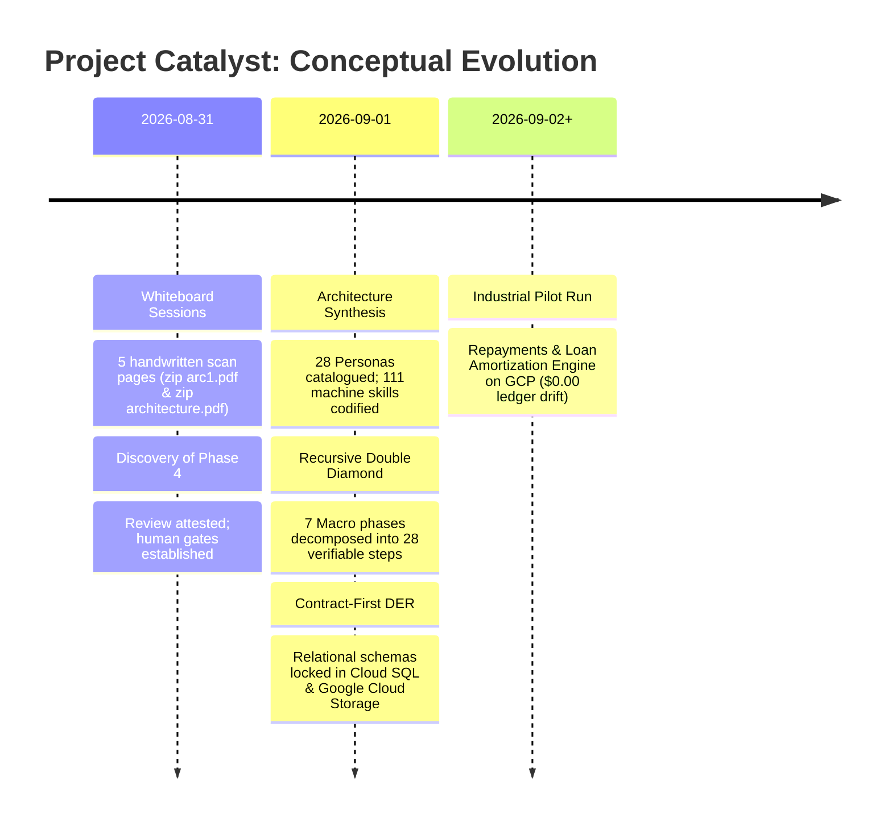
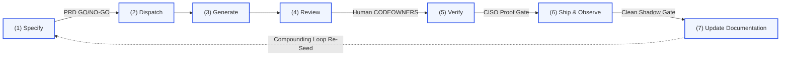
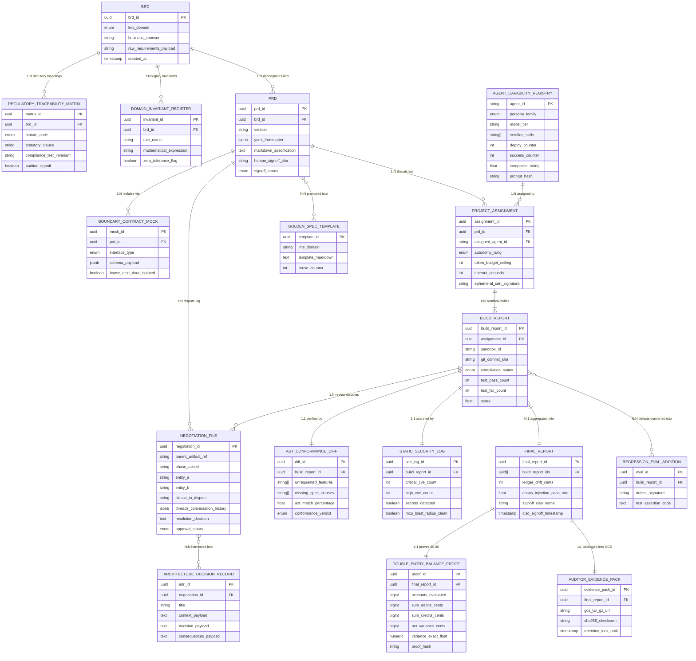
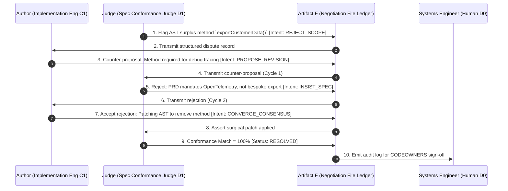
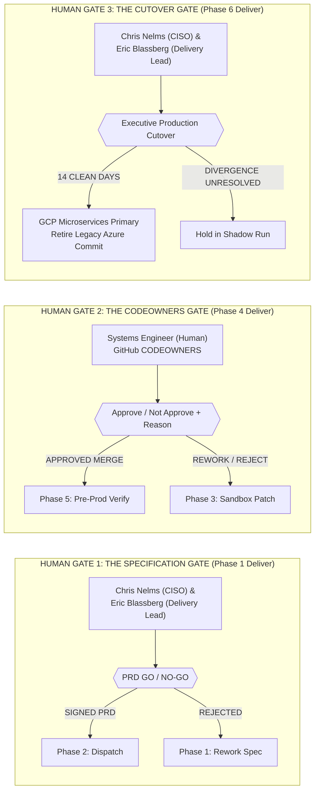

# Act 1: Concepts, Phases & Constitutional Architecture

**Zip Agentic Factory · Project Catalyst — Core Banking LMS Rebuild**  
**Document Code:** `ACT-01-CONCEPTS-PHASES`  
**Target File:** `architecture-unpack/storyline/01_CONCEPTS_AND_PHASES.md`  
**Classification:** Executive Architectural Specification  
**Stakeholders:** Chris Nelms (CISO), Eric Blassberg (Delivery Lead), Zip Engineering Leadership & Google Cloud FDE Team  
**Date:** September 1, 2026  
**Status:** Approved Architectural Blueprint  

---

## Table of Contents

1. [Executive Narrative: The Conceptual Leap — From Informal Sketches to Engineering Rigor](#1-executive-narrative-the-conceptual-leap--from-informal-sketches-to-engineering-rigor)
   - [1.1 The Genesis: Five Scanned Pages and a Core Banking Imperative](#11-the-genesis-five-scanned-pages-and-a-core-banking-imperative)
   - [1.2 The Paradigm Shift: Moving Beyond Unconstrained Copilots to an Industrial Software Factory](#12-the-paradigm-shift-moving-beyond-unconstrained-copilots-to-an-industrial-software-factory)
   - [1.3 The Four Load-Bearing Architectural Invariants](#13-the-four-load-bearing-architectural-invariants)
2. [The Double Diamond Recursive Phases Framework](#2-the-double-diamond-recursive-phases-framework)
   - [2.1 The Seven Macro Phases & Resolving the Historic "Missing Phase 4" Anomaly](#21-the-seven-macro-phases--resolving-the-historic-missing-phase-4-anomaly)
   - [2.2 The Recursive Double Diamond: Micro-Cycles within Every Macro Phase](#22-the-recursive-double-diamond-micro-cycles-within-every-macro-phase)
   - [2.3 Exhaustive Phase-by-Phase Walkthrough (Phase 1 through Phase 7)](#23-exhaustive-phase-by-phase-walkthrough-phase-1-through-phase-7)
   - [2.4 Master Factory Meta-DAG and Typed Pipeline Handshakes](#24-master-factory-meta-dag-and-typed-pipeline-handshakes)
3. [The Contract-First Artifacts Registry & DER Data Model](#3-the-contract-first-artifacts-registry--der-data-model)
   - [3.1 The 10 Strongly-Typed Artifacts (Primary A–F & Compounding Sub-Artifacts)](#31-the-10-strongly-typed-artifacts-primary-af--compounding-sub-artifacts)
   - [3.2 The Master Entity-Relationship Model (Mermaid DER)](#32-the-master-entity-relationship-model-mermaid-der)
   - [3.3 Deep Dive: "Disagreement is an Artifact" — The Negotiation File Ledger](#33-deep-dive-disagreement-is-an-artifact--the-negotiation-file-ledger)
   - [3.4 Deep Dive: Bank Regulators & The Immutable Auditor Evidence Pack](#34-deep-dive-bank-regulators--the-immutable-auditor-evidence-pack)
4. [Constitutional Separation of Powers: Personas & Adversarial Pairs](#4-constitutional-separation-of-powers-personas--adversarial-pairs)
   - [4.1 The Fundamental Axiom: "Author and Judge Are Never the Same Persona"](#41-the-fundamental-axiom-author-and-judge-are-never-the-same-persona)
   - [4.2 The Test Isolation Doctrine: Zero-Code-Access Verification](#42-the-test-isolation-doctrine-zero-code-access-verification)
   - [4.3 Exhaustive Persona Catalog: 28 Personas Across 6 Families & 111 Machine Skills](#43-exhaustive-persona-catalog-28-personas-across-6-families--111-machine-skills)
   - [4.4 The Human Gatekeepers: Systems Engineer and Executive Transformation Owners](#44-the-human-gatekeepers-systems-engineer-and-executive-transformation-owners)

---

# 1. Executive Narrative: The Conceptual Leap — From Informal Sketches to Engineering Rigor

## 1.1 The Genesis: Five Scanned Pages and a Core Banking Imperative

Project Catalyst represents the architectural re-platforming of Zip Co’s core Loan Management System (LMS). The system currently services millions of active consumer credit accounts, amortizing loans, real-time merchant settlements, and delinquency waterfalls across regulated jurisdictions. Historically anchored in an incumbent Azure C#/.NET and Microsoft SQL Server monolithic estate, the LMS is being systematically re-engineered into modern, highly resilient, decoupled microservices hosted on Google Cloud Platform (Google Kubernetes Engine, Cloud Run sandboxes, Cloud SQL, and Vertex AI multi-model gateways).

The architectural blueprint for this transformation originated not from a standard commercial off-the-shelf software package, but from a series of five handwritten whiteboard scans:
- **Document Page 1 (`zip arc1.pdf`):** Outlined the runtime setup and engineering environment, the repository hub, the cross-cutting Skills Agent, GCP infrastructure dependencies, and the fundamental seven-phase pipeline with its human gating checkpoints (including the seven handwritten open architectural questions, Q.1 through Q.7).
- **Document Pages 2–5 (`zip  architecture.pdf`):** Formalized the initial contract-first artifact model (Artifacts A through F), the concept of the "Negotiation File," agent capability ratings, closed-loop documentation harvesting, control plane telemetry, and 36 critical parking lot items.



In their raw, scanned form, these notes provided a visionary glimpse into autonomous AI software development. However, an informal sketch is insufficient to operate a bank. In consumer lending, software bugs do not merely trigger application crashes; they violate federal statutes (Truth in Lending Act / Reg Z, Equal Credit Opportunity Act / Reg B, FDCPA, GLBA), corrupt borrower credit files, induce regulatory enforcement actions from consumer protection bureaus, and leak capital through floating-point rounding drift.

To bridge the gap between high-level ambition and enterprise viability, this document synthesizes the architectural decisions, operational protocols, and relational data contracts that transform those informal whiteboard notes into a production-grade, mathematically defensible **Agentic Software Factory**.

---

## 1.2 The Paradigm Shift: Moving Beyond Unconstrained Copilots to an Industrial Software Factory

The broader technology industry has spent three years deploying generative AI as interactive "chat copilots" or semi-autonomous IDE extensions. In these conventional paradigms:
- Software engineers type natural language prompts into IDE panels.
- Large language models (LLMs) emit speculative code diffs directly into active feature branches.
- Unit tests are authored by the same engineer (or LLM) who authored the source code, creating dangerous confirmation bias and circular test validation.
- Critical architectural trade-offs, scope deferrals, and security exceptions are lost to ephemeral chat transcripts.

Project Catalyst completely repudiates the "copilot" model. A copilot is an unconstrained assistant operating without an architectural contract. **Zip requires an Industrial Software Factory.**

```mermaid
graph TD
    subgraph CP["The Copilot Anti-Pattern (Fragile & Non-Deterministic)"]
        U1["Developer / Prompt Engineer"] -->|Free-form text| M1["Frontier LLM"]
        M1 -->|Speculative Code| U1
        U1 -->|Self-Certifying Tests| M1
        M1 -->|Unreviewed Merge| PR1["Production Codebase"]
        style CP fill:#FFF1F0,stroke:#FF4D4F,stroke-width:2px;
    end

    subgraph AF["The Zip Agentic Factory (Deterministic & Contract-Governed)"]
        BRD["BRD (A)"] -->|Reg Z/B Mapping| PRD["Reviewed PRD Contract (B)"]
        PRD -->|Deterministic Dispatch| PA["Project Assignment (C)"]
        PA -->|Isolated Cloud Run| CR["Implementation Eng (C1)"]
        PRD -->|Zero-Code Isolation| TDD["Isolated Test Eng (C2)"]
        CR -->|Build Report (D)| AST["AST Conformance Diff (D.1)"]
        TDD -->|Spec-Derived Tests (C.2)| AST
        AST -->|Threads 2.0 Dispute Log| NF["Negotiation File (F)"]
        NF -->|Authoritative Human Gate| CE["Systems Engineer (Human D0)"]
        CE -->|Release Candidate| V5["Phase 5: $0.00 Ledger Proofs"]
        style AF fill:#F6FFED,stroke:#52C41A,stroke-width:2px;
    end
```

In the Zip Agentic Factory:
1. **Agents are bounded industrial workers**, not conversational partners. They are invoked with cryptographically signed execution tokens, rigid token budgets, and ephemeral, disposable runtime sandboxes (Cloud Run) that have zero access to the public internet or external production resources.
2. **Work is decomposed deterministically** into directed acyclic graphs (DAGs) rather than open-ended conversational loops.
3. **Execution is strictly contract-driven.** No agent generates a single line of Go or Python code until a formal, high-definition Product Requirements Document (PRD) containing an explicit Unit Test Strategy, Target Technology stack, and Architectural Restrictions has been reviewed and signed by human leadership.
4. **Testing is fully decoupled from implementation.** Tests are derived directly from the signed contract by an isolated agent operating in a sandbox with zero access to the implementation source code.

---

## 1.3 The Four Load-Bearing Architectural Invariants

The entire operational integrity of the Zip Agentic Factory rests upon four non-negotiable architectural invariants:

### Invariant 1: Every Step Emits a Durable, Registered Artifact
Nothing of structural consequence is permitted to live solely in memory, an orchestrator execution state, or an ephemeral terminal window. Every transition between pipeline stages requires the emission, hashing, and registration of a strongly-typed artifact into the central **Artifact Registry** (backed by Cloud SQL for metadata and Google Cloud Storage for immutable payloads). If an action does not emit a registered artifact, the action did not occur.

### Invariant 2: The Registry is the Central System Backbone
The factory does not rely on ad-hoc peer-to-peer agent discovery. The central registry maintains:
- The authoritative lifecycle states of all ten system artifacts.
- The **Agent Capability Registry** (tracking persona system prompts, certified tool predicates, total deployments, successful runs, and empirical scoring records).
- The dynamic routing logic that matches decomposed microservice tasks to the optimal frontier model (e.g., routing high-reasoning contract synthesis to Gemini 1.5 Pro, and high-speed code generation to Gemini 1.5 Pro).

### Invariant 3: Disagreement is a First-Class Artifact (The Negotiation File)
In distributed human teams, design compromises, scope adjustments, and technical debt occur in hallway conversations, Slack messages, or unrecorded Zoom calls. In an agentic factory, disputes between personas (e.g., an Implementation Engineer failing an Abstract Syntax Tree conformance check executed by a Spec Conformance Judge) are not treated as transient runtime errors. 

Disagreement is elevated to a formal, first-class, auditable ledger: **Artifact F (The Negotiation File / Decision Registry)**. Every dispute captures the phase, the contesting entities, the specific clause of the specification under debate, the counter-proposals exchanged via structured multi-turn consensus protocols, and the ultimate resolution.

### Invariant 4: Documentation is a Closed, Compounding Loop
In traditional software engineering organizations, documentation degrades monotonically over time; code evolves, while wiki pages and architecture diagrams rot. 

In the Zip Agentic Factory, documentation is closed in a self-annealing, circular loop:
- What the factory updates at the conclusion of Phase 7 (harvesting resolved Negotiation Files into Architecture Decision Records, promoting standardized patterns into Golden Domain Spec Templates, and hardening persona system prompts) is precisely what it ingests as authoritative context during Phase 1 of cycle $N+1$.
- Consequently, the factory exhibits **compounding organizational learning**: each successive release cycle requires fewer token retries, encounters fewer spec disputes, and achieves a measurably lower unit cost of delivery per story point.

```
       ┌────────────────────────────────────────────────────────┐
       │             THE COMPOUNDING CLOSED LOOP                │
       ▼                                                        │
┌──────────────┐      ┌──────────────┐      ┌──────────────┐    │
│   Phase 1    │ ───► │  Phases 2-5  │ ───► │   Phase 6    │ ───┘
│   SPECIFY    │      │ DISPATCH,    │      │    SHIP &    │
│              │      │ GENERATE,    │      │   OBSERVE    │
│ (Reads Golden│      │ REVIEW,      │      │ (Proves Zero │
│  Specs &     │      │ VERIFY       │      │  Cent Drift) │
│  ADR Context)│      │              │      │              │
└──────────────┘      └──────────────┘      └──────────────┘
                                                   │
                                                   ▼
                                            ┌──────────────┐
                                            │   Phase 7    │
                                            │    UPDATE    │
                                            │ DOCUMENTATION│
                                            │ (Promotes    │
                                            │  ADRs, Evals,│
                                            │  Golden Specs)
                                            └──────────────┘
```

---

# 2. The Double Diamond Recursive Phases Framework

## 2.1 The Seven Macro Phases & Resolving the Historic "Missing Phase 4" Anomaly

The master delivery lifecycle is organized into **seven discrete macro phases**, executing in strict sequence with hard human and mathematical gates:



### Resolving the "Missing Phase 4" Anomaly
A notable historical detail in the project’s architectural provenance was an apparent anomaly on the whiteboard scans. Document page 3 of the 4-page PDF (`zip  architecture.pdf`) was explicitly labeled "Page 4" by its author, while document page 2 transitioned directly from generation concepts into verification and reporting notes. This led to early speculation that an entire page or phase of the architecture had been lost (`PL-01`, `PL-15`).

The mystery was conclusively resolved by the retrieval of `zip arc1.pdf` (Document Page 1). Document Page 1 proved that:
1. No page was missing; `zip arc1.pdf` was the physical first page of the sequence, re-aligning the entire page count.
2. **Phase 4 is attested as `Review`**: Specifically recorded as the stage that *"reviews the Build Report and provides a score,"* producing three mandatory governance outputs:
   - **Score agent** (persisted to Cloud SQL).
   - **Feedback register** (captured within the Negotiation File).
   - **Approve / Not approve + Reason** (enforced by a human Systems Engineer in GitHub CODEOWNERS).

Closing this anomaly was crucial. Without Phase 4, the architecture would have lacked an adversarial evaluation checkpoint between raw sandbox compilation (Phase 3) and pre-production integration proofs (Phase 5).

---

## 2.2 The Recursive Double Diamond: Micro-Cycles within Every Macro Phase

The Double Diamond model, originally codified by the British Design Council, separates design into two alternating diamond phases:
- **Diamond 1: Problem Space** (*"Designing the right thing"*), oscillating between **Discover** (divergent context exploration) and **Define** (convergent specification).
- **Diamond 2: Solution Space** (*"Designing the thing right"*), oscillating between **Develop** (divergent solution ideation) and **Deliver** (convergent realization and testing).

In conventional software engineering, the Double Diamond is applied as a macro framework over an entire quarterly initiative. In the Zip Agentic Factory, this model is applied **recursively within EACH of the seven pipeline phases**.

```
                PHASE N: RECURSIVE DOUBLE DIAMOND ENGINE
    ┌───────────────────────────────────┐   ┌───────────────────────────────────┐
    │             DIAMOND 1             │   │             DIAMOND 2             │
    │           PROBLEM SPACE           │   │          SOLUTION SPACE           │
    │                                   │   │                                   │
    │     Discover   ───►    Define     │──►│     Develop    ───►    Deliver    │
    │   (Divergent)       (Convergent)  │   │   (Divergent)       (Convergent)  │
    └───────────────────────────────────┘   └───────────────────────────────────┘
```

Within every individual phase $N \in [1, 7]$:
1. **Discover (Divergent Problem Exploration):** The phase fans out to ingest context, gather stakeholder requirements, extract undocumented legacy code invariants, explore task dependency graphs, or probe potential vulnerability surfaces.
2. **Define (Convergent Problem Formulation):** The phase narrows down the discovered data into rigorous, machine-verifiable constraints, typed schemas, bounded blast radiuses, non-functional latency/throughput bounds, or standardized error taxonomies.
3. **Develop (Divergent Solution Authoring):** The phase fans out again into execution: generating parallel candidate implementations in isolated sandboxes, deriving spec-based test suites without source access, running adversarial Red Team attack vectors, or triaging live traffic shadow queues.
4. **Deliver (Convergent Verification & Gating):** The phase converges upon non-negotiable exit criteria: asserting zero compilation warnings, proving $0.00 mathematical balance reconciliation, securing human CODEOWNERS approval, compiling cryptographic evidence packs, or promoting reusable golden templates.

By embedding this four-step micro-engine within every phase, the factory prevents the common pathologies of autonomous agent fleets: runaway hallucinations, unmonitored code bloat, untested assumptions, and premature task completion.

---

## 2.3 Exhaustive Phase-by-Phase Walkthrough (Phase 1 through Phase 7)

Below is the complete, production-grade specification for each of the seven factory phases, detailing the sub-phase progression, participating personas, typed input/output artifacts, and verifiable exit gates.

```mermaid
flowchart TD
    subgraph P1["PHASE 1: SPECIFY (Intent & PRD Contract)"]
        S11["1.1 Discover: SME Intake, Archaeology & Reg Z/B Mapping"] --> S12["1.2 Define: Formal Markdown PRD & NFR Freezing"]
        S12 --> S13["1.3 Develop: Adversarial Spec Challenge (Threads 2.0)"]
        S13 --> S14["1.4 Deliver: PRD GO/NO-GO Executive Sign-Off"]
    end

    subgraph P2["PHASE 2: DISPATCH (Topology & Sandboxes)"]
        S21["2.1 Discover: Task Decomposition & Capability Scan"] --> S22["2.2 Define: Autonomy Rungs & House Next Door Mocks"]
        S22 --> S23["2.3 Develop: Ephemeral Sandboxes & TDD Test Shift-Left"]
        S23 --> S24["2.4 Deliver: Cryptographic Project Assignment (C)"]
    end

    subgraph P3["PHASE 3: GENERATE (Parallel Build & Isolated Tests)"]
        S31["3.1 Discover: Sandbox Loading & Assertion Extraction"] --> S32["3.2 Define: Service AST Skeletons & Idempotent Backfills"]
        S32 --> S33["3.3 Develop: Microservice Coding & Spec-Derived Tests"]
        S33 --> S34["3.4 Deliver: Sandbox Compilation & Build Report (D)"]
    end

    subgraph P4["PHASE 4: REVIEW (Adversarial Review & CODEOWNERS)"]
        S41["4.1 Discover: AST Conformance Diff & SAST Scans"] --> S42["4.2 Define: Multi-Dimensional Scoring & Scope Triage"]
        S42 --> S43["4.3 Develop: Multi-Turn Consensus Negotiation"]
        S43 --> S44["4.4 Deliver: Human CODEOWNERS Sign-Off & Merge"]
    end

    subgraph P5["PHASE 5: VERIFY (Mathematical Proofs & Pre-Production)"]
        S51["5.1 Discover: Boundary Edge Cases & Chaos Mesh Stress"] --> S52["5.2 Define: $0.00 Double-Entry Ledger Proofs & Reg Audit"]
        S52 --> S53["5.3 Develop: 15-Min Rollback Drill & Trial Migration"]
        S53 --> S54["5.4 Deliver: Final Verification Report (E) & CISO Sign-Off"]
    end

    subgraph P6["PHASE 6: SHIP & OBSERVE (Shadow Gate & Production)"]
        S61["6.1 Discover: Live Traffic Mirroring & Divergence Stream"] --> S62["6.2 Define: 4-Class Divergence Taxonomy Classification"]
        S62 --> S63["6.3 Develop: Surgical Hotfix Generation & State Sync"]
        S63 --> S64["6.4 Deliver: 14-Day Clean Shadow Window & Cutover"]
    end

    subgraph P7["PHASE 7: UPDATE DOCUMENTATION (Compounding Closed Loop)"]
        S71["7.1 Discover: Defect Harvesting & ADR Archaeology"] --> S72["7.2 Define: ADR Indexing & Golden Spec Promotion"]
        S72 --> S73["7.3 Develop: Regression Eval Suites & Prompt Re-Baselining"]
        S73 --> S74["7.4 Deliver: Unit Cost Attribution & Re-Seed Phase 1"]
    end

    S14 -->|"Reviewed PRD (B)"| S21
    S24 -->|"Project Assignment (C)"| S31
    S34 -->|"Build Report (D)"| S41
    S44 -->|"Merged Release Candidate"| S51
    S54 -->|"Verification Dossier (E)"| S61
    S64 -->|"Live Telemetry & Sign-Off"| S71
    S74 -.->|"Golden Templates (G.1) & Hardened Personas"| S11
```



---

### Phase 1: Specify (Intent & High-Definition PRD Contract)
- **Primary Objective:** Completely eradicate ambiguity before engineering commences. Ingest raw business requirements, reverse-engineer unwritten lending invariants from the legacy Azure monolith, map legal statutory clauses, and compile an ironclad, machine-validatable PRD contract.
- **Sub-Phase Breakdown:**
  - **1.1 Discover (Divergent Context Ingestion):**
    - `STEP-1.1.1: SME Intake & Journey Mapping:` Product Manager (`A1`) and the 5 Domain SMEs (`A2`) interview business sponsors, mapping loan repayment schedules, issuing limits, credit decisioning trees, and merchant fee structures into the initial unstructured `BRD (Artifact A)`.
    - `STEP-1.1.2: Legacy Azure Code Archaeology:` Software Architect (`B1`) and Data Architect (`B2`) analyze the legacy Azure C# / SQL monolith to extract undocumented lending logic (e.g., end-of-month leap-year interest accrual nuances, grace period edge cases) into the `Domain Invariant Register (Artifact A.2)`.
    - `STEP-1.1.3: Statutory Compliance Mapping:` Regulatory Analyst (`A3`) conducts a clause-by-clause statutory audit, linking functional requirements directly to federal and state banking laws in the `Regulatory Traceability Matrix (Artifact A.1)`.
  - **1.2 Define (Convergent Contract Formation):**
    - `STEP-1.2.1: Formal PRD Contract Synthesis:` Requirements Architect (`A5`) synthesizes the BRD, Invariant Register, and Regulatory Matrix into a structured GitHub Markdown PRD with strict YAML frontmatter. Prose is translated into testable Boolean assertions.
    - `STEP-1.2.2: Non-Functional Bounds Freezing:` SRE Agent (`D5`) and Software Architect (`B1`) freeze non-functional constraints into the PRD YAML frontmatter (e.g., p99 latency $< 15\text{ms}$, availability $> 99.99\%$, zero floating-point math, maximum memory bounds).
  - **1.3 Develop (Divergent Adversarial Challenge):**
    - `STEP-1.3.1: Adversarial Ambiguity Probing:` Spec Adversary (`A6`) and QA Adversary (`D3`) interrogate the draft PRD, identifying linguistic ambiguities, untestable claims, circular definitions, and edge-case omissions, recording disputes in the `Negotiation File (Artifact F)`.
    - `STEP-1.3.2: Turn-Alternating Negotiation:` Requirements Architect (`A5`) and Spec Adversary (`A6`) execute a multi-turn deliberation via Threads 2.0. The 3-cycle stopping rule is enforced: disputes must converge or escalate to human leadership.
  - **1.4 Deliver (Convergent Executive Gating):**
    - `STEP-1.4.1: PRD GO / NO-GO Gate:` Executive Transformation Owners (Chris Nelms CISO & Eric Blassberg Delivery Lead) review the finalized PRD alongside the Regulatory Matrix. Formal cryptographic sign-off is committed to GitHub: **"Signed Spec or No Run"** — yielding the authoritative `Reviewed PRD (Artifact B)`.

---

### Phase 2: Dispatch (Work Topology & Bounded Sandboxes)
- **Primary Objective:** Deterministically decompose the signed PRD into decoupled microservice build tasks, assign autonomy governance rungs, generate interface stubs for the "House Next Door," and provision ephemeral execution environments.
- **Sub-Phase Breakdown:**
  - **2.1 Discover (Divergent Topology & Capability Exploration):**
    - `STEP-2.1.1: Task Decomposition & Dependency Graphing:` The GKE Control Plane Engine, assisted by Software Architect (`B1`), parses the PRD YAML and decomposes the system into a task dependency tree of modular microservices.
    - `STEP-2.1.2: Agent Capability Scanning:` Persona Steward (`F1`) queries the Cloud SQL Agent Registry, verifying active persona schemas, skill certifications, past reliability ratings, and token efficiency profiles.
  - **2.2 Define (Convergent Policy Governance):**
    - `STEP-2.2.1: Autonomy Rung Assignment:` Autonomy Rung Governor (`F3`) and Executive Owner (`E4`) evaluate task criticality, assigning autonomy levels ($L1$ through $L4$). Core financial ledger mutations are restricted to supervised tiers with mandatory human checkpoints.
    - `STEP-2.2.2: Boundary Mocks & Stubs Formulation:` Integration Engineer (`B3`) and Data Architect (`B2`) generate OpenAPI and AsyncAPI mock contracts (`Artifact B.2`). In accordance with the "House Next Door" strategy, all calls targeting the legacy Azure core are stubbed; direct runtime calls to Azure are prohibited.
  - **2.3 Develop (Divergent Sandbox Scaffolding):**
    - `STEP-2.3.1: Ephemeral Sandbox Provisioning:` Identity & Access Engineer (`B4`) provisions disposable Cloud Run sandboxes with read-only root filesystems, zero outbound internet egress, scoped VPC service controls, and hard token budget caps enforced by Token Economics Analyst (`F4`).
    - `STEP-2.3.2: Test Shift-Left Ingestion:` Isolated Test Engineer (`C2`) and Spec Adversary (`A6`) ingest the signed PRD contract into an isolated test workspace with **zero access** to the microservice source code repository.
  - **2.4 Deliver (Convergent Dispatch Gate):**
    - `STEP-2.4.1: Cryptographic Dispatch Package Emission:` The Control Plane Engine issues single-task ephemeral IAM credentials and signs the immutable JSON `Project Assignment Contract (Artifact C)`.

---

### Phase 3: Generate (Parallel Build & Isolated Test Derivation)
- **Primary Objective:** Build the microservice source code and independent test suites in parallel, isolated sandboxes under strict "Neighborhood Rules," ensuring tests measure system effects rather than confirming code mocks.
- **Sub-Phase Breakdown:**
  - **3.1 Discover (Divergent Workspace Setup):**
    - `STEP-3.1.1: Sandbox Workspace Loading:` Implementation Engineer (`C1`) loads the Project Assignment contract inside its Cloud Run container. Skills Agent (`C4`) mounts the Zip SDLC Principles (linting configs, Go/Python formatting rules, security checks).
    - `STEP-3.1.2: Test Assertion Decomposition:` Operating in a separate, isolated container, Isolated Test Engineer (`C2`) decomposes the PRD into an exhaustive matrix of executable assertions without viewing implementation files.
  - **3.2 Define (Convergent Architecture Skeletons):**
    - `STEP-3.2.1: Service AST Skeleton Planning:` Implementation Engineer (`C1`) scaffolds strongly-typed models, asserting the absolute ban on IEEE-754 floating-point numbers for financial calculations (`shopspring/decimal` in Go or `decimal.Decimal` in Python must be used).
    - `STEP-3.2.2: Idempotent Backfill Formulation:` Migration Engineer (`C3`) and Data Architect (`B2`) construct idempotent, restartable data migration scripts (`Artifact C.3`) to support multi-year loan ledger backfills.
  - **3.3 Develop (Divergent Parallel Generation):**
    - `STEP-3.3.1: Autonomous Microservice Authoring:` Implementation Engineer (`C1`) generates service logic against the boundary mocks. Observability Engineer (`E1`) injects OpenTelemetry trace wrappers and structured logging semantics.
    - `STEP-3.3.2: Independent Test Suite Authoring:` Isolated Test Engineer (`C2`) writes complete behavioral and unit test suites purely against the PRD contract ("Measure the effect, not the act").
  - **3.4 Deliver (Convergent Compilation Gate):**
    - `STEP-3.4.1: Sandbox Compilation & Packaging:` The sandbox executes compilation, static linting, and internal unit tests. The container generates the immutable `Build Report (Artifact D)` detailing Git commit SHAs, test logs, and OpenTelemetry trace identifiers.

---

### Phase 4: Review (Adversarial Validation & Human CODEOWNERS)
- **Primary Objective:** Perform adversarial code analysis, diff the generated Abstract Syntax Tree against the PRD to enforce "nothing more, nothing less," resolve disputes via Threads 2.0, and secure authoritative human CODEOWNERS sign-off.
- **Sub-Phase Breakdown:**
  - **4.1 Discover (Divergent Adversarial Probing):**
    - `STEP-4.1.1: AST Conformance Diffing:` Spec Conformance Judge (`D1`) parses the generated source code into an Abstract Syntax Tree (AST) and maps every endpoint, struct, and logic branch back to the PRD contract, flagging unrequested behavior (code hallucinations) or omitted requirements in `Artifact D.1`.
    - `STEP-4.1.2: Static Security Audit & Blast Radius Analysis:` Security Red Team (`D2`) runs SAST scanners, checks for hardcoded credentials, verifies dependency SBOMs, and audits MCP permission boundaries (`Artifact D.2`).
  - **4.2 Define (Convergent Quality Scoring & Triage):**
    - `STEP-4.2.1: Multi-Dimensional Eval Scoring:` Eval Engineer (`F2`) executes the composite scoring algorithm combining quantitative bug counts with qualitative review metrics, recording the rating in Cloud SQL (`Artifact D.3`). Tasks scoring $< 85\%$ trigger automatic autonomy demotion via `F3`.
    - `STEP-4.2.2: Scope Variance & Defect Triage:` Product Manager (`A1`) and Domain SMEs (`A2`) triage minor variances, determining whether defects block the merge or can be deferred as non-critical backlog items.
  - **4.3 Develop (Divergent Consensus Negotiation):**
    - `STEP-4.3.1: Multi-Turn Consensus Negotiation:` If conformance or security flags exist, Implementation Engineer (`C1`) and Judges (`D1`, `D2`) deliberate in the `Negotiation File (Artifact F)` via Threads 2.0. Up to 3 cycles of surgical code patching are permitted.
  - **4.4 Deliver (Convergent Human CODEOWNERS Gate):**
    - `STEP-4.4.1: Human CODEOWNERS Sign-Off:` Systems Engineer (`D0` - Human) reviews the complete dossier (AST diff, security logs, scoring records, and resolved disputes). Authoritative human approval is recorded (`Approve / Not approve + reason`), merging the pull request into the release branch.

---

### Phase 5: Verify (Mathematical Proofs & Pre-Production Verification)
- **Primary Objective:** Subject the assembled release candidate to rigorous pre-production verification: mathematical double-entry balance proofs to $0.00 zero-cent drift, 10× peak load chaos injection, 15-minute rollback drills, and CISO evidence sign-off.
- **Sub-Phase Breakdown:**
  - **5.1 Discover (Divergent Stress Generation):**
    - `STEP-5.1.1: Adversarial Boundary Bombardment:` QA Adversarial Tester (`D3`) executes stress suites targeting complex banking edge cases: leap-year interest rollovers, negative balances, concurrent microsecond repayment collisions, and daylight savings shifts.
    - `STEP-5.1.2: Chaos Mesh & 10× Peak Load Injection:` SRE Agent (`D5`) subjects the staging GKE cluster to 10× peak transaction volumes while injecting pod terminations, network partitions, and CPU starvation via Chaos Mesh (`Artifact E.2`).
  - **5.2 Define (Convergent Mathematical Proofs):**
    - `STEP-5.2.1: Double-Entry Ledger Proofs ($0.00):` Reconciliation Analyst (`D6`) and Data Architect (`B2`) query the generated financial ledger tables, asserting the fundamental accounting equation across all accounts:
      $$\sum \text{Debits} - \sum \text{Credits} = \$0.000000$$
      Any non-zero variance immediately halts the pipeline (`Artifact E.1`).
    - `STEP-5.2.2: Statutory Compliance Verification:` Regulatory Verifier (`D4`) executes statutory test suites, ensuring adverse action notices (Reg B) and annual percentage rate disclosures (Reg Z) meet legal tolerances.
  - **5.3 Develop (Divergent Deployment Rehearsal):**
    - `STEP-5.3.1: 15-Minute Rollback Sequence Rehearsal:` Release Manager (`E3`) and SRE Agent (`D5`) execute a full automated rollback drill in staging, validating that state can be restored within 15 minutes without ledger corruption.
    - `STEP-5.3.2: Historical Data Migration Trial:` Migration Engineer (`C3`) executes backfill scripts against 50,000+ anonymized historical loan accounts, asserting 100% record parity between legacy and modern schemas.
  - **5.4 Deliver (Convergent CISO Sign-Off Gate):**
    - `STEP-5.4.1: Final Verification Dossier & CISO Sign-Off:` Regulatory Verifier (`D4`) and Reconciliation Analyst (`D6`) assemble all proofs into the `Auditor Evidence Pack (Artifact E.3)` (stored in GCS with object locks). CISO Chris Nelms signs the `Final Verification Report (Artifact E)`, authorizing production shadow traffic.

---

### Phase 6: Ship & Observe (Shadow Gate & Production Realization)
- **Primary Objective:** Mirror live production financial traffic from the incumbent Azure LMS to GCP microservices with side-effect suppression, classify divergences into a 4-class taxonomy, maintain a 14-day clean window, and execute executive cutover.
- **Sub-Phase Breakdown:**
  - **6.1 Discover (Divergent Live Traffic Mirroring):**
    - `STEP-6.1.1: Live Traffic Mirroring (Suppressed Side-Effects):` The GKE Service Mesh duplicates 100% of incoming production transactions from the Azure LMS to GCP microservices. Crucially, *side-effect suppression filters* block external card network calls, outbound payment rails, and customer SMS alerts from GCP (`Artifact F.1`).
    - `STEP-6.1.2: Real-Time Divergence Stream Capture:` Observability Engineer (`E1`) and Reconciliation Analyst (`D6`) stream dual responses into BigQuery, capturing every delta in balances, interest calculations, or response payloads.
  - **6.2 Define (Convergent Taxonomy Triage):**
    - `STEP-6.2.1: Four-Class Divergence Taxonomy Classification:` Reconciliation Analyst (`D6`) and Domain SMEs (`A2`) categorize every observed delta into the standard taxonomy:
      - *Class 1: GCP Microservice Bug* (Requires surgical hotfix).
      - *Class 2: Legacy Azure Monolith Bug* (Requires formal documentation & executive waiver).
      - *Class 3: Benign Floating-Point Rounding Drift* (Documented sub-cent delta).
      - *Class 4: Intentional Specification Divergence* (New approved business logic).
    - `STEP-6.2.2: Operational Economics Profiling:` Token Economics Analyst (`F4`) profiles live infrastructure and model inference costs, ensuring runtime expenditure stays within budget.
  - **6.3 Develop (Divergent Remediation & Sync):**
    - `STEP-6.3.1: Surgical Hotfix Generation:` If Class 1 defects emerge, Implementation Engineer (`C1`) generates a minimal patch in an isolated sandbox; Spec Conformance Judge (`D1`) asserts zero regression.
    - `STEP-6.3.2: State Re-Baselining & Drift Compensation:` Migration Engineer (`C3`) resynchronizes state snapshots between Azure and GCP to prevent cascading false divergences.
  - **6.4 Deliver (Convergent Executive Cutover Gate):**
    - `STEP-6.4.1: 14-Day Clean Shadow Window Proof:` Reconciliation Analyst (`D6`) compiles empirical proof demonstrating 14 consecutive calendar days with zero unexplained Class 1 defects and $0.00 balance drift.
    - `STEP-6.4.2: Executive Cutover Authorization & Decommission:` Executive Transformation Owners (Chris Nelms & Eric Blassberg) execute the cutover switch. GKE promotes GCP microservices to primary; the legacy Azure commit is permanently retired (`Artifact F.3`).

---

### Phase 7: Update Documentation (Compounding & Closed-Loop Annealing)
- **Primary Objective:** Prevent institutional amnesia. Harvest resolved disputes into Architecture Decision Records (ADRs), promote reusable golden spec templates, generate regression evals for escaped defects, and re-seed Phase 1 for cycle $N+1$.
- **Sub-Phase Breakdown:**
  - **7.1 Discover (Divergent Institutional Harvesting):**
    - `STEP-7.1.1: Escaped Defect & Learning Harvesting:` Eval Engineer (`F2`) and Reconciliation Analyst (`D6`) extract all resolved disputes from the Negotiation File (`Artifact F`) and all divergence traces from the shadow gate.
    - `STEP-7.1.2: Architecture Decision Archaeology:` Documentation Curator (`E2`) and Software Architect (`B1`) identify architectural trade-offs, scope deferrals, and boundary adjustments negotiated during the build.
  - **7.2 Define (Convergent Knowledge Standardization):**
    - `STEP-7.2.1: Architecture Decision Record (ADR) Indexing:` Software Architect (`B1`) and Documentation Curator (`E2`) compile formal ADRs into the Git repository (`Artifact G.2`), establishing permanent precedent.
    - `STEP-7.2.2: Golden Domain Spec Library Promotion:` Documentation Curator (`E2`) and Requirements Architect (`A5`) extract recurring specification patterns, promoting them into standardized `Golden Domain Spec Templates (Artifact G.1)`.
  - **7.3 Develop (Divergent Eval & Prompt Annealing):**
    - `STEP-7.3.1: Regression Eval Suite Synthesis:` Eval Engineer (`F2`) converts every escaped bug and triaged divergence into a permanent automated regression test (`Artifact G.3`) added to the pre-merge test harness.
    - `STEP-7.3.2: Persona Prompt Directive Re-Baselining:` Persona Steward (`F1`) updates persona system prompts and boundary rules in Cloud SQL to immunize future runs against past mistakes.
  - **7.4 Deliver (Convergent Compounding Gate & Phase 1 Re-Seed):**
    - `STEP-7.4.1: Unit Cost Attribution Report:` Token Economics Analyst (`F4`) publishes mathematical proof (`Artifact G.4`) demonstrating that unit delivery cost per spec decreased relative to prior cycles.
    - `STEP-7.4.2: Closed-Loop Re-Seeding of Phase 1:` Documentation Curator (`E2`) and Persona Steward (`F1`) mount the enriched templates, ADRs, and hardened personas into Phase 1 of the next cycle. Cycle $N+1$ commences.

---

## 2.4 Master Factory Meta-DAG and Typed Pipeline Handshakes

To ensure absolute determinism across the factory, every phase boundary represents a typed cryptographic handshake. No phase may ingest arbitrary, unvalidated data.

| Phase Boundary Handshake | Source Output Artifact | Receiving Consumer Phase | Strict Verification / Exit Criteria |
|---|---|---|---|
| **Phase 1 $\rightarrow$ Phase 2** | `Reviewed PRD (Artifact B)` + `Regulatory Matrix (A.1)` | Phase 2 (Dispatch Engine) | Signed cryptographic Git commit SHA; 100% testable assertions; zero unaddressed ambiguity items. |
| **Phase 2 $\rightarrow$ Phase 3** | `Project Assignment (Artifact C)` + `Boundary Mocks (B.2)` | Phase 3 (Generation Sandboxes) | Validated ephemeral IAM certificates; token spend caps bound; zero external network egress routes. |
| **Phase 3 $\rightarrow$ Phase 4** | `Generated Source (C.1)` + `Build Report (Artifact D)` | Phase 4 (Adversarial Review) | Clean sandbox compilation; zero linter warnings; 100% internal unit test pass; OpenTelemetry trace IDs attached. |
| **Phase 4 $\rightarrow$ Phase 5** | `Merged Release Candidate` + `AST Conformance Log (D.1)` | Phase 5 (Pre-Production Verification) | Human Systems Engineer CODEOWNERS sign-off (`Approve + reason`); composite eval score $\ge 85\%$; zero High/Critical CVEs. |
| **Phase 5 $\rightarrow$ Phase 6** | `Final Verification Report (Artifact E)` + `Evidence Pack (E.3)` | Phase 6 (Live Shadow Mirroring) | Proven cent-for-cent double-entry balance ($\$0.000000$ drift); 15-minute rollback drill certified; CISO sign-off. |
| **Phase 6 $\rightarrow$ Phase 7** | `Production Cutover Auth (F.3)` + `Divergence Register (F.2)` | Phase 7 (Compounding Closed Loop) | 14 consecutive clean shadow mirroring days; zero unexplained Class 1 defects; executive cutover co-sign. |
| **Phase 7 $\rightarrow$ Phase 1 (Loop)** | `Golden Spec Templates (G.1)` + `Hardened Personas (F.1)` | Phase 1 (Cycle $N+1$ Ingestion) | Zero duplicate spec patterns; persona prompts re-baselined in Cloud SQL; unit delivery cost validated. |

---

# 3. The Contract-First Artifacts Registry & DER Data Model

## 3.1 The 10 Strongly-Typed Artifacts (Primary A–F & Compounding Sub-Artifacts)

The factory’s state is codified across **ten strongly-typed artifacts**: the six primary artifacts ($A$ through $F$) identified in the architectural scans, supplemented by the four compounding sub-artifacts ($A.1/A.2$, $B.1/B.2$, $E.1/E.3$, and $G.1-G.4$) required for regulatory compliance and closed-loop learning.

```
       ┌────────────────────────────────────────────────────────┐
       │             THE 10 REGISTERED ARTIFACTS                │
       └────────────────────────────────────────────────────────┘
  PRIMARY ARTIFACTS                       COMPOUNDING SUB-ARTIFACTS
  ────────────────────────────────────    ──────────────────────────────────────
  • Artifact A: BRD                       • Sub-Artifact A.1: Regulatory Matrix
  • Artifact B: Reviewed PRD              • Sub-Artifact A.2: Invariant Register
  • Artifact C: Project Assignment        • Sub-Artifact B.1: Agent Capability DB
  • Artifact D: Build Report              • Sub-Artifact B.2: Boundary Mocks & Stubs
  • Artifact E: Final Report              • Sub-Artifact E.1: Ledger Balance Proof
  • Artifact F: Negotiation File          • Sub-Artifact E.3: Auditor Evidence Pack
                                          • Sub-Artifacts G.1-G.4: Compounding Pack
```

### 1. Artifact A: Business Requirements Document (BRD)
- **Visibility:** External (Business Stakeholder Facing).
- **Accepted Formats:** Markdown (`.md`), Plain Text (`.txt`), Word (`.docx`), PDF (`.pdf`).
- **Origin:** Human Curated (Product Manager `A1`) & AI Generated (Domain SMEs `A2`).
- **Core Schema Attributes:** `brd_id` (UUIDv4), `lms_domain` (Enum: `Decisioning`, `Issuing`, `Repayments`, `CustomerMaster`, `MerchantEngine`), `business_sponsor` (String), `target_delivery_quarter` (String), `raw_requirements_payload` (Text/Markdown), `created_at` (Timestamp).

### 2. Sub-Artifact A.1: Regulatory Traceability Matrix
- **Visibility:** External / Regulatory.
- **Origin:** Regulatory Analyst (`A3`).
- **Core Schema Attributes:** `matrix_id` (UUIDv4), `brd_id` (FK), `statute_code` (Enum: `REG_Z_TILA`, `REG_B_ECOA`, `FDCPA`, `GLBA`, `PCI_DSS`), `statutory_clause` (String), `functional_requirement_mapping` (String), `compliance_test_invariant` (String), `auditor_signoff` (Boolean).

### 3. Sub-Artifact A.2: Domain Invariant Register
- **Visibility:** Internal / Architectural.
- **Origin:** Software Architect (`B1`) & Data Architect (`B2`) via legacy Azure archaeology.
- **Core Schema Attributes:** `invariant_id` (UUIDv4), `brd_id` (FK), `rule_name` (String), `mathematical_expression` (String), `legacy_source_reference` (File/Line/Table), `zero_tolerance_flag` (Boolean).

### 4. Artifact B: Reviewed Product Requirements Document (PRD)
- **Visibility:** External / Engineering Contract.
- **Origin:** Requirements Architect (`A5`), challenged by Spec Adversary (`A6`), approved by Executive Owners (`E4`).
- **Pillars Encoded in Schema:**
  1. `restrictions_guardrails`: Architectural invariants (no direct Azure calls, stateless design).
  2. `unit_test_strategy`: Concrete assertions and testing boundaries defined upfront.
  3. `target_technology`: Go 1.24 / Python 3.12, GKE, PostgreSQL, OpenTelemetry.
  4. `stack_impact`: Explicit LMS microservice domains affected.
- **Core Schema Attributes:** `prd_id` (UUIDv4), `brd_id` (FK), `version` (SemVer), `yaml_frontmatter` (JSONB), `markdown_specification` (Text), `human_signoff_sha` (String), `signoff_status` (Enum: `DRAFT`, `NEGOTIATING`, `SIGNED_GO`, `REJECTED_NO_GO`).

### 5. Sub-Artifact B.1: Agent Capability Registry Record
- **Visibility:** Internal / Control Plane.
- **Origin:** Persona Steward (`F1`) in Cloud SQL.
- **Core Schema Attributes:** `agent_id` (String), `persona_family` (Enum: `A`..`F`), `model_tier` (String), `certified_skills` (Array of Strings), `deploy_counter` (Integer), `success_counter` (Integer), `composite_rating` (Float), `prompt_hash` (SHA-256).

### 6. Sub-Artifact B.2: Boundary Contract & Mock Spec
- **Visibility:** Internal / Sandbox Isolation.
- **Origin:** Integration Engineer (`B3`).
- **Core Schema Attributes:** `mock_id` (UUIDv4), `prd_id` (FK), `interface_type` (Enum: `OPENAPI_V3`, `ASYNCAPI_V2`, `GRPC_PROTO`), `schema_payload` (JSONB/YAML), `house_next_door_isolated` (Boolean: `true`).

### 7. Artifact C: Project Assignment Contract
- **Visibility:** Internal / Machine-to-Machine Dispatch.
- **Origin:** GKE Control Plane Dispatch Policy Service.
- **Core Schema Attributes:** `assignment_id` (UUIDv4), `prd_id` (FK), `task_id` (String), `assigned_agent_id` (String), `autonomy_rung` (Enum: `L1_DIRECTED`, `L2_SUPERVISED`, `L3_CONSENSUS`, `L4_AUTONOMOUS`), `token_budget_ceiling` (Integer), `timeout_seconds` (Integer), `ephemeral_cert_signature` (Ed25519 Signature).

### 8. Artifact D: Handover / Build Report
- **Visibility:** External / Review Dossier.
- **Origin:** Implementation Engineer (`C1`) via Cloud Run sandbox.
- **Core Schema Attributes:** `build_report_id` (UUIDv4), `assignment_id` (FK), `sandbox_id` (String), `git_commit_sha` (String), `compilation_status` (Enum: `SUCCESS`, `FAILED`), `test_pass_count` (Integer), `test_fail_count` (Integer), `telemetry_trace_ids` (Array of Strings), `score` (Float).

### 9. Sub-Artifact D.1: AST Conformance Diff
- **Visibility:** Internal / Adversarial Review.
- **Origin:** Spec Conformance Judge (`D1`).
- **Core Schema Attributes:** `diff_id` (UUIDv4), `build_report_id` (FK), `unrequested_features_detected` (Array of AST nodes), `missing_spec_clauses` (Array of Strings), `ast_match_percentage` (Float), `conformance_verdict` (Enum: `PASS`, `FAIL_SURPLUS_CODE`, `FAIL_OMISSION`).

### 10. Sub-Artifact E.1: Double-Entry Balance Proof
- **Visibility:** External / Regulatory & Financial Audit.
- **Origin:** Reconciliation Analyst (`D6`) & Data Architect (`B2`).
- **Core Schema Attributes:** `proof_id` (UUIDv4), `final_report_id` (FK), `accounts_evaluated_count` (BigInt), `sum_debits_cents` (BigInt), `sum_credits_cents` (BigInt), `net_variance_cents` (BigInt: must be `0`), `variance_exact_float` (Numeric: must be `0.000000`), `mathematical_proof_hash` (SHA-256).

### 11. Sub-Artifact E.3: Auditor Evidence Pack
- **Visibility:** External / Banking Regulators (CFPB, APRA, OCC).
- **Origin:** Regulatory Verifier (`D4`) stored in Google Cloud Storage.
- **Core Schema Attributes:** `evidence_pack_id` (UUIDv4), `final_report_id` (FK), `gcs_tar_gz_uri` (URI), `sha256_checksum` (String), `retention_lock_until` (Timestamp: 7-year WORM compliance), `regulatory_frameworks_covered` (Array of Strings).

### 12. Artifact E: Final Verification Report
- **Visibility:** External / Executive Sign-Off.
- **Origin:** Pipeline Aggregator & CISO Chris Nelms.
- **Core Schema Attributes:** `final_report_id` (UUIDv4), `build_report_ids` (Array of FKs), `ledger_drift_cents` (Integer: `0`), `chaos_injection_pass_rate` (Float: `100.0`), `ciso_signoff_timestamp` (Timestamp), `signoff_ciso_name` (String).

### 13. Artifact F: Negotiation File (Decision Registry)
- **Visibility:** Internal / Auditable Dispute Ledger.
- **Origin:** Cross-cutting side-car ledger attaching to any phase.
- **Core Schema Attributes:** `negotiation_id` (UUIDv4), `parent_artifact_ref` (String: e.g. `PRD-102` or `BUILD-401`), `phase_raised` (String), `entity_a` (String), `entity_b` (String), `clause_in_dispute` (String), `threads_conversation_history` (JSONB), `resolution_decision` (Text), `approval_status` (Enum: `PENDING`, `RESOLVED`, `ESCALATED_TO_HUMAN`).

### 14. Compounding Sub-Artifacts (G.1 through G.4)
- `G.1: Golden Domain Spec Templates:` Deduplicated, high-reuse specification templates stored in Git.
- `G.2: Architecture Decision Records (ADR) Index:` Permanent institutional record of resolved engineering trade-offs.
- `G.3: Regression Eval Suite Additions:` Automated evals converted from escaped defects.
- `G.4: Unit Cost Attribution Report:` Empirical telemetry proving the cycle-over-cycle decline in token spend and rework cost.

---

## 3.2 The Master Entity-Relationship Model (Mermaid DER)

The relational integrity of the factory is enforced by foreign keys linking all artifacts, execution logs, and dispute records:



---

## 3.3 Deep Dive: "Disagreement is an Artifact" — The Negotiation File Ledger

In un-engineered multi-agent workflows, disagreements between agents result in chaotic loop states: two LLMs arguing over variable naming or type definitions until context windows exhaust or rate limits trip.

Project Catalyst formalizes disagreement into an immutable side-car ledger: **Artifact F (The Negotiation File / Decision Registry)**.



### The Three Operational Rules of the Negotiation File:
1. **Disagreement Does Not Halt the Pipeline:** The Negotiation File is an attached side-car ledger. It captures disputes asynchronously. Minor defects or scope debates do not abort the entire factory; they are logged as action items.
2. **Threads 2.0 Turn-Alternating Deliberation:** Messages exchanged in the negotiation ledger must carry explicit semantic tags:
   - `CLARIFY_REQUIREMENT`
   - `PROPOSE_REVISION`
   - `REJECT_SCOPE`
   - `INSIST_SPEC`
   - `CONVERGE_CONSENSUS`
3. **The 3-Cycle Stopping Rule:** An author persona and a judge persona are permitted a maximum of **three turn-alternating exchange cycles**. If consensus is not reached within 3 cycles, deliberation terminates immediately. The dispute escalates automatically to the human Systems Engineer (`D0`) or Product Manager (`A1`), preventing infinite loops and token waste.

---

## 3.4 Deep Dive: Bank Regulators & The Immutable Auditor Evidence Pack

For a consumer lending platform governed by federal regulations (CFPB, OCC, Federal Reserve) and Australian standards (APRA CPS 234), deploying AI-generated code to core banking engines presents a high legal hurdle: **How does an institution prove to a bank examiner that an autonomous AI agent did not introduce illegal bias or un-audited calculation changes?**

Traditional enterprise compliance answers this with manual documentation, which is slow, expensive, and incomplete. The Zip Agentic Factory answers this through the **Auditor Evidence Pack (Sub-Artifact E.3)**.

```
       ┌─────────────────────────────────────────────────────────┐
       │             AUDITOR EVIDENCE PACK (GCS)                 │
       │    URI: gs://zip-catalyst-evidence/LMS-REP-2026-Q3/     │
       │    WORM Retention Policy: 7 Years (Immutable)           │
       └─────────────────────────────────────────────────────────┘
                                   │
       ┌───────────────────────────┼───────────────────────────┐
       ▼                           ▼                           ▼
┌──────────────────┐      ┌──────────────────┐      ┌──────────────────┐
│   REGULATORY     │      │   ZERO-DRIFT     │      │  CRYPTOGRAPHIC   │
│   TRACEABILITY   │      │   BALANCE PROOF  │      │  CHAIN OF        │
│   MATRIX (A.1)   │      │   (E.1)          │      │  PROVENANCE      │
│ • Reg Z clauses  │      │ • 50,000+ loans  │      │ • PRD Commit SHA │
│ • Reg B notices  │      │ • ΣDebits-ΣCredits│     │ • Sandbox ID     │
│ • FDCPA rules    │      │   = $0.000000    │      │ • AST Diff Hash  │
│ • 100% test pass │      │ • Cent-for-cent  │      │ • CISO Signature │
└──────────────────┘      └──────────────────┘      └──────────────────┘
```

### Key Elements of the Evidence Pack:
1. **End-to-End Cryptographic Chain of Provenance:** An auditor can traverse the relational chain backwards: from the deployed production container image SHA, to the Final Verification Report, to the human CODEOWNERS sign-off, to the Build Report, to the Project Assignment token, to the exact signed PRD commit SHA, and finally to the originating Business Requirements Document.
2. **Statutory Clause-Level Traceability:** Every calculation governed by consumer lending law (e.g., TILA Reg Z finance charges, APR amortization, or Reg B adverse action timing) links directly to an automated verification test log stored within the evidence pack.
3. **Mathematically Proven Zero-Cent Drift:** Sub-Artifact E.1 provides an undeniable, double-entry ledger proof showing that across millions of transactions, total debits equal total credits to zero decimal places of precision:
   $$\text{Ledger Drift} = \$0.000000$$
4. **Google Cloud Storage Immutable WORM Storage:** The entire evidence dossier is compressed into a SHA-256 hashed tarball and written to a GCS bucket configured with a **7-Year Object Retention Lock (Write-Once-Read-Many)**. Even cloud administrators cannot alter or delete the compliance dossier during the statutory retention window.

---

# 4. Constitutional Separation of Powers: Personas & Adversarial Pairs

## 4.1 The Fundamental Axiom: "Author and Judge Are Never the Same Persona"

The single greatest failure mode in autonomous software engineering is **self-certification**. When the same LLM context generates both the implementation code and the evaluation criteria:
- The model exhibits severe confirmation bias.
- If the model misinterprets a requirement in the spec, it encodes that exact misunderstanding into its unit tests.
- Static unit tests pass 100%, yet the system fails completely in production.

To permanently eradicate self-certification, the Zip Agentic Factory establishes a constitutional separation of powers:

> [!IMPORTANT]
> **Constitutional Axiom 1 (Separation of Powers):**  
> *"Author and judge are never the same persona."*  
> Under no circumstances may the persona that authors an artifact (spec, code, test, or config) hold the authority to approve, score, or verify that artifact. Creation and adjudication must remain strictly decoupled across different personas, different system prompts, and different physical execution sandboxes.

```mermaid
graph TD
    subgraph S1["Phase 1: Specification"]
        A5["Requirements Architect (Author)"] <-->|Adversarial Challenge| A6["Spec Adversary (Judge)"]
    end

    subgraph S3["Phase 3: Generation"]
        C1["Implementation Eng (Code Author)"] <-->|Strict Zero-Code Isolation| C2["Isolated Test Eng (Test Author)"]
    end

    subgraph S4["Phase 4: Review"]
        C1_B["Generated Microservice Source"] --> D1["Spec Conformance Judge (AST Diff)"]
        C1_B --> D2["Security Red Team (SAST & Vulnerability)"]
        D1 & D2 --> D0["Systems Engineer (Human CODEOWNERS Gate)"]
    end

    subgraph S5["Phase 5: Pre-Production Verification"]
        NEW_SVC["Compiled Microservice Binary"] --> D6["Reconciliation Analyst (Ledger Judge)"]
        NEW_SVC --> D4["Regulatory Verifier (Compliance Judge)"]
        NEW_SVC --> D5["SRE / Resilience Agent (Chaos Stress)"]
    end

    style A5 fill:#E6F7FF,stroke:#1890FF;
    style A6 fill:#FFF1F0,stroke:#FF4D4F;
    style C1 fill:#E6F7FF,stroke:#1890FF;
    style C2 fill:#FFF1F0,stroke:#FF4D4F;
    style D1 fill:#FFF1F0,stroke:#FF4D4F;
    style D2 fill:#FFF1F0,stroke:#FF4D4F;
    style D0 fill:#FFF7E6,stroke:#FA8C16;
    style D6 fill:#FFF1F0,stroke:#FF4D4F;
    style D4 fill:#FFF1F0,stroke:#FF4D4F;
    style D5 fill:#FFF1F0,stroke:#FF4D4F;
```



---

## 4.2 The Test Isolation Doctrine: Zero-Code-Access Verification

A core corollary of the Separation of Powers is the **Test Isolation Doctrine**. 

In conventional development, test engineers (or AI test generators) look at the implementation source code to determine what tests to write. This guarantees that the tests merely assert what the code *does*, rather than what the specification *required*.

In the Zip Agentic Factory:
1. **Isolated Test Engineer (`C2`) operates in complete physical isolation:** It is provisioned in a separate Cloud Run sandbox that is denied filesystem or network access to the Implementation Engineer’s repository workspace.
2. **Tests are derived exclusively from the signed PRD:** The Isolated Test Engineer ingests only the signed PRD (`Artifact B`) and the Regulatory Matrix (`Artifact A.1`). It translates specification invariants into BDD/Gherkin assertions and executable unit/integration test suites.
3. **Tests Fail First (True Test-Driven AI Development):** The test suite is authored *before* or *in parallel with* code generation. When executed against the fresh implementation skeleton, the test suite must initially fail. Only when the Implementation Engineer produces code satisfying all external assertions does the suite pass.
4. **"Measure the Effect, Not the Act":** Borrowed from the constitutional doctrine of `mission-kit`, tests are forbidden from asserting internal implementation mocks. Tests must assert external observable effects: database ledger balance changes, emitted event payloads, and HTTP response contracts.

---

## 4.3 Exhaustive Persona Catalog: 28 Personas Across 6 Families & 111 Machine Skills

The factory employs **28 specialized personas** distributed across six functional families ($A$ through $F$). Each persona is equipped with specific, machine-executable skills drawn from an inventory of **111 codified capabilities**.

```
       ┌────────────────────────────────────────────────────────┐
       │              28 SPECIALIZED FACTORY PERSONAS           │
       └────────────────────────────────────────────────────────┘
  FAMILY A: Intent & Scope (6 Personas · 23 Skills)
  FAMILY B: Design & Architecture (4 Personas · 16 Skills)
  FAMILY C: Build & Implementation (4 Personas · 16 Skills)
  FAMILY D: Adversarial Judges (7 Personas · 28 Skills)
  FAMILY E: Sustain & Cutover (4 Personas · 16 Skills)
  FAMILY F: Factory Governance (3 Personas + 2 Gates · 12 Skills)
```

---

### Family A — Intent & Scope (6 Personas)

| Persona Identifier & Name | Role Type | Core Mission & Phase Distribution | Primary Machine Skills (Inventory) | Adversarial Counterpart |
|---|---|---|---|---|
| **`A1` Product Manager** | Author · ⭐ MVP | Business ROI alignment, user journeys, MVP scope bounding. Active in **Phase 1 (Intake)**, **Phase 4 (Scope Deferral)**, and **Phase 6 (Cutover Co-Sign)**. | `jira_epic_reader`, `value_scoring_calculator`, `user_journey_validator`, `mvp_scope_diff_analyzer` | `A6 Spec Adversary` |
| **`A2` Domain SME (×5 Domains)** | Judge · ⭐ MVP | 15-year lending domain expert across Decisioning, Issuing, Repayments, Customer Master, Merchant Engine. Active in **Phase 1 (Intake)**, **Phase 4 (Adjudication)**, and **Phase 6 (Shadow Triage)**. | `loan_amortization_calculator`, `interest_accrual_validator`, `delinquency_waterfall_checker`, `merchant_fee_settler` | `A5 Requirements Architect` |
| **`A3` Regulatory Analyst** | Judge (Shift-Left) · ⭐ MVP | Anchors requirements to statutory frameworks (Reg Z, B, FDCPA, GLBA). Active in **Phase 1 (Matrix Mapping)** and **Phase 5 (Compliance Audit)**. | `reg_z_tila_checker`, `reg_b_ecoa_auditor`, `fdcpa_disclosure_scanner`, `pci_dss_tokenization_verifier`, `statutory_clause_mapper` | `A5 Requirements Architect` |
| **`A4` UX/UI Designer** | Author | Accessibility (WCAG 2.1 AA), customer distress journeys, statement readability. Active in **Phase 4 (Adverse Action & Statement Templates)**. | `wcag_contrast_auditor`, `user_friction_evaluator`, `distress_flow_simulator`, `design_token_verifier` | `A1 Product Manager` |
| **`A5` Requirements Architect** | Author · ⭐ MVP | Synthesizes unstructured intent into machine-readable PRD contracts with YAML frontmatter. Active in **Phase 1 (PRD Author)**, **Phase 3 (RFI On-Call)**, and **Phase 7 (Golden Spec Promotion)**. | `prd_markdown_generator`, `ast_spec_compiler`, `invariant_rule_synthesizer`, `openapi_contract_validator` | `A6 Spec Adversary` |
| **`A6` Spec Adversary** | Judge · ⭐ MVP | Uncovers contradictions, untestable claims, and silent assumptions before build. Active in **Phase 1 (Ambiguity Challenge)** and **Phase 2 (Test Ingestion Review)**. | `semantic_ambiguity_detector`, `contradiction_scanner`, `untestable_assertion_flagger`, `dual_interpretation_prober` | `A5 Requirements Architect` |

---

### Family B — Design & Architecture (4 Personas)

| Persona Identifier & Name | Role Type | Core Mission & Phase Distribution | Primary Machine Skills (Inventory) | Adversarial Counterpart |
|---|---|---|---|---|
| **`B1` Software Architect** | Judge | Pattern integrity, GKE microservice design, concurrency models, dependency health. Active in **Phase 1 (Archaeology)**, **Phase 2 (Task Graph)**, **Phase 4 (CODEOWNERS)**, and **Phase 7 (ADR Sign-Off)**. | `architecture_pattern_analyzer`, `concurrency_model_evaluator`, `cache_invalidation_prober`, `distributed_tracing_planner` | `A5 Requirements Architect` |
| **`B2` Data Architect** | Judge | Money model protection: strict decimal math, bitemporal schemas, double-entry ledger structures. Active in **Phase 1 (Invariants)**, **Phase 3 (Backfill Schema)**, and **Phase 5 (Ledger Proofs)**. | `double_entry_balance_checker`, `bitemporal_schema_auditor`, `decimal_money_validator`, `rounding_rule_analyzer` | `B1 Software Architect` |
| **`B3` Integration Engineer** | Author | Owns system boundaries; builds OpenAPI/AsyncAPI stubs for "House Next Door" isolation. Active in **Phase 2 (Mock Specs)** and **Phase 3 (Stub Harnesses)**. | `openapi_stub_builder`, `asyncapi_mock_generator`, `idempotency_key_verifier`, `partial_failure_simulator` | `B1 Software Architect` |
| **`B4` Identity & Access Engineer** | Author | Issues least-privilege certificates, enforces sandbox network perimeters. Active in **Phase 2 (Cert Issuance)**, **Phase 3 (Egress Monitoring)**, and **Phase 4 (IAM Scan)**. | `ephemeral_token_issuer`, `iam_least_privilege_checker`, `network_boundary_enforcer`, `agent_cert_signer` | `F3 Autonomy Governor` |

---

### Family C — Build (4 Personas)

| Persona Identifier & Name | Role Type | Core Mission & Phase Distribution | Primary Machine Skills (Inventory) | Adversarial Counterpart |
|---|---|---|---|---|
| **`C1` Implementation Engineer** | Author · ⭐ MVP | Writes clean, typed Go/Python microservices strictly to PRD spec inside Cloud Run. Strictly confined to **Phase 3 (Generate)**; authors surgical hotfixes in Phase 4/6. | `go_service_scaffolder`, `python_fastapi_generator`, `sdlc_linter_enforcer`, `dependency_security_checker` | `C2 Isolated Test Engineer` |
| **`C2` Isolated Test Engineer** | Judge (Shift-Left) · ⭐ MVP | Operates in strict zero-code isolation; authors spec-derived TDD tests purely from PRD. Active in **Phase 2 (Shift-Left)**, **Phase 3 (Spec Tests)**, and **Phase 7 (Evals)**. | `spec_assertion_extractor`, `bdd_gherkin_compiler`, `zero_code_test_runner`, `mutation_test_executor` | `C1 Implementation Engineer` |
| **`C3` Migration & Backfill Engineer** | Author | Authors idempotent backfill pipelines to migrate multi-year historical loan books. Active in **Phase 3 (Idempotent Backfill)**, **Phase 5 (Trial Backfill)**, and **Phase 6 (State Sync)**. | `idempotent_etl_builder`, `loan_book_backfill_runner`, `state_rebaselining_sync`, `source_cent_reconciler` | `D6 Reconciliation Analyst` |
| **`C4` Skills Agent (Zip SDLC)** | Governor | The cross-cutting governance backbone; injects Zip house rules across all phases. Active across **Phases 1 through 7**. | `sdlc_rule_injector`, `coding_standard_linter`, `pr_checklist_enforcer`, `git_hook_validator` | `F1 Persona Steward` |

---

### Family D — Adversarial Judges (7 Personas / Roles)

| Persona Identifier & Name | Role Type | Core Mission & Phase Distribution | Primary Machine Skills (Inventory) | Adversarial Counterpart |
|---|---|---|---|---|
| **`D0` Systems Engineer (Human)** | Human Gatekeeper · ⭐ MVP | Holds GitHub CODEOWNERS approval authority; validates AST diffs and security scores. Active in **Phase 4 (Authoritative Merge Gate)**. | `codeowners_pr_reviewer`, `security_signoff_authorizer`, `system_sdlc_approver` | `C1 Implementation Engineer` |
| **`D1` Spec Conformance Judge** | Judge · ⭐ MVP | Diffs implementation AST against PRD to enforce "nothing more, nothing less." Active in **Phase 4 (AST Diffing)** and **Phase 6 (Hotfix Verification)**. | `ast_diff_analyzer`, `unrequested_behavior_detector`, `missing_feature_flagger`, `spec_conformance_scorer` | `C1 Implementation Engineer` |
| **`D2` Security Engineer / Red Team** | Judge · ⭐ MVP | Scans OWASP Top 10, MCP privilege escalation, cross-tenant data leaks, secret hygiene. Active in **Phase 4 (SAST Scan)** and **Phase 5 (DAST & Penetration)**. | `owasp_top10_scanner`, `mcp_permission_boundary_probe`, `privilege_escalation_auditor`, `secret_leak_detector` | `C1 Implementation Engineer` |
| **`D3` QA / Adversarial Tester** | Judge | Probes negative boundary conditions: leap years, currency rollovers, concurrency races. Active in **Phase 1 (Negative Inputs)** and **Phase 5 (Boundary Stress)**. | `boundary_condition_fuzzer`, `leap_year_rollover_tester`, `concurrency_race_prober`, `negative_path_generator` | `C1 Implementation Engineer` |
| **`D4` Regulatory Conformance Verifier** | Judge | Executes statutory test suites; packages evidence packs into immutable GCS buckets. Active in **Phase 5 (Evidence Pack)** and **Phase 6 (Cutover Compliance)**. | `statutory_test_executor`, `auditor_evidence_packager`, `gcs_evidence_uploader`, `cfpb_compliance_verifier` | `A3 Regulatory Analyst` |
| **`D5` SRE / Resilience Agent** | Judge | Evaluates operability under stress, runs Chaos Mesh on GKE, validates latency SLOs. Active in **Phase 1 (NFR Targets)**, **Phase 5 (Chaos Mesh)**, and **Phase 6 (SLO Monitoring)**. | `chaos_mesh_injector`, `ten_x_load_generator`, `latency_slo_tracker`, `pod_failure_simulator` | `B1 Software Architect` |
| **`D6` Reconciliation Analyst** | Judge · ⭐ MVP | The persona Catalyst lives or dies on: asserts $0.00 ledger balance; triages shadow queues. Active in **Phase 1 (Tolerances)**, **Phase 5 (Ledger Proofs)**, and **Phase 6 (Divergence Triage)**. | `ledger_balance_comparator`, `divergence_classifier`, `float_drift_explainer`, `shadow_queue_triager` | `A2 Domain SME (x5)` |

---

### Family E — Sustain & Cutover (4 Personas)

| Persona Identifier & Name | Role Type | Core Mission & Phase Distribution | Primary Machine Skills (Inventory) | Adversarial Counterpart |
|---|---|---|---|---|
| **`E1` Observability Engineer** | Author | Instruments OpenTelemetry traces, metrics, and structured logs to answer 3am on-call diagnostics. Active in **Phase 3 (Tracing Wrappers)**, **Phase 5 (Chaos Telemetry)**, and **Phase 6 (Live Stream)**. | `opentelemetry_instrumenter`, `slo_alert_rule_generator`, `pagerduty_bridge_configurator`, `distributed_trace_analyzer` | `D5 SRE / Resilience Agent` |
| **`E2` Documentation Curator** | Author | Prevents documentation rot; deduplicates specs, indexes ADRs, promotes golden templates. Active in **Phase 1 (Templates)**, **Phase 4 (Dispute Harvesting)**, and **Phase 7 (Golden Spec Index)**. | `adr_markdown_indexer`, `golden_spec_deduplicator`, `docusaurus_publisher`, `runbook_synthesizer` | `F1 Persona Steward` |
| **`E3` Release & Change Manager** | Author | Formulates cutover sequencing; enforces the mandatory 15-minute rollback runbook drill. Active in **Phase 5 (Rollback Drill)** and **Phase 6 (Mirroring & Cutover Sequencing)**. | `cutover_sequencer`, `fifteen_minute_rollback_runner`, `change_ticket_synthesizer`, `revert_drill_verifier` | `E4 Executive Owners` |
| **`E4` Executive Transformation Owners** | Human Gatekeeper · ⭐ MVP | Chris Nelms (CISO) & Eric Blassberg (Delivery Lead); authorize PRD execution and final production cutover. Active in **Phase 1 (PRD Sign-Off)** and **Phase 6 (Cutover Authorization)**. | `executive_cutover_authorizer`, `ciso_compliance_certifier`, `legacy_decommission_signer` | `E3 Release Manager` |

---

### Family F — Factory Governance (4 Personas)

| Persona Identifier & Name | Role Type | Core Mission & Phase Distribution | Primary Machine Skills (Inventory) | Adversarial Counterpart |
|---|---|---|---|---|
| **`F1` Persona Steward** | Governor | Guards persona prompts; monitors prompt drift across frontier model upgrades in Cloud SQL. Active in **Phase 2 (Registry Verification)** and **Phase 7 (Prompt Re-Baselining)**. | `persona_drift_evaluator`, `prompt_rebaseliner`, `frontier_model_eval_runner`, `version_changelog_logger` | `E2 Documentation Curator` |
| **`F2` Eval Engineer** | Governor | Maintains the scoring algorithm; converts escaped production bugs into permanent regression evals. Active in **Phase 4 (Scoring Harness)**, **Phase 5 (Test Harness)**, and **Phase 7 (Defect Evals)**. | `eval_harness_maintainer`, `escaped_defect_eval_builder`, `benchmark_scorer`, `regression_suite_compiler` | `C1 Implementation Engineer` |
| **`F3` Autonomy Rung Governor** | Governor | Evaluates task execution history; dynamically promotes/demotes tasks between L1 and L4 autonomy. Active in **Phase 2 (Rung Assignment)** and **Phase 4 (Automatic Demotion)**. | `clean_run_counter`, `escaped_defect_demoter`, `rung_promotion_certifier`, `trust_audit_logger` | `B4 IAM Engineer` |
| **`F4` Token Economics Analyst** | Governor | Measures token consumption per spec, tracks inference ROI, proves unit delivery cost decline. Active in **Phase 2/3 (Sandbox Budgets)**, **Phase 6 (Inference Cost)**, and **Phase 7 (Unit Cost KPI)**. | `token_consumption_meter`, `unit_cost_attributor`, `retry_cost_analyzer`, `roi_curve_plotter` | `A1 Product Manager` |

---

## 4.4 The Human Gatekeepers: Systems Engineer and Executive Transformation Owners

A fully autonomous software pipeline that operates without authoritative human gates represents an unacceptable risk in banking. Project Catalyst establishes two explicit, non-delegable human gating checkpoints:



### 1. Human Gatekeeper 1: Systems Engineer (`D0`) — The CODEOWNERS Review
- **Placement:** Phase 4 Deliver (Operational Merge Gate).
- **Authority:** Enforces GitHub branch protection rules via `CODEOWNERS`. No agent, control plane script, or automated tool can bypass this gate.
- **Review Artifacts:**
  - `AST Conformance Diff (Artifact D.1):` Asserts that generated code contains zero unrequested behaviors ("nothing more, nothing less").
  - `Static Security Audit Log (Artifact D.2):` Asserts zero Critical/High CVEs and clean IAM permission scopes.
  - `Negotiation File Ledger (Artifact F):` Confirms all flagged ambiguities and review action items have reached a resolved status.
- **Action:** Submits formal PR review: `Approve / Not approve + reason`. Only an explicit `Approve` authorizes code merge into the release branch.

### 2. Human Gatekeeper 2: Executive Transformation Owners (`E4`) — Chris Nelms & Eric Blassberg
- **Placement:** Phase 1 Deliver (PRD GO / NO-GO) and Phase 6 Deliver (Production Cutover).
- **Phase 1 Responsibilities:** Evaluates the business case, regulatory traceability matrix, and NFR bounds. Validates that statutory risks are mitigated upfront. Signs the PRD commit hash.
- **Phase 6 Responsibilities:** The ultimate commercial and regulatory authority. Holds the keys to production cutover:
  - Requires empirical verification of **14 consecutive clean shadow days** with zero unexplained Class 1 defects.
  - Requires mathematical verification of **$0.00 double-entry ledger balance drift**.
  - Requires successful completion of the **15-minute emergency rollback drill**.
  - Co-signs the permanent retirement and decommission of the legacy Azure monolith commit.

---

# Summary of Act 1 Architectural Commitments

By establishing:
1. **The Recursive Double Diamond**, every phase is decomposed into transparent Discover, Define, Develop, and Deliver micro-steps with typed DAG inputs, outputs, and exit criteria.
2. **The Contract-First Artifacts Registry and DER Model**, all ten artifacts are relationally linked in Cloud SQL and GCS, elevating disputes to the Negotiation File and compiling cryptographic compliance evidence packs for bank regulators.
3. **Constitutional Separation of Powers**, the 28 personas across six families are bound by the axiom that "author and judge are never the same persona," backed by isolated zero-code-access testing and non-delegable human gatekeepers (Systems Engineer and Executive Transformation Owners).

With Act 1 locked, the foundational concepts and phase topology are established. The factory is prepared to proceed into detailed technical execution across the remaining acts of the Project Catalyst architecture storyline.
