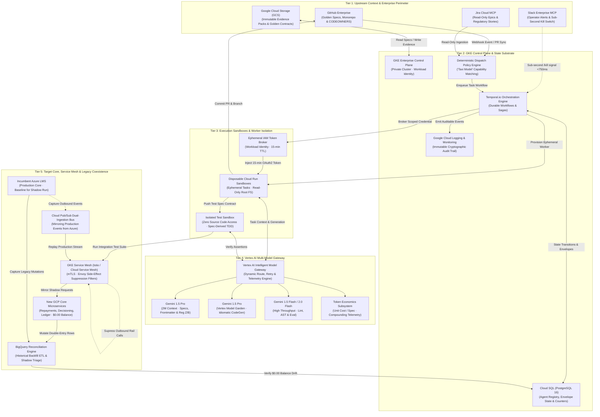
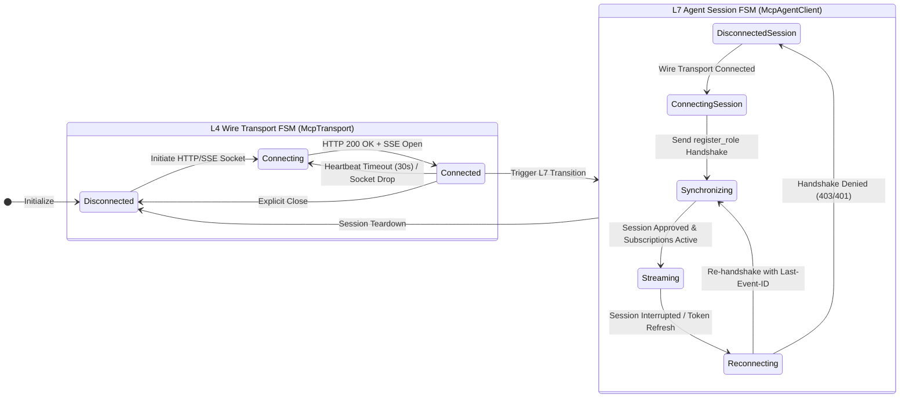
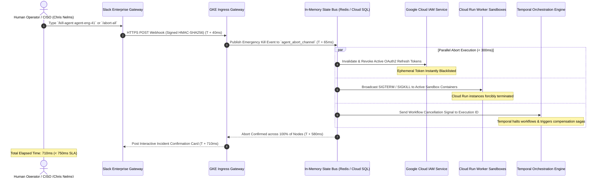

# Act 2: Platform Architecture & Substrate Specification

**Project Catalyst · Zip Agentic Factory & Core LMS Modernisation**  
**Document Series:** The Architecture Storyline — Act 2 of 4  
**Classification:** Enterprise Engineering Architecture & Operating Blueprint  
**Status:** Approved for Implementation · Stage 0 / Stage 1 Baseline  
**Target File:** `storyline/02_ARCHITECTURE_AND_SUBSTRATE.md`  
**Authors:** Google Cloud CE/FDE Team & Zip Catalyst Core Engineering  
**Version:** 1.0.0 · Production-Grade Blueprint  

---

## 1. Executive Narrative: Building the Production Substrate on Google Cloud Platform

### 1.1 The Imperative for an Industrialized Substrate
The enterprise rebuild of Zip’s Core Loan Management System (LMS)—migrating from a legacy monolithic Azure footprint to sovereign, cloud-native microservices on Google Cloud Platform (GCP)—cannot be executed through ad-hoc, conversational AI tools. Consumer lending infrastructure operates under non-negotiable statutory mandates (Truth in Lending Act / Regulation Z, Equal Credit Opportunity Act / Regulation B, Fair Debt Collection Practices Act, PCI DSS Level 1) and mathematical absolutes (penny-perfect double-entry accounting balances where $\Delta = \$0.00$).

In this mission-critical financial context, naive multi-agent frameworks fail catastrophically:
1. **Context Drift and Hallucinated State:** Agents relying on narrative chat logs or prompt memories invent non-existent APIs, drop regulatory boundary conditions, and lose track of transaction boundaries.
2. **Unbounded Blast Radius:** Agents equipped with live, long-lived infrastructure credentials can execute unvetted database mutations, trigger live payment rail transfers, or leak cross-tenant customer records.
3. **Circular Confirmation Bias:** When an agent generates both the implementation code and its validation suite, it writes unit tests that assert against its own flawed assumptions, concealing core accounting bugs.
4. **Non-Deterministic Execution:** Uncontrolled probabilistic LLM calls introduce irreproducible builds, flaky integration pipelines, and untraceable regressions.

To overcome these failure modes, **Act 2 establishes the production substrate for the Zip Agentic Factory**. The substrate is not an agent itself; it is the **immutable, deterministic platform architecture** in which agents operate as bounded, ephemeral, and untrusted execution processes.

```
┌─────────────────────────────────────────────────────────────────────────────────────────────┐
│                             ZIP AGENTIC FACTORY RUNTIME PARADIGM                            │
├─────────────────────────────────────────────────────────────────────────────────────────────┤
│   PROBABILISTIC REASONING (LLM Personas)        DETERMINISTIC SUBSTRATE (Platform Engine)   │
│   • Semantic intent interpretation              • Sovereign state storage (PostgreSQL JSONB)│
│   • Contextual specification generation         • Immutable signed audit logging            │
│   • Idiomatic code generation                   • Ephemeral IAM scoping & token rotation    │
│   • Adversarial contract critique               • Turn-alternating consensus state machines │
│   • Non-binding review recommendations          • Hardware-isolated test sandboxes          │
│                                                 • Hard side-effect suppression proxies      │
│   Controlled within bounded blast radiuses  ◄──►  Enforces zero-trust execution & invariants│
└─────────────────────────────────────────────────────────────────────────────────────────────┘
```

### 1.2 Core Architectural Thesis
> **The Substrate Thesis:** High-velocity autonomous software engineering requires stripping agents of persistent ambient authority. Agents must execute within disposable, single-task container sandboxes, receive short-lived cryptographically bounded IAM credentials, coordinate through an immutable state membrane, and submit all work items to independent, automated falsifiers before any code is promoted.

By anchoring the Zip Agentic Factory to Google Cloud Platform—leveraging Google Kubernetes Engine (GKE) Enterprise, Cloud Run sandboxing, Cloud SQL sovereign storage, and Vertex AI’s intelligent multi-model routing—Zip achieves the throughput of an autonomous engineering organization while maintaining bank-grade regulatory compliance, total audibility, and provable system stability.

---

## 2. The 5-Tier Cloud Architecture

The Zip Agentic Factory substrate is structured into **five strictly decoupled architectural tiers**, establishing defense-in-depth isolation between upstream corporate identity, central control plane orchestration, untrusted agent execution, foundation model inference, and target core banking services.



---

### 2.1 Tier 1: Upstream Context & Enterprise Perimeter

Tier 1 acts as the authoritative demarcation zone between Zip’s corporate systems and the agentic engineering pipeline. No autonomous agent is granted unrestricted administrative access to this tier.

#### 1. GitHub Enterprise (The Sovereign Source of Truth)
- **Role:** Hosts the golden specifications, infrastructure-as-code (Terraform), agent persona definitions, skills libraries, and target microservice source repositories.
- **Access Model:** Strict branch protection rules (`main` and `release/*` branches require cryptographic commit signing and human CODEOWNERS sign-off). Agents interact exclusively via ephemeral feature branches (`agent/<task-id>/<feature-slug>`) and pull requests.
- **Event Ingestion:** GitHub Webhooks (push, pull request, review comment) are dispatched to Tier 2 over HTTPS with HMAC-SHA256 signature verification.

#### 2. Jira Cloud MCP Server (Read-Only Business Context)
- **Role:** Ingests upstream business initiatives, epic epics, user acceptance criteria, and statutory regulatory requirements from Product Managers and Compliance Officers.
- **Safety Restriction:** The Jira Model Context Protocol (MCP) server is deployed with **strict read-only permissions**. Agents cannot mutate tickets, alter project scopes, or close requirements autonomously. Transitioning Jira issue states is reserved exclusively for the human Systems Engineer upon successful Phase 6 deployment.

#### 3. Slack Enterprise MCP Server (The Operator Interface & Kill Switch)
- **Role:** Serves as the real-time notification stream for human supervisors, rendering interactive approval cards (Phase 1 PRD GO/NO-GO, Phase 4 Review Approval, Phase 6 Production Gate).
- **Critical Capability:** Hosts the high-priority, zero-latency **Emergency Kill Switch** (`/kill-agent <agent-id>` or `/abort-pipeline <pipeline-id>`), enabling operators to instantly terminate runaway execution loops.

#### 4. Google Cloud Storage (GCS Immutable Evidence Store)
- **Role:** Provides write-once-read-many (WORM) bucket storage (`zip-agentic-factory-evidence-australia-southeast1`) with Object Retention Lock.
- **Artifacts Stored:**
  * Golden PRD contracts (`PRD-<id>-v<version>.md`)
  * Full-fidelity execution transcripts (`transcript_full.jsonl`)
  * Auditor evidence packages (statutory compliance mapping, cryptographic test proofs, vulnerability scans)
  * Pre-generated AST diff reports and load testing telemetry.

---

### 2.2 Tier 2: GKE Control Plane & State Substrate

Tier 2 represents the cognitive and operational brain of the factory. It provides deterministic lifecycle management, persistent state durability, and cryptographic auditability.

```
┌─────────────────────────────────────────────────────────────────────────────────────────────┐
│                           TIER 2: GKE CONTROL PLANE ARCHITECTURE                            │
├─────────────────────────────────────────────────────────────────────────────────────────────┤
│                                                                                             │
│   ┌───────────────────────────────┐               ┌──────────────────────────────────────┐  │
│   │   GKE Enterprise Cluster      │               │   Cloud SQL (PostgreSQL 16)          │  │
│   │   • Private Nodes (Multi-Zone)│               │   • JSONB Envelopes Substrate        │  │
│   │   • Workload Identity Enabled │               │   • LISTEN / NOTIFY Backplane        │  │
│   │   • Istio Service Mesh Ingress│               │   • Agent Registry & Performance     │  │
│   │                               │               │   • SchemaDef Automated Reconciler   │  │
│   │   ┌────────────────────────┐  │               └───────────────────▲──────────────────┘  │
│   │   │ Dispatch Policy Engine │  │                                   │                     │
│   │   │ (Deterministic Taxi)   │  │                                   │ pgvector / JSONB    │
│   │   └───────────┬────────────┘  │                                   │                     │
│   │               ▼               │               ┌───────────────────┴──────────────────┐  │
│   │   ┌────────────────────────┐  │               │   Temporal.io Cluster (Orchestration)│  │
│   │   │ Temporal Worker Pool   │◄─┼───────────────┤   • Durable Workflow Execution       │  │
│   │   │ (Workflow & Activities)│  │               │   • Automatic Sagas & Compensation   │  │
│   │   └───────────┬────────────┘  │               │   • Deterministic Timeouts & Retries │  │
│   └───────────────┼───────────────┘               └──────────────────────────────────────┘  │
│                   │                                                                         │
│                   ▼ Task Spawning & Telemetry Ingestion                                     │
│   ┌──────────────────────────────────────────────────────────────────────────────────────┐  │
│   │   Google Cloud Operations Suite                                                      │  │
│   │   • Cloud Logging (Append-only signed audit ledger with retention locks)             │  │
│   │   • Cloud Monitoring (Agent latency SLOs, error budgets, token burn-rate meters)    │  │
│   │   • Cloud Trace (OpenTelemetry end-to-end distributed span tracing)                  │  │
│   └──────────────────────────────────────────────────────────────────────────────────────┘  │
└─────────────────────────────────────────────────────────────────────────────────────────────┘
```

#### 1. GKE Enterprise Control Plane
- **Infrastructure:** Deployed across three availability zones in `australia-southeast1` on GKE Enterprise with private nodes, authorized network filtering, and Shielded GKE Nodes (Secure Boot, vTPM).
- **Workload Identity:** All in-cluster pods authenticate to Google Cloud APIs using Kubernetes Service Account (KSA) to Google Service Account (GSA) identity mapping. Zero long-lived service account keys (`.json`) exist anywhere on disk or in cluster secrets.

#### 2. Deterministic Dispatch Policy Engine ("Taxi Model")
- **Mechanism:** Implements Artifact C (*Project Assignment*) as an unyielding mathematical routing function rather than a fuzzy LLM prompt.
- **Algorithm:** When a task is queued from an approved PRD contract, the Dispatch Engine matches the task's tuple `(Domain, WorkType, TargetLanguage)` against the Cloud SQL Agent Registry.
- **Candidate Evaluation:**
  $$\text{Score}(A) = 0.40 \cdot \text{CapabilityMatch}(A) + 0.35 \cdot \text{HistoricalPassRate}(A) + 0.25 \cdot \left(1 - \frac{\text{BugRate}(A)}{\text{MaxBugRate}}\right)$$
- **Autonomy Rung Gate:** An agent is only dispatched autonomously without mandatory human pre-review if its Autonomy Rung level ($L_1$ to $L_4$) exceeds the task risk tier ($T_{low}$ to $T_{critical}$).

#### 3. Temporal.io Orchestration Engine (Durable Execution)
- **Role:** Eliminates transient state failure. Multi-agent workflows spanning hours or days (e.g., generating 45 microservice endpoints, executing 1,200 adversarial test cases) are expressed as durable Temporal workflows.
- **Capabilities:**
  * **Deterministic Timers & Heartbeats:** Every agent invocation requires periodic heartbeats (default: 30s). If a worker sandbox freezes or exceeds token limits, Temporal initiates automated retry or compensatory rollback.
  * **Saga Orchestration:** If Phase 5 (*Verify*) detects an invariant failure after Phase 3 (*Generate*) has opened a pull request, Temporal triggers compensating activities: labeling the PR as failed, archiving the workitem, posting diagnostic logs to the Negotiation File, and waking the Author agent with exact failure telemetry.

#### 4. Cloud SQL Agent Registry & Sovereign State Store
- **Engine:** PostgreSQL 16 Enterprise with High Availability (HA) failover and Automated Storage Escalation.
- **Architectural Pattern:** Strict **Kubernetes-style JSONB Envelope Storage**. Every entity (Task, Proposal, Review, Bug, Turn, Report) is written as an immutable envelope:
  ```sql
  CREATE TABLE agentic_state_envelopes (
      entity_id VARCHAR(64) PRIMARY KEY,
      api_version VARCHAR(32) NOT NULL DEFAULT 'hub.zip.io/v1alpha1',
      kind VARCHAR(32) NOT NULL, -- Task | Proposal | Review | AuditReport
      metadata JSONB NOT NULL,   -- id, createdAt, resourceVersion, labels
      spec JSONB NOT NULL,       -- Declarative input contract
      status JSONB NOT NULL,     -- Runtime phase, heartbeats, results
      created_at TIMESTAMPTZ NOT NULL DEFAULT NOW(),
      updated_at TIMESTAMPTZ NOT NULL DEFAULT NOW()
  );
  CREATE INDEX idx_envelopes_kind ON agentic_state_envelopes(kind);
  CREATE INDEX idx_envelopes_spec ON agentic_state_envelopes USING GIN (spec);
  CREATE INDEX idx_envelopes_status ON agentic_state_envelopes USING GIN (status);
  ```
- **The Decode-to-Flat Membrane:** The storage layer enforces strict envelope validation. When domain controllers read state, an automated mapper deserializes the envelope into a typed, flattened entity. Dual-shape readers are strictly prohibited by code contract, eliminating undefined-field regressions.

#### 5. Google Cloud Logging Immutable Audit Trail
- **Compliance Mandate:** Every prompt sent, completion received, tool called, and code diff generated is structured as a Cloud Logging entry with cryptographic payload hashes.
- **Log Sink:** Exported continuously to a locked BigQuery telemetry dataset with 7-year non-erasable retention to satisfy APRA (Australian Prudential Regulation Authority) CPS 234 and CFPB examination requirements.

---

### 2.3 Tier 3: Execution Sandboxes & Worker Isolation

Agents generate and compile code, download dependencies, and execute test scripts. If unconfined, this execution environment represents an extreme security vulnerability. Tier 3 establishes **uncompromising hardware-level process isolation**.

```
┌─────────────────────────────────────────────────────────────────────────────────────────────┐
│                          TIER 3: EXECUTION SANDBOX ISOLATION                                │
├─────────────────────────────────────────────────────────────────────────────────────────────┤
│                                                                                             │
│       ┌─────────────────────────────────────────────────────────────────────────────┐       │
│       │ Google Cloud Run Disposable Container Instance                              │       │
│       │ • CPU Allocation: Dedicated during request (2–4 vCPU, 4–8 GB RAM)           │       │
│       │ • Execution Lifetime: Single-Task Execution (Max 30 mins, destroyed upon exit│       │
│       │ • Filesystem: Read-Only Root Filesystem (`/` is immutable)                  │       │
│       │ • Ephemeral Scratch: `/tmp` mounted in memory (tmpfs, max 1 GB)             │       │
│       │ • Network Egress: Route all egress through Serverless VPC Access Connector  │       │
│       │                                                                             │       │
│       │   ┌─────────────────────────────────────────────────────────────────────┐   │       │
│       │   │ Sandboxed Agent Process (Node.js 22 / Python 3.11)                  │   │       │
│       │   │ • Identity: Workload Identity Federation (No static keys)           │   │       │
│       │   │ • IAM Token: Short-lived OAuth2 Token (15-minute validity)          │   │       │
│       │   │ • Scopes: Scoped strictly to target task repository & MCP endpoint  │   │       │
│       │   └──────────────────────────────────┬──────────────────────────────────┘   │       │
│       └──────────────────────────────────────┼──────────────────────────────────────┘       │
│                                              │ Controlled gRPC / HTTPS Egress               │
│                                              ▼                                              │
│       ┌─────────────────────────────────────────────────────────────────────────────┐       │
│       │ VPC Firewall & Cloud NAT Perimeter (australia-southeast1)                   │       │
│       │ • Block all arbitrary public internet egress (0.0.0.0/0 blocked)            │       │
│       │ • Allowlist: GitHub Enterprise IP range, Vertex AI API endpoints            │       │
│       │ • Corporate Proxy: Mandatory egress inspection for outbound HTTP/HTTPS      │       │
│       └─────────────────────────────────────────────────────────────────────────────┘       │
└─────────────────────────────────────────────────────────────────────────────────────────────┘
```

#### 1. Disposable Cloud Run Sandboxes
- **Ephemeral Container Lifecycle:** Execution workers are packaged as minimal distroless container images running on Google Cloud Run. A container instance is instantiated dynamically for exactly one task, executes the code generation or analysis step, pushes its diff/report to Tier 2, and is **immediately terminated and reclaimed**.
- **Filesystem Immutability:** Containers run with `--read-only-root-filesystem`. Operating system binaries, configurations, and system paths cannot be modified by generated code or malicious injection. A volatile `tmpfs` RAM disk is mounted exclusively at `/tmp` for temporary code compilation and is wiped upon task completion.

#### 2. Single-Task Ephemeral IAM Token Broker
- **Zero Static Credentials:** No worker container has baked-in GCP Service Account keys.
- **Dynamic Token Exchange:** When Temporal schedules a task on a Cloud Run instance:
  1. The GKE Control Plane invokes Google Cloud IAM Credentials API via Workload Identity Federation.
  2. It requests an OAuth2 access token with a strict **15-minute Time-To-Live (TTL)**.
  3. The token is down-scoped using IAM Session Policies to grant permissions *only* to the specific GCS artifact path and Cloud SQL records corresponding to the assigned Task ID.
  4. If the task exceeds 15 minutes without an authorized Temporal extension, the credential expires automatically, instantly neutralizing the worker.

#### 3. The Isolated Test Runner (Spec-Derived TDD)
- **Preventing Confirmation Bias:** To ensure generated microservices are verified objectively, the test execution runner runs in a **physically isolated container sandbox** separated from the Implementation Engineer.
- **Zero Implementation Visibility:** The Isolated Test Engineer persona authoring the test suite has access *only* to the signed PRD contract (Phase 1/2) and the OpenAPI specification. It has **zero read access to the implementation source code**.
- **Execution:** The Isolated Test Runner pulls the compiled container from Tier 3, injects the independent test suite, and executes integration, load, and mutation tests against strict black-box interfaces.

---

### 2.4 Tier 4: Vertex AI Multi-Model Gateway & Token Economics

The Zip Agentic Factory does not rely on a single monolithic foundation model. Different phases of software development demand vastly different cognitive profiles: legal/statutory contract analysis requires massive context windows; production microservice synthesis requires surgical coding syntax; linting and test classification requires low-latency, cost-effective inference.

Tier 4 acts as the **Intelligent Cognitive Router and Token Economics Engine**.

```
┌─────────────────────────────────────────────────────────────────────────────────────────────┐
│                       TIER 4: VERTEX AI MULTI-MODEL GATEWAY                                 │
├─────────────────────────────────────────────────────────────────────────────────────────────┤
│                                                                                             │
│                         Task Request from Worker Sandboxes                                  │
│                                       │                                                     │
│                                       ▼                                                     │
│   ┌─────────────────────────────────────────────────────────────────────────────────────┐   │
│   │ Intelligent Model Router (Dynamic Task Taxonomy & Context Analyzer)                 │   │
│   └───────┬───────────────────────────┼─────────────────────────────┬───────────────────┘   │
│           │                           │                             │                       │
│           ▼ (Spec / Regulatory)       ▼ (CodeGen / Refactor)        ▼ (Lint / Eval / AST)   │
│   ┌───────────────────────┐   ┌─────────────────────────┐   ┌───────────────────────────┐   │
│   │ Gemini 1.5 Pro        │   │ Gemini 1.5 Pro       │   │ Gemini 1.5 Flash / 2.0 Fl.│   │
│   │ • 2M Context Window   │   │ • State-of-the-art Code │   │ • Sub-second Latency      │   │
│   │ • Full LMS Corpus     │   │ • Strict Type Synthesis │   │ • 10x Throughput / Low Cost│  │
│   │ • Reg Z, Reg B, FDCPA │   │ • Microservice Logic    │   │ • Schema & AST Linting    │   │
│   │ • Invariant Frontmatter│  │ • Complex Algorithmics  │   │ • Unit Test Compilation   │   │
│   └───────────────────────┘   └─────────────────────────┘   └───────────────────────────┘   │
│           │                           │                             │                       │
│           └───────────────────────────┼─────────────────────────────┘                       │
│                                       ▼                                                     │
│   ┌─────────────────────────────────────────────────────────────────────────────────────┐   │
│   │ Token Economics & Compounding Telemetry Engine                                      │   │
│   │ • Measures Prompt & Completion Tokens per WorkItem                                  │   │
│   │ • Attributes Unit Cost per Spec & Flags Rework Waste                                │   │
│   │ • Enforces Hard Budget Limits per Phase ($50/Spec Cap)                              │   │
│   │ • Verifies Compounding Efficiency: Cycle(N+1) < Cycle(N)                            │   │
│   └─────────────────────────────────────────────────────────────────────────────────────┘   │
└─────────────────────────────────────────────────────────────────────────────────────────────┘
```

#### 1. Model Allocation Taxonomy
| Cognitive Workload | Primary Model | Why Selected | Fallback Model |
|---|---|---|---|
| **Phase 1: High-Definition PRD & Statutory Mapping** | **Gemini 1.5 Pro** | 2,000,000+ token context window allows ingesting entire legacy COBOL/C# codebases, historical Jira logs, and complete CFPB/Reg Z regulatory texts simultaneously. | Gemini 1.5 Pro |
| **Phase 1: Spec Adversary & Contradiction Hunting** | **Gemini 1.5 Pro** | Superior needle-in-a-haystack reasoning to detect subtle logical contradictions between business requirements and ledger invariants. | Gemini 1.5 Pro |
| **Phase 3: Production Code Generation** | **Gemini 1.5 Pro** (via Vertex Model Garden) | Best-in-class precision for idiomatic Go, Python FastAPI, and TypeScript. Consistently generates strict typing, explicit error handling, and zero hallucinated libraries. | Gemini 1.5 Pro |
| **Phase 4: Spec Conformance & AST Differencing** | **Gemini 1.5 Flash** | Extremely fast execution for parsing Abstract Syntax Trees, diffing OpenAPI schemas against implementation code, and identifying unrequested endpoints. | Gemini 2.0 Flash |
| **Phase 5: Rapid Unit Test Linting & Triage** | **Gemini 1.5 Flash** | Millisecond response times allow running thousands of parallel test evaluations without exhausting development budgets. | Gemini 1.5 Pro |

#### 2. Token Economics & Compounding Telemetry
- **Financial Attribution:** The factory treats inference cost as a first-class engineering metric. The Token Economics Analyst persona monitors real-time telemetry captured by the gateway:
  $$\text{Unit Cost per Spec} = \sum_{p=1}^{7} \sum_{i=1}^{k} \left( \text{InputTokens}_{p,i} \cdot C_{\text{in}} + \text{OutputTokens}_{p,i} \cdot C_{\text{out}} \right)$$
- **Defect Rework Surcharge:** Any token expenditure resulting from rejected reviews (Phase 4) or failed verification gates (Phase 5) is tagged with `metadata.rework: true`.
- **Compounding Learning Proof:** The gateway enforces Axiom `A14` (*Compounding Learning*). By promoting reusable golden specification templates and indexing settled architectural decisions into the Calibration Ledger, **the net token cost per delivered microservice must decrease by $\ge 30\%$ over successive implementation cycles**.

---

### 2.5 Tier 5: Target Core, Service Mesh & Legacy Coexistence

Replacing a legacy core banking LMS cannot be executed in a single high-risk "big bang" cutover. Tier 5 provides the network virtualization and traffic routing infrastructure required to run the new GCP microservices in **Shadow Mode** alongside legacy Azure systems.

```
┌─────────────────────────────────────────────────────────────────────────────────────────────┐
│                      TIER 5: SERVICE MESH & SHADOW TRAFFIC MIRRORING                        │
├─────────────────────────────────────────────────────────────────────────────────────────────┤
│                                                                                             │
│                                  Production Live Traffic                                    │
│                                             │                                               │
│                                             ▼                                               │
│   ┌─────────────────────────────────────────────────────────────────────────────────────┐   │
│   │ Incumbent Azure LMS (Production Core)                                               │   │
│   │ • Processes Real Loan Applications, Disbursals, Repayments & Card Swipes            │   │
│   │ • Triggers External Payment Rails & Core Banking Ledgers                            │   │
│   └──────────────────────┬──────────────────────────────────────────────────────────────┘   │
│                          │                                                                  │
│                          ▼ Event Grid / Service Bus Mirroring Tap                           │
│   ┌─────────────────────────────────────────────────────────────────────────────────────┐   │
│   │ Cloud Pub/Sub High-Throughput Mirror Bus (australia-southeast1)                     │   │
│   └──────────────────────┬──────────────────────────────────────────────────────────────┘   │
│                          │                                                                  │
│                          ▼ Real-Time Shadow Replay                                          │
│   ┌─────────────────────────────────────────────────────────────────────────────────────┐   │
│   │ GKE Service Mesh (Istio / Cloud Service Mesh)                                       │   │
│   │   ┌─────────────────────────────────────────────────────────────────────────────┐   │   │
│   │   │ Envoy Sidecar Proxy with Side-Effect Suppression Filters                    │   │   │
│   │   │ • Inbound: Unpack mirrored shadow request                                   │   │   │
│   │   │ • Internal: Route to Candidate GCP Microservice (e.g. Repayments Engine)    │   │   │
│   │   │ • Outbound Egress Interception:                                             │   │   │
│   │   │   - Outbound Swift / Direct Entry Rails: ──► MOCK & SUPPRESS (Return 200 OK)│   │   │
│   │   │   - Customer SMS / Email Gateway:      ──► SINK TO NULL (Suppress Message)  │   │   │
│   │   │   - Credit Bureau Reporting:           ──► LOG ONLY (Suppress Bureau Write) │   │   │
│   │   └─────────────────────────────────────────────────────────────────────────────┘   │   │
│   └──────────────────────┬──────────────────────────────────────────────────────────────┘   │
│                          │                                                                  │
│                          ▼ Mutate Candidate Shadow State                                    │
│   ┌─────────────────────────────────────────────────────────────────────────────────────┐   │
│   │ New GCP Cloud SQL (Bitemporal Double-Entry Database)                                │   │
│   └──────────────────────┬──────────────────────────────────────────────────────────────┘   │
│                          │                                                                  │
│                          ▼ BigQuery Change Data Capture (CDC) Stream                        │
│   ┌─────────────────────────────────────────────────────────────────────────────────────┐   │
│   │ BigQuery Automated Reconciliation Engine ($0.00 Target)                             │   │
│   │ • Joins Azure Production Mutations with GCP Shadow Mutations by Transaction ID      │   │
│   │ • Calculates Cent-by-Cent Delta: abs(Azure_Balance - GCP_Balance) == $0.00           │   │
│   │ • Triages Discrepancies via 4-Class Taxonomy (GCP Bug, Azure Bug, Rounding, Spec)   │   │
│   └─────────────────────────────────────────────────────────────────────────────────────┘   │
└─────────────────────────────────────────────────────────────────────────────────────────────┘
```

#### 1. GKE Service Mesh & Side-Effect Suppression
- **Technology:** Istio-based Cloud Service Mesh with mutual TLS (mTLS) v1.3 encryption across all internal service pods.
- **The Shadow Hazard:** Running live financial repayment traffic through an experimental shadow microservice poses the risk of **duplicate real-world actions** (e.g., debiting a customer’s bank account twice, sending duplicate SMS notices, or filing conflicting credit bureau files).
- **Envoy Outbound Filter:** Custom Envoy filters dynamically intercept all external egress calls from shadow services:
  * Payment Rail Gateways (DE/NPP/Mastercard): Intercepted; synthetic cryptographic receipts generated; outbound wire connection suppressed.
  * Customer Communication: Diverted to an immutable audit queue; zero outbound customer delivery.
  * Credit Bureau Reporting (Equifax/Experian): Captured in audit log; zero external transmission.

#### 2. Dual-Ingestion Traffic Mirroring
- An Azure Event Grid / Service Bus bridge mirrors 100% of live loan application, repayment, and interest accrual events across a dedicated Google Cloud Interconnect into Google Cloud Pub/Sub.
- GKE shadow workers consume this stream at production concurrency, executing identical state transitions in the candidate microservices.

#### 3. The $0.00 Ledger Balance Target
- Core banking demands absolute reconciliation down to the cent. The BigQuery Reconciliation Engine streams transaction journals from both Azure and GCP:
  $$\Delta_{\text{ledger}} = \left| \text{Balance}_{\text{Azure}} - \text{Balance}_{\text{GCP}} \right|$$
- **Production Exit Criteria:** The shadow gate requires **14 consecutive clean operating days with $\Delta_{\text{ledger}} = \$0.00$ across all 1.8 million active accounts**.
- **Automated Divergence Triage:** If $\Delta_{\text{ledger}} > 0$, the Reconciliation Analyst persona classifies the divergence into the established 4-class taxonomy:
  1. *Class 1 (GCP Microservice Bug):* Incorrect math or unhandled boundary condition $\rightarrow$ Automated ticket created, fed into Phase 2 Dispatch for remediation.
  2. *Class 2 (Legacy Azure Bug):* Azure calculates incorrectly (e.g., leap-year flaw or legacy 32-bit float truncation) $\rightarrow$ Retained in GCP; documented as legacy deviation.
  3. *Class 3 (Precision & Banker's Rounding):* IEEE-754 float drift vs. decimal representation $\rightarrow$ Settle in favor of exact 64-bit decimal banker’s rounding.
  4. *Class 4 (Intentional Statutory Deviation):* New Reg Z compliance requirement intentionally overrides legacy calculation.

---

## 3. The Central Tooling & State Membrane

The platform’s communication and state synchronization layer adopts the battle-tested architecture of the **OIS Platform (`agentic-network`)**, establishing a unified, resilient Model Context Protocol (MCP) backbone.

### 3.1 Node.js 22 MCP Hub Architecture

The Model Context Protocol Hub is deployed as a high-performance, containerized service running on Node.js 22 LTS with native ECMAScript Modules (ESM). It serves as the single programmatic gateway through which all agents invoke tools and exchange state.

```
┌─────────────────────────────────────────────────────────────────────────────────────────────┐
│                           CENTRAL NODE.JS 22 MCP HUB RUNTIME                                │
├─────────────────────────────────────────────────────────────────────────────────────────────┤
│                                                                                             │
│   Host Plugin Sessions (Antigravity CLI / OpenCode / Antigravity CLI / Cloud Run Workers)       │
│                                         │                                                   │
│                                         ▼ HTTP Streamable Transport                         │
│   ┌─────────────────────────────────────────────────────────────────────────────────────┐   │
│   │ Express / Node.js 22 L7 Policy Router                                               │   │
│   │ • Route Authentication & Bearer Token Verification                                  │   │
│   │ • Role-Based Blast Radius Policy Check (`register_role` handshake)                  │   │
│   │ • Endpoints:                                                                        │   │
│   │   - `POST   /mcp`  ──► Client-to-Hub JSON-RPC Tool Invocation & State Mutate        │   │
│   │   - `GET    /mcp`  ──► Persistent Server-Sent Events (SSE) Channel Wake Stream      │   │
│   │   - `DELETE /mcp`  ──► Explicit Session Teardown & Resource Cleanup                │   │
│   └─────────────────────────────────────┬───────────────────────────────────────────────┘   │
│                                         │                                                   │
│                                         ▼ Internal Dispatch                                 │
│   ┌─────────────────────────────────────────────────────────────────────────────────────┐   │
│   │ 71 Domain MCP Tools across 17 Functional Subsystems                                 │   │
│   │ [Tasks] [Proposals] [Threads] [Reviews] [Reports] [Bugs] [Audits] [Turns] [Registry]│   │
│   └─────────────────────────────────────┬───────────────────────────────────────────────┘   │
│                                         │                                                   │
│                                         ▼ Persist-First Transaction                         │
│   ┌─────────────────────────────────────────────────────────────────────────────────────┐   │
│   │ Sovereign PostgreSQL JSONB Substrate                                                │   │
│   │ • Write envelope row to `agentic_state_envelopes`                                   │   │
│   │ • Execute `pg_notify('hub_events', payload)` via Postgres LISTEN/NOTIFY             │   │
│   │ • Event Dispatcher captures notification and fans out to connected SSE streams     │   │
│   │ • Client reconnects support `Last-Event-ID` replay from database sequence          │   │
│   └─────────────────────────────────────────────────────────────────────────────────────┘   │
└─────────────────────────────────────────────────────────────────────────────────────────────┘
```

#### 1. Transport Mechanics
- **Streamable HTTP Transport:** Unlike fragile local stdio pipes, the Hub exposes an enterprise HTTP transport:
  * `POST /mcp`: Transmits JSON-RPC 2.0 tool invocation payloads.
  * `GET /mcp`: Establishes a persistent Server-Sent Events (SSE) stream for asynchronous notifications, state wake-ups, and channel broadcasts.
  * `DELETE /mcp`: Gracefully cleans up active agent sessions and releases reserved locks.
- **Persist-First Guarantee:** Notifications are never broadcast over in-memory queues before being committed to disk. State changes are written transactionally to PostgreSQL first; the database `LISTEN/NOTIFY` trigger subsequently dispatches the SSE event. If an agent experiences a network disconnect, it reconnects using the HTTP header `Last-Event-ID`, and the Hub replays all missed events in exact chronological order.

#### 2. Tool Surface (71 Domain Tools across 17 Domains)
The Hub manages 71 finely scoped domain tools adhering to the principle of least privilege:
- **Task Management (6 tools):** `create_task`, `get_task`, `update_task_status`, `assign_task`, `list_tasks`, `close_task`.
- **Deliberation & Threads 2.0 (8 tools):** `create_thread`, `post_turn`, `challenge_turn`, `concur_turn`, `synthesize_turn`, `stage_action`, `commit_convergence`, `park_thread`.
- **Review & Gatekeeping (7 tools):** `create_review`, `submit_score`, `record_negotiation`, `assert_conformance`, `verify_statute`, `flag_regression`, `approve_gate`.
- **Registry & Capabilities (6 tools):** `register_agent`, `query_registry`, `update_performance_counters`, `demote_rung`, `promote_rung`, `get_agent_skills`.
- **Audit & Evidence (8 tools):** `record_audit_event`, `upload_evidence_pack`, `sign_manifest`, `query_audit_trail`, `generate_compliance_report`, `verify_checksum`, `export_telemetry`, `record_rework_cost`.
- **Domain-Specific Banking Tools (36 tools across Lending, Ledger, and Shadow Engine):** `calculate_interest_accrual`, `validate_amortization_schedule`, `assert_double_entry_balance`, `query_shadow_delta`, `simulate_repayment_waterfall`, `scan_reg_z_disclosure`, etc.

---

### 3.2 Universal Network Adapter (`@apnex/network-adapter`)

To connect heterogeneous developer environments and AI harnesses (Antigravity CLI, Antigravity CLI, VS Code extensions, OpenCode, and headless Cloud Run workers) into the central Hub, the platform implements the **Universal Network Adapter**.

The adapter decouples physical wire transport from high-level agent session semantics through **two coordinated Finite State Machines (FSMs)**.



#### 1. L4 Wire Transport (`McpTransport`)
- **Responsibility:** Manages raw HTTP sockets, TLS termination, SSE keep-alives, and low-level connection retries.
- **3-State FSM:** `disconnected` $\rightarrow$ `connecting` $\rightarrow$ `connected`.
- **Heartbeat Ping & Watchdog:** Transmits a wire-level ping every **30 seconds**. A strict **90-second watchdog timer** runs continuously. If no SSE data or ping acknowledgement is received within 90 seconds, the transport forcibly resets the underlying TCP connection and initiates exponential backoff reconnection.

#### 2. L7 Agent Session Client (`McpAgentClient`)
- **Responsibility:** Manages agent identity, role handshakes, capability subscription, and message routing.
- **5-State FSM:** `disconnected` $\rightarrow$ `connecting` $\rightarrow$ `synchronizing` $\rightarrow$ `streaming` $\rightarrow$ `reconnecting`.
- **The `register_role` Handshake:**
  ```typescript
  interface RegisterRolePayload {
    agentId: string;
    role: "architect" | "engineer" | "verifier" | "director";
    token: string; // Ephemeral 15-min OAuth2 JWT
    supportedTools: string[];
    lastEventId?: string;
  }
  ```
  Upon establishing wire connectivity, the client sends `register_role`. The Hub validates the token against Cloud SQL. If the session has been invalidated or preempted, the adapter initiates a single `retry-once` sequence before terminating cleanly.

#### 3. Actionable Wake Protocol (Anti-Polling Architecture)
- **The Anti-Pattern:** Agents executing continuous polling loops (`while true: check_tasks()`) exhaust API quotas, generate massive token overhead, and introduce race conditions.
- **The Substrate Solution:** The Universal Network Adapter implements an **Actionable Wake Protocol**. When an agent goes idle, its execution process suspends. When an event addressed to its registered role or task ID arrives via the SSE stream:
  1. The adapter receives the SSE envelope.
  2. It unmarshals the event and synthesizes an actionable prompt wake string:
     ```xml
     <wake event="task_assigned" id="task-891" priority="urgent">
       <contract_path>gs://zip-agentic-factory-specs/PRD-402-v1.md</contract_path>
       <action>Execute phase 3 microservice synthesis within services/repayments/</action>
     </wake>
     ```
  3. It injects the wake directly into the host harness context via `promptAsync` or CLI channel injection, instantly resuming the agent without a single polling call.

---

### 3.3 Central Safety Controls: Sub-Second Slack Emergency Kill Switch

In an autonomous agentic factory executing in financial domains, a human operator must possess the absolute ability to **halt execution immediately**. The Zip substrate implements a hardened, sub-second emergency kill switch capable of neutralizing all active agents and revocation of credentials in **less than 750 milliseconds**.



#### Kill Switch Mechanics & Propagation SLA
1. **Trigger Ingestion ($T_0$ to $T + 50\text{ms}$):** The operator issues `/kill-agent <id>` or `/abort-pipeline <id>` in the dedicated `#catalyst-safety-bridge` Slack channel. Slack dispatches an encrypted webhook to the GKE Ingress Gateway.
2. **Signature Verification & Broadcast ($T + 50\text{ms}$ to $T + 120\text{ms}$):** GKE validates the Slack HMAC signature and broadcasts an un-droppable high-priority message over the in-memory Redis cluster.
3. **Immediate Credential Invalidation ($T + 120\text{ms}$ to $T + 350\text{ms}$):** The Identity Broker immediately calls the Google Cloud IAM revocation endpoint, blacklisting the active 15-minute OAuth2 token and revoking Workload Identity lease bindings. Any subsequent tool invocation by the agent fails with an un-bypassable `401 Unauthorized`.
4. **Hardware Container Termination ($T + 120\text{ms}$ to $T + 500\text{ms}$):** The Cloud Run orchestration agent issues a forcible `SIGKILL` to the target container instance, terminating running processes and reclaiming memory.
5. **Workflow Saga Compensation ($T + 120\text{ms}$ to $T + 650\text{ms}$):** Temporal marks the execution state as `ABORTED_BY_OPERATOR`, captures stack traces, reverts uncommitted database transactions, labels open GitHub PRs as invalid, and freezes state.
6. **Operator Confirmation ($T + 710\text{ms}$):** An interactive incident card is returned to Slack displaying: Agent ID, stopped PID, revoked IAM serial, aborted Git branch, and confirmation of zero uncommitted ledger mutations.
7. **Verification Drill:** Stage 0 exit gate criteria mandates executing an automated chaos drill every 30 days demonstrating end-to-end propagation in **$< 750\text{ms}$**.

---

## 4. Direct Blueprint Adoption from the Reference Triad

The Zip Agentic Factory directly integrates and enforces the production-hardened design patterns proven in the three reference repositories: `mission-kit`, `agentic-network`, and `mam-learning-portfolio-engine`.

```
┌─────────────────────────────────────────────────────────────────────────────────────────────┐
│                          THE REFERENCE TRIAD FOUNDATIONAL BLUEPRINTS                        │
├──────────────────────────────┬──────────────────────────────┬───────────────────────────────┤
│   1. CONSTITUTIONAL LAYER    │   2. COORDINATION LAYER      │   3. APPLICATION LAYER        │
│   mission-kit                │   agentic-network (OIS)      │   mam-learning-portfolio-engine│
├──────────────────────────────┼──────────────────────────────┼───────────────────────────────┤
│ • 14 Invariant Axioms (A1-14)│ • Threads 2.0 Consensus      │ • 3-Layer Architecture        │
│ • 3-Axis Work Generation     │   (Turn-Alternating Debate)  │   (Conductor ➔ ADK ➔ Engine)  │
│ • Cognitive Claim Discipline │ • Staged Convergence Actions │ • Neighborhood Rules          │
│   (Measured vs. Inferred)    │ • Sovereign JSONB Envelope   │   (Strict Folder Ownership)   │
│ • Evidence Quality Rules     │ • Queryable Calibration      │ • Self-Healing Annealing Loop │
│   (Measure effect, not act)  │   Ledger (calibrations.yaml) │   (Markdown Living SOPs)      │
└──────────────────────────────┴──────────────────────────────┴───────────────────────────────┘
```

---

### 4.1 `mission-kit`: The Constitutional & Cognitive Foundation

`mission-kit` provides the engineering constitution. It establishes the unshakeable doctrine that **agents must have their correctness measured rather than trusted**.

#### 1. The 14 Invariant Axioms (`A1`–`A14`) in the Zip Context
Every specification, pipeline phase, and PR must strictly obey the 14 Invariant Axioms:

| Axiom ID | Axiom Name | Core Invariant Mandate | Application to Zip LMS Core Rebuild |
|---|---|---|---|
| **A1** | **Sovereign State Transparency** | System state must be discoverable from the state store itself, never reconstructed from logs or agent chat memories. | Core loan balances, interest accruals, and transaction histories live exclusively in PostgreSQL JSONB envelopes. No agent memory is authoritative. |
| **A2** | **Isomorphic Specification** | The specification *is* the system. Drift between declared intent and running reality is treated as a defect. | If the OpenAPI spec and the running Go repayment microservice disagree on an error payload, the build fails the Phase 4 gate immediately. |
| **A3** | **Sovereign Composition** | Compose concerns across clear boundaries; avoid monoliths where one domain leaks side effects into another. | Decisioning, Repayments, Customer Master, Issuing, and Merchant engines run as strictly isolated microservices. Zero cross-database foreign keys. |
| **A4** | **Zero-Loss Knowledge** | Institutional memory must be externalized into structured artifacts. Agents retain nothing between cold sessions. | Every design decision, rejected PR, and regulatory trade-off is committed to the Negotiation File or GCS. Uncaptured findings are treated as lost. |
| **A5** | **Perceptual Parity** | Agents must act on raw observations rather than derived summaries; perception must match underlying ground truth. | Agents inspecting build or test failures read raw JSON-RPC logs, stdout/stderr streams, and database rows—never synthetic LLM summaries. |
| **A6** | **Frictionless Collaboration** | Inter-agent seams must operate autonomously without requiring a human relay in the synchronous execution path. | When the Implementation Engineer finishes a build, the Hub automatically wakes the Spec Conformance Judge without human intermediary intervention. |
| **A7** | **Resilient Operations** | Systems must cleanly withstand transport disconnects, stalled turns, and failed tasks through automated retries and DLQs. | Temporal workflows recover gracefully from Cloud Run sandbox preemption, replaying from the exact state sequence stored in Cloud SQL. |
| **A8** | **Gated Recursive Integrity** | Promotion past any boundary requires passing an independent, automated falsifier gate; self-attestation is forbidden. | An Implementation Engineer cannot sign off on its own pull request. A separate, code-isolated Test Engineer executes independent TDD tests. |
| **A9** | **Chaos-Validated Deployment** | A deployment cannot be trusted until it has demonstrated survival under active chaos injection and node failure. | Microservices must survive Chaos Mesh drills on GKE (50% packet drop, pod eviction during payment processing) before exiting Phase 5. |
| **A10** | **Autopoietic Evolution** | Friction surfaced during operation must feed back into permanent updates to the SOPs, rules, and tooling (self-annealing). | Escaped defects or ambiguous requirements automatically trigger updates to golden PRD markdown templates and testing guidelines. |
| **A11** | **Cognitive Minimalism** | Never allocate probabilistic LLM tokens to work that deterministic code, regex, or database queries can execute reliably. | AST parsing, schema validation, linting, and ledger balance checking are executed in deterministic Go/Python scripts—never passed to LLMs. |
| **A12** | **Precision Context Engineering** | Assemble only the minimal, load-bearing context required for an invocation; bloat degrades reasoning fidelity. | Agents receive surgically pruned context: target directory code, relevant OpenAPI interfaces, and applicable regulatory rules—never the full repo. |
| **A13** | **Director Intent Amplification** | Maximize human strategic leverage; human directors define goals and sign release gates; agents handle autonomous execution. | Chris Nelms and Eric Blassberg hold the three critical human gates (PRD GO/NO-GO, Review Approval, Shadow Cutover); agents handle the build. |
| **A14** | **Compounding Learning** | Cycle $N+1$ must be strictly cheaper, faster, and more reliable than Cycle $N$ through the reuse and promotion of verified assets. | Golden spec templates and indexed calibrations ensure that building the second microservice requires 30% fewer tokens than the first. |

#### 2. The 3-Axis Dynamic Work Generation Engine
The factory rejects static, hard-coded task lists. Tasks are dynamically compiled from three orthogonal axes:

$$\text{Role } (M) \times \text{Work-Type } (W) \times \text{Domain } (N) \longrightarrow \text{WorkItem Template} + \text{Evidence Authority} + \text{Independence Constraints}$$

- **Axis 1: Role (`roles/`):** Defines authority and execution capabilities (`R1` Architect, `R2` Implementation Engineer, `R3` Isolated Verifier, `R4` Systems Engineer Director).
- **Axis 2: Work-Type (`work-types/`):** The atomic unit of engineering (`W1` Microservice Build Slice, `W2` Bug Fix, `W3` Hard Cut, `W5` Falsifier Test Generation, `W8` Reactive Gate Evaluation, `W10` Adversarial Review, `W14` Contract Design, `W17` Closeout Evidence Packet).
- **Axis 3: Domain (`domains/`):** The target LMS business surface (`D1` Repayments & Waterfall, `D2` Decisioning & Underwriting, `D3` Card Issuing & Ledger, `D4` Customer Master & Identity, `D5` Merchant Settlement Engine).

*Example Compilation:* When a task is generated for `(R2 Implementation Engineer, W1 Build Slice, D1 Repayments)`, the system automatically injects:
- Bounded blast radius: Read/Write restricted exclusively to `services/repayments/`.
- Required inputs: Approved PRD contract `PRD-D1-042.md` and OpenAPI interface `repayments.yaml`.
- Evidence Authority: Requires independent sign-off from `(R3 Verifier, W5 Falsifier Tests, D1 Repayments)`. Self-attestation is rejected.

#### 3. Cognitive Claim Disciplines & Evidence Quality Standards
To eradicate the pervasive problem of LLMs making unfounded claims of completion, the factory enforces the `mission-kit` claim disciplines:
- **Measured vs. Inferred:** Every assertion made by an agent in a specification, code comment, or review report must be explicitly tagged as either **[Measured]** (backed by an exact test log, compiler trace, or production database snapshot) or **[Inferred]** (a logical extrapolation). Any report containing untagged assertions is rejected by the schema validator.
- **Mint Before Cite:** Agents are forbidden from citing placeholder identifiers, simulated git SHAs, or imaginary file paths. If an artifact does not exist in GCS or GitHub, the agent must physically mint and register it before referencing it.
- **Evidence Quality Rule: "Measure the Effect, Not the Act":** A test asserting that an API returned `HTTP 200 OK` is rejected as insufficient evidence. The test must inspect the underlying database state to prove that debits equal credits ($\Delta = \$0.00$), interest accrued accurately, and idempotency keys were respected.
- **Evidence Quality Rule: "Source Settles Mechanism; Behaviour Settles Bug":** An agent cannot claim a bug is fixed merely because its unit test passes. It must pinpoint the exact code line responsible for the fault mechanism and prove that the behavior under negative boundary conditions matches the specification.
- **Stopping Criteria (The Anti-Thrashing Discriminator):** If an Author agent and an Adversarial Judge engage in **3 consecutive reasoning cycles without narrowing the scope of disagreement**, the substrate automatically halts execution, transitions the thread to `PARKED`, and escalates the issue to the human Systems Engineer (`PL-21` / `PL-22`).

---

### 4.2 `agentic-network` (OIS): The Distributed Coordination Backbone

From `agentic-network`, the substrate adopts the protocols that govern how agents deliberate, negotiate, and converge on architectural truth without human mediation.

```
┌─────────────────────────────────────────────────────────────────────────────────────────────┐
│                           THREADS 2.0 CONVERGENCE PROTOCOL                                  │
├─────────────────────────────────────────────────────────────────────────────────────────────┤
│                                                                                             │
│   Implementation Engineer (Author)                  Spec Conformance Judge (Judge)          │
│   ┌──────────────────────────────┐                  ┌──────────────────────────────┐        │
│   │ Turn 1: Propose              │                  │                              │        │
│   │ intent: "propose"            ├─────────────────►│                              │        │
│   │ payload: PR #104 Open        │                  │                              │        │
│   └──────────────────────────────┘                  │                              │        │
│                                                     │ Turn 2: Challenge            │        │
│                                                     │ intent: "challenge"          │        │
│   ┌──────────────────────────────┐                  │ payload: AST diff shows      │        │
│   │                              │◄─────────────────┤ unrequested endpoint         │        │
│   │                              │                  │ stagedActions: [remove_route]│        │
│   │ Turn 3: Synthesize           │                  └──────────────────────────────┘        │
│   │ intent: "synthesize"         │                                                          │
│   │ payload: Route removed;      ├─────────────────►┌──────────────────────────────┐        │
│   │ updated commit pushed        │                  │ Turn 4: Concur               │        │
│   └──────────────────────────────┘                  │ intent: "concur"             │        │
│                                                     │ converged: true              │        │
│                                                     │ stagedActions: [approve_pr]  │        │
│                                                     └──────────────┬───────────────┘        │
│                                                                    │                        │
│                                                                    ▼ Mutual Agreement       │
│   ┌─────────────────────────────────────────────────────────────────────────────────────┐   │
│   │ Hub Atomically Commits Staged Convergence Actions to PostgreSQL JSONB Substrate     │   │
│   │ • Labels PR as Conformance Approved                                                 │   │
│   │ • Enqueues Task for Phase 5 Isolated Verification                                   │   │
│   └─────────────────────────────────────────────────────────────────────────────────────┘   │
└─────────────────────────────────────────────────────────────────────────────────────────────┘
```

#### 1. Threads 2.0 Turn-Alternating Consensus Protocol
When multi-agent pairs (e.g., Requirements Architect $\longleftrightarrow$ Spec Adversary in Phase 1, or Implementation Engineer $\longleftrightarrow$ Spec Conformance Judge in Phase 4) review work, they do not engage in unstructured chat. They communicate through **Threads 2.0**:
- **Mandatory Semantic Intent:** Every turn submitted to the Hub must specify an immutable semantic intent:
  * `propose`: Submits an initial artifact or modification.
  * `challenge`: Formally identifies an invariant violation, contradiction, or gap, backed by citations.
  * `concur`: Formally agrees with a proposed resolution.
  * `synthesize`: Reconciles competing proposals into an integrated solution.
  * `park`: Halts the debate and escalates to human intervention when convergence stalls.
- **Staged Convergence Actions:** During the turn-alternating exchange, agents accumulate `stagedConvergenceActions` (e.g., modifying an interface, removing an unauthorized file, updating a test).
- **Atomic Consensus Commit:** Only when both agents submit turns with `converged: true` does the Hub atomically commit the staged actions to the database and trigger the downstream workflow.

#### 2. The Queryable Calibration Ledger (`calibrations.yaml`)
To prevent "organizational amnesia"—where agents repeatedly make the same subtle architectural errors across subsequent weeks—the platform implements a centralized **Calibration Ledger**.
- **Structure:** Stored in the repository as `docs/calibrations.yaml` and loaded into Cloud SQL.
- **Contents:** Documents hard-won engineering lessons, settled dispute precedents, legacy Azure edge cases (e.g., how the legacy system handled rounding on leap-year amortizations), and known foundation model failure patterns.
- **Programmatic Querying:** Before an agent begins Phase 1 specification or Phase 3 generation, the Hub invokes `query_calibrations(domain, keywords)` to inject relevant calibration records into the agent’s context. Agents are tested against the calibration ledger in Phase 5 to ensure past errors are never repeated.

---

### 4.3 `mam-learning-portfolio-engine`: Enterprise Domain & Google Cloud Governance

From the enterprise financial diligence engine (`mam-learning-portfolio-engine`), the substrate adopts strict architectural layering, directory boundaries, and autonomous self-annealing.

#### 1. The 3-Layer Architecture
The platform enforces a radical separation of concerns across three distinct layers, preventing fuzzy LLM logic from contaminating core execution pipelines:

```
┌─────────────────────────────────────────────────────────────────────────────────────────────┐
│                            THE 3-LAYER ENTERPRISE ARCHITECTURE                              │
├─────────────────────────────────────────────────────────────────────────────────────────────┤
│                                                                                             │
│   LAYER 1: CONDUCTOR WORKFLOWS & SPECIFICATIONS ("What to Do")                              │
│   • Living Standard Operating Procedures (SOPs) written in deterministic Markdown (`conductor/`)│
│   • System Invariants and Non-Negotiable Rules (`invariants.md`)                            │
│   • Machine-verifiable Data Contracts & Schemas (`specification/`)                          │
│                                         │                                                   │
│                                         ▼ Guides & Governs                                  │
│   LAYER 2: MULTI-AGENT ORCHESTRATION & REASONING ("Decision Making")                         │
│   • Specialized Agent Guardians (BFF Guardian, Repayments Guardian, Ingestion Guardian)     │
│   • Autonomous deliberation via Google Agent Development Kit (ADK) & Hub MCP Transport     │
│   • Context Assembly & Model Routing (Vertex AI Gemini & Gemini 1.5 Pro)                        │
│                                         │                                                   │
│                                         ▼ Directs & Validates                               │
│   LAYER 3: DETERMINISTIC EXECUTION ENGINE ("Doing the Work")                                │
│   • Compiled Microservices (Go, Python FastAPI, TypeScript)                                 │
│   • Google Cloud Platform Native Services (BigQuery Property Graph, Cloud SQL, GCS)         │
│   • Strict Deterministic Testing Harnesses (Zero Probabilistic Logic in Financial Math)     │
└─────────────────────────────────────────────────────────────────────────────────────────────┘
```

#### 2. Directory Governance Matrix ("Neighborhood Rules")
In a large monorepo housing all LMS microservices, multiple autonomous agents working simultaneously can easily trample shared code, introduce circular dependencies, or overwrite critical shared models.

To enforce order, the factory institutes **Neighborhood Rules**:

```
┌─────────────────────────────────────────────────────────────────────────────────────────────┐
│                        NEIGHBORHOOD RULES: DIRECTORY GOVERNANCE MATRIX                      │
├─────────────────────────────────────┬───────────────────────────┬───────────────────────────┤
│ Directory Path                      │ Assigned Agent Guardian   │ Authorized Operations     │
├─────────────────────────────────────┼───────────────────────────┼───────────────────────────┤
│ `services/repayments/`              │ `repayments_guardian`     │ Read / Write (Bounded)    │
│ `services/decisioning/`             │ `decisioning_guardian`    │ Read / Write (Bounded)    │
│ `services/customer_master/`         │ `customer_master_guardian`│ Read / Write (Bounded)    │
│ `services/issuing_ledger/`          │ `issuing_ledger_guardian` │ Read / Write (Bounded)    │
│ `services/merchant_settlement/`     │ `merchant_guardian`       │ Read / Write (Bounded)    │
│ `shared/contracts/`                 │ `contract_guardian`       │ Read-Only (Negotiated)    │
│ `conductor/`, `calibrations/`       │ `conductor_governor`      │ Append-Only (Annealed)    │
│ `agent_feedback_registry/`          │ `feedback_registry_agent` │ Append-Only (Audited)     │
└─────────────────────────────────────┴───────────────────────────┴───────────────────────────┘
```

- **Strict Containment:** An Implementation Engineer assigned to the Repayments microservice is **physically prohibited** from modifying files outside `services/repayments/`. The Cloud Run worker's file-system adapter throws an immediate permission exception if an edit targets another path.
- **Cross-Domain Adjustments via Formal Markdown Negotiations:** If the Repayments service requires an adjustment to a shared model in `shared/contracts/` (e.g., adding an Account Status enum), the agent cannot edit the file directly. It must open a formal **Markdown Negotiation file** in `agent_feedback_registry/negotiations/`:
  ```markdown
  # Negotiation Request: NEG-2026-09-02-001
  **Author:** `repayments_guardian`
  **Target Domain:** `shared/contracts/`
  **Target Guardian:** `contract_guardian`
  **Proposed Change:** Add `DELINQUENT_STAGE_3` to `LoanAccountStatusEnum`
  **Rationale [Measured]:** Required by CFPB Reg Z delinquency waterfall implementation.
  **Impact Analysis:** Recompiles Repayments, Decisioning, and Customer Master services.
  ```
  The target guardian reviews the request. If concurred, the shared change is committed atomically; if challenged, the negotiation escalates to human CODEOWNERS.

#### 3. Self-Healing & Annealing Loop
Software systems experience operational edge cases during runtime execution and integration testing. Rather than applying silent, temporary patches that leave future agents vulnerable to the same trap, the platform implements the **Self-Healing Annealing Loop**:

```
┌─────────────────────────────────────────────────────────────────────────────────────────────┐
│                            SELF-HEALING ANNEALING LOOP                                      │
├─────────────────────────────────────────────────────────────────────────────────────────────┤
│                                                                                             │
│   1. Error Detection & Trace Capture                                                        │
│      A runtime exception or shadow gate delta is detected in Tier 5.                        │
│      The full stack trace, transaction payload, and environment state are captured.         │
│                                      │                                                      │
│                                      ▼                                                      │
│   2. Root Cause Pinpointing & Surgical Isolation                                            │
│      The SRE / Resilience Agent inspects raw traces to pinpoint the exact failure code line. │
│                                      │                                                      │
│                                      ▼                                                      │
│   3. Surgical Code Remediation                                                              │
│      The assigned domain guardian applies a minimal, targeted patch within its directory.  │
│                                      │                                                      │
│                                      ▼                                                      │
│   4. Automated Falsifier Assertion                                                          │
│      The Isolated Test Runner verifies that the patch resolves the issue and passes all TDD.│
│                                      │                                                      │
│                                      ▼                                                      │
│   5. PERMANENT SYSTEM ANNEALING (The Living SOP Update)                                     │
│      The Conductor Governor automatically updates the living Markdown SOP in `conductor/`   │
│      and indexes the pathology in `docs/calibrations.yaml`.                                 │
│      All future agent instances permanently inherit this knowledge upon instantiation.      │
│                                                                                             │
└─────────────────────────────────────────────────────────────────────────────────────────────┘
```

---

## 5. Architectural Topology Specifications & Deployment Runbook

### 5.1 Infrastructure as Code (Terraform Baseline for Tier 2 & Tier 3)

The following production Terraform specification defines the core infrastructure for the GKE Control Plane and Cloud Run Execution Sandboxes within `australia-southeast1`:

```hcl
# Google Cloud Platform Infrastructure Baseline for Zip Agentic Factory Substrate
terraform {
  required_version = ">= 1.8.0"
  required_providers {
    google = {
      source  = "hashicorp/google"
      version = "~> 5.30.0"
    }
  }
}

provider "google" {
  project = var.project_id
  region  = "australia-southeast1"
}

# 1. Dedicated VPC & Private Subnet
resource "google_compute_network" "agentic_vpc" {
  name                    = "zip-agentic-vpc"
  auto_create_subnetworks = false
}

resource "google_compute_subnetwork" "control_plane_subnet" {
  name                     = "zip-control-plane-subnet"
  ip_cidr_range            = "10.100.0.0/20"
  region                   = "australia-southeast1"
  network                  = google_compute_network.agentic_vpc.id
  private_ip_google_access = true

  secondary_ip_range {
    range_name    = "pods"
    ip_cidr_range = "10.101.0.0/16"
  }

  secondary_ip_range {
    range_name    = "services"
    ip_cidr_range = "10.102.0.0/20"
  }
}

# 2. GKE Enterprise Private Cluster (Tier 2 Control Plane)
resource "google_container_cluster" "control_plane_cluster" {
  name     = "zip-agentic-control-plane"
  location = "australia-southeast1"

  network    = google_compute_network.agentic_vpc.id
  subnetwork = google_compute_subnetwork.control_plane_subnet.id

  ip_allocation_policy {
    cluster_secondary_range_name  = "pods"
    services_secondary_range_name = "services"
  }

  private_cluster_config {
    enable_private_nodes    = true
    enable_private_endpoint = false
    master_ipv4_cidr_block  = "172.16.0.0/28"
  }

  workload_identity_config {
    workload_pool = "${var.project_id}.svc.id.goog"
  }

  shielded_nodes {
    enabled = true
  }

  release_channel {
    channel = "STABLE"
  }
}

# 3. Cloud SQL High-Availability PostgreSQL 16 (State Substrate)
resource "google_sql_database_instance" "state_substrate_db" {
  name             = "zip-agentic-substrate-db"
  database_version = "POSTGRES_16"
  region           = "australia-southeast1"

  settings {
    tier              = "db-custom-8-32768" # 8 vCPU, 32 GB RAM
    availability_type = "REGIONAL"          # Multi-Zone High Availability
    disk_size         = 200
    disk_type         = "PD_SSD"
    disk_autoresize   = true

    ip_configuration {
      ipv4_enabled    = false
      private_network = google_compute_network.agentic_vpc.id
    }

    database_flags {
      name  = "cloudsql.enable_pgvector"
      value = "on"
    }
  }
}

# 4. Serverless VPC Access Connector (For Cloud Run Sandboxes)
resource "google_vpc_access_connector" "run_connector" {
  name          = "zip-run-vpc-connector"
  region        = "australia-southeast1"
  ip_cidr_range = "10.200.0.0/28"
  network       = google_compute_network.agentic_vpc.name
}
```

---

### 5.2 Verification Checklist & Stage 0 Exit Gates

Prior to promoting the Zip Agentic Factory to Stage 1 (Single Domain Pilot on Repayments), the infrastructure must successfully complete and sign off on all Stage 0 Exit Gates:

| # | Verification Gate Item | Evaluation Method | Target SLA / Metric | Sign-Off Authority |
|---|---|---|---|---|
| **G0.1** | **Sub-Second Kill Switch Drill** | Automated chaos script fires `/kill-agent` from Slack API; measures propagation to Cloud Run worker. | **Latency $< 750\text{ms}$** from Slack webhook to SIGKILL. | Chris Nelms (CISO) |
| **G0.2** | **Sandbox Container Escape Audit** | Penetration test team executes privilege escalation, kernel probe, and root filesystem write exploit within Cloud Run. | **Zero escape.** Read-only root confirmed; zero host access. | Red Team Lead |
| **G0.3** | **Ephemeral IAM Token Expiry** | Task dispatched with 15-minute token; worker attempts GCS read at minute 16 without refresh. | **HTTP 401 Unauthorized** returned; zero credential leak. | Identity Architect |
| **G0.4** | **PostgreSQL Envelope Reconciler** | Ingest 10,000 synthetic state envelopes under high concurrency; verify LISTEN/NOTIFY delivery. | **Zero dropped events;** $100\%$ delivery to SSE clients. | Principal Data Architect |
| **G0.5** | **Side-Effect Suppression Verification** | Shadow worker triggers simulated NPP payment rail debit and customer SMS alert. | **100% intercepted by Envoy;** zero external network calls. | Lead Integration Engineer |
| **G0.6** | **Multi-Model Routing & Token Tracking** | Ingest complex 200-page loan contract into Gemini 1.5 Pro, route code generation to Gemini 1.5 Pro. | Complete telemetry logged; unit cost $< \$12.00$ for baseline. | Token Economics Analyst |

---

## 6. Synthesis & Trajectory to Act 3

Act 2 has established the non-negotiable physical and logical substrate for Project Catalyst:
1. **The 5-Tier Cloud Architecture** completely isolates corporate perimeters, control planes, execution sandboxes, foundation models, and target core banking systems.
2. **The Central Tooling & State Membrane** provides a robust, observable Node.js 22 MCP Hub running over Streamable HTTP and SSE, backed by a sovereign PostgreSQL JSONB envelope store and protected by a sub-second emergency kill switch.
3. **The Reference Triad Adoption** embeds `mission-kit`'s 14 Invariant Axioms and dynamic work generation, `agentic-network`'s Threads 2.0 turn-alternating consensus, and `mam`'s 3-Layer Architecture with strict Neighborhood Rules.

With the production substrate operational, **Act 3: The 7-Phase Delivery Machine & Governance Protocols** (`03_DELIVERY_PIPELINE_AND_GOVERNANCE.md`) establishes the operational pipeline: orchestrating the 28 specialized personas across the 7 delivery phases, enforcing the two-author/two-judge paired execution discipline, and guaranteeing zero-cent balance drift ($0.00) from specification to production cutover.
