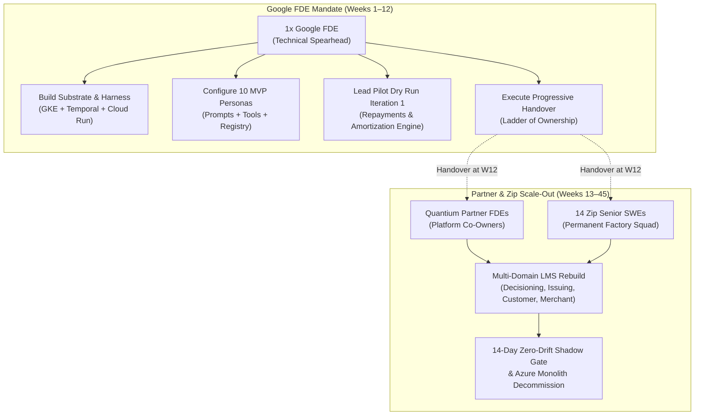
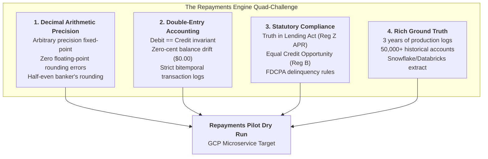
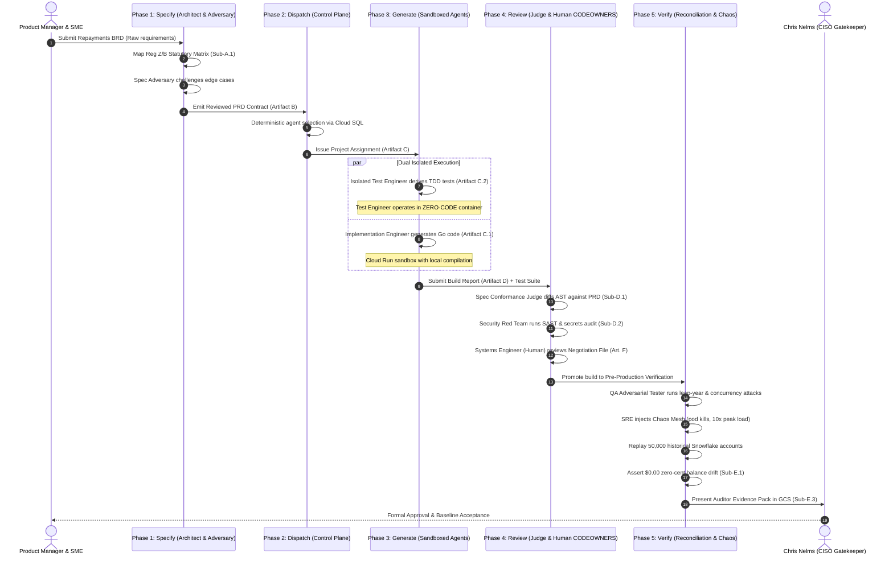
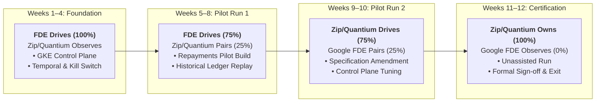

# Act 3: Statement of Work (SoW), Definition of Done (DoD) & Pilot Dry Run Specification

**Document Reference:** `PROJECT-CATALYST-ACT-03-SOW-DOD`  
**Programme:** Project Catalyst · Zip Agentic Software Factory & Loan Management System (LMS) Rebuild  
**Stakeholders:** Chris Nelms (CISO), Eric Blassberg (Delivery Lead), Phoebe Gunter (Google Cloud Account Lead), Pedro Correia (Google Cloud CE/FDE Lead), Steve / Quantium Delivery Leadership  
**Author:** Google Cloud Field Deployed Engineering (FDE) & Customer Engineering (CE) Team  
**Date:** September 1, 2026  
**Status:** Baseline Specification · Production Standard  

---

## 1. Executive Narrative for Act 3: Statement of Work (SoW) and Definition of Done (DoD)

### 1.1 Context & Strategic Framing
Following the architectural transcription of the foundational whiteboard blueprints (**Act 1: Architecture Read-Back**) and the formal codification of the 7-phase pipeline, 28 personas, and recursive lifecycle (**Act 2: Double Diamond & Control Plane Specification**), **Act 3 establishes the operational delivery contract**. It defines the exact boundaries, commercial reality, machine-auditable milestones, and handover gates governing the **Google Field Deployed Engineer (FDE)** engagement within Project Catalyst.

Project Catalyst is not a standard systems integration engagement, nor is it a temporary burst of outsourced development staff augmentation. In the explicit vision of CISO Chris Nelms and Delivery Lead Eric Blassberg, Project Catalyst creates a **permanent, compounding, Zip-owned software manufacturing capability**. In this model, small teams of senior Zip engineers direct fleets of autonomous AI agents to draft, compile, test, and verify software, while human engineers and executives hold all consequential quality, security, and financial gates.

```
+---------------------------------------------------------------------------------------+
|                                ZIP OWNED ASSETS                                       |
|    Methodology · Golden PRDs · Evaluation Test Banks · Verification Evidence Packs    |
|================================= THE WATERLINE =======================================|
|                           GOOGLE CLOUD FACTORY SUBSTRATE                              |
|    GKE Control Plane · Temporal · Cloud Run Sandboxes · Vertex AI · BigQuery Telemetry|
+---------------------------------------------------------------------------------------+
```

### 1.2 The Waterline Principle
The program is governed by a strict architectural waterline:
* **Above the Waterline (Zip Enduring Assets):** Zip permanently owns and maintains the software development methodology, high-definition specification standards, evaluation datasets, prompt libraries, domain invariants, control plans, and compliance verification packs. These assets compound in enterprise value with every release cycle.
* **Below the Waterline (Google Cloud Factory Substrate):** Google Cloud provides the hyper-scalable, secure execution infrastructure upon which the factory operates: the Google Kubernetes Engine (GKE) Control Plane, Temporal workflow orchestrator, ephemeral Cloud Run execution sandboxes, Cloud SQL registry, Cloud Logging audit trails, and the Vertex AI consolidated inference gateway.

### 1.3 The Core Mandate: Build the Machine, Not the Whole Fleet
The primary failure mode of enterprise AI engagements is the "infinite pilot trap," wherein external specialists become embedded coders who write application microservices manually while the underlying delivery machine remains fragile, undocumented, and un-reproducible.

To defeat this anti-pattern, the Google FDE engagement is strictly bounded to **building the factory machine itself and executing a single, high-stakes pilot dry run (the Repayments & Loan Amortization Engine)**. The subsequent multi-month re-platforming of the remaining four LMS domains (Decisioning, Issuing, Customer Master, and Merchant Engine) and the live production shadow gating against the incumbent Azure monolith are explicitly assigned to **Partner FDEs (Quantium)** and **Zip Senior Engineers (a squad of 14 senior engineers scaling over 9 months)**.

### 1.4 The 12-Week Time-Box & Commercial Alignment
The Google FDE engagement is structured as a **12-week sequential handover model** (Q4 2026: October – December 2026), terminating in **Factory General Availability (GA) on December 31, 2026**.

This timeline aligns directly with Zip's commercial commitments:
1. **Azure Commit Early Retirement:** Zip's early retirement of its three-year, $1.0M Microsoft Azure consumption commitment occurs within the next six months. The factory must be operational by end of Q4 2026 so that all net-new consumer lending services land natively on Google Cloud Platform.
2. **Commit Expiry vs. Production Cutover:** December 31, 2026 represents **Azure commit expiry and Factory GA**, *not* production DNS cutover. Live shadow traffic mirroring and production cutover for the entire loan portfolio will execute across Months 6–12 (2027) led by Quantium and Zip.

---

## 2. The Spearhead Mandate & Engagement Boundaries

### 2.1 The 1x Google FDE Role: Technical Spearhead
The 1x Google Field Deployed Engineer serves as the **architectural spearhead and technical builder**. The FDE's purpose is to break ground, lay the production-grade GCP substrate, wire the multi-model inference pipelines, enforce zero-trust container sandboxing, configure the 10 MVP personas, and prove the complete closed-loop lifecycle against real-world core banking logic.



### 2.2 Engagement Boundaries: In-Scope vs. Out-of-Scope
To prevent scope creep and guarantee deep engineering rigor on core deliverables, the boundary between the Google FDE engagement and post-handover operations is delineated with surgical clarity:

```
+---------------------------------------------------------------------------------------------------+
|                                   ENGAGEMENT SCOPE DELINEATION                                    |
+------------------------------------------------------------------+--------------------------------+
| IN-SCOPE: Google FDE Deliverables (Weeks 1–12)                   | OUT-OF-SCOPE: Quantium & Zip   |
+------------------------------------------------------------------+--------------------------------+
| 1. GKE Control Plane & Temporal state machine orchestration      | 1. Full rebuild of 4 remaining |
| 2. Central sub-second Slack MCP kill switch (<750ms SLA)         |    LMS domains (Decisioning,   |
| 3. Vertex AI Model Gateway routing (Gemini 1.5 Pro/Flash, Claude)|    Issuing, Customer, Merchant)|
| 4. Disposable Cloud Run sandboxes with ephemeral IAM credentials | 2. Live production DNS cutover |
| 5. 10 MVP Personas codified with YAML contracts in Cloud SQL     | 3. Decommission of Azure .NET  |
| 6. Isolated TDD Runner (zero-code-access test authoring sandbox) |    monolith & SQL servers      |
| 7. Repayments Pilot Dry Run (Iteration 1: FDE led)               | 4. Multi-month live shadow     |
| 8. 50,000-account historical replay asserting $0.00 balance drift|    mirroring & state rebase    |
| 9. Repayments Modification Dry Run (Iteration 2: Zip led)        | 5. Long-term 24/7 on-call      |
| 10. Complete Handover Artifact Pack & Progressive Mentoring      |    production support          |
+------------------------------------------------------------------+--------------------------------+
```

#### Detailed In-Scope Scope Items
1. **Control Plane Substrate:** Provisioning production GKE clusters (private endpoint, workload identity, Calico CNI), deploying Temporal Server with PostgreSQL persistence, and scaffolding the Control Plane Dispatch Engine.
2. **Safety & Abort Fabric:** Hardening the centralized kill switch triggered via Slack MCP (`/kill-factory --all`) or authenticated REST webhook, terminating all active agent sandboxes and revoking ephemeral tokens within 750 milliseconds.
3. **Vertex AI Multi-Model Gateway:** Configuring unified inference endpoints proxying Gemini 1.5 Pro (deep specification & AST diffing), Gemini 1.5 Pro (algorithmic microservice code generation), and Gemini 1.5 Flash (low-latency linting and AST parsing) with token rate limiting and spend tracking.
4. **Disposable Sandboxes:** Building hardened, ephemeral Cloud Run container templates with network namespace isolation, read-only root filesystems, and strict egress firewalls.
5. **SDLC Harness & 10 MVP Personas:** Defining system prompts, tool schemas, and capability predicates for the 10 MVP personas across Families A, B, C, D, and F.
6. **Isolated Zero-Code TDD Runner:** Architecting physical container isolation ensuring the Isolated Test Engineer derives test suites solely from the signed PRD (Artifact B) with zero access to implementation code repositories.
7. **Repayments Pilot Dry Run (Iteration 1):** Executing the end-to-end factory lifecycle on the Repayments & Loan Amortization Engine, verifying double-entry bookkeeping and statutory compliance (Reg Z / Reg B).
8. **Historical Ledger Replay:** Validating 50,000+ historical loan accounts extracted from Snowflake/Databricks against generated microservice ledger balances to assert exact $0.00 balance drift.
9. **Co-Delivered Handover Run (Iteration 2):** Pairing with Zip and Quantium engineers as they take the keyboard to author and execute a specification change (e.g., promotional interest tier) through the factory.
10. **Handover Artifact Pack:** Delivering complete Terraform modules, architecture decision records (ADRs), operations runbooks, persona registers, and training sign-offs.

#### Detailed Out-of-Scope Scope Items
1. **Remaining 4 LMS Domains:** Code generation, testing, and reconciliation for Decisioning, Card Issuing, Customer Master, and Merchant Engine. (Delivered by Quantium + Zip in Weeks 13–32).
2. **Production DNS Cutover:** Flipping live production borrower and merchant traffic from Azure endpoints to GCP GKE ingress.
3. **Azure Monolith Decommission:** Tearing down legacy Azure App Services, Azure SQL databases, Service Bus queues, and C# monolith deployments.
4. **Live Traffic Mirroring at Scale:** Configuring network taps, real-time Kafka event replication, and live side-effect suppression across 100% of US transaction volume (Delivered in Weeks 33–45).
5. **24/7 Production Operations:** Post-cutover on-call rotations, live incident management, and continuous infrastructure maintenance.
6. **Enterprise Data Warehouse Migration:** Moving Snowflake or Databricks data clusters to BigQuery. (The factory merely reads batch JSON/Parquet historical replay dumps).

### 2.3 Comprehensive Cross-Functional RACI Matrix
To ensure operational accountability across Google Cloud, Zip Co, and Quantium, all major workstreams are assigned under a formal RACI framework:

| Workstream | Google FDE | Zip Factory Architect | Zip Arch Team | Partner FDEs (Quantium) | Zip Senior SWEs (14) | Exec Owners (Nelms/Blassberg) |
|---|:---:|:---:|:---:|:---:|:---:|:---:|
| **1. Landing Zone & Network VPC Peering** | **C** | C | C | I | I | **A** (TOC Foundations) |
| **2. GKE Control Plane & Temporal Substrate** | **R** | C | C | I | I | **A** (Nelms) |
| **3. Central Safety Fabric & Kill Switch (<750ms)** | **R** | C | I | I | I | **A** (Nelms) |
| **4. Vertex AI Multi-Model Gateway & Routing** | **R** | C | I | C | I | **A** (Blassberg) |
| **5. SDLC Harness & 10 MVP Personas** | **R** | C | C | I | I | **A** (Blassberg) |
| **6. Isolated Zero-Code TDD Runner** | **R** | C | I | C | I | **A** (Nelms) |
| **7. Repayments Pilot: Specification & Adversary** | **R** | C | C | C | C | **A** (Blassberg) |
| **8. Repayments Pilot: CodeGen & AST Conformance** | **R** | C | I | C | C | **A** (Blassberg) |
| **9. Historical Ledger Replay ($0.00 Drift)** | **C** | C | C | **R** | **R** | **A** (Nelms) |
| **10. Pilot Iteration 2 (Zip/Quantium Driven)** | **C** | **R** | C | **R** | **R** | **A** (Blassberg) |
| **11. Handover Pack & Progressive Mentoring** | **R** | **R** | C | C | C | **A** (Blassberg) |
| **12. Multi-Domain LMS Scaling (Weeks 13–32)** | **I** | A | C | **R** | **R** | **A** (Blassberg) |
| **13. Production Shadow Gate & Cutover (W33–45)** | **I** | C | C | R | **R** | **A** (Nelms) |

*RACI Definitions:*  
* **R (Responsible):** The execution lead who authors code, deploys infrastructure, and produces the required deliverable.  
* **A (Accountable):** The individual with final approval authority, veto power, and executive ownership.  
* **C (Consulted):** Domain experts and architects who review specifications, provide inputs, and shape designs.  
* **I (Informed):** Stakeholders kept updated on milestone progress, outputs, and risk logs.  

---

## 3. The 4 Machine-Verifiable Milestone Gates (M1 to M4)

The 12-week engagement is anchored by four objective, machine-verifiable milestone gates. Progression between stages cannot occur on executive assertion or qualitative sentiment; every gate requires an automated, cryptographic, or log-verified proof mechanism.

```mermaid
timeline
    title The 4 Machine-Verifiable Milestone Gates
    section M1: Foundation
        Week 2 : GKE Control Plane Operational
               : Temporal 99.9% Synthetic Heartbeat
               : Sub-second Kill Switch Drill (<750ms)
    section M2: SDLC Harness
        Week 5 : 10 MVP Personas in Cloud SQL
               : Vertex AI Multi-Model Gateway Live
               : Isolated Zero-Code TDD Runner Validated
    section M3: Pilot Dry Run
        Week 8 : Repayments Microservice Generated
               : AST Conformance 100% Invariant Match
               : 50,000 Accounts Replayed ($0.00 Drift)
    section M4: Handover & Exit
        Week 12: Unassisted Factory Run (Zip/Quantium)
               : 8-Part Handover Pack Validated
               : Signed Exit Charter & CISO Sign-Off
```

### 3.1 Milestone Gate M1 (Week 2): Foundation Substrate & Sub-second Kill Switch
* **Target Delivery:** End of Week 2 (Day 14).
* **Objective:** Establish the secure Google Cloud computing foundation, container orchestrator, workflow engine, and emergency abort fabric.

#### Verifiable Gate Requirements
1. **GKE Control Plane Operational:** GKE cluster (private endpoint, Workload Identity enabled, Shielded GKE Nodes) deployed via Terraform with zero manual configuration drift.
2. **Temporal Workflow Engine 99.9% Availability:** Temporal Server running on GKE with Cloud SQL (PostgreSQL) backend. A synthetic heartbeat workflow executes every 60 seconds, asserting end-to-end task dispatch and state persistence.
3. **Sub-second Central Kill Switch (<750ms SLA):** A centralized kill switch operational via Slack MCP command (`/kill-factory --all`) and authenticated REST webhook. Upon triggering, the control plane must terminate all active Cloud Run sandbox containers, invalidate all in-flight Temporal activity tokens, and revoke short-lived IAM credentials in under 750 milliseconds.

#### Proof Mechanism & Artifacts
* `M1-PROOF-01`: Automated chaos drill log executing the `/kill-factory` webhook against 20 concurrently running agent containers, capturing timestamps from HTTP request receipt to container SIGKILL.
* `M1-PROOF-02`: Synthetic Temporal heartbeat uptime dashboard in Cloud Monitoring demonstrating 99.9% success over 7 consecutive days.
* `M1-PROOF-03`: Terraform execution plan and state file in Cloud Storage asserting infrastructure-as-code compliance.

#### Sign-off Authority
* **Chris Nelms** (CISO) & **Platforms Customer Engineer**.

---

### 3.2 Milestone Gate M2 (Week 5): SDLC Harness, 10 MVP Personas & Isolated TDD Runner
* **Target Delivery:** End of Week 5 (Day 35).
* **Objective:** Deliver the agentic factory dispatch engine, multi-model Vertex AI inference routing, persona capability catalog, and physically isolated test generation runner.

#### Verifiable Gate Requirements
1. **10 MVP Personas Codified:** The 10 MVP personas (Families A, B, C, D, and F) configured in Cloud SQL with immutable versioning, semantic capability predicates, tool access bounds, and system prompt markdown definitions.
2. **Vertex AI Multi-Model Routing:** The Model Gateway proxy successfully routes requests to Gemini 1.5 Pro, Gemini 1.5 Pro, and Gemini 1.5 Flash based on task assignment metadata. Token consumption counters and spend quotas are actively recorded in Cloud Logging.
3. **Isolated Zero-Code TDD Runner:** The Isolated Test Engineer operates in an isolated Cloud Run sandbox with strictly partitioned network and filesystem boundaries:
   * **Ingress:** Reads only the signed PRD Contract (Artifact B).
   * **Zero Access:** Has zero read access to the Implementation Engineer's workspace, code repository, or generated ASTs.
   * **Red Phase Proof:** Derives automated unit/conformance test suites and executes them against empty service stubs, proving that **100% of tests fail prior to code generation**.

#### Proof Mechanism & Artifacts
* `M2-PROOF-01`: Cloud SQL database dump verifying the schema and cryptographic hash of all 10 persona prompt templates and tool manifests.
* `M2-PROOF-02`: Cloud Logging trace export demonstrating dynamic model switching across Gemini 1.5 Pro, Gemini 1.5 Pro, and Gemini Flash with token billing attribution.
* `M2-PROOF-03`: Git commit log and container sandbox audit trail proving the Isolated Test Engineer generated tests in a zero-code-access workspace, accompanied by execution logs showing 100% failed assertions against empty stubs.

#### Sign-off Authority
* **Zip Factory Architect** & **AI Customer Engineer**.

---

### 3.3 Milestone Gate M3 (Week 8): Repayments Pilot Dry Run Verified with $0.00 Balance Drift
* **Target Delivery:** End of Week 8 (Day 56).
* **Objective:** Execute a complete end-to-end factory build cycle on the Repayments & Loan Amortization Engine, verifying code generation, AST conformance, statutory compliance, and historical financial ledger accuracy.

#### Verifiable Gate Requirements
1. **End-to-End Factory Execution:** Successful progression of the Repayments module through all 7 factory phases:
   $$\text{BRD (A)} \longrightarrow \text{PRD (B)} \longrightarrow \text{Assignment (C)} \longrightarrow \text{Build Report (D)} \longrightarrow \text{Negotiation (F)} \longrightarrow \text{Final Report (E)}$$
2. **AST Conformance Judge Verification:** The Spec Conformance Judge executes an Abstract Syntax Tree (AST) comparison between the signed PRD invariants and the generated Go/Python microservice, verifying zero unauthorized endpoints, zero unrequested network dependencies, and 100% invariant mapping.
3. **Statutory Compliance Validation:** Regulatory Conformance Verifier executes automated compliance test suites asserting 100% coverage of Truth in Lending Act (Reg Z § 1026.22 APR tolerances) and Equal Credit Opportunity Act (Reg B).
4. **Historical Ledger Replay ($0.00 Drift):** The new microservice executes an offline replay of **50,000+ historical loan accounts** spanning 3 years of transaction history extracted from Snowflake/Databricks. Reconstructed general ledger balances must match legacy Azure outputs with **exactly $0.00 zero-cent balance drift** across principal, interest, fees, and payments.

#### Proof Mechanism & Artifacts
* `M3-PROOF-01`: Signed PRD Contract (Artifact B) with embedded Regulatory Traceability Matrix (Sub-Artifact A.1) and Domain Invariant Register (Sub-Artifact A.2).
* `M3-PROOF-02`: AST Conformance Diff (Sub-Artifact D.1) signed off by the Spec Conformance Judge with zero unresolved anomalies.
* `M3-PROOF-03`: Historical Ledger Reconciliation Proof (Sub-Artifact E.1) providing a row-by-row mathematical diff proving $\Delta = \$0.000000$ across 50,000 accounts.
* `M3-PROOF-04`: Auditor Evidence Pack (Sub-Artifact E.3) compiled as a cryptographically signed `.tar.gz` archive stored immutably in Cloud Storage (`gs://zip-audit-evidence-prod/`).

#### Sign-off Authority
* **Chris Nelms** (CISO), **Eric Blassberg** (Delivery Lead), **Reconciliation Analyst**, and **Repayments Domain SME**.

---

### 3.4 Milestone Gate M4 (Week 12): Sequential Handover Certification & Exit
* **Target Delivery:** End of Week 12 (December 31, 2026).
* **Objective:** Complete the 4-week Progressive Ownership Ladder, certify that Zip and Quantium engineers independently operate the factory without assistance, and execute formal Google FDE exit.

#### Verifiable Gate Requirements
1. **Unassisted Factory Execution (Iteration 2):** Two named Zip Senior Engineers and two Quantium Partner FDEs independently specify, dispatch, generate, review, and verify a full modification cycle (e.g., promotional zero-interest repayment schedule) through the factory with **zero interventions, zero tool prompts, and zero code commits from the Google FDE**.
2. **Complete 8-Part Handover Pack Accepted:** The receiving team formally inspects, validates, and signs off on the complete Handover Artifact Pack.
3. **Unit Cost Baseline Instrumented:** Token economics, inference costs, and human review cycle times are captured in Cloud Logging, establishing the baseline unit cost per story point to measure future compounding.
4. **Formal Exit Charter Signed:** Executive leadership signs the engagement completion certificate, transitioning Google Cloud into an ongoing advisory architecture role.

#### Proof Mechanism & Artifacts
* `M4-PROOF-01`: Screen recording, commit SHAs, and Temporal run IDs of the unassisted factory execution executed entirely by Zip and Quantium personnel.
* `M4-PROOF-02`: Signed Handover Artifact Pack Receipt across all 8 required asset classes.
* `M4-PROOF-03`: Unit Cost Attribution Dashboard in Cloud Logging demonstrating per-spec inference cost metrics.
* `M4-PROOF-04`: Executed Engagement Closure Charter signed by Chris Nelms, Eric Blassberg, and Google Cloud Leadership.

#### Sign-off Authority
* **Chris Nelms** (CISO), **Eric Blassberg** (Delivery Lead), **Quantium Lead**, and **Google Cloud Account Lead**.

---

## 4. Verifiable Definition of Done (DoD) Checklist

The following machine-auditable checklist governs acceptance across all milestone gates. A gate is considered passed if and only if **100% of corresponding binary criteria are satisfied with verifiable machine proofs**.

```
+--------------------------------------------------------------------------------------------------------------------------------------------+
|                                              VERIFIABLE DEFINITION OF DONE (DoD) TABLE                                                     |
+----+-------------+------------------+------------------------------------+---------------------------------------+-------------------------+
| #  | Gate ID     | Area             | Verifiable Requirement             | Proof Mechanism / Artifact            | Sign-off Authority      |
+----+-------------+------------------+------------------------------------+---------------------------------------+-------------------------+
| 1  | M1 (Week 2) | Substrate        | GKE cluster & Temporal deployed;   | Synthetic heartbeat workflow executing| Platforms CE &          |
|    |             | Infrastructure   | 99.9% uptime over 7 days.          | every 60s logged to Cloud Monitoring  | Zip Arch Lead           |
+----+-------------+------------------+------------------------------------+---------------------------------------+-------------------------+
| 2  | M1 (Week 2) | Safety &         | Central kill switch terminates all | Automated chaos test log; webhook to  | Chris Nelms (CISO)      |
|    |             | Emergency Stop   | active sandboxes in <750ms.        | 0 running containers timestamp delta  |                         |
+----+-------------+------------------+------------------------------------+---------------------------------------+-------------------------+
| 3  | M2 (Week 5) | Model Gateway    | Dynamic routing for Gemini Pro,    | Cloud Logging telemetry trace; token  | AI CE &                 |
|    |             | & Inference      | Gemini 1.5 Pro, Gemini Flash.       | quota budget enforcement alerts       | Zip Factory Arch        |
+----+-------------+------------------+------------------------------------+---------------------------------------+-------------------------+
| 4  | M2 (Week 5) | Governance &     | 10 MVP personas versioned with     | Cloud SQL capability schema dump;     | Zip Factory Arch        |
|    |             | SDLC Principles  | YAML schemas & bounded tools.      | prompt markdown files in Git          |                         |
+----+-------------+------------------+------------------------------------+---------------------------------------+-------------------------+
| 5  | M2 (Week 5) | Test Isolation   | Test Engineer has 0 code access;   | Network namespace sandbox audit; git  | Chris Nelms (CISO) &    |
|    |             | (TDD Rigor)      | 100% tests fail on empty stubs.    | diff showing tests committed first    | Systems Engineer        |
+----+-------------+------------------+------------------------------------+---------------------------------------+-------------------------+
| 6  | M3 (Week 8) | Code Generation  | Repayments service generated; 100% | AST diff report; clean CI build report| Repayments SME &        |
|    |             | & Conformance    | invariant match against PRD.       | signed in Negotiation File (Art. F)   | Systems Engineer        |
+----+-------------+------------------+------------------------------------+---------------------------------------+-------------------------+
| 7  | M3 (Week 8) | Financial Proof  | 50,000 loan accounts replayed with | Sub-Artifact E.1 reconciliation proof;| Reconciliation Analyst  |
|    |             | & Regulatory     | $0.00 zero-cent drift; Reg Z pass. | Auditor Evidence Pack in GCS bucket   | & Chris Nelms (CISO)    |
+----+-------------+------------------+------------------------------------+---------------------------------------+-------------------------+
| 8  | M4 (Week 12)| Handover &       | Zip & Quantium execute unassisted  | Screen recording; Temporal execution  | Chris Nelms (CISO) &    |
|    |             | Operational Exit | cycle; 8-part pack accepted.       | run IDs; signed Exit Charter          | Eric Blassberg (Lead)   |
+----+-------------+------------------+------------------------------------+---------------------------------------+-------------------------+
```

### 4.1 Detailed Machine Audit Commands & Verification Queries

#### Verification 1: Sub-second Kill Switch Latency Assertion
The kill switch must be verified via an automated probe asserting sub-750ms execution:
```bash
# Automated Kill Switch Verification Probe
TRIGGER_TIME=$(date +%s%3N)
curl -s -X POST https://control-plane.internal.zip.co/api/v1/factory/emergency-halt \
  -H "Authorization: Bearer $(gcloud auth print-identity-token)" \
  -H "Content-Type: application/json" \
  -d '{"scope": "ALL", "reason": "CHAOS_DRILL_M1", "actor": "ciso-gatekeeper"}'

# Assert 0 running Cloud Run containers within 750ms
CONTAINER_COUNT=$(gcloud run services list --filter="metadata.labels.env=agent-sandbox AND status.conditions.type=Ready" --format="value(status.traffic[0].percent)" | wc -l)
STOP_TIME=$(date +%s%3N)
ELAPSED=$((STOP_TIME - TRIGGER_TIME))

echo "Kill Switch Latency: ${ELAPSED}ms | Running Sandboxes: ${CONTAINER_COUNT}"
test $ELAPSED -lt 750 && test $CONTAINER_COUNT -eq 0 && echo "DoD Gate 2: PASSED" || echo "DoD Gate 2: FAILED"
```

#### Verification 2: Zero-Cent Balance Drift Query (BigQuery / Cloud SQL)
Financial reconciliation is asserted through double-entry balance validation:
```sql
-- Historical Ledger Reconciliation Verification Query
-- Sub-Artifact E.1: Double-Entry Balance Proof
WITH legacy_ledger AS (
  SELECT 
    account_id,
    ROUND(SUM(principal_cents), 0) AS legacy_principal,
    ROUND(SUM(interest_cents), 0)  AS legacy_interest,
    ROUND(SUM(fee_cents), 0)       AS legacy_fees,
    ROUND(SUM(payment_cents), 0)   AS legacy_payments
  FROM `zip-data-lake.historical_replay.legacy_azure_ledger_50k`
  GROUP BY account_id
),
gcp_replayed_ledger AS (
  SELECT 
    account_id,
    ROUND(SUM(principal_cents), 0) AS gcp_principal,
    ROUND(SUM(interest_cents), 0)  AS gcp_interest,
    ROUND(SUM(fee_cents), 0)       AS gcp_fees,
    ROUND(SUM(payment_cents), 0)   AS gcp_payments
  FROM `zip-repayments-pilot.ledger.journal_entries`
  GROUP BY account_id
)
SELECT 
  COUNT(*) AS total_divergent_accounts,
  SUM(ABS(legacy_principal - gcp_principal)) AS principal_delta_cents,
  SUM(ABS(legacy_interest - gcp_interest))   AS interest_delta_cents,
  SUM(ABS(legacy_fees - gcp_fees))           AS fees_delta_cents,
  SUM(ABS(legacy_payments - gcp_payments))   AS payments_delta_cents
FROM legacy_ledger l
FULL OUTER JOIN gcp_replayed_ledger g ON l.account_id = g.account_id
WHERE l.legacy_principal != g.gcp_principal
   OR l.legacy_interest  != g.gcp_interest
   OR l.legacy_fees      != g.gcp_fees
   OR l.legacy_payments  != g.gcp_payments;

-- PASS CONDITION: total_divergent_accounts == 0 AND all deltas == 0
```

---

## 5. Pilot Dry Run Focus: Repayments & Loan Amortization Engine

### 5.1 Detailed Rationale: Why Repayments is the Critical Spearhead
Choosing the right component for the pilot dry run is the single most consequential scoping decision of the engagement. If a trivial microservice is chosen (such as an email notification dispatcher), the factory passes easily but proves nothing about its ability to generate mission-critical core banking logic. Conversely, attempting to rebuild the entire consumer loan origination pipeline invites failure through unmanaged external dependencies.

The **Repayments & Loan Amortization Engine** is selected because it embodies the ultimate stress test for an autonomous agentic factory:



#### 1. Mathematical Rigor & Decimal Arithmetic Precision
In consumer installment lending, floating-point arithmetic (`float32`, `float64`, `double`) is strictly unacceptable. Cumulative IEEE 754 rounding quirks inevitably create penny-rounding discrepancies that destroy financial integrity. The generated Repayments engine must utilize arbitrary-precision fixed-point math (`shopspring/decimal` in Go or `decimal.Decimal` in Python) and enforce statutory rounding standards (e.g., half-even banker's rounding across amortization intervals).

#### 2. Double-Entry Ledger Invariant ($\Delta = \$0.00$)
Every financial event (drawdown, interest accrual, partial repayment, late fee assessment, write-off) must balance to the exact cent across assets, liabilities, equity, revenue, and expense accounts:
$$\sum \text{Debits} - \sum \text{Credits} = \$0.000000$$
The engine must maintain an immutable, append-only journal. If a single cent cannot be accounted for across 50,000 accounts, the build is rejected.

#### 3. Statutory & Regulatory Non-Negotiables
Consumer lending in the United States is strictly policed by federal and state statutes:
* **Truth in Lending Act (TILA / Regulation Z, 12 CFR Part 1026):** Mandates exact Annual Percentage Rate (APR) calculations. Actuarial and US Rule calculations must fall within the statutory tolerance of $\frac{1}{8}\text{ of }1\%$ (0.125%) for regular installment transactions.
* **Equal Credit Opportunity Act (ECOA / Regulation B, 12 CFR Part 1002):** Mandates deterministic, non-discriminatory waterfall application of incoming borrower repayments (e.g., fees first, interest second, principal last).
* **Fair Debt Collection Practices Act (FDCPA, 15 U.S.C. § 1692):** Strictly bounds delinquency aging buckets, grace periods, and late fee assessment rules.

#### 4. Unrivaled Historical Ground Truth
Zip maintains over three years of high-fidelity loan servicing logs in Snowflake and Databricks. This provides an extraordinary black-box historical dataset: tens of millions of historical events, including leap years, daylight saving anomalies, early payouts, partial prepayments, distressed loan re-amortizations, and merchant chargebacks. The factory's generated code can be subjected to exact historical replay without synthetic data bias.

---

### 5.2 End-to-End Walkthrough: Traversing the Factory Lifecycle
The following step-by-step walkthrough details how the Repayments module traverses the factory from raw requirements to historical proof:



#### Step 1: Specify (Discover & Define)
1. **Input:** Business sponsor submits raw repayments requirements (BRD - Artifact A) covering installment schedules, interest accrual, and delinquency grace periods.
2. **Regulatory Mapping:** Regulatory Analyst drafts the **Regulatory Traceability Matrix (Sub-Artifact A.1)**, linking every functional requirement to specific clauses in Regulation Z (§ 1026.22) and Regulation B (§ 1002.9).
3. **Invariant Registration:** Data Architect establishes the **Domain Invariant Register (Sub-Artifact A.2)**:
   * *Invariant INV-REP-01:* Money calculations must use 64-bit integer cents or 128-bit decimal; IEEE floating-point arithmetic is prohibited.
   * *Invariant INV-REP-02:* Sum of transaction debits must equal credits at all times ($\sum D - \sum C = 0$).
   * *Invariant INV-REP-03:* Repayment allocation must strictly follow the statutory waterfall: Unpaid Fees $\rightarrow$ Accrued Interest $\rightarrow$ Principal Balance.
4. **Adversarial Hardening:** The Spec Adversary challenges the requirements, forcing the PM to clarify edge cases: leap-year interest divisor (365 vs. 366 days), partial repayments occurring on daylight saving shift boundaries, and fee waivers.
5. **Output:** Reviewed PRD Contract (Artifact B) in GitHub Markdown with YAML frontmatter, formally approved by Product and Architecture leads.

#### Step 2: Dispatch (Control Plane Orchestration)
1. **Dispatch Policy Engine:** Ingests the signed PRD Contract. Queries the Agent Capability Registry in Cloud SQL to match required skills (`golang-banking-core`, `decimal-amortization`, `temporal-saga`).
2. **Quota & Certificate Issuance:** Sets an immutable token budget (5.0M tokens) and execution timeout (60 minutes). Issues short-lived mTLS cryptographic execution certificates and ephemeral Google Cloud IAM tokens.
3. **Output:** Project Assignment (Artifact C) dispatched to Temporal orchestrator.

#### Step 3: Generate (Dual Isolated Sandboxes)
1. **Isolated Test Derivation:** The Isolated Test Engineer runs in an isolated Cloud Run sandbox with zero access to the implementation code. It ingests Artifact B and authors a comprehensive test suite in Go (`repayments_conformance_test.go`), defining assertions for amortization math, Reg Z tolerances, and waterfall priorities. The runner asserts that **100% of tests fail against blank interfaces**.
2. **Microservice Code Generation:** Concurrently, the Implementation Engineer runs in a separate Cloud Run container, invoking Gemini 1.5 Pro and Gemini 1.5 Pro via the Vertex AI gateway to implement the microservice domain model, repository layer, and event handlers.
3. **Local Sandbox Verification:** The sandbox compiles the code, executes local unit tests, and formats code according to Zip SDLC standards.
4. **Output:** Generated Microservice Source (Sub-Artifact C.1), Independent Test Suite (Sub-Artifact C.2), and Disposable Sandbox Build Report (Artifact D).

#### Step 4: Review (Conformance, Security & Negotiation)
1. **AST Conformance Diffing:** Spec Conformance Judge parses the Go AST, verifying that every struct, method, and transaction matches the PRD contract. It flags any unrequested public methods or undocumented dependencies.
2. **Static Security Red Team:** Scans code for hardcoded secrets, SQL injection, insecure deserialization, and excessive MCP privileges.
3. **Adjudication via Negotiation File:** If minor ambiguities exist, the human Systems Engineer adjudicates via the Negotiation File (Artifact F). Once resolved, the human CODEOWNERS signs off (`Approve`).
4. **Output:** AST Conformance Diff (Sub-Artifact D.1), Security Audit Log (Sub-Artifact D.2), and Agent Score Record (Sub-Artifact D.3).

#### Step 5: Verify (Chaos, Historical Replay & $0.00 Ledger Proof)
1. **Adversarial QA Attacks:** QA Adversarial Tester executes negative boundary fuzzing: negative interest rates, multi-threading race conditions on simultaneous card debits, and leap-second clock shifts.
2. **SRE Chaos Mesh:** Injects network latency, kills database connection pools, and simulates 10× peak Black Friday transaction volumes.
3. **50,000-Account Historical Replay:** The Migration Engineer loads 50,000 anonymized historical loan accounts from Snowflake into the staging environment. The replayer feeds 3 years of chronological repayments into the new GCP service.
4. **Reconciliation Analysis:** The Reconciliation Analyst queries the double-entry general ledger journal, comparing output balances against legacy Azure records. It asserts **$0.00 zero-cent balance drift**.
5. **Auditor Evidence Pack:** All test runs, reconciliation diffs, and AST logs are bundled into an auditor-legible, SHA-256 signed evidence archive uploaded to Cloud Storage.
6. **Output:** Double-Entry Balance Proof (Sub-Artifact E.1), Chaos Telemetry (Sub-Artifact E.2), Auditor Evidence Pack (Sub-Artifact E.3), and Final Verification Report (Artifact E).

#### Step 6: Handover Replay (Iteration 2 — Zip/Quantium Driven)
1. During Weeks 9–10, the receiving team takes full ownership. A Zip engineer introduces a specification amendment: **"Support a 3-month 0% promotional APR repayment tier with deferred fee accrual."**
2. Zip and Quantium engineers drive the factory independently, updating the PRD, dispatching tasks, reviewing diffs, and verifying historical ledger drift. The Google FDE pairs and observes.
3. By Week 12, the factory executes cleanly with zero FDE intervention, proving operational self-sufficiency.

---

## 6. The Progressive Ownership Ladder (Sequential Handover)

Handover in Project Catalyst is not an asynchronous documentation drop or a compressed knowledge transfer session scheduled in the final week of December. **Handover begins in Week 5 and operates as a progressive 4-stage ownership ladder**:



### 6.1 Handover Progression Across the 12 Weeks

```
+---------------------------------------------------------------------------------------------------------+
|                                    PROGRESSIVE OWNERSHIP LADDER PHASES                                  |
+-------------+------------------+-----------------------------+------------------------------------------+
| Window      | Operational Mode | Primary Driver              | Concrete Co-Delivery Activities          |
+-------------+------------------+-----------------------------+------------------------------------------+
| Weeks 1–4   | Model 1:         | Google FDE (100%)           | FDE deploys GKE, Temporal, and Cloud Run |
|             | FDE Drives,      |                             | sandboxes. Zip & Quantium engineers      |
|             | Zip Observes     |                             | attend daily architecture walk-throughs. |
+-------------+------------------+-----------------------------+------------------------------------------+
| Weeks 5–8   | Model 2:         | Google FDE (75%)            | FDE builds Repayments pilot; named Zip & |
|             | FDE Drives,      | Zip / Quantium Pairs (25%)  | Quantium engineers actively pair on test |
|             | Zip Pairs        |                             | authoring and ledger reconciliation.     |
+-------------+------------------+-----------------------------+------------------------------------------+
| Weeks 9–10  | Model 3:         | Zip / Quantium (75%)        | Zip & Quantium engineers take keyboard to|
|             | Zip Drives,      | Google FDE Pairs (25%)      | execute a feature amendment (Iteration 2)|
|             | FDE Pairs        |                             | through the full factory pipeline.       |
+-------------+------------------+-----------------------------+------------------------------------------+
| Weeks 11–12 | Model 4:         | Zip / Quantium (100%)       | Receiving team executes an unassisted run|
|             | Zip Drives,      | Google FDE Observes (0%)    | with zero FDE intervention. Formal review|
|             | FDE Observes     |                             | of 8-part handover pack and exit signoff.|
+-------------+------------------+-----------------------------+------------------------------------------+
```

### 6.2 The 8-Part Handover Artifact Pack
The engagement cannot be certified for closure until all eight components of the Handover Artifact Pack are committed to Zip's version control repositories, reviewed, and signed off by the receiving team:

1. **Architecture Decision Records (ADR) Compendium:** Full Markdown record documenting all architectural decisions (Temporal state machine design, Cloud Run isolation boundaries, Vertex AI gateway routing, kill-switch API patterns).
2. **Infrastructure-as-Code (Terraform) Repository:** Modular, clean Terraform code establishing GKE clusters, VPC networks, Cloud SQL instances, Cloud Storage buckets, and Workload Identity bindings.
3. **Spec Repo Templates & Authoring Standards:** Standardized GitHub Markdown templates with frontmatter YAML schemas for BRDs, PRDs, Regulatory Traceability Matrices, and Domain Invariant Registers.
4. **Persona Library & Prompt Directives:** Complete, versioned system prompt catalog for all 10 MVP personas, including capability manifests, tool schemas, and autonomy rung configurations.
5. **Eval Harness & Regression Test Banks:** Automated evaluation pipelines, AST conformance checkers, and benchmark test suites stored as permanent, owned Zip code assets.
6. **Operations Runbook & On-Call Playbook:** Step-by-step procedures for managing Temporal workflows, clearing stuck queues, recovering from failed agent runs, rotating credentials, and executing the kill switch.
7. **Known Limitations & Deferred Items Register:** Explicit documentation of technical debt, deferred edge cases, and architectural recommendations for Stages 2–4.
8. **Engineering Certification & Training Sign-off:** Verified attendance and practical competency sign-offs for the two named Zip engineers and two Quantium FDEs.

---

## 7. Week-by-Week Operational Execution Plan (Weeks 1 to 12)

```
+---------------------------------------------------------------------------------------------------------+
|                                    12-WEEK OPERATIONAL EXECUTION CALENDAR                               |
+------+-----------------------+--------------------------------------------------------------------------+
| Week | Focus Area            | Key Deliverables & Activities                                            |
+------+-----------------------+--------------------------------------------------------------------------+
| W1   | Onboarding & Landing  | • Finalize GCP IAM roles, VPC peering, and Vertex AI quota reservations  |
|      | Zone Validation       | • Conduct joint architecture kickoff with Chris Nelms, Eric Blassberg,   |
|      |                       |   Pedro Correia, and Quantium delivery leads                             |
|      |                       | • Establish GitHub spec repository, branch protection, and CODEOWNERS    |
+------+-----------------------+--------------------------------------------------------------------------+
| W2   | Substrate Scaffolding | • Deploy GKE Control Plane cluster & Temporal workflow orchestrator      |
|      | & Kill Switch Drill   | • Implement Slack MCP and webhook centralized kill switch (<750ms SLA)   |
|      | [MILESTONE GATE M1]   | • Execute automated chaos drill proving sub-second container termination |
|      |                       | • **Sign-off Gate M1: CISO Chris Nelms approves Foundation Substrate**   |
+------+-----------------------+--------------------------------------------------------------------------+
| W3   | Multi-Model Gateway   | • Configure Vertex AI proxy routing Gemini 1.5 Pro, Flash, and Claude    |
|      | & Token Telemetry     | • Implement token spend quotas and rate limiting per task assignment     |
|      |                       | • Deploy Cloud Logging telemetry dashboard for token attribution         |
+------+-----------------------+--------------------------------------------------------------------------+
| W4   | Sandboxes & Tool      | • Build disposable Cloud Run container runtime templates                 |
|      | Boundaries            | • Configure ephemeral short-lived IAM credentials for agent sandboxes    |
|      |                       | • Integrate Jira MCP (read-only) and PostgreSQL schema tools             |
+------+-----------------------+--------------------------------------------------------------------------+
| W5   | SDLC Harness & Personas| • Codify and register 10 MVP Personas in Cloud SQL capability registry   |
|      | [MILESTONE GATE M2]   | • Implement Isolated Zero-Code TDD Runner with physical sandbox isolation|
|      |                       | • Assert 100% test failure on empty stubs (Red-phase TDD validation)    |
|      |                       | • **Sign-off Gate M2: Zip Factory Architect approves SDLC Harness**      |
+------+-----------------------+--------------------------------------------------------------------------+
| W6   | Repayments Spec &     | • Ingest Repayments domain requirements; author high-definition PRD      |
|      | Adversarial Review    | • Compile Regulatory Traceability Matrix for Reg Z (§ 1026.22) and Reg B |
|      |                       | • Run Spec Adversary to eliminate dual-interpretation ambiguities        |
+------+-----------------------+--------------------------------------------------------------------------+
| W7   | CodeGen & AST         | • Implementation Engineer generates Go microservice in Cloud Run sandbox |
|      | Conformance Review    | • Spec Conformance Judge parses Go AST, verifying 100% PRD invariant match|
|      |                       | • Security Red Team performs SAST, secrets detection, and dependency scan|
|      |                       | • Systems Engineer adjudicates via Negotiation File; approves PR         |
+------+-----------------------+--------------------------------------------------------------------------+
| W8   | Historical Replay &   | • Replay 50,000 historical loan accounts from Snowflake through service  |
|      | Pilot Financial Proof | • Reconcile double-entry ledger balances asserting **$0.00 zero drift**  |
|      | [MILESTONE GATE M3]   | • Compile Auditor Evidence Pack (.tar.gz) and store in immutable GCS bucket|
|      |                       | • **Sign-off Gate M3: Chris Nelms & Eric Blassberg approve Pilot M3**     |
+------+-----------------------+--------------------------------------------------------------------------+
| W9   | Handover Co-Delivery  | • Quantium and Zip engineers take the keyboard (Progressive Ladder M3)   |
|      | (Pilot Iteration 2)   | • Introduce specification amendment (promotional 0% APR repayment tier)  |
|      |                       | • Google FDE transitions to active pairing and mentoring role            |
+------+-----------------------+--------------------------------------------------------------------------+
| W10  | Operational Runbooks  | • Execute failure recovery drills (stuck queues, killed containers)     |
|      | & Failure Drills      | • Validate on-call runbooks and automated alerting with Zip SREs         |
|      |                       | • Tune Cloud SQL registry indexing and Temporal workflow timeout bounds  |
+------+-----------------------+--------------------------------------------------------------------------+
| W11  | Unassisted Factory    | • Zip and Quantium run a full factory build cycle with 0 FDE touches     |
|      | Execution             | • Verify complete autonomous execution from PRD to verification report   |
|      |                       | • Capture unit cost and token consumption telemetry in Cloud Logging     |
+------+-----------------------+--------------------------------------------------------------------------+
| W12  | Certification & Exit  | • Comprehensive review of all 8 Definition of Done exit criteria         |
|      | [MILESTONE GATE M4]   | • Formally deliver completed 8-part Handover Artifact Pack               |
|      |                       | • **Sign-off Gate M4: Executive sign-off; Google FDE exits on Dec 31**    |
+------+-----------------------+--------------------------------------------------------------------------+
```

---

## 8. Risk Management & Governance Matrix

| Risk ID | Risk Description | Severity | Likelihood | Impact on Delivery | Proactive Mitigation Strategy |
|---|---|:---:|:---:|:---:|---|
| **RSK-01** | **Landing Zone Provisioning Delays:** Delays in VPC peering or GCP organization IAM roles prevent GKE deployment. | **P0** | Medium | Blocks M1 substrate work from Week 2. | Platforms CE and TOC Foundations pre-provision staging VPC and service accounts during Week 0 ramp-up. |
| **RSK-02** | **Unassigned Receiving Team:** Zip fails to commit named engineers for paired handover sessions starting Week 5. | **P0** | Medium | Handover fails; FDE retained by default; violates exit charter. | Charter explicitly names two Zip SWEs and two Quantium FDEs prior to Week 1 kickoff. Executive condition for gate progression. |
| **RSK-03** | **Historical Data Extraction Friction:** Snowflake/Databricks extract of 50,000 accounts delayed by schema obscurity. | **P1** | High | Delays M3 ledger replay verification. | Quantium data engineer paired in Week 3 to author ETL extraction script; synthetic replay fallback prepared. |
| **RSK-04** | **Scope Creep into Additional Domains:** Stakeholders request expanding pilot to include Card Issuing or Decisioning. | **P1** | Medium | Dilutes FDE focus; threatens 12-week exit date. | Strict change-control boundary enforced. Act 3 charter legally bounds FDE scope to Repayments engine only. |
| **RSK-05** | **Sub-second Kill Switch Latency Spikes:** Container termination exceeds 750ms due to Cloud Run cold metadata calls. | **P1** | Low | Fails CISO M1 exit gate criteria. | Implement parallel asynchronous gRPC termination signals combined with immediate VPC firewall egress revocation. |
| **RSK-06** | **Frontier Model Token Rate Limit Throttling:** Gemini 1.5 Pro or Gemini 1.5 Pro quota limits breached during code gen. | **P2** | Medium | Temporary stalling of Generation phase. | Pre-allocated committed quota tiers purchased on Vertex AI; multi-model fallback failover configured. |

---

## 9. Conclusion: The Factory as an Enduring Asset

The completion of Milestone M4 on December 31, 2026 marks the successful realization of Act 3. By deliberately bounding the Google Field Deployed Engineer engagement to **building the software factory machine and proving it on the Repayments Engine**, Project Catalyst achieves three vital outcomes:

1. **Zero Intellectual Property Debt:** Zip permanently owns the upper waterline—methodology, high-definition PRD templates, evaluation test banks, and verification evidence packs.
2. **Defensible Financial Integrity:** Proving the engine against 50,000 real-world accounts with **$0.00 zero-cent balance drift** establishes undeniable confidence for CISO Chris Nelms and executive stakeholders.
3. **True Operational Autonomy:** Through the 4-week Progressive Ownership Ladder, Zip Senior Engineers and Quantium Partner FDEs stand fully equipped to operate, scale, and compound the factory across the remaining four LMS domains, retiring the legacy Azure monolith on an accelerated, confident trajectory.
