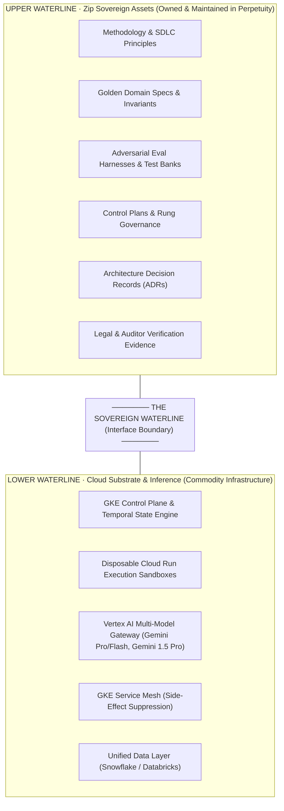
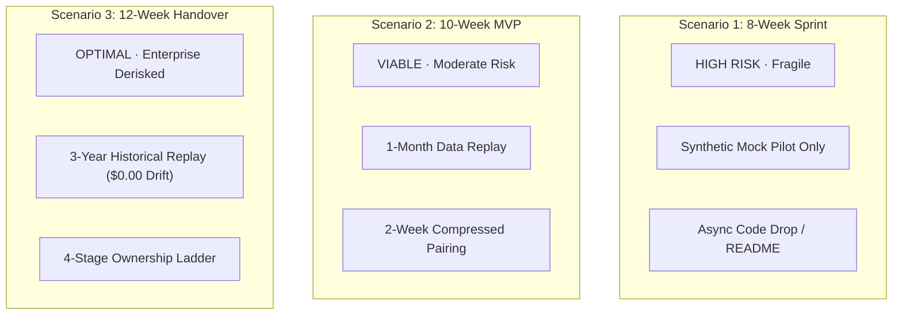
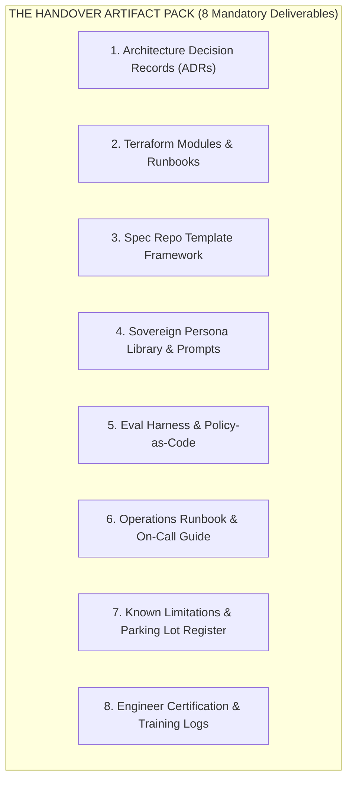
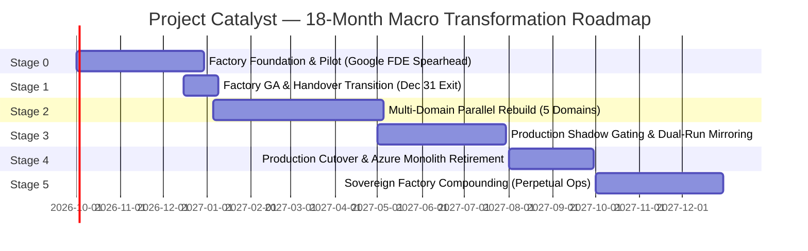

# Act 4: Phased Implementation, Collaboration Model & Long-Term Roadmap

**Project Catalyst · US Regulated Consumer Lending Agentic Factory**  
**Engineering Specification & Engagement Architecture: 12-Week Build to 18-Month Horizon**  
**Stakeholders:** Chris Nelms (CISO), Eric Blassberg (Head of Delivery), Zip Architecture Group, Quantium Delivery Team, Google Cloud FDE & CE Team  
**Baseline Date:** September 1, 2026  
**Status:** Canonical Implementation Blueprint · Act 4 of 4  

---

## 1. Executive Narrative for Act 4: Phased Implementation, Collaboration Model & Long-Term Roadmap

### 1.1 Strategic Context: The "House Next Door" and the Waterline
Project Catalyst represents a fundamental paradigm shift for Zip Co’s United States consumer lending infrastructure. The organization’s existing core platform—operating entirely in Microsoft Azure as a legacy C# / .NET monolith underpinned by complex event sourcing—has reached an architectural inflection point described by leadership as *"taking a rocket ship to the grocery store."* Monolithic coupling, historical schema anomalies, and unmaintainable event-stream dependencies hinder product velocity in a highly regulated, high-volume consumer lending market governed by the Truth in Lending Act (Reg Z), Equal Credit Opportunity Act (Reg B), Fair Debt Collection Practices Act (FDCPA), and Gramm-Leach-Bliley Act (GLBA).

Rather than attempting an in-place refactoring or a risky, big-bang lift-and-shift, Zip has committed to the **"House Next Door" strategy**: constructing an autonomous, sovereign **Agentic Software Factory** on Google Cloud Platform (GCP) to cleanly engineer a net-new Loan Management System (LMS). This strategy is governed by three foundational pillars:
1. **Human Specified, Human Supervised, Human Verified**: Fleets of autonomous AI agents draft, compile, cross-check, and test software in isolated sandboxes, but qualified human systems engineers and executive transformation owners hold every consequential gate.
2. **The Sovereign Upper Waterline**: Everything above the waterline—domain methodologies, golden specification templates, evaluation assets, adversarial test suites, Architecture Decision Records (ADRs), and verification evidence—remains Zip's permanent, proprietary intellectual property.
3. **The Commodity Lower Waterline**: Everything below the waterline—disposable sandbox execution runtimes (Cloud Run), unified control plane orchestration (GKE, Temporal), and multi-model frontier intelligence (Vertex AI routing to Gemini 1.5 Pro/Flash and Gemini 1.5 Pro)—is treated as utility infrastructure. Zip buys the models as commodities, but builds the factory as an enduring operational capability.



### 1.2 The Three-Party Convergence Model
A critical strategic tension emerged during initial program scoping regarding organizational structure:
* **The Serial Fallacy**: Initial planning contemplated a disconnected relay race—a Google Field Deployed Engineer (FDE) working in isolation for 4 to 8 weeks, dropping a codebase over the fence to a systems integrator (Quantium), who would subsequently attempt a handover to Zip internal engineering months later.
* **The Tripartite Reality**: Zip leadership (Eric Blassberg, Chris Nelms) explicitly rejected this disjointed handoff: *"We’d like all three entities—Google FDE, Quantium, and Zip senior engineering—to converge simultaneously from Day 1 for maximum leverage."*

To honor this mandate while maintaining sharp contractual boundaries, Act 4 establishes a **Tripartite Convergence Model**:
* **Google FDE (The Technical Spearhead & Factory Architect)**: Deployed for a strictly time-boxed **12-week window (Q4 FY26: October–December 2026)**. The FDE’s mandate is solely to architect the factory substrate, harden the agentic SDLC harness, deploy the 10 MVP personas, and prove the model via a high-stakes pilot dry run. The FDE exits at Week 12.
* **Quantium (The Scaling & Industrialization Partner)**: Embedded alongside the Google FDE from Week 1, ramping from architectural observation to co-delivery by Week 5, driving factory operations by Week 9, and leading the subsequent 10-month parallel rebuild of all five LMS domains across 2027.
* **Zip Senior Engineering (The Permanent Capability Owner)**: A dedicated cohort of 14 senior engineers, led by the Zip Factory Architect, paired continuously with the FDE and Quantium over a 9-month knowledge transfer curve, ensuring Zip independently operates, modifies, and governs the factory in perpetuity by Month 12.

### 1.3 Commercial Alignment & The 6-Month Azure Commit Window
Project Catalyst is synchronized with Zip's cloud commercial horizon. Zip is currently consuming against an early three-year, $1,000,000 Microsoft Azure commitment that expires within approximately six months (Q1 2027). Establishing the Google Cloud Agentic Factory as a production-grade capability within 12 weeks provides executive leadership with the technical proof and operational leverage needed to allow the Azure commitment to retire without renewal, establishing GCP as the default landing zone for all net-new durable assets.

---

## 2. Capacity Feasibility & 3 Delivery Scenarios

### 2.1 Objective Feasibility Assessment: Is 8–12 Weeks Adequate?
An objective engineering analysis demonstrates that the 8–12 week timeframe is **fully adequate, viable, and derisked—provided the boundary conditions of the engagement are strictly maintained**:

> [!IMPORTANT]
> **The Boundary Condition of Success**:
> The 1x Google FDE engagement is **the factory build window and nothing else**. The FDE's scope is strictly confined to building the manufacturing assembly line (the GKE/Temporal control plane, Cloud Run sandboxes, Vertex AI gateway, 10 MVP personas, and isolated TDD runner) and executing a single, high-stakes pilot dry run (the Repayments & Loan Amortization Engine). 
> 
> If the FDE's scope creeps into rebuilding the remaining four LMS domains, migrating legacy event-sourced databases, or executing live production traffic cutovers, **the 12-week timeline will fail**. Those operational domains belong entirely to Quantium and the Zip engineering squads across the subsequent 12-month program.

### 2.2 Detailed Comparison of Three Delivery Scenarios
To evaluate scheduling and resource allocation, three execution scenarios were evaluated during the architecture workshop:



#### Detailed Scenario Comparison Matrix

| Dimension | Scenario 1: 8-Week Accelerated Sprint | Scenario 2: 10-Week Balanced MVP | Scenario 3: 12-Week Sequential Handover (Recommended) |
| :--- | :--- | :--- | :--- |
| **Strategic Profile** | Aggressive / High Risk | Pragmatic Baseline | Enterprise Derisked / Fully Derisked |
| **Duration & Calendar** | 8 Weeks (Oct – Nov 2026) | 10 Weeks (Oct – mid-Dec 2026) | 12 Weeks (Oct – Dec 31, 2026) |
| **Google FDE Allocation** | 8 Person-Weeks (100% flat out) | 10 Person-Weeks (100%) | 12 Person-Weeks (100% W1–10, tapering W11–12) |
| **Zip Engineering Effort** | 12 Person-Weeks (2 SWEs, 50% shared) | 18 Person-Weeks (2 SWEs + Arch, 75%) | 28 Person-Weeks (4 SWEs + Arch + CISO, 100%) |
| **Partner (Quantium) Effort**| 2 Person-Weeks (passive observation) | 6 Person-Weeks (onboarding W8+) | 16 Person-Weeks (co-delivery W5–12) |
| **Pilot Dry Run Target** | Synthetic mock transactions only | 1-month historical transaction replay | Full 3-year historical ledger replay (50k+ loans) |
| **Financial Reconcile Gate** | Mathematical sanity check ($\pm \$5.00$) | Basic reconciliation ($\pm \$0.10$ drift) | Strict zero-cent balance invariant (**$\$0.00$ drift**) |
| **Personas Implemented** | 6 Core Personas (P1–P3 only) | 8 MVP Personas | 10 MVP Personas + Regression Eval Suite |
| **Isolated TDD Engine** | Partial (shared container namespaces) | Dedicated test runner container | Strict zero-code-access containerized runner |
| **Handover Methodology** | Async Git push, README, 2-day Q&A | 2-week compressed pair programming | **4-stage Progressive Ownership Ladder (4 weeks)** |
| **Landing Zone Prerequisite** | Zero buffer; VPC/IAM must be perfect W1 | 1-week provisioning buffer | 2-week decoupled staging (degraded-mode harness) |
| **Post-FDE Trajectory** | High risk of stall; partner unready | Moderate risk of velocity dip in Month 4 | Seamless transition to Quantium-led Stage 3 |
| **Feasibility Verdict** | 🔴 **Unacceptable Risk**: Fragile to IAM delays; leaves Zip with unmaintainable code. | 🟡 **Viable but Strained**: Delivers tech, but fails operational handover to Quantium. | 🟢 **Recommended & Optimal**: Derisks financial verification, embeds partner, guarantees sovereign ownership. |

### 2.3 Work Breakdown Structure (WBS) & Capacity Distribution
The recommended 12-Week Plan requires **61 total person-weeks** across engineering and governance (plus dedicated support), structured into eight core workstreams:

```
Work Breakdown Structure (WBS) - 12-Week Catalyst Factory Build:
├── WS1: Landing Zone & Substrate Foundation (Weeks 1–3)
│   ├── 1.1 GKE Autopilot Cluster & Private Control Plane Setup
│   ├── 1.2 Temporal State Orchestrator Deployment
│   └── 1.3 Sub-Second Slack MCP Central Kill Switch
├── WS2: Multi-Model Inference & Governance (Weeks 2–4)
│   ├── 2.1 Vertex AI Multi-Model Gateway (Gemini 1.5 Pro/Flash, Gemini 1.5 Pro)
│   ├── 2.2 Cloud SQL Sovereign Agent Capability Registry
│   └── 2.3 Token Economics Telemetry & Quota Throttling Engine
├── WS3: Sandbox Isolation & Tool Adapters (Weeks 3–5)
│   ├── 3.1 Disposable Cloud Run Container Runtimes with Ephemeral IAM Tokens
│   ├── 3.2 GitHub Enterprise, Jira MCP & Postgres Tool Adapter Isolation
│   └── 3.3 Strict Isolated TDD Container Runner (Zero Code Access)
├── WS4: 10 MVP Personas & SDLC Harness Hardening (Weeks 4–7)
│   ├── 4.1 Family A & B: Requirements Architect, Spec Adversary, Software/Data Arch
│   ├── 4.2 Family C & D: Implementation Engineer, Test Engineer, Conformance Judge
│   └── 4.3 Negotiation File State Machine & 3-Cycle Auto-Escalation Engine
├── WS5: Repayments Pilot Dry Run — Iteration 1 (Weeks 6–8)
│   ├── 5.1 Ingestion of Reg Z / Reg B Statutory Invariants into Golden PRD
│   ├── 5.2 Microservice Generation & AST Diff Conformance Review
│   └── 5.3 3-Year Historical Ledger Replay against Snowflake (50,000+ Accounts)
├── WS6: Handover Co-Delivery — Iteration 2 (Weeks 9–10)
│   ├── 6.1 Quantium & Zip Engineers Drive Keyboard on Repayments Feature Delta
│   ├── 6.2 Side-Effect Suppression Rule Hardening in GKE Service Mesh
│   └── 6.3 Operational Runbook Drills & Chaos Injections
├── WS7: Unassisted Factory Validation & Audit (Weeks 11–12)
│   ├── 7.1 Zip/Quantium 100% Unassisted End-to-End Factory Execution
│   ├── 7.2 Handover Artifact Pack Validation & Verification Sign-Off
│   └── 7.3 Formal M4 Exit Gate Review with CISO Chris Nelms
└── WS8: Continuous Delivery & Program Governance (Weeks 1–12)
    ├── 8.1 Weekly Tripartite Steering Committee & Parking Lot Triage
    └── 8.2 ADR Archival & Golden Spec Template Promotion
```

#### Capacity Distribution by Role across 12 Weeks (Person-Weeks)

| Workstream | Google FDE | Zip Factory Arch | Quantium Lead / SWE | Zip Senior SWEs (4) | Google CE (AI/Plat) | Total Person-Weeks |
| :--- | :---: | :---: | :---: | :---: | :---: | :---: |
| **WS1: Landing Zone & Substrate** | 2.5 | 1.0 | 1.0 | 1.0 | 1.5 | **7.0** |
| **WS2: Inference & Governance** | 2.0 | 0.5 | 1.0 | 0.5 | 1.0 | **5.0** |
| **WS3: Sandbox Isolation & TDD** | 2.0 | 0.5 | 1.0 | 1.0 | 0.5 | **5.0** |
| **WS4: Personas & SDLC Harness** | 2.5 | 1.5 | 2.0 | 2.0 | 0.5 | **8.5** |
| **WS5: Repayments Pilot (Iter 1)**| 2.0 | 1.5 | 2.0 | 2.5 | 0.5 | **8.5** |
| **WS6: Handover Co-Delivery** | 0.5 (Pair) | 2.0 | 4.0 | 4.0 | 0.5 | **11.0** |
| **WS7: Unassisted Validation** | 0.2 (Obs) | 1.5 | 3.0 | 4.0 | 0.5 | **9.2** |
| **WS8: Program Governance** | 0.3 | 1.5 | 2.0 | 1.0 | 2.0 | **6.8** |
| **TOTAL PERSON-WEEKS** | **12.0** | **10.0** | **16.0** | **16.0** | **7.0** | **61.0** |

---

## 3. The 4-Stage Progressive Ownership Ladder (Sequential Handover)

### 3.1 Handover Philosophy: Shift-Left Knowledge Transfer
Traditional IT programs defer handover to the final fortnight, treating it as an administrative exercise consisting of documentation drop-offs and walkthrough webinars. In an autonomous agentic factory, this approach guarantees failure: the nuances of prompt directives, AST conformance diffing, eval scoring weights, and sandbox security cannot be assimilated theoretically.

Handover in Project Catalyst begins in **Week 5**, not Week 12. The mechanism is a **4-Stage Progressive Ownership Ladder** that systematically inverts operational driving responsibility:

```mermaid
graph LR
    subgraph Stage1["STAGE 1: WEEKS 1–4"]
        S1_Title["FDE DRIVES<br>Zip / Quantium Observes"]
        S1_Desc["• FDE architects substrate<br>• Zip/Quantium attend all sessions<br>• Joint PR reviews & daily syncs<br>• Initial ADRs co-authored"]
    end

    subgraph Stage2["STAGE 2: WEEKS 5–8"]
        S2_Title["FDE DRIVES<br>Zip / Quantium Pairs"]
        S2_Desc["• Repayments Iteration 1<br>• 50/50 mob & pair programming<br>• Zip engineers author tests<br>• Quantium configures tools"]
    end

    subgraph Stage3["STAGE 3: WEEKS 9–10"]
        S3_Title["ZIP / QUANTIUM DRIVES<br>Google FDE Pairs"]
        S3_Desc["• Repayments Iteration 2<br>• Zip/Quantium at the keyboard<br>• FDE reviews, coaches & advises<br>• Operational runbook drills"]
    end

    subgraph Stage4["STAGE 4: WEEKS 11–12"]
        S4_Title["ZIP / QUANTIUM OWNS<br>Google FDE Observes & Signs Off"]
        S4_Desc["• 100% unassisted factory run<br>• Zero FDE intervention<br>• Handover Artifact Pack signed<br>• Formal exit on Dec 31"]
    end

    Stage1 --> Stage2 --> Stage3 --> Stage4
```



### 3.2 Detailed Breakdown of the 4 Stages

#### Stage 1: FDE Drives · Zip/Quantium Observes (Weeks 1–4)
* **Operational Dynamic**: Google FDE holds the keyboard and drives the architectural scaffolding. Zip Factory Architect and Quantium Lead participate in all architecture sessions, approve design patterns, and review every Pull Request.
* **Core Activities**: Setting up GKE Autopilot, deploying Temporal state orchestrator, establishing Cloud SQL agent registry, provisioning Vertex AI gateway, deploying disposable Cloud Run sandboxes, configuring sub-second kill switches.
* **Check-In Gate (End of Week 4)**: The baseline substrate must execute a synthetic end-to-end task; Zip and Quantium sign off on foundational architecture before any domain personas are codified.

#### Stage 2: FDE Drives · Zip/Quantium Pairs (Weeks 5–8)
* **Operational Dynamic**: Google FDE leads the execution of Repayments Pilot Iteration 1, but daily development shifts to structured **pair and mob programming**. Zip and Quantium engineers actively write prompt contracts, build tool adapters, and construct isolated test containers.
* **Core Activities**: Ingesting statutory rules (Reg Z/B), authoring the high-definition PRD contract, running Spec Adversary challenges, generating microservice code in sandboxes, executing isolated TDD suites, running 3-year historical ledger replay against Snowflake logs.
* **Check-In Gate (End of Week 8 / Milestone M3)**: Repayments Iteration 1 compiles, passes 100% of isolated tests, and proves zero-cent ($0.00) ledger drift over 50,000 historical accounts.

#### Stage 3: Zip/Quantium Drives · FDE Pairs (Weeks 9–10)
* **Operational Dynamic**: The keyboard is formally handed over. Named Zip Senior Engineers and Quantium FDEs author all code, specs, and configurations for **Repayments Pilot Iteration 2** (introducing a complex feature delta: promotional interest schedules and delinquent payment re-allocation). The Google FDE sits in the co-pilot seat, providing guidance, diagnosing edge cases, and answering escalation queries.
* **Core Activities**: Specifying requirement deltas, dispatching autonomous agent tasks, adjudicating AST conformance diffs in CODEOWNERS review, executing side-effect suppression drills, performing on-call runbook simulations.
* **Check-In Gate (End of Week 10)**: Zip and Quantium independently push Iteration 2 through the full 7-phase pipeline with minimal FDE escalation.

#### Stage 4: Zip/Quantium Owns · FDE Observes & Signs Off (Weeks 11–12)
* **Operational Dynamic**: Complete operational autonomy. Zip and Quantium execute a clean factory cycle with **zero Google FDE keyboard touches or intervention**. The Google FDE acts purely as an auditor, validating telemetry, verifying evidence, reviewing unit costs, and inspecting the Handover Artifact Pack.
* **Core Activities**: Executing unassisted build cycle, verifying 15-minute rollback runbooks, auditing Cloud Logging cryptographic hashes, finalizing ADRs, and conducting the formal exit review with CISO Chris Nelms.
* **Exit Gate (December 31, 2026 / Milestone M4)**: Formal executive acceptance and signing of the Handover Certification Charter.

---

### 3.3 The Handover Artifact Pack (8 Formal Deliverables)
The Google FDE cannot exit until the Zip Factory Architect, Quantium Delivery Lead, and CISO Chris Nelms have formally inspected and accepted the **Handover Artifact Pack**:



1. **Architecture Decision Records (ADR) Index**: Complete, immutable record of all architectural decisions made during Catalyst Phase 1 (ADR-001 through ADR-015+), documenting context, options considered, decision rationale, and consequences (e.g., GKE Autopilot vs Standard, Temporal vs Airflow, Vertex AI multi-model routing, Cloud Run sandbox namespaces).
2. **Terraform Modules & Infrastructure Runbooks**: Declarative, production-grade Infrastructure-as-Code (IaC) defining the GKE control plane, Cloud SQL instances, Cloud Run sandbox profiles, Secret Manager mappings, IAM least-privilege service accounts, and VPC peering configurations. Includes clean provisioning and teardown automation.
3. **Spec Repo Template Framework & Authoring Guide**: The standardized GitHub Markdown schema for Business Requirements Documents (BRD) and Product Requirements Documents (PRD). Includes mandatory YAML frontmatter definitions (`SC1`–`SC6`), statutory compliance matrices (Reg Z/B, FDCPA), and step-by-step authoring guides for Product Managers and Requirements Architects.
4. **Sovereign Persona Library & Prompt Directives**: The complete, versioned repository of system prompt directives, tool boundary schemas, and permission manifests for the 10 MVP personas (Families A through F). Includes Cloud SQL initialization scripts and persona update runbooks for frontier model upgrades.
5. **Eval Harness & Policy-as-Code Suites**: The executable evaluation engine combining quantitative unit test results and qualitative review scores (`PL-16`/`Q.5`). Contains the AST Conformance Diff analyzer, isolated TDD harness, and the baseline regression test suite.
6. **Operations Runbook & On-Call Guide**: Step-by-step Standard Operating Procedures (SOPs) for operating the factory: handling Temporal workflow deadlocks, executing sub-second kill switch drills, resetting sandbox quotas, managing token budget escalations, and troubleshooting GKE service mesh side-effect suppression.
7. **Known Limitations & Deferred Items Register**: An unvarnished technical disclosure of all architectural boundaries, known edge cases, and deferred items from the Parking Lot (`PL-20` advanced side-effect filters, `PL-25` autonomy rung governor automation, `PL-33` automated state re-baselining), ensuring Quantium has a clear engineering roadmap for Stage 3.
8. **Engineer Certification & Training Completion Record**: Formal log signed by the Google FDE certifying that four named Zip Senior Engineers and two Quantium Technical Leads have independently operated, debugged, and signed off on full factory cycles.

---

### 3.4 The 7 Verifiable Exit Criteria
The Google FDE engagement closes on **December 31, 2026**, if and only if all seven criteria are verifiably true:

* [ ] **Criterion 1: Unassisted Execution**: The factory executes a complete specify $\rightarrow$ dispatch $\rightarrow$ generate $\rightarrow$ review $\rightarrow$ verify cycle on the Repayments pilot component with **zero Google FDE intervention**.
* [ ] **Criterion 2: Named Zip Operator Competency**: At least **two named Zip Senior Engineers** have independently initiated, executed, and verified a feature modification cycle through the factory from scratch.
* [ ] **Criterion 3: Complete Handover Pack Validation**: The receiving team (Zip Factory Architect and Quantium Technical Lead) has formally accepted and validated all eight items in the Handover Artifact Pack.
* [ ] **Criterion 4: Persona Ownership Assigned**: All 10 MVP personas are cataloged, versioned in Git, stored in Cloud SQL, and assigned to **named human stewards** within Zip/Quantium.
* [ ] **Criterion 5: Zero-Cent Ledger Balance Invariant**: The Repayments pilot microservice demonstrates exact historical ledger reconciliation against 50,000+ real-world accounts with **$\$0.00$ balance drift**.
* [ ] **Criterion 6: Token Economics Baseline Established**: Full token usage telemetry is active in Cloud Logging; baseline unit delivery costs per story point / spec are calculated and recorded.
* [ ] **Criterion 7: Sovereign Control Plane Resourced**: Zip executive leadership confirms that the post-handover receiving team (Zip Factory Architect and Quantium squads) is fully funded, staffed, and allocated for Stage 3.

---

## 4. Cross-Functional RACI Matrix

### 4.1 Governance Principles
In accordance with modern enterprise architecture governance, the Project Catalyst RACI matrix enforces two strict rules:
1. **Single Point of Accountability**: Exactly **one 'A' (Accountable)** is assigned per workstream. Accountability cannot be shared or delegated; the Accountable owner holds ultimate veto and approval authority.
2. **Clear Delivery Responsibility**: One or more roles are marked **'R' (Responsible)** to execute the actual engineering work under the direction of the Accountable lead.

#### Role Definitions
* **Role 1: Google FDE (Field Deployed Engineer)** — Technical Spearhead & Factory Substrate Architect (Oct–Dec 2026).
* **Role 2: Zip Factory Architect** — Technical Lead & Sovereign Upper Waterline Owner (Permanent Zip Staff).
* **Role 3: Zip Core Architecture & Security** — Enterprise Standards, InfoSec, and Infrastructure Peer Review.
* **Role 4: Partner Lead / FDE (Quantium)** — Scaling, Migration Execution, and Industrialization Partner.
* **Role 5: Zip Senior SWE Cohort (14 Engineers)** — Domain Squad Engineers adopting factory operational mastery.
* **Role 6: Executive Transformation Owners (Nelms & Blassberg)** — CISO & Head of Delivery (Sponsors & Gatekeepers).

### 4.2 Comprehensive 8-Workstream RACI Matrix

| Workstream | Google FDE | Zip Factory Arch | Zip Arch & Sec | Partner (Quantium) | Zip Senior SWEs | Exec Owners (Nelms/Blassberg) |
| :--- | :---: | :---: | :---: | :---: | :---: | :---: |
| **WS1: Landing Zone & Substrate Foundation**<br>*(GKE Autopilot, Temporal, Kill Switch)* | **R** | C | C | I | I | **A** |
| **WS2: Multi-Model Inference & Governance**<br>*(Vertex AI Routing, Agent Registry, Token Telemetry)* | **R** | C | C | I | I | **A** |
| **WS3: Sandbox Isolation & Tool Adapters**<br>*(Cloud Run Containers, Ephemeral IAM, Isolated TDD)* | **R** | C | C | I | I | **A** |
| **WS4: Persona Library & SDLC Harness Hardening**<br>*(10 MVP Personas, Spec Adversary, Negotiation File)* | **R** | **A** | C | C | C | I |
| **WS5: Repayments Pilot Dry Run — Iteration 1**<br>*(Specification, AST Review, 3-Year Historical Replay)* | **R** | C | C | C | C | **A** |
| **WS6: Handover Co-Delivery — Iteration 2**<br>*(Pairing Keyboard Handover, Feature Delta, Runbooks)* | C | **A** | I | **R** | **R** | I |
| **WS7: Unassisted Factory Validation & Audit**<br>*(100% Unassisted Cycle, Handover Sign-Off, Exit M4)* | C | **A** | C | **R** | **R** | **A** |
| **WS8: Multi-Domain LMS Scaling Prep (W13+)**<br>*(Fan-out to Remaining 4 Domains, Azure Cutover)* | I | **A** | C | **R** | **R** | **A** |

*Legend: **R** = Responsible for execution; **A** = Accountable (Single Point of Authority); **C** = Consulted (Two-way input); **I** = Informed (One-way visibility).*

### 4.3 Accountability Narrative & Critical Handoff Interfaces
* **Substrate & Harness (WS1–WS3)**: The Google FDE is **Responsible** for standing up the core engineering mechanics. Executive leadership (Chris Nelms / Eric Blassberg) remains **Accountable** for approving cloud expenditure, security controls, and enterprise architectural posture.
* **Persona & Upper Waterline Governance (WS4)**: The Zip Factory Architect is **Accountable** for the persona definitions and SDLC principles. This ensures prompt directives, code quality rules, and review standards reflect Zip’s long-term sovereign standards rather than temporary external defaults.
* **The Handover Handoff (WS5 $\rightarrow$ WS6)**: At the conclusion of WS5 (Week 8), primary execution responsibility (**R**) flips from the Google FDE to Quantium and Zip Senior SWEs. The Zip Factory Architect becomes Accountable for ensuring the team demonstrates unassisted capability before the FDE is released.
* **Long-Term Scaling & Cutover (WS8)**: Post-Week 12, the Google FDE drops to an Informed status (**I**), with Google coverage transitioning to standard Advisory Customer Engineering (AI CE and Platforms CE). Quantium and Zip own the complete delivery and execution of the multi-domain LMS.

---

## 5. 12-Week Week-by-Week Phased Execution Plan

The 12-week engagement spans **October 1, 2026 through December 31, 2026**, preceded by an essential Pre-Engagement Ramp in September 2026.

```mermaid
gantt
    title Project Catalyst — 12-Week Agentic Factory Build Schedule
    dateFormat  YYYY-MM-DD
    section Pre-Ramp
    Week 0: Mobilisation & Alignment       :2026-09-15, 14d
    section Phase 1: Substrate
    Week 1: Landing Zone & Discovery       :2026-10-01, 7d
    Week 2: Control Plane Scaffolding (M1) :2026-10-08, 7d
    Week 3: Model Gateway & Telemetry      :2026-10-15, 7d
    Week 4: Sandboxes & Isolated TDD       :2026-10-22, 7d
    section Phase 2: Pilot 1
    Week 5: 10 MVP Personas & Harness (M2) :2026-10-29, 7d
    Week 6: Repayments Spec & Adversary    :2026-11-05, 7d
    Week 7: Code Generation & AST Diff     :2026-11-12, 7d
    Week 8: Historical Replay & Proof (M3) :2026-11-19, 7d
    section Phase 3: Handover
    Week 9: Handover Co-Delivery (Iter 2)  :2026-11-26, 7d
    Week 10: Operational Runbooks & Chaos  :2026-12-03, 7d
    Week 11: Unassisted Execution Run      :2026-12-10, 7d
    Week 12: Handover Sign-Off & Exit (M4) :2026-12-17, 14d
```

---

### Pre-Engagement Ramp: Week 0 (September 15 – 30, 2026) · Mobilization & Alignment

* **Primary Objective**: Finalize contractual foundations, complete security enablement, baseline the project charter, and establish technical communication channels.
* **Google FDE & CE Actions**:
  * Complete Google internal FDE enablement and security clearance.
  * AI CE and Platforms CE lead discovery workshops on Zip's Azure current-state and Snowflake/Databricks schemas.
  * Establish baseline Terraform repository structure and CI/CD pipelines.
* **Zip & Partner Actions**:
  * Execute tripartite non-disclosure agreements (NDAs) and access charters with Quantium.
  * Designate the initial cohort of 4 Zip Senior Engineers and the Zip Factory Architect.
  * Provision Google Cloud organization, billing accounts, and initial VPC projects (`zip-agent-factory-dev`, `zip-agent-factory-stage`).
* **Tangible Deliverables**:
  * Signed Project Catalyst Charter with agreed RACI and Definition of Done.
  * Shared Slack Connect channel (`#zip-gcp-agent-factory`) and GitHub Enterprise repository organization.
  * Discovery Architecture Map: Azure legacy C# monolith $\rightarrow$ GCP microservice target domains.
* **Exit Gate**: All team credentials, cloud IAM accesses, and Slack channels verified and operational.

---

### Sprint 1: Weeks 1–4 · Foundation & Control Plane Substrate

#### Week 1 (October 1 – 7, 2026) · Landing Zone Verification & Control Plane Inception
* **Primary Objective**: Stand up private Google Cloud foundation and initialize GKE Autopilot control plane.
* **Google FDE Actions**:
  * Review and validate GCP Landing Zone provisioned by TOC Foundations team (VPC peering, NAT gateways, firewall rules).
  * Author core Terraform modules for GKE Autopilot private cluster with Workload Identity Federation.
  * Stand up Cloud SQL PostgreSQL instance to serve as the Sovereign Agent Capability Registry.
* **Zip Team & Partner Actions**:
  * Zip Infrastructure team approves VPC network peering design into Snowflake/Databricks.
  * Quantium Technical Lead attends daily standups and reviews all IaC pull requests.
  * Zip CISO team approves Cloud SQL encryption keys and secret management posture.
* **Tangible Deliverables**:
  * GKE Autopilot cluster deployed and accessible via private endpoints.
  * Cloud SQL PostgreSQL database running with initial Agent Registry DDL schema.
  * Terraform state locking verified using GCS backend.
* **Exit Gate**: GKE cluster health checks green; private network connectivity between GKE and Cloud SQL validated.

#### Week 2 (October 8 – 14, 2026) · Orchestration Engine & Central Safety Controls
* **Primary Objective**: Deploy Temporal workflow engine and implement the sub-second centralized kill switch.
* **Google FDE Actions**:
  * Deploy production Temporal cluster on GKE using Helm and persistent SSD backing.
  * Build the centralized Agent Dispatch Service conforming to the deterministic taxi-dispatch model.
  * Implement the sub-second Slack MCP Kill Switch integration via Cloud Functions and GKE API hooks.
* **Zip Team & Partner Actions**:
  * Security team configures dedicated Slack channel (`#factory-kill-switch`) with authorized token signers.
  * Zip engineers participate in kill-switch architecture walkthrough.
* **Tangible Deliverables**:
  * Operational Temporal web UI showing active worker pools.
  * Sub-second kill switch API endpoint capable of terminating all active agent namespaces.
* **Milestone Gate M1 Review**:
  * **Proof Mechanism**: Execute automated chaos test—trigger kill switch via Slack command `/factory-abort-all`; assert that 50 active synthetic worker pods terminate across GKE within **< 750 milliseconds**.
  * **Status**: 🟢 **Gate M1 Cleared**.

#### Week 3 (October 15 – 21, 2026) · Model Gateway & Multi-Model Inference Routing
* **Primary Objective**: Establish the consolidated Vertex AI inference channel and deploy Token Economics telemetry.
* **Google FDE Actions**:
  * Deploy the Vertex AI Model Gateway supporting multi-model dynamic routing: Gemini 1.5 Pro (deep specification & AST review), Gemini 1.5 Pro (code generation), and Gemini Flash (fast linting).
  * Build token quota enforcement and backpressure throttles to prevent runaway agent loops.
  * Implement OpenTelemetry instrumentation piping per-agent token consumption and cost directly to Cloud Logging and BigQuery.
* **Zip Team & Partner Actions**:
  * Zip AI Architect configures enterprise quota reservations on Vertex AI for Gemini and frontier models on Vertex AI.
  * Zip Data Engineering configures BigQuery export sink for real-time cost attribution.
* **Tangible Deliverables**:
  * Model Gateway endpoint with automated fallback, retry policies, and circuit breakers.
  * Cloud Monitoring dashboard tracking latency, tokens consumed, and dollars expended per task.
* **Exit Gate**: Synthetic code generation prompt successfully routed across Gemini 1.5 Pro and Gemini 1.5 Pro with token metrics logged to BigQuery.

#### Week 4 (October 22 – 28, 2026) · Disposable Execution Sandboxes & Isolated TDD Runner
* **Primary Objective**: Build ephemeral Cloud Run sandbox runtimes and configure the zero-code-access TDD runner.
* **Google FDE Actions**:
  * Author Docker runtime templates for disposable Cloud Run execution sandboxes with zero host egress.
  * Implement ephemeral single-task IAM credentials (Cloud IAM OAuth tokens scoped to 15-minute TTL).
  * Scaffolding the **Isolated Test Runner**: a hermetic execution container where the Test Engineer compiles and executes spec-derived test suites with zero access to implementation source code.
* **Zip Team & Partner Actions**:
  * Zip Security red-team conducts initial container escape audit and approves IAM token boundary.
  * Quantium engineers execute test runs inside sandbox environments to validate build toolchains (Go 1.22, Python 3.12).
* **Tangible Deliverables**:
  * Cloud Run sandbox provisioning automation via Temporal activities.
  * Isolated TDD container image verified with zero network egress to production assets.
* **Exit Gate**: Verification that an agent inside a Cloud Run sandbox cannot reach internal metadata services or external internet endpoints outside whitelisted package mirrors.

---

### Sprint 2: Weeks 5–8 · Agentic SDLC Harness & Pilot Dry Run (Iteration 1)

#### Week 5 (October 29 – November 4, 2026) · 10 MVP Personas & Negotiation Engine
* **Primary Objective**: Codify and deploy the 10 MVP personas and establish the Negotiation File state machine.
* **Google FDE Actions**:
  * Codify prompt directives, JSON capability schemas, and tool limits for the 10 MVP personas across Families A through F:
    1. *Requirements Architect (A5)*
    2. *Spec Adversary (A6)*
    3. *Software Architect (B1)*
    4. *Data Architect (B2)*
    5. *Implementation Engineer (C1)*
    6. *Isolated Test Engineer (C2)*
    7. *Spec Conformance Judge (D1)*
    8. *Security Red Team (D2)*
    9. *Reconciliation Analyst (D6)*
    10. *Documentation Curator (E2)*
  * Implement the **Negotiation File (`NEGOTIATION.md`) state machine** with turn-alternating deliberation and the **3-cycle stopping rule** (automatic escalation to human CODEOWNERS).
* **Zip Team & Partner Actions**:
  * Zip Factory Architect and Domain SMEs review and fine-tune persona system prompts.
  * Quantium engineers paired 50/50 with FDE to configure persona tool adapters.
* **Tangible Deliverables**:
  * 10 MVP persona definitions committed to Git and registered in Cloud SQL Agent Registry.
  * Automated GitHub Action executing the Negotiation File state machine on PR creation.
* **Milestone Gate M2 Review**:
  * **Proof Mechanism**: Execute automated synthetic PR dispute; assert that after 3 opposing review rounds between Author and Judge, the system automatically halts and summons the human CODEOWNERS reviewer.
  * **Status**: 🟢 **Gate M2 Cleared**.

#### Week 6 (November 5 – 11, 2026) · Repayments Domain Specification & Adversary Challenge
* **Primary Objective**: Ingest Repayments statutory logic and produce the first high-definition Reviewed PRD contract.
* **Google FDE Actions**:
  * Guide the paired specification session for the **Repayments & Loan Amortization Engine**.
  * Configure the Spec Adversary persona to aggressively challenge the draft PRD for ambiguous edge cases (e.g., leap-year interest accruals, delinquency payment allocation waterfalls, partial cent rounding).
  * Embed statutory compliance matrices: Reg Z APR disclosure rules, Reg B adverse action triggers.
* **Zip Team & Partner Actions**:
  * Zip Repayments SME and Regulatory Analyst provide legacy domain rules and golden calculation tables.
  * Quantium Lead authors the formal YAML frontmatter constraints (`SC1`–`SC6`).
* **Tangible Deliverables**:
  * Canonical `REPAYMENTS_PRD.md` approved and cryptographically signed by Zip Product and Architecture leadership.
  * Traceability matrix mapping every Reg Z statutory requirement to a discrete mathematical assertion.
* **Exit Gate**: PRD passes automated YAML linting and receives human GO/NO-GO sign-off.

#### Week 7 (November 12 – 18, 2026) · Code Generation, AST Conformance & Red Teaming
* **Primary Objective**: Execute autonomous microservice generation and adversarial conformance review.
* **Google FDE Actions**:
  * Dispatch Implementation Engineer persona in Cloud Run to generate Go microservice source code.
  * Concurrently dispatch Isolated Test Engineer to generate exhaustive unit and property test suites solely from the signed PRD.
  * Execute Abstract Syntax Tree (AST) Conformance Diff analyzer to verify the generated code implements "everything in the spec, and nothing outside the spec."
  * Execute Security Red Team persona scanning for SAST vulnerabilities and hardcoded secrets.
* **Zip Team & Partner Actions**:
  * Zip Senior SWEs shadow code generation, observing compile-and-fix annealing loops.
  * Zip Security team reviews red-team audit logs and approves zero-vulnerability finding.
* **Tangible Deliverables**:
  * Fully compiled Go microservice for the Repayments Engine.
  * Independent test suite passing with 100% statement and branch coverage against PRD invariants.
  * AST Conformance Report certifying zero undocumented API endpoints or memory leaks.
* **Exit Gate**: Clean compilation in disposable sandbox; 100% test pass; human CODEOWNERS approval.

#### Week 8 (November 19 – 25, 2026) · Historical Replay & Zero-Cent Balance Proof
* **Primary Objective**: Execute 3-year historical transaction replay against Snowflake logs and prove $0.00 ledger drift.
* **Google FDE Actions**:
  * Configure high-throughput replay harness streaming historical loan transactions from Snowflake into the newly generated Repayments microservice.
  * Deploy the Reconciliation Analyst persona to execute real-time cent-for-cent double-entry balance validation.
* **Zip Team & Partner Actions**:
  * Zip Data Engineering provisions Snowflake read-replica containing 50,000 anonymized loan books.
  * Zip Finance and Accounting SMEs validate general ledger debit/credit matching rules.
* **Tangible Deliverables**:
  * Reconciliation Audit Report verifying ledger reconciliation across 50,000+ accounts over 3 historical years.
  * Auditor Evidence Pack stored in immutable Google Cloud Storage bucket with SHA-256 signatures.
* **Milestone Gate M3 Review**:
  * **Proof Mechanism**: Execute full ledger comparison between legacy Azure calculations and new GCP microservice; assert **$\$0.00 zero-cent variance** across all loan amortization schedules.
  * **Status**: 🟢 **Gate M3 Cleared**.

---

### Sprint 3: Weeks 9–12 · Progressive Handover, Validation & Program Exit

#### Week 9 (November 26 – December 2, 2026) · Handover Co-Delivery — Pilot Iteration 2
* **Primary Objective**: Invert keyboard control; Quantium and Zip engineers drive an end-to-end modification cycle.
* **Google FDE Actions**:
  * Transition to pairing, mentoring, and code review role.
  * Assist with edge-case debugging and control plane tuning.
* **Zip Team & Partner Actions**:
  * **Quantium FDE and Zip Senior SWEs take the keyboard**.
  * Draft and execute a complex feature modification spec: introducing a 0% APR promotional tier with non-standard delinquency waterfall re-allocation.
  * Dispatch agent fleet, adjudicate Negotiation File disputes, and review pull requests independently.
* **Tangible Deliverables**:
  * Working feature delta deployed to stage through unassisted agentic cycle.
  * Updated `NEGOTIATION.md` showing Zip/Quantium successfully arbitrating agent disputes.
* **Exit Gate**: Zip and Quantium independently merge feature delta with FDE acting purely as co-reviewer.

#### Week 10 (December 3 – 9, 2026) · Operational Runbooks & Chaos Drills
* **Primary Objective**: Validate on-call procedures, failure recovery, and GKE service mesh side-effect suppression.
* **Google FDE Actions**:
  * Lead chaos engineering walkthrough: simulate Temporal worker failures, Cloud SQL failover, and Vertex AI rate-limit throttling.
  * Train receiving team on GKE service mesh side-effect suppression filters (preventing shadow traffic from emitting live banking payments).
* **Zip Team & Partner Actions**:
  * Zip SRE and Quantium engineers execute the 15-minute emergency rollback runbook.
  * Practice manual kill-switch activation and recovery drills.
* **Tangible Deliverables**:
  * Signed Chaos Engineering Drill Report.
  * Verified 15-minute automated rollback pipeline in staging.
* **Exit Gate**: Successful recovery from injected orchestrator failure within < 5 minutes; zero live network leaks during mirrored traffic drill.

#### Week 11 (December 10 – 16, 2026) · 100% Unassisted Factory Execution Run
* **Primary Objective**: Zip and Quantium execute an entire factory cycle with zero Google FDE touches.
* **Google FDE Actions**:
  * **Zero keyboard access**. Observe telemetry, monitor logs, and evaluate receiving team autonomy.
  * Conduct comprehensive audit of the Handover Artifact Pack deliverables.
* **Zip Team & Partner Actions**:
  * Receive a brand-new, unseen requirement: Early Repayment Fee Rebate Calculation.
  * Author BRD/PRD, run Spec Adversary, dispatch to Cloud Run sandboxes, run isolated TDD suites, complete CODEOWNERS review, and deploy microservice to staging.
* **Tangible Deliverables**:
  * Screen-recorded, fully audited end-to-end execution run completed with zero external touches.
  * Finalized Handover Artifact Pack ready for executive sign-off.
* **Exit Gate**: 100% autonomous pass of new requirement verified by telemetry logs.

#### Week 12 (December 17 – 31, 2026) · Handover Certification & Formal FDE Exit
* **Primary Objective**: Formal acceptance of deliverables, executive sign-off, and contractual FDE closure.
* **Google FDE Actions**:
  * Deliver final presentation of the Handover Artifact Pack to Zip executive leadership.
  * Transition all GitHub CODEOWNERS, GKE admin IAM roles, and Cloud SQL credentials to Zip/Quantium owners.
  * Formally ramp down FDE allocation to 0% as of December 31, 2026.
* **Zip Team & Partner Actions**:
  * Zip Factory Architect and Quantium Lead present operational readiness assessment.
  * Executive Transformation Owners (Chris Nelms & Eric Blassberg) execute formal sign-off.
* **Tangible Deliverables**:
  * Signed Project Catalyst Phase 1 Handover Charter.
  * Transition Plan for Stage 3 (Parallel Domain Rebuild) mobilizing January 2027.
* **Milestone Gate M4 Review (Engagement Closure)**:
  * **Proof Mechanism**: Formal verification of all 7 Definition of Done exit criteria.
  * **Status**: 🟢 **Gate M4 Cleared · Factory GA Achieved · FDE Engagement Closed**.

---

## 6. The 18-Month Program Roadmap

The 12-week Google FDE build represents the ignition point of Project Catalyst. Below is the full 18-month macro-roadmap connecting factory establishment to complete Azure retirement and sovereign operations:



### 6.1 Roadmap Stages Breakdown

#### Stage 0: Foundation & Pilot Substrate (Months 1–3 · Oct–Dec 2026)
* **Scope**: The 12-week Google FDE build detailed in this specification.
* **Leadership**: Google FDE (Technical Lead) pairing with Quantium and Zip Factory Architect.
* **Core Milestone**: Factory GA; Repayments pilot microservice passing $0.00 ledger drift.
* **Google Cloud Engagement**: 100% dedicated Google FDE.

#### Stage 1: Transition & Mobilization (Month 3 · Late Dec 2026)
* **Scope**: Contractual closure of FDE engagement; onboarding remaining Quantium squads and Zip senior engineers.
* **Leadership**: Zip Factory Architect & Quantium Delivery Lead.
* **Core Milestone**: Handover Pack accepted; 14 Zip Senior SWEs assigned to domain squads.
* **Google Cloud Engagement**: Transition from FDE to Google AI CE and Platforms CE advisory support.

#### Stage 2: Multi-Domain Parallel Rebuild (Months 4–7 · Jan–Apr 2027)
* **Scope**: Industrializing the factory assembly line across the remaining four LMS domains:
  1. **Decisioning & Underwriting Engine**: Real-time credit policy rules, bureau integrations, fraud checks.
  2. **Card Issuing & Merchant Settlement**: Virtual card generation, interchange accounting, merchant payouts.
  3. **Customer Master & Identity**: KYC/AML state, borrower profile aggregation, multi-account hierarchies.
  4. **Communications & Notices**: Adverse action dispatch, delinquency notices, WCAG customer templates.
* **Leadership**: Quantium Delivery Lead managing 4 parallel engineering squads; Zip Factory Architect enforcing golden specs.
* **Core Milestone**: All 5 core LMS domains compiled, unit-tested, and passing isolated TDD suites.
* **Google Cloud Engagement**: Bi-weekly architecture reviews with Google AI CE; frontier model updates evaluated via Persona Steward.

#### Stage 3: Live Shadow Gating & Historical Replay (Months 8–10 · May–Jul 2027)
* **Scope**: Full-scale parallel production run. GKE service mesh mirrors 100% of live US lending traffic from the incumbent Azure monolith to the new GCP microservices with side-effect suppression active.
* **Divergence Triage**: Real-time divergence capture in BigQuery. The Reconciliation Analyst persona and human Domain SMEs triage all variances into the 4-class taxonomy:
  * *Class 1*: GCP Microservice Bug (reworked through factory).
  * *Class 2*: Legacy Azure Monolith Bug (documented and approved).
  * *Class 3*: Benign Float/Rounding Variance (calibrated to $0.00).
  * *Class 4*: Intentional Architectural Improvement (signed off by CISO).
* **Core Milestone**: **14 consecutive days of zero unexplained transaction variances** across millions of live transactions.
* **Optional Google Advisory**: Scoped 2-day Google FDE review checkpoint (Week 30) to audit side-effect suppression and state re-baselining.

#### Stage 4: Production Cutover & Azure Retirement (Months 11–12 · Aug–Sep 2027)
* **Scope**: Live production traffic cutover. The GKE ingress gateway becomes the primary transaction authority; legacy Azure core is placed in read-only audit mode.
* **Rollback Readiness**: 15-minute automated DNS and traffic-shift rollback pipeline held active.
* **Executive Authority**: Chris Nelms (CISO) and Eric Blassberg formally sign the Production Cutover Charter.
* **Core Milestone**: 100% of US consumer lending powered by GCP; Microsoft Azure infrastructure decommissioned, eliminating legacy licensing and hosting costs.

#### Stage 5: Sovereign Operation & Compounding Factory Velocity (Month 13+ · Oct 2027+)
* **Scope**: Permanent, business-as-usual operation of the Zip Agentic Software Factory.
* **Compounding Economic Return**: Phase 7 closed-loop documentation curation and golden template reuse yields a measured **> 30% reduction in unit engineering cost per story point**.
* **Team Maturity**: The 14 Zip Senior Engineers independently operate, tune, and expand the factory to handle international markets (Australia, New Zealand) and net-new financial products without external partner reliance.

---

## 7. Immediate Executive Decisions & Next Steps

To baseline this implementation plan for the **September 1, 2026 kick-off**, executive leadership must resolve three immediate decisions:

1. **Formal Approval of Scenario 3 (12-Week Plan)**: Formally endorse the 12-Week Sequential Handover Model as the canonical timeline, establishing December 31, 2026 as the hard exit milestone for the Google FDE.
2. **Designation of the Receiving Team (Zip + Quantium)**: Formally name the **Zip Factory Architect** and the **four initial Zip Senior Engineers**, and confirm Quantium staffing alignment for co-delivery starting Week 5.
3. **Approval of the Repayments Pilot Scope**: Confirm the **Repayments & Loan Amortization Engine** as the official target for the 12-week pilot dry run, with Snowflake read-access granted for historical ledger replay.

---

*End of Specification · Act 4 of 4: Phased Implementation, Collaboration Model & Long-Term Roadmap*
