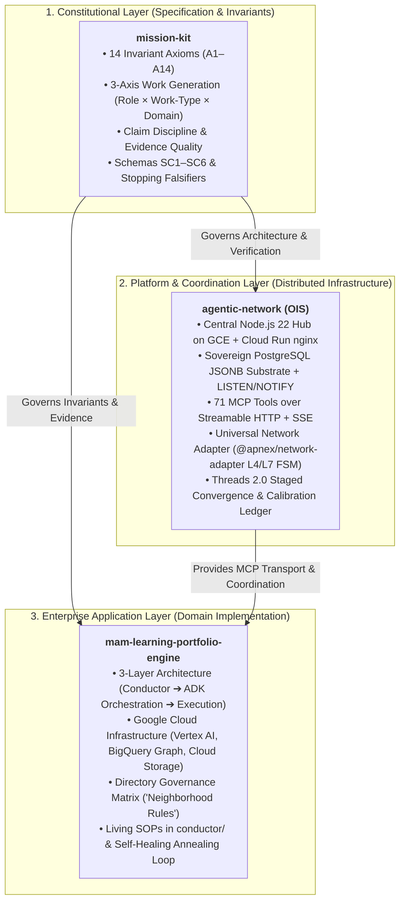
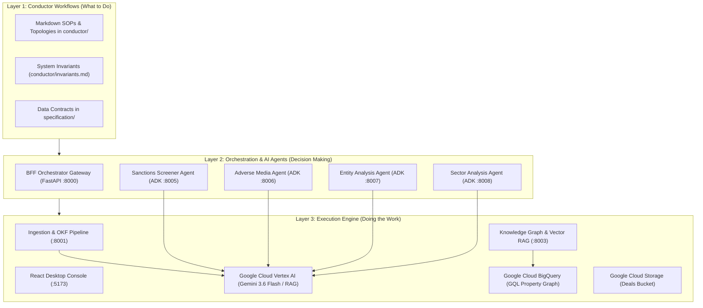
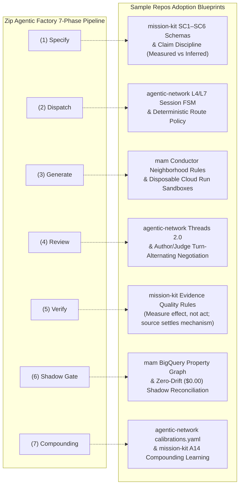

# Sample Repositories: Architectural Knowledge, System Setup & Zip Factory Blueprints

This document distills the architectural blueprints, engineering doctrines, operational protocols, and setup runbooks across the three sample repositories in [`sample-repos/`](./):

1. [`mission-kit/`](./mission-kit/) — **The Engineering System Constitution** (Harness-neutral doctrine, 14 invariant axioms, 3-axis work generation, machine-verifiable schemas, and cognitive/claim disciplines).
2. [`agentic-network/`](./agentic-network/) — **The Distributed Multi-Agent Platform (OIS)** (Production Node.js 22 Hub on GCE/Cloud Run, PostgreSQL JSONB state backplane, 71 MCP tools over Streamable HTTP + SSE, Universal Network Adapter with L4/L7 FSM, and turn-alternating consensus threads).
3. [`mam-learning-portfolio-engine/`](./mam-learning-portfolio-engine/) — **Enterprise Domain Application & Google Cloud Showcase** (Institutional deal diligence & asset portfolio engine, 3-Layer Architecture, Google ADK 2.0, Vertex AI Gemini 3.6 Flash, BigQuery Property Graph, and strict Directory Governance / Neighborhood Rules).

---

## 1. Executive Triad Synthesis: The 3-Tier Multi-Agent Stack

The three repositories form a coherent, self-reinforcing engineering ecosystem for autonomous agentic systems:



### Comparative Analysis Matrix

| Dimension | `mission-kit` | `agentic-network` (OIS) | `mam-learning-portfolio-engine` |
|---|---|---|---|
| **Role in Ecosystem** | Pure Engineering Constitution & Doctrine | Distributed Agent Network Platform | Enterprise Financial Diligence System |
| **Runtime & Language** | Harness-neutral Markdown, Bash, Node.js tooling | Node.js 22, TypeScript, PostgreSQL, Docker, GCE/Cloud Run | Python 3.11 (`uv`), FastAPI, Node.js 18 (React), GCP Vertex AI |
| **State Store** | Immutable Git repository, Addressable Ledgers (`INDEX.md`) | PostgreSQL with JSONB, LISTEN/NOTIFY, SchemaDef reconciler | BigQuery (`deal_engine`), GCS bucket, Vertex RAG Corpus |
| **Agent Transport** | Protocol-agnostic specification | MCP over Streamable HTTP (`POST/GET/DELETE /mcp`) + SSE | FastAPI REST endpoints, SSE token streaming, Google ADK RPC |
| **Key Invariant** | "Axioms are standing commitments, not situated moves." | "Persist-first notifications; envelope storage, decode-to-flat read." | "Push deterministic logic into code; focus AI on cognitive extraction." |
| **Coordination Pattern** | 3-axis generation (`Role × Work-Type × Domain`) | Director ⟷ Architect ⟷ Engineer via turn-alternating Threads 2.0 | Central Conductor ⟷ ADK Guardians via Markdown Negotiations |

---

## 2. Deep Dive: `mission-kit` — The Engineering System Constitution

### 2.1 Mandate & Design Philosophy
`mission-kit` is designed to be **complete enough that an agent holding nothing can instantiate the organization, compile strategic intent into correct work, and have that correctness measured rather than trusted**.

It operates on four falsifiable properties:
- **Portable:** Resolves from any host, any working directory, any agent harness.
- **Addressable:** Every entry carries a stable ID (`A1`, `R1`, `W1`, `SC1`, `K1`) and is reachable through [`INDEX.md`](./mission-kit/INDEX.md).
- **Routable:** Every entry defines an explicit `hydrate-when` condition stating when it must be loaded into context.
- **Checkable:** What can be verified by code is verified by code (`tools/check-standing-context.sh`).

### 2.2 The 14 Invariant Axioms (`A1`–`A14`)
Axioms represent **standing commitments** that must hold whenever their architectural preconditions (`applies-to`) are satisfied:

| ID | Axiom Name | `applies-to` Tag | Core Mandate |
|---|---|---|---|
| **A1** | **Sovereign State Transparency** | `stateful` | System state must be discoverable from the state store itself, never reconstructed from message logs, narrative summaries, or agent memory. |
| **A2** | **Isomorphic Specification** | `declarative` | The specification *is* the system. Drift between declared intent and running reality is treated as a defect in either the spec or the runtime. |
| **A3** | **Sovereign Composition** | `any-system` | Compose concerns across clear boundaries; avoid monoliths where changes in one domain leak unintended side effects into another. |
| **A4** | **Zero-Loss Knowledge** | `any-system` | Institutional memory must be externalized into structured artifacts. Agents retain nothing between cold sessions; uncaptured findings are permanently lost. |
| **A5** | **Perceptual Parity** | `multi-agent`, `llm-in-the-loop` | Agents must act on raw observations rather than derived summaries; perception must match the underlying ground truth. |
| **A6** | **Frictionless Agentic Collaboration** | `multi-agent` | Inter-agent seams must operate autonomously without requiring a human relay in the synchronous execution path. |
| **A7** | **Resilient Agentic Operations** | `multi-agent`, `autonomous` | Systems must cleanly withstand transport disconnects, stalled turns, and failed tasks through automated retries and dead-letter queues. |
| **A8** | **Gated Recursive Integrity** | `any-system` | Promotion past any boundary requires passing an independent, automated falsifier gate; self-attestation is strictly prohibited. |
| **A9** | **Chaos-Validated Deployment** | `any-system` | A deployment cannot be trusted until it has demonstrated survival under active chaos injection and node failure. |
| **A10** | **Autopoietic Evolution** | `multi-agent`, `autonomous` | Friction surfaced during operation must feed back into permanent updates to the SOPs, rules, and tooling (self-annealing). |
| **A11** | **Cognitive Minimalism** | `llm-in-the-loop` | Never allocate probabilistic LLM tokens to work that deterministic code, regex, or database queries can execute reliably. |
| **A12** | **Precision Context Engineering** | `llm-in-the-loop` | Assemble only the minimal, load-bearing context required for an invocation; bloat degrades reasoning fidelity. |
| **A13** | **Director Intent Amplification** | `multi-agent`, `autonomous` | Maximize human strategic leverage; human directors define goals and sign release gates; agents handle autonomous execution. |
| **A14** | **Compounding Learning** | `any-system` | Cycle $N+1$ must be strictly cheaper, faster, and more reliable than Cycle $N$ through the deduplication and promotion of reusable assets. |

### 2.3 The 3-Axis Work Generation Engine
Rather than maintaining an impossible static catalogue of every task, `mission-kit` generates work dynamically from three orthogonal axes:

$$\text{Role } (M) \times \text{Work-Type } (W) \times \text{Domain } (N) \longrightarrow \text{WorkItem Template} + \text{Evidence Authority} + \text{Independence Constraints}$$

- **Role Axis (`roles/`):** Who holds authority (`R1` Architect, `R2` Engineer, `R3` Verifier, `R4` Director).
- **Work-Type Axis (`work-types/`):** The unit of work (`W1` Build Slice, `W2` Bug Fix, `W3` Hard Cut, `W5` Falsifier Tests, `W8` Reactive Gate, `W10` Adversarial Review, `W14` Contract Design, `W17` Closeout Packet).
- **Domain Axis (`domains/`):** The subject surface (`D1` Delivery Code, `D2` Distribution, `D3` Tooling Harness, `D4` Authority & Governance, `D5` Coordination Substrate, `D6` Knowledge Methodology).

### 2.4 The Engineering Doctrine: Cognitive Falsifiers & Claim Disciplines
Section 5 of [`mission-kit/AGENTS.md`](./mission-kit/AGENTS.md) documents exact named failure patterns that plague AI-assisted software engineering:

```
┌─────────────────────────────────────────────────────────────────────────────┐
│                      MISSION-KIT ENGINEERING DOCTRINE                       │
├──────────────────────────────┬──────────────────────────────────────────────┤
│ 1. Claim Discipline          │ • Measured vs. Inferred: State which is which│
│                              │ • Mint before cite: Never invent placeholders│
│                              │ • Widen only by command: Don't guess SHAs    │
│                              │ • Retract for insufficiency, not just denial │
├──────────────────────────────┼──────────────────────────────────────────────┤
│ 2. Evidence Quality          │ • Measure the effect, not the act            │
│                              │ • Source settles mechanism; behaviour is bug │
│                              │ • One read is not a deploy proof             │
│                              │ • Never report a cheaper proxy as real read  │
├──────────────────────────────┼──────────────────────────────────────────────┤
│ 3. Composition Failures      │ • The Join Class: 2 truths -> 1 falsehood    │
│                              │ • Parallel implementations: author is blind  │
│                              │ • Derived representations lose qualifiers    │
├──────────────────────────────┼──────────────────────────────────────────────┤
│ 4. Stopping Criteria         │ • Does the correction have a consumer?       │
│                              │ • 3 reasoning cycles without narrowing = PARK│
│                              │ • Converging vs. Thrashing discriminator     │
└──────────────────────────────┴──────────────────────────────────────────────┘
```

---

## 3. Deep Dive: `agentic-network` (OIS) — Production Multi-Agent Network Platform

### 3.1 System Topology
`agentic-network` is an asynchronous, multi-agent software engineering network deployed across Google Cloud:

```
┌──────────────┐                               ┌─────────────────────────────────────────┐
│   Director   │ ◄─────── host session ──────► │ Architect (LLM host session)            │
│   (Human)    │                               │   Role: architect | @apnex/claude-plugin│
└──────────────┘                               └────────────────────┬────────────────────┘
                                                                    │ MCP Streamable HTTP
                                                                    ▼
┌────────────────────────────────────────────────────────────────────────────────────────┐
│ Hub Platform — GCE VM (australia-southeast1) + Cloud Run nginx Proxy (TLS / Ingress)   │
│   • Docker Compose: Hub + PostgreSQL + Watchtower                                      │
│   • Layer 7 PolicyRouter: 71 MCP Domain Tools                                          │
│   • HubStorageSubstrate: Postgres + JSONB + LISTEN/NOTIFY + SchemaDef Reconciler       │
│   • Notification Subsystem: Persist-first write ➔ SSE Delivery ➔ Last-Event-ID Replay │
└────────────────────────────────────────────────────────────────────────────────────────┘
                                                                    ▲
                                                                    │ MCP Streamable HTTP
┌──────────────┐                               ┌────────────────────┴────────────────────┐
│   Engineer   │ ◄─────── host session ──────► │ Engineer (LLM host session)             │
│ (Human + AI) │                               │   Role: engineer | @apnex/claude-plugin │
└──────────────┘                               └─────────────────────────────────────────┘
```

### 3.2 The Sovereign Storage Substrate
The Hub stores all entities (Tasks, Proposals, Threads, Reviews, Reports, Audits, Messages, Bugs, Turns) as Kubernetes-style JSONB envelope rows in PostgreSQL:

```json
{
  "apiVersion": "hub.apnex.io/v1alpha1",
  "kind": "Task",
  "metadata": {
    "id": "task-412",
    "createdAt": "2026-05-22T04:12:00Z",
    "resourceVersion": 4
  },
  "spec": {
    "title": "Implement idempotency key filter",
    "role": "engineer",
    "assignedTo": "agent-eng-01"
  },
  "status": {
    "phase": "in_progress",
    "lastHeartbeat": "2026-05-22T04:15:30Z"
  }
}
```
**The Strict Decode-to-Flat Membrane:** The storage substrate stores envelopes strictly; repository decoders translate the envelope to flat domain entities at the boundary. No dual-shape reader exists above the membrane, structurally eliminating undefined field regressions.

### 3.3 Universal MCP Network Adapter (`@apnex/network-adapter`)
The network adapter (`packages/network-adapter/`) bridges host LLM plugins (Claude Code, OpenCode) into the Hub's MCP endpoint:

- **L4 Wire Transport (`McpTransport`):**
  - Owns HTTP Streamable transport socket, SSE watchdog, and wire-level reconnect.
  - 30-second heartbeat ping + 90-second SSE watchdog.
  - 3-state wire FSM: `disconnected` $\rightarrow$ `connecting` $\rightarrow$ `connected`.
- **L7 Session Client (`McpAgentClient`):**
  - 5-state session FSM: `disconnected` $\rightarrow$ `connecting` $\rightarrow$ `synchronizing` $\rightarrow$ `streaming` $\rightarrow$ `reconnecting`.
  - Performs `register_role` handshake with session-invalid retry-once.
  - Dispatches actionable wakes (<channel> injection or promptAsync) into host sessions.

### 3.4 Operational Protocols: Tasks & Threads 2.0
1. **Task Execution Lifecycle:**
   ```
   Architect (create_task) ➔ Hub PostgreSQL write ➔ SSE notification to Engineer
     ➔ Engineer wakes (get_task) ➔ Executes work in local worktree ➔ Opens PR
     ➔ Engineer (create_report) ➔ Hub SSE notification to Architect
     ➔ Architect (create_review) ➔ Gate clearance or revision feedback
   ```
2. **Threads 2.0 (Turn-Alternating Consensus):**
   - Each thread message carries a mandatory `semanticIntent` tag (`propose`, `challenge`, `concur`, `synthesize`, `park`).
   - Staged `convergenceActions` are accumulated during back-and-forth turns.
   - When `converged: true` is agreed, the Hub commits the staged convergence actions atomically.

### 3.5 Calibration Ledger (`calibrations.yaml`)
To defeat LLM narrative-recall drift, architectural pathologies and hard-won post-mortem learnings are indexed into `docs/calibrations.yaml`. Agents query the calibration ledger programmatically via script (`python3 scripts/calibrations/calibrations.py list`) rather than relying on fuzzy context recall.

---

## 4. Deep Dive: `mam-learning-portfolio-engine` — Enterprise AI on Google Cloud

### 4.1 System Overview
Built as an enterprise deal diligence engine, this platform demonstrates how to build an institutional multi-agent diligence scoring platform on Google Cloud. It ingests complex, unstructured infrastructure deal memos (PDF/DOCX/PPTX) into a canonical Open Knowledge Format (`deal.okf`), executes multi-agent background research, queries historical precedent graphs in BigQuery, and streams real-time deal scores.

### 4.2 The 3-Layer Architecture
The engine explicitly separates probabilistic LLM reasoning from deterministic business code:



### 4.3 Directory Governance Matrix ("Neighborhood Rules")
To prevent multiple agents from trampling codebases, `ANTIGRAVITY.md` enforces strict folder ownership:

| Directory Path | Assigned Owner | Downstream Consumers |
|---|---|---|
| `backend/ingestion_service/` | `ingestion_pipeline_guardian` | Knowledge Graph, ML Scoring |
| `agents/external_research/` | `external_research_guardian` | BFF Orchestrator |
| `backend/knowledge_graph_service/` | `knowledge_graph_guardian` | BFF Orchestrator |
| `backend/ml_scoring_service/` | `ml_scoring_guardian` | BFF Orchestrator |
| `backend/bff_service/` | `bff_orchestrator_guardian` | React Frontend Console |
| `frontend/` | `frontend_console_guardian` | End-User Browser |
| `conductor/`, `agent_feedback_registry/` | `conductor_agent` | All Components & Agents |

**Cross-Domain Changes:** No agent may edit code outside its assigned directory. Cross-domain adjustments require writing a formal Markdown Negotiation file in `agent_feedback_registry/negotiations/`.

### 4.4 Self-Healing & Annealing Loop
When an error occurs during runtime execution:
1. Pinpoint root cause from the error trace.
2. Surgically apply the fix within the owning directory.
3. Validate against test scenarios.
4. **Update the Markdown SOP in `conductor/`** so future agents inherit the fix permanently.

---

## 5. Local Setup, Prerequisites & Deployment Runbooks

### 5.1 `mission-kit` Setup & Verification
`mission-kit` requires minimal host tooling because its doctrine is enforced via standalone shell and node scripts:

```bash
# 1. Navigate to mission-kit
cd sample-repos/mission-kit

# 2. Verify standing context and doctrine compliance
./tools/check-standing-context.sh AGENTS.md

# 3. Validate entity schemas
node tools/validate-schemas.mjs

# 4. Generate entry index ledger
node tools/generate-index.mjs
```

---

### 5.2 `agentic-network` (OIS) Setup & Local Dev
The OIS Hub runs locally via Docker Compose backed by PostgreSQL:

```bash
# 1. Navigate to agentic-network
cd sample-repos/agentic-network

# 2. Install workspace dependencies
npm install

# 3. Build Hub and Packages
npm run build --workspaces

# 4. Run automated test suites across all packages
npm test

# 5. Start Local Hub & Postgres Stack
./scripts/local/build-hub.sh
./scripts/local/start-hub.sh

# 6. Verify Hub Health (Default port 3000)
curl -i http://localhost:3000/health

# 7. Check Substrate Entities via CLI
./scripts/local/get-entities.sh Task
```

**Production Deployment (GCE + Cloud Run):**
- **VM Host:** GCE e2-standard-2 in `australia-southeast1` running Docker Compose (`hub:v1.2`, `postgres:16-alpine`, `containrrr/watchtower`).
- **Ingress:** Cloud Run service running Nginx reverse proxy terminating public TLS and passing `X-Forwarded-For` to the private GCE internal IP over Serverless VPC Access.

---

### 5.3 `mam-learning-portfolio-engine` Setup & GCP Runbook
The enterprise portfolio engine requires Python 3.11, Node.js 18, and Google Cloud SDK:

```bash
# 1. Navigate to repository root
cd sample-repos/mam-learning-portfolio-engine

# 2. Enable Required Google Cloud APIs
gcloud services enable \
  aiplatform.googleapis.com \
  bigquery.googleapis.com \
  storage.googleapis.com \
  logging.googleapis.com \
  cloudtrace.googleapis.com \
  --project ple-prototype

# 3. Authenticate with Google Cloud (ADC)
gcloud auth login --update-adc
gcloud auth application-default login
gcloud config set project ple-prototype

# 4. Set Up Python Virtual Environment using uv
uv venv .venv --python 3.11
source .venv/bin/activate
uv pip install -e ".[dev]"

# 5. Install Frontend Dependencies
cd frontend && npm install && cd ..

# 6. Run Complete Test Suite
pytest -v

# 7. Launch Unified Multi-Service Stack (All microservices + React UI)
python run_app.py
```
*Access the React UI at `http://localhost:5173` and the BFF Gateway at `http://localhost:8000/docs`.*

---

## 6. Blueprints for the Zip Agentic Factory (LMS Rebuild)

Here is how the Zip Agentic Factory directly borrows, adopts, and implements constructs from these three sample repositories across all 7 factory phases:



### Phase-by-Phase Adoption Guide:

#### Phase 1: Specify ➔ Adopt `mission-kit` Schemas & Claim Discipline
- **The Problem in Zip:** Requirements Architects and Product Managers risk producing vague, untestable markdown specs ("make repayments fast and scalable").
- **The Blueprint:**
  - Enforce `mission-kit`'s **Claim Discipline**: Every sentence in the PRD must be classified as *Measured* (backed by an existing production database trace or statutory clause) or *Inferred*.
  - Enforce `SC1`–`SC6` Schema validation: A PRD cannot pass the `PRD GO / NO-GO` gate unless all inputs, invariant outputs, and error boundaries conform to machine-validatable schemas.
  - Require the Regulatory Analyst to produce a **Statutory Mapping Matrix** anchoring clauses to Reg Z, Reg B, FDCPA, and PCI DSS before coding starts (Compliance Shift-Left).

#### Phase 2: Dispatch ➔ Adopt `agentic-network` L4/L7 Session FSM
- **The Problem in Zip:** Dispatching tasks non-deterministically via raw LLM prompts causes hallucinations, duplicate task execution, and unauthorized tool calls.
- **The Blueprint:**
  - Implement Dispatch as a deterministic control-plane policy service using `agentic-network`'s **L4 Wire Transport & L7 Session FSM** (`McpAgentClient`).
  - Use `register_role` cryptographic handshakes to issue short-lived, single-task execution tokens to sandboxed agents with bounded tool blast radiuses.

#### Phase 3: Generate ➔ Adopt `mam-learning-portfolio-engine` Conductor SOPs & Neighborhood Rules
- **The Problem in Zip:** Implementation Engineers modifying microservices in shared repos can accidentally alter ledger boundaries or cross-tenant data structures.
- **The Blueprint:**
  - Implement the **Directory Governance Matrix ("Neighborhood Rules")**: An agent working on the Repayments microservice is strictly confined to `services/repayments/`.
  - Any cross-domain contract adjustment (e.g., changes to Customer Master or Issuing) requires opening a formal Markdown Negotiation file (`agent_feedback_registry/negotiations/`).
  - Containerize code execution in disposable Cloud Run sandboxes with read-only root filesystems and single-task lifecycles.

#### Phase 4: Review ➔ Adopt `agentic-network` Threads 2.0 Turn-Alternating Consensus
- **The Problem in Zip:** Review loops between Implementation Engineers (Authors) and Spec Conformance Judges (Judges) can devolve into unresolvable circular arguments.
- **The Blueprint:**
  - Mediate all disagreements through **Threads 2.0**: Every reply must specify a `semanticIntent` (`challenge`, `concur`, `synthesize`, `park`).
  - Enforce the 3-cycle stopping rule from `mission-kit` Section 5.4: If the author and judge do not converge within 3 reasoning cycles on the same evidence, the issue is automatically parked and escalated to human CODEOWNERS (`PL-21` / `PL-22`).

#### Phase 5: Verify ➔ Adopt `mission-kit` Evidence Quality Standards
- **The Problem in Zip:** Test generators produce tests that test their own mocks rather than true behavioral boundaries.
- **The Blueprint:**
  - Enforce `mission-kit`'s golden rule: **"Measure the effect, not the act."** A test asserting that an API returned HTTP 200 does not prove ledger correctness. The test must inspect the underlying database row to verify that debits equal credits ($0.00 variance).
  - Enforce strict Test Isolation: The Isolated Test Engineer authors tests exclusively from the signed PRD contract at Phase 1/2, without access to the generated source code, preventing circular confirmation bias.

#### Phase 6: Shadow Gate ➔ Adopt `mam` BigQuery Property Graph & 4-Class Divergence Taxonomy
- **The Problem in Zip:** Shadow-mirroring 1.8M loan repayments against legacy Azure produces thousands of small monetary divergences (float drift, rounding quirks).
- **The Blueprint:**
  - Ingest both legacy Azure and new GCP ledger mutations into a BigQuery telemetry dataset (`deal_engine` style).
  - Use the Reconciliation Analyst agent to automatically triage divergences into the 4-class taxonomy:
    1. *GCP Bug* (fix in factory)
    2. *Legacy Bug* (Azure calculates incorrectly; approve GCP behavior)
    3. *Precision / Rounding* (32-bit float vs 64-bit decimal banker's rounding)
    4. *Intentional Spec Deviation* (new statutory requirement under Reg Z)
  - Gate production cutover on **14 consecutive clean days with zero unexplained divergences**.

#### Phase 7: Compounding ➔ Adopt `agentic-network` Calibration Ledger & `mission-kit` A14
- **The Problem in Zip:** When frontier foundation models are updated (e.g. Gemini 1.5 Pro to Gemini 2.0), persona prompt behaviors drift, and past lessons are forgotten.
- **The Blueprint:**
  - Maintain a centralized **Calibration Ledger** (`calibrations.yaml`) tracking known architectural pathologies, legacy quirks, and resolved disputes.
  - Automatically convert escaped defects and shadow gate variances into permanent regression eval benchmarks in the Eval Engineer's scoring suite.
  - Curate architectural decision records (`ADR-001` through `ADR-014` style) to make cycle $N+1$ progressively cheaper, faster, and more autonomous.

---

## 7. Summary Reference & Quick Links

- **Constitutional Specification:** [`sample-repos/mission-kit/README.md`](./mission-kit/README.md)
  - 14 Invariant Axioms: [`sample-repos/mission-kit/axioms/`](./mission-kit/axioms/)
  - Engineering Doctrine & Falsifiers: [`sample-repos/mission-kit/AGENTS.md`](./mission-kit/AGENTS.md)
  - Universal Entry Ledger: [`sample-repos/mission-kit/INDEX.md`](./mission-kit/INDEX.md)
- **Multi-Agent Network Infrastructure:** [`sample-repos/agentic-network/ARCHITECTURE.md`](./agentic-network/ARCHITECTURE.md)
  - Universal MCP Network Adapter: [`sample-repos/agentic-network/packages/network-adapter/`](./agentic-network/packages/network-adapter/)
  - Central Hub & Policy Router: [`sample-repos/agentic-network/hub/`](./agentic-network/hub/)
  - Claude & OpenCode Host Plugins: [`sample-repos/agentic-network/adapters/`](./agentic-network/adapters/)
- **Enterprise Google Cloud Application:** [`sample-repos/mam-learning-portfolio-engine/README.md`](./mam-learning-portfolio-engine/README.md)
  - Operating Guidelines & 3-Layer Architecture: [`sample-repos/mam-learning-portfolio-engine/AGENTS.md`](./mam-learning-portfolio-engine/AGENTS.md)
  - Antigravity Manifest & Neighborhood Rules: [`sample-repos/mam-learning-portfolio-engine/ANTIGRAVITY.md`](./mam-learning-portfolio-engine/ANTIGRAVITY.md)
  - Living SOPs & Invariants: [`sample-repos/mam-learning-portfolio-engine/conductor/`](./mam-learning-portfolio-engine/conductor/)
